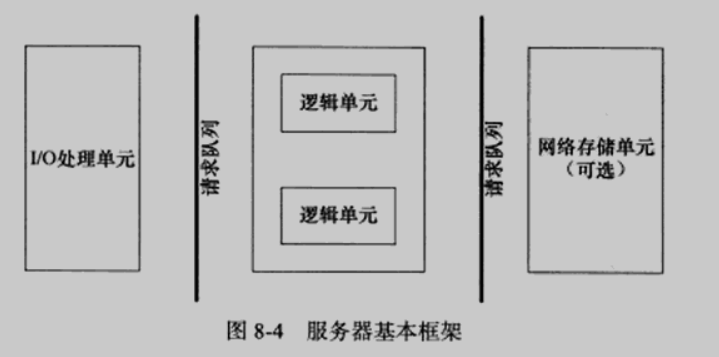
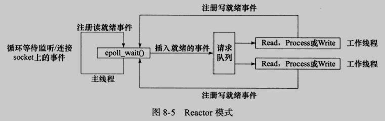
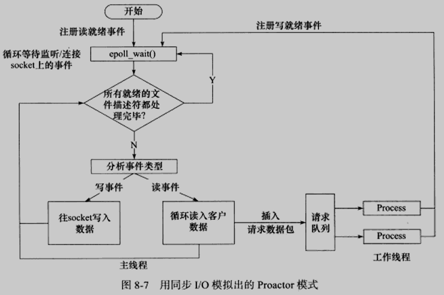
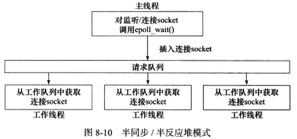
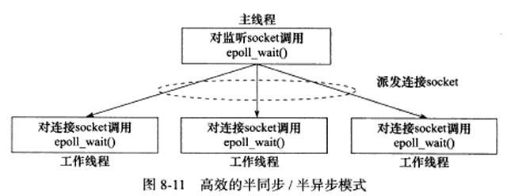
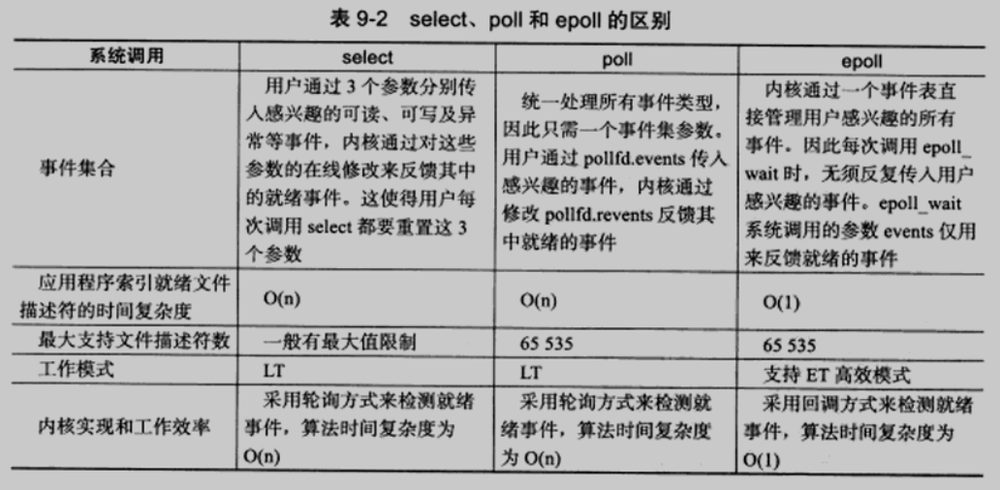
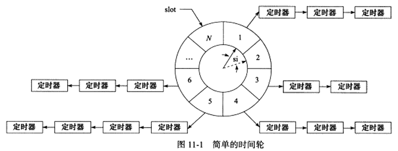
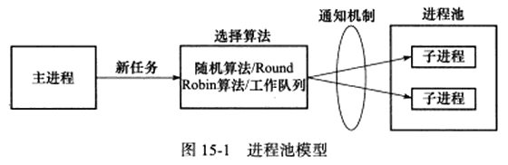

# 《Linux高性能服务器编程》读书笔记

## Linux网络编程基础API

### socket地址API

#### 主机字节序和网络字节序

- 字节在内存中排序的顺序将影响它被累加器装载成的整数的值

- 现代PC大多采用小端字节序，因此小端字节序又被称为主机字节序

- 在网络中，约定发送方以大端字节序发送，因此大端字节序又被称为网络字节序

- Linux提供了如下4个函数来完成主机字节序和网络字节序之间的转换

  ```cpp
  #include <netinet/in.h>
  unsigned long int htonl(unsigned long int hostlong);
  unsigned short int htons(unsigned short int hostshort);
  unsigned long int ntohl(unsigned long int netlong);
  unsigned short int ntohs(unsigned short int netshort);
  ```

#### 通用socket地址

- socket地址通过结构体来描述
- 不同的协议族有不同的地址形式
- 通用socket地址结构体`sockaddr`和`sockaddr_storage`适用于各种协议族

#### 专用socket地址

- Linux为各个协议族提供了专门的socket地址结构体，比通用socket地址结构体要好用
  - `sockaddr_un` - UNIX本地域协议族
  - `sockaddr_in` - TCP/IPv4协议族
  - `sockaddr_in6` - TCP/IPv6协议族
- 所有专用socket地址类型的变量在实际使用时都要转化为通用socket地址类型`sockaddr`（强制类型转换即可）

#### IP地址转换函数

以下3个函数可用于以点分十进制字符串表示的IPv4地址和以网络字节序整数表示的IPv4地址之间的转换：

- `inet_addr` - 点分十进制字符串 -> 网络字节序整数
- `inet_aton` - 点分十进制字符串 -> 网络字节序整数
- `inet_ntoa` - 网络字节序整数 -> 点分十进制字符串

下面这对更新的函数也能完成上述3个函数同样的功能，并且它们同时适用于IPv4地址和IPv6地址

- `inet_pton` - 字符串 -> 网络字节序整数
- `inet_ntop` - 网络字节序整数 -> 字符串

### 创建socket

UNIX/Linux的一个哲学是：所有东西都是文件。socket也不例外，它就是可读、可写、可控制、可关闭的文件描述符。

```cpp
#include <sys/types.h>
#include <sys/socket.h>
int socket(int domain, int type, int protocol);
```

- `domain`告诉系统使用哪个底层协议族
- `type`指定服务类型，主要有`SOCK_STREAM`和`SOCK_UGRAM`，对于TCP/IP协议族而言，它们分别对应TCP和UDP
- `protocol`是在前两个参数构成的协议集合下，再选择一个具体的协议。几乎在所有情况下，我们都应该把它设置为`0`

### 命名socket

- 将一个socket与socket地址绑定称为给socket命名
- 在服务器程序中，通常要命名socket，因为只有命名后客户程序才能知道该如何连接它
- 客户程序通常不需要命名socket，而是采用匿名方式，即使用操作系统自动分配的socket地址

```cpp
#include <sys/types.h>
#include <sys/socket.h>
int bind(int sockfd, const struct sockaddr* my_addr, socklen_t addrlen);
```

`bind`将`my_addr`所指的socket地址分配给未命名的`sockfd`文件描述符，`addrlen`参数指出该socket地址的长度。

### 监听socket

socket被命名之后，还不能接受客户连接，我们需要使用如下系统调用来创建一个监听队列以存放待处理的客户连接:

```cpp
#include <sys/socket.h>
int listen(int sockfd, int backlog);
```

- `sockfd`指定被监听的socket
- `backlog`提示内核监听队列的最大长度

### 接受连接

以下系统调用从`listen`监听队列中接受一个连接:

```cpp
#include <sys/types.h>
#include <sys/socket.h>
int accept(int sockfd, struct sockaddr* addr, socklen_t* addrlen);
```

- `sockfd`是执行过`listen`系统调用的监听socket
- `addr`用来获取被接受连接的远端socket地址，该地址长度由`addrlen`指出
- `accept`成功时返回一个连接socket，该socket唯一地标识了被接受的这个连接，服务器可以通过读写该socket来与被接受连接对应的客户通信
- `accept`只是从监听队列中取出连接，而不论连接处于何种状态，更不关心任何网络状态的变化
- `accept`从`listen`监听队列中接受的连接至少已经完成了TCP三次握手的前两个步骤

### 发起连接

客户端需要通过如下系统调用来主动与服务器建立连接：

```cpp
#include <sys/types.h>
#include <sys/socket.h>
int connect(int sockfd, const struct sockaddr* serv_addr, socklen_t addrlen);
```

- `sockfd`是由`socket`系统调用返回的一个`sockfd`
- `serv_addr`是服务器的监听socket的地址，`addrlen`指明这个地址的长度
- `connect`一旦成功，`sockfd`就唯一地标识了这连接，客户就可以通过读写`sockfd`来与服务器通信

### 关闭连接

关闭一个连接实际上就是关闭该连接对应的socket，这可以通过如下关闭普通文件描述的系统调用来完成：

```cpp
#include <unistd.h>
int close(int fd);
```

`close`系统调用并非总是关闭一个连接，而是将`fd`的引用计数减1。只有当`fd`的引用计数为0时，才真正关闭连接。

如果无论如何都要立即终止连接，可以使用如下的`shutdown`系统调用，它是专门为网络编程设计的：

```cpp
#include <sys/socket.h>
int shutdown(int sockfd, int howto);
```

`howto`用于指明关闭socket上的读或写，或者都关闭。

### 数据读写

#### TCP数据读写

```cpp
#include <sys/types.h>
#include <sys/socket.h>
ssize_t recv(int sockfd, void* buf, size_t len, int flags);
ssize_t send(int sockfd, const void* buf, size_t len, int flags);
```

- 分别用于向指定socket中读取和写入数据，返回实际读取或写入的数据长度
- `buf`和`len`指定读或写缓冲区的位置和大小
- `flags`为数据收发提供了额外的控制，通常置为`0`即可

#### UDP数据读写

```cpp
#include <sys/types.h>
#include <sys/socket.h>
ssize_t recvfrom(int sockfd, void* buf, size_t len, int flags, struct sockaddr* src_addr, socklen_t* addrlen);
ssize_t sendto(int sockfd, const void* buf, size_t len, int flags, const struct sockaddr* dest_addr, socklen_t addrlen);
```

由于UDP没有连接的概念，所以我们每次读/写数据都需要获取发送/接收端的socket地址，即参数`src_addr`所指内容

#### 通用数据读写

socket编程接口还提供了一对通用的数据读写系统调用。它们不仅能用于TCP流数据，也能用于UDP数据报：

```cpp
#include <sys/socket.h>
ssize_t recvmsg(int sockfd, struct msghdr* msg, int flags);
ssize_t sendmsg(int sockfd, struct msghdr* msg, int flags);
```

### 带外标记

我们通常无法预知带外数据何时到来。好在Linux内核检测到TCP紧急标志时，将通知应用程序。但是，应用程序即使收到这个通知，还需要知道带外数据在数据流中的具体位置，才能准确接收带外数据。这一点可以通过如下系统调用实现：

```cpp
#include <sys/socket.h>
int sockatmark(int sockfd);
```

`sockatmark`判断`sockfd`是否处于带外标记，即下一个被读取到的数据是否是带外数据。如果是，我们就可以利用带`MSG_OOB`标志的`recv`系统调用来接收带外数据。

### 地址信息函数

有时，我们想知道一个连接socket的本端socket地址和远端socket地址，以下两个函数可以实现这一点：

```cpp
#include <sys/socket.h>
int getsockname(int sockfd, struct sockaddr* address, socklen_t* address_len);
int getpeername(int sockfd, struct sockaddr* address, socklen_t* address_len);
```

### socket选项

以下两个系统调用专门用来读取和设置socket文件描述符选项：

```cpp
#include <sys/socket.h>
int getsockopt(int sockfd, ...);
int setsockopt(int sockfd, ...);
```

#### SO_REUSEADDR选项

用于使得服务器端可以强制使用被处于TIME_WAIT状态的连接占用的socket地址。

#### SO_RCVBUF和SO_SNDBUF选项

用于设置发送缓冲区大小和接收缓冲区大小。

#### SO_RCVLOWAT和SO_SNDLOWAT选项

- 分别表示TCP接受缓冲区和发送缓冲区的低水位标记
- 一般被I/O复用系统调用用来判断socket是否可读或可写
- 默认情况下，TCP接受缓冲区和发送缓冲区的低水位标记均为1字节

#### SO_LINGER选项

用于控制`close`系统调用在关闭TCP连接时的行为。

### 网络信息API

- gethostbyname / gethostbyaddr

  用于获取某个主机的完整信息。

  ```cpp
  #include <netdb.h>
  struct hostent* gethostbyname(const char* name);
  struct hostent* gethostbyaddr(const void* addr, size_t len, int type);
  ```

- getservbyname / getservbyport

  用于获取某个服务的完整信息。

  ```cpp
  #include <netdb.h>
  struct servent* getservbyname(const char* name, const char* proto);
  struct servent* getservbyport(int port, const char* proto);
  ```

- getaddrinfo

  既能通过主机名获得IP地址（内部使用的是`gethostbyname`），也能通过服务名获得端口号（内部使用的是`getservbyname`）。

  ```cpp
  int getaddrinfo(const char* hostname, const char* service, const struct addrinfo* hints, struct addrinfo** result);
  ```

  `getaddrinfo`将隐式地分配堆内存，我们必须使用如下配对函数来释放这块内存：

  ```cpp
  #include <netdb.h>
  void freeaddrinfo(struct addrinfo* res);
  ```

- getnameinfo

  能通过socket地址同时获得以字符串表示的主机名（内部使用的是`gethostbyaddr`）和服务名（内部使用的是`getservbyport`）。

  ```cpp
  #include <netdb.h>
  int getnameinfo(const struct sockaddr* sockarr, socklen_t addrlen, char* host, socklen_t hostlen, char* serv, socklen_t servlen, int flags);
  ```

## 高级I/O函数

### pipe函数

`pipe`函数可用于创建一个管道，以实现进程间通信。

```cpp
#inclde <unistd.h>
int pipe(int fd[2]);
```

- 将一对打开的文件描述符值填入其参数指向的数组
- `fd[0]`和`fd[1]`分别构成管道的两端，往`fd[1]`写入的数据可以从`fd[0]`读出，不能反过来使用，即这个管道是单向的
- 管道内部传输的数据是字节流
- 管道本身拥有一个容量限制，它规定如果应用程序不将数据从管道读走的话，该管道最多能被写入多少字节的数据

此外，socket的基础API中有一个`socketpair`函数，它能够方便地创建双向管道。

```cpp
#include <sys/types.h>
#include <sys/socket.h>
int socketpair(int domain, int type, int protocol, int fd[2]);
```

### dup函数和dup2函数

有时我们希望把标准输入重定向到一个文件，或者把标准输出重定向到一个网络连接。这可以通过下面的用于复制文件描述符的`dup`或`dup2`函数来实现：

```cpp
#include <unistd.h>
int dup(int fd);
int dup2(int fd1, int fd2);
```

- `dup`函数返回一个新的文件描述符，这个新的文件描述符与原有的文件描述符`fd`指向相同的文件、管道或者网络连接
- `dup2`与`dup`类似，不过它将返回第一个不小于`fd2`的整数值

### readv函数和writev函数

- `readv`函数将数据从文件描述符读到分散的内存块中，即分散读
- `writev`函数将多块分散的内存数据一并写入文件描述符中，即集中写

```cpp
#include <sys/uio.h>
ssize_t readv(int fd, const struct iovec* vector, int count);
ssize_t writev(int fd, const struct iovec* vector, int count);
```

- `vector`是`iovec`结构体数组，该结构体描述一块内存区。`count`是数组长度
- 返回读出/写入`fd`的字节数
- 相当于简化版的`recvmsg`和`sendmsg`函数

### sendfile函数

`sendfile`函数在两个文件描述符之间直接传递数据（完全在内核中操作），从而避免了内核缓冲区和用户缓冲区之间的数据拷贝，这被称为零拷贝。

```cpp
#include <sys/sendfile.h>
ssize_t sendfile(int out_fd, int in_fd, off_t* offset, size_t count);
```

- `offset`指定从读入文件流的哪个位置开始读，如果为空，则使用默认的起始位值
- `count`指定传输的字节数
- 返回传输的字节数
- `in_fd`必须指向一个真实的文件，`out_fd`必须是一个socket，由此可见，`sendfile`几乎是专门为在网络上传输文件而设计的

### mmap函数和munmap函数

- `mmap`函数用于申请一段内存空间。我们可以将这段内存作为进程间通信的共享内存，也可以将文件直接映射到其中
- `munmap`函数用于释放由`mmap`创建的内存空间

```cpp
#include <sys/mman.h>
void* mmap(void* start, size_t length, int prot, int flags, int fd, off_t offset);
int munmap(void* start, size_t length);
```

- `start`允许用户使用某个特定的地址作为这段内存的起始地址，`length`指定内存段的长度
- `port`用于设置内存段的访问权限
- `flags`控制内存段内存被修改后程序的行为
- `fd`是被映射文件对应的文件描述符，一般通过`open`系统调用获得。`offset`指定从文件的何处开始映射

### splice函数

`splice`函数用于在两个文件描述符之间移动数据，也是零拷贝操作。

```cpp
#include <fcntl.h>
ssize_t splice(int fd_in, loff_t* off_in, int fd_out, loff_t* off_out, size_t len, unsigned int flags);
```

- `fd_in`和`fd_out`必须至少有一个是管道文件描述符
- 返回移动字节的数量

### tee函数

- `tee`函数用于在两个管道文件描述符之间复制数据，也是零拷贝操作
- 不消耗数据，因此源文件描述符上的数据仍可以用于后续的读操作

```cpp
#include <fcntl.h>
ssize_t tee(int fd_in, int fd_out, size_t len, unsigned int flags);
```

- 返回复制字节的数量

### fcntl函数

`fcntl`提供了对文件描述符的各种控制操作。

```cpp
#include <fcntl.h>
int fcntl(int fd, int cmd, ...);
```

- 在网络编程中，`fcntl`函数通常用来将一个文件描述符设置为非阻塞的

## Linux服务器程序规范

### 日志

#### Linux系统日志

- 服务器的调试和维护都需要一个专业的日志系统
- Linux提供一个守护进程来处理系统日志——syslogd，现代Linux系统使用的都是它的升级版——rsyslogd
- rsyslogd守护进程既能接收用户进程输出的日志，又能接收内核日志

#### syslog函数

- 应用程序使用`syslog`函数与rsyslogd守护进程通信
- `openlog`函数可以改变`syslog`的默认输出方式

日志的过滤也很重要。程序在开发阶段可能需要输出很多调试信息，而发布之后我们又需要将这些调试信息关闭。解决这个问题的方法并不是在程序发布之后删除调试代码，而是简单地设置日志掩码，使日志级别大于日志掩码的日志信息被系统忽略。

```cpp
#include <syslog.h>
int setlogmask(int maskpri);
void closelog();
```

### 用户信息

#### UID、EUID、GID和EGID

- 用户信息对于服务器程序的安全性来说是很重要的，比如大部分服务器就必须以root身份启动，但不能以root身份运行
- 以下这一组函数可以获取和设置当前进程的真实用户ID(UID)、有效用户ID(EUID)、真实组ID(GID)和有效组ID(EGID)

```cpp
#include <sys/types.h>
#include <unistd.h>
uid_t getuid();
uid_t geteuid();
gid_t getgid();
gid_t getegid();
int setuid(uid_t uid);
int seteuid(uid_t uid);
int setgid(gid_t gid);
int setegid(gid_ gid);
```

- 一个进程拥有两个用户ID：UID和EUID

#### 切换用户

### 进程间关系

#### 进程组

- Linux下每个进程都隶属于一个进程组，因此它们除了PID信息之外，还有进程组ID(PGID)
- 每个进程组都有一个首领进程，其PGID和PID相同。进程组将一直存在，直到其中所有进程都退出，或者加入到其他进程组
- 一个进程只能设置自己或者其子进程的PGID
- `getpgid`和`setpgid`分别用于获取和设置PGID

```cpp
#include <unistd.h>
pid_t getpgid(pid_t pid);
int setpgid(pid_t pid, pid_t pgid);
```

#### 会话

- 一些有关联的进程组将形成一个会话(session)
- Linux进程并未提供所谓会话ID(SID)的概念，但Linux认为它等于会话首领所在的进程组的PGID
- `setsid`和`getsid`分别用于设置和获取SID，其实质是用PGID来实现的

```cpp
#include <unistd.h>
pid_t setsid(void);
pid_t getsid(pid_t pid);
```

#### 用ps命令查看进程关系

### 系统资源限制

Linux上运行的程序都会受到资源限制的影响，比如物理设备限制（CPU数量、内存数量等）、系统策略限制（CPU时间等），以及具体实现的限制（比如文件名的最大长度）。Linux系统资源限制可以通过如下一对函数来读取和设置：

```cpp
#include <sys/resource.h>
int getrlimit(int resource, struct rlimit* rlim);
int setrlimit(int resource, const struct rlimit* rlim);
```

### 改变工作目录和根目录

获取和改变进程工作目录的函数分别是：

```cpp
#include <unistd.h>
char* getcwd(char* buf, size_t size);
int chdir(const char* path);
```

改变进程根目录的函数是：

```cpp
#include <unistd.h>
int chroot(const char* path);
```

### 服务器后台化

```cpp
#include <unistd.h>
int daemon(int nochdir, int noclose);
```

## 高性能服务器程序框架

### 服务器模型

#### C/S模型

#### P2P模型

### 服务器编程框架

一个服务器的基本框架包括：I/O处理单元、逻辑单元、网络存储单元（可选）、请求队列。

- I/O处理单元 - 处理客户连接，读写网络数据
- 逻辑单元 - 业务进程或线程
- 网络存储单元 - 本地数据库、文件或缓存
- 请求队列 - 各单元之间的通信方式



### I/O模型

socket在创建的时候默认是阻塞的。我们可以通过传递`SOCK_NONBLOCK`标志，将其设置为非阻塞的。阻塞和非阻塞的概念能应用于所有文件描述符，而不仅仅是socket。我们称阻塞的文件描述符为阻塞I/O，称非阻塞的文件描述符为非阻塞I/O。

进程操作阻塞I/O可能因为无法立即完成而被操作系统挂起，直到等待的事件发生时，操作系统唤醒该进程，然后完成I/O操作。进程操作非阻塞I/O则总是立即返回，而不管事件是否已经发生。事件没有发生或出错时都会返回`-1`，我们需要根据`errno`来区分这两种情况。对`accept`、`send`和`recv`而言，事件未发生时，`errno`通常被设置成`EAGAIN`（再来一次）或者`EWOULDBLOCK`（期望阻塞）；对`connect`而言，`errno`则被设置成`EINPROGRESS`（在处理中）。

很显然，我们只有在事件已经发生的情况下操作非阻塞I/O，才能提高程序的效率。因此，非阻塞I/O通常要和其他I/O通知机制一起使用，比如I/O复用和`SIGIO`信号。

I/O复用是最常用的I/O通知机制。它指的是，应用程序通过I/O复用函数向内核注册一组事件，内核通过I/O复用函数把其中就绪的事件通知给应用程序。需要注意的是，I/O复用函数本身是阻塞的，它们能提高程序效率的原因在于它们具有同时监听多个I/O事件的能力。

`SIGIO`信号也可以用来报告I/O事件。我们可以为一个目标文件描述符指定宿主进程，那么当该目标文件描述符就绪时，被指定的宿主进程将捕获到`SIGIO`信号。

异步I/O是一种将真正的读写操作交由内核接管的I/O方式。它告诉内核用户读写缓冲区的位置，委托内核进行读写操作，内核在完成读写操作后，向应用程序通知读写完成事件。

- 阻塞I/O - 程序阻塞于读写函数
- I/O复用 - 程序阻塞于I/O复用系统调用，但可同时监听多个I/O事件，对I/O本身的读写操作是非阻塞的
- `SIGIO`信号 - 信号触发读写就绪事件，用户程序执行读写操作，程序没有阻塞阶段
- 异步I/O - 内核执行读写操作并触发读写完成事件，程序没有阻塞阶段

（异步I/O不是本书的重点）

### 两种高效的事件处理模式

同步I/O模型通常用于实现Reactor模式，异步I/O模型则用于实现Proactor模式。

#### Reactor模式

主线程（I/O处理单元）只负责监听文件描述符上是否有事件发生，有的话就立即将该事件告知工作线程（逻辑单元）。除此之外，主线程不做任何其他实质性的工作。读写数据、接受新的连接、以及处理客户请求均在工作线程中完成。

使用同步I/O模型（以`epoll_wait`为例）实现的Reactor模式的工作流程是：

- 主线程往`epoll`内核事件表中注册socket上的读就绪事件
- 主线程调用`epoll_wait`等待socket上有数据可读
- 当socket上有数据可读时，`epoll_wait`通知主线程。主线程则将socket可读事件放入请求队列。
- 睡眠在请求队列上的某个工作线程被唤醒，它从socket中读取数据，并处理客户请求，然后往`epoll`内核事件表中注册该socket上的写就绪事件
- 主线程调用`epoll_wait`等待socket可写
- 当socket可写时，`epoll_wait`通知主线程。主线程将socket可写事件放入请求队列。
- 睡眠在请求队列上的某个工作线程被唤醒，它往socket上写入服务器处理客户请求的结果



工作线程从请求队列中取出事件后，将根据事件的类型来决定如何处理它：对于可读事件，执行读数据和处理请求的操作；对于可写事件，执行写数据的操作。

#### Proactor模式

与Reactor模式不同，Proactor模式将所有I/O操作都交给主线程（I/O处理单元）和内核来处理，工作线程（逻辑单元）仅仅负责业务逻辑。因此，Proactor模式更符合图8-4所描述的服务器编程框架。

#### 模拟Proactor模式

可以使用同步I/O方式模拟出Proactor模式。其原理是：主线程执行数据读写操作，读写完成后，主线程向工作线程通知这一“完成事件”。那么，从工作线程的角度来看，它们就直接获得了数据读写的结果，接下来要做的只是对读写的结果进行逻辑处理。

使用同步I/O模型（以`epoll_wait`为例）模拟出的Proactor模式的工作流程如下：

- 主线程往`epoll`内核事件表中注册socket上的读就绪事件
- 主线程调用`epoll_wait`等待socket上有数据可读
- 当socket上有数据可读时，`epoll_wait`通知主线程。主线程从socket循环读取数据，直到没有更多数据可读，然后将读取到的数据封装成一个请求对象并插入到请求队列
- 睡眠在请求队列上的某个工作线程被唤醒，它获得请求对象并处理客户请求，然后往`epoll`内核事件表中注册socket上的写就绪事件
- 主线程调用`epoll_wait`等待socket可写
- 当socket可写时，`epoll_wait`通知主线程。主线程往socket上写入服务器处理客户请求的结果



### 两种高效的并发模式

对应于图8-4，并发模式是指I/O处理单元和多个逻辑单元之间协调完成任务的方法。服务器主要有两种并发编程模式：半同步/半异步模式和领导者/追随者模式。

#### 半同步 / 半异步模式

在I/O模型中，“同步”和“异步”区分的是内核向应用程序通知的是何种I/O事件（是就绪事件还是完成事件），以及该由谁来完成I/O读写（是应用程序还是内核）。在并发模式中，“同步”指的是程序完全按照代码序列的顺序执行；“异步”指的是程序的执行需要由系统事件来驱动。

在半同步 / 半异步模式中，同步线程用于处理业务逻辑，相当于图8-4中的逻辑单元；异步线程用于处理I/O事件，相当于图8-4中的I/O处理单元。异步线程监听到客户请求后，就将其封装成请求对象并插入请求队列中。请求队列将通知某个工作在同步模式下的工作线程来读取并处理该请求对象。

在服务器程序中，如果结合考虑两种事件处理模式和几种I/O模型，则半同步 / 半异步模式就存在多种变体。其中有一种变体称为半同步 / 半反应堆模式。



图8-11描述了一种相对高效的半同步 / 半异步模式，它的每个工作线程都能同时处理多个客户连接。



#### 领导者 / 追随者模式

在领导者 / 追随者模式中，多个工作线程轮流获得事件源集合，轮流监听、分发并处理事件。在任意时间点，程序都仅有一个领导者线程，它负责监听I/O事件。而其他线程都是追随者，它们休眠在线程池中等待成为新的领导者。当前的领导者如果检测到I/O事件，首先要从线程池中退选出新的领导者线程，然后处理I/O事件。此时，新的领导者等待新的I/O事件，而原来的领导者则处理I/O事件，二者实现了并发。

### 有限状态机

有限状态机是逻辑单元内部的一种高效编程方法。其实就是将应用层协议头部包含的数据包类型字段映射为逻辑单元的执行状态，服务器可以根据它来编写相应的处理逻辑。

下面我们考虑有限状态机应用的一个实例：HTTP请求的读取和分析。HTTP协议没有提供首部长度字段，并且首部长度变化很大。根据协议规定，我们判断HTTP首部结束的依据是遇到一个空行，该空行仅包含一对回车换行符。如果一次读操作没有读入HTTP请求的整个首部，即没有遇到空行，那么我们必须等待客户继续写数据并再次读入。因此，我们每完成一次读操作，就要分析新读入的数据中是否有空行。不过在寻找空行的过程中，我们可以同时完成对整个HTTP请求首部的分析，以提高解析HTTP请求的效率。

（代码清单8-3 使用主、从两个有限状态机实现HTTP请求的读取和分析）

### 提高服务器性能的其他建议

#### 池

- 服务器的硬件资源一般比较“充裕”，提高服务器性能的一个很直接的方法就是空间换时间
- 池是一组资源的集合，这组资源在服务器启动之初就被完全创建好并初始化，这称为静态资源分配
- 当服务器进入运行阶段，如果它需要相关的资源，就可以直接从池中获取，无须动态分配
- 从最终的效果来看，池就相当于服务器管理系统资源的应用层设施，它避免了服务器对内核的频繁访问

#### 数据复制

避免不必要的数据复制，尤其是当数据复制发生在用户代码和内核之间的时候，用户代码内部的数据复制也是应该避免的。

#### 上下文切换和锁

- 并发程序必须考虑进程切换或线程切换导致的系统开销
- 并发程序还需要考虑共享资源的加锁保护

## I/O复用

I/O复用使得程序能同时监听多个文件描述符。虽然如此，但I/O复用本身是阻塞的。并且当多个文件描述符同时就绪时，如果不采取额外的措施，程序就只能按顺序依次处理其中的每个文件描述符，这使得服务器看起来像是串行工作的。如果要实现并发，只能使用多进程或多线程等编程手段。

Linux下实现I/O复用的系统调用主要有`select`、`poll`和`epoll`。

### select系统调用

#### select API

```cpp
#include <sys/select.h>
int select(int nfds, fd_set* readfds, fd_set* writefds, fd_set* exceptfds, struct timeval* timeout);
```

- `nfds`参数指定被监听的文件描述符总数

- `readfds`、`writefds`、`exceptfds`分别指向可读、可写、异常等事件对应的文件描述符集合。应用程序调用`select`时，通过这3个参数传入自己感兴趣的文件描述符。`select`返回时，内核将修改它们来通知应用程序哪些文件描述符已经就绪

- `fd_set`是一个结构体，仅包含一个整型数组，该数组的每个元素的每一位(bit)标记了一个文件描述符。由于位操作过于繁琐，我们应该使用下面的一系列宏来访问`fd_set`结构体中的位：

  ```cpp
  #include <sys/select.h>
  FD_ZERO(int fd, fd_set *fdset);
  FD_SET(int fd, fd_set *fdset);
  FD_CLR(int fd, fd_set *fdset);
  int FD_ISSET(int fd, fd_set *fdset);
  ```

- `timeout`用来设置`select`的超时时间

- `select`成功时返回就绪（可读、可写、出现异常）文件描述符的总数

#### 文件描述符就绪条件

可读的情况：

- socket内核接收缓冲区中的字节数大于等于其低水位标记，读操作返回值将大于0
- socket通信的对方关闭连接，读操作将返回0
- 监听socket上有新的连接请求
- socket上有未处理的错误，此时我们可以使用`getsockopt`来读取和清除该错误

可写的情况：

- socket内核发送缓冲区的可用字节数大于等于其低水位标记，写操作返回值将大于0
- socket的写操作被关闭，写操作将触发一个`SIGPIPE`信号
- socket使用非阻塞`connect`连接成功或者失败（超时）之后
- socket上有未处理的错误，此时我们可以使用`getsockopt`来读取和清除该错误

网络程序中，`select`能处理的异常情况只有一种：socket上接收到带外数据。

#### 处理带外数据

`select`的使用方式：

- 创建`fd_set`对象，使用`FD_ZERO`将该对象中的位都置为0
- 使用`FD_SET`将感兴趣的`fd`对应的位置为1
- 调用`select`
- 使用`FD_ISSET`查看感兴趣的`fd`对应的位是否仍为1

### poll系统调用

`poll`和`select`类似，也是在指定时间内轮询一定数量的文件描述符，以测试其中是否有就绪者。

```cpp
#include <poll.h>
int poll(struct pollfd* fds, nfds_t nfds, int timeout);
```

- `fds`是一个`pollfd`结构体类型的数组，它指定所有我们感兴趣的文件描述符上发生的可读、可写和异常等事件

- `pollfd`结构体的定义如下：

  ```cpp
  struct pollfd {
      int fd;
      short events;		// 注册的事件
      short revents;		// 实际发生的事件，由内核填充
  }
  ```

  - `events`告诉`poll`要监听`fd`上的哪些事件，它是一系列事件的按位或
  - `revents`由内核修改，以通知应用进程`fd`上实际发生了哪些事件

- `nfds`指定被监听事件集合`fds`的大小

- `timeout`指定`poll`的超时值

### ***epoll系列系统调用

`epoll`是Linux特有的I/O复用函数。它在实现和使用上与`select`、`poll`有很大差异：

- `epoll`使用一组函数来完成任务，而不是单个函数
- `epoll`把用户关心的文件描述符上的事件放在内核里的一个事件表中，从而无须像`select`和`poll`那样每次调用都要重复传入文件描述符集或事件集。但epoll需要使用一个额外的文件描述符，来唯一标识内核中的这个事件表。

#### 内核事件表

`epoll`所使用的一个额外的文件描述符通过`epoll_create`来创建：

```cpp
#include <sys/epoll.h>
int epoll_create(int size);
```

- `size`现在已经不起作用了，但必须大于0
- 返回一个文件描述符，这个文件描述符将用作其他所有`epoll`系列系统调用的第一个参数，以指定要访问的内核事件表

下面的函数用来操作`epoll`的内核事件表：

```cpp
#include <sys/epoll.h>
int epoll_ctl(int epfd, int op, int fd, struct epoll_event *event);
```

- `op`指定操作类型：

  - `EPOLL_CTL_ADD` - 往事件表中注册`fd`上的事件
  - `EPOLL_CTL_MOD` - 修改`fd`上的注册事件
  - `EPOLL_CTL_DEL` - 删除`fd`上的注册事件

- `event`指定事件，它是`epool_event`结构体指针类型

- `epoll_event`的定义如下：

  ```cpp
  struct epoll_event {
      __uint32_t events;	// epoll事件
      epoll_data_t data;	// 用户数据
  }
  ```

  - `events`用于描述事件类型。`epoll`支持的事件类型和`poll`基本相同，在对应宏前加上"E"即可

  - `data`用于存储用户数据

  - `epoll_data_t`类型的定义如下：

    ```cpp
    typedef union epoll_data {
        void* ptr;
        int fd;
        uint32_t u32;
        uint64_t u64;
    } epoll_data_t;
    ```

    4个成员中使用得最多的是`fd`，它指定事件所从属的目标文件描述符。`ptr`成员可用于指定与`fd`相关的用户数据。但由于`epoll_data_t`是一个联合体，我们不能同时使用其`ptr`和`fd`。因此，如果要将文件描述符和用户数据关联起来，以实现快速的数据访问，只能使用其他手段。

#### epoll_wait函数

`epoll`系列系统调用的主要接口是`epoll_wait`函数，它在一段超时时间内等待一组文件描述符上的事件。

```cpp
#include <sys/epoll.h>
int epoll_wait(int epfd, struct epoll_event* events, int maxevents, int timeout);
```

- 返回就绪的文件描述符个数
- `maxevents`指定最多监听多少个事件，必须大于0
- `epoll_wait`如果检测到事件，就将所有就绪的事件从内核事件表中复制到`events`指向的数组中

#### LT和ET模式

`epoll`对文件描述符的操作有两种模式：LT模式和ET模式。其中，LT模式是默认工作模式。当往`epoll`内核事件表中注册一个文件描述符上的`EPOLLET`事件时，`epoll`将以ET模式来操作该文件描述符。

- LT模式

  当`epoll_wait`检测到其上有事件发生并将此事件通知应用程序后，应用程序可以不立即处理该事件。这样，当应用程序下一次调用`epol_wait`时，`epoll_wait`还会再次向应用程序通知此事件，直到该事件被处理。

- ET模式

  当`epoll_wait`检测到其上有事件发生并将此事件通知应用程序后，应用程序必须立即处理该事件。因为后续的`epoll_wait`调用将不再向应用程序通知此事件。

ET模式在很大程度上降低了同一个`epoll`事件被重复触发的次数，因此效率要比LT模式高。

每个使用ET模式的文件描述符都应该是非阻塞的，以确保及时处理事件并避免阻塞。

#### EPOLLONESHOT事件

即使我们使用ET模式，一个socket上的某个事件还是可能被触发多次。这在并发程序中就会引起一个问题。比如一个线程在读完某个socket上的数据后开始处理这些数据，而在数据处理过程中该socket上又有新数据可读（`EPOLLIN`再次被触发），此时另外一个线程被唤醒来读取这些新数据。于是就出现了两个线程同时操作一个socket的局面。

上述问题可以通过使用`epoll`的`EPOLLONESHOT`事件来解决。

对于注册了`EPOLLONESHOT`事件的文件描述符，操作系统最多触发其上注册的一个可读、可写或者异常事件，且只触发一次。这样，当一个线程在处理某个socket时，其他线程是不可能有机会操作该socket的。但反过来思考，注册了`EPOLLONESHOT`事件的socket一旦被某个线程处理完毕，该线程就应该立即重置这个socket上的`EPOLLONESHOT`事件，以确保这个socket下一次可读时，其`EPOLLIN`事件能被触发，进而让其他工作线程有机会继续处理这个socket。

（本节的代码清单很有参考意义）

### ***三组I/O复用函数的比较



## 信号

信号是由用户、系统或者进程发送给目标进程的信息，以通知目标进程某个状态的改变或系统异常。

Linux信号可由以下条件产生：

- 对于前台进程，用户可以通过输入特殊的终端字符来给它发信号。比如输入`Ctrl+C`通常会给进程发送一个中断信号
- 系统异常。比如浮点异常和非法内存段访问
- 系统状态变化。比如`alarm`定时器到期将引起`SIGALRM`信号
- 运行`kill`命令或调用`kill`函数

服务器程序必须处理（或至少忽略）一些常见的信号，以免异常终止。

### Linux信号概述

#### 发送信号

Linux下，一个进程给其他进程发送信号的API是`kill`函数。其函数原型如下：

```cpp
#include <sys/types.h>
#include <signal.h>
int kill(pid_t pid, int sig);
```

#### 信号处理方式

目标进程在收到信号时，需要定义一个接收函数来处理它。信号处理函数的原型如下：

```cpp
#include <signal.h>
typedef void (*__sighandler_t) (int);
```

- 信号处理函数只带有一个整型参数，该参数用来指示信号类型
- 信号处理函数应该是可重入的，否则很容易引发一些竟态条件

除了用户自定义信号处理函数外，还有以下两种处理方式：

```cpp
#include <bits/signum.h>
#define SIG_DFL ((__sighandler_t) 0)
#define SIG_IGN ((__sighandler_t) 1)
```

- `SIG_IGN`表示忽略目标信号
- `SIG_DFL`表示使用信号的默认处理方式

#### Linux信号

- Linux的可用信号都定义在bits/signum.h头文件中，其中包括标准信号和POSIX实时信号
- 与网络编程关系紧密的几个信号是：`SIGHUP`、`SIGPIPE`、`SIGURG`、`SIGALRM`、`SIGCHLD`

#### 中断系统调用

如果程序在执行处于阻塞状态的系统调用时接收到信号，并且我们为该信号设置了信号处理函数，则默认情况下系统调用将被中断，并且`errno`被设置为`EINTR`。我们可以使用`sigaction`函数为信号设置`SA_RESTART`标志以自动重启被该信号中断的系统调用。

对于默认行为是暂停进程的信号（比如`SIGSTOP`、`SIGTTIN`），如果我们没有为它们设置信号处理函数，则它们也可以中断某些系统调用（比如`connect`、`epoll_wait`）。POSIX没有规定这种行为，这是Linux独有的。

### 信号函数

#### signal系统调用

要为一个信号设置处理函数，可以使用`signal`系统调用。

```cpp
#include <signal.h>
_sighandler_t signal(int sig, _sighandler_t _handler);
```

返回前一次调用`signal`函数时传入的函数指针，或者是信号`sig`对应的默认处理函数指针`SIG_DEF`（如果是第一次调用的话）。

#### sigaction系统调用

设置信号处理函数的更健壮的接口是`sigaction`系统调用。

```cpp
#include <signal.h>
int sigaction(int sig, const struct sigaction* act, struct sigaction* oact);
```

- `act`指定新的信号处理方式
- `oact`输出先前的信号处理方式
- `sigaction`结构体中的`sa_hander`成员指定信号处理函数，`sigset_t`类型的`sa_mask`成员设置进程的信号掩码

### 信号集

要始终清楚地知道进程在每个运行时刻的信号掩码，以及如何适当地处理捕获到的信号。在多进程、多线程环境中，我们要以进程、线程为单位来处理信号和信号掩码。我们不能设想新创建的进程、线程具有和父进程、主线程完全相同的信号特征。比如，`fork`调用产生的子进程将继承父进程的信号掩码，但具有一个空的挂起信号集。

#### 信号集函数

Linux使用数据结构`sigset_t`来表示一组信号。其定义如下：

```cpp
#include <bits/sigset.h>
#define _SIGSET_NWORDS (1024 / (8 * sizeof (unsigned long int)))
typedef struct {
    unsigned long int __val[_SIGSET_NWORDS];
} __sigset_t;
```

与文件描述符集`fd_set`的定义方式类似，`sigset_t`实际上是一个长整型数组，数组的每个元素的每个位表示一个信号。

Linux提供了如下一组函数来设置、修改、删除和查询信号集：

```cpp
#include <signal.h>
int sigemptyset(sigset_t* _set);
int sigfillset(sigset_t* _set);
int sigaddset(sigset_t* _set, int _signo);
int sigdelset(sigset_t* _set, int _signo);
int sigismember(_const sigset_t* _set, int _signo);
```

#### 进程信号掩码

除了利用`sigaction`结构体的`sa_mask`成员来设置进程的信号掩码外，`sigprocmask`函数也可以用于设置或查看进程的信号掩码。

```cpp
#include <signal.h>
int sigprocmask(int _how, _const sigset_t* _set, sigset_t* _oset);
```

#### 被挂起的信号

设置进程信号掩码后，被屏蔽的信号将不能被进程接受。如果给进程发送一个被屏蔽的信号，则操作系统将该信号设置为进程的一个被挂起的信号。如果我们取消对被挂起信号的屏蔽，则它能立即被进程接收到。

`sigpending`函数可以获得进程当前被挂起的信号集。

```cpp
#include <signal.h>
int sigpending(sigset_t* set);
```

### 统一事件源

信号是一种异步事件：信号处理函数和程序的主循环是两条不同的执行路线。很显然，信号处理函数需要尽可能快地执行完毕，以确保该信号不被屏蔽太久（前面提到过，为了避免一些竞态条件，信号在处理期间，系统不会再次触发它）。

一种典型的解决方案是：把信号的主要处理逻辑放到程序的主循环中，而信号处理函数只是简单地通知主循环程序接收到信号，并把信号值传递给主循环，主循环再根据接收到的信号值执行相应的逻辑代码。信号处理函数通常使用管道来将信号“传递”给主循环，那么主循环怎么知道管道上何时有数据可读呢？这很简单，我们只需要使用I/O复用系统调用来监听管道的读端文件描述符上的可读事件。如此一来，信号事件就能和其他I/O事件一样被处理，即统一事件源。

- 设置一个全局变量`pipefd[2]`
- 在主函数中通过`socketpair`创建双向管道，存入`pipefd`中
- 往`epoll`内核事件表中注册管道的读就绪事件
- 设置一个统一的信号处理函数`sig_hander(int sig)`，它做的事情只是将`sig`通过`pipefd`传给主函数，让主函数处理信号
- 设置一个函数`addsig(int sig)`，用于为指定的信号绑定上述的信号处理函数

### 网络编程相关信号

#### SIGHUP

- 当挂起进程的控制终端时，`SIGHUP`信号将被触发
- 对于没有控制终端的网络后台程序而言，它们通常利用`SIGHUP`信号来强制服务器重读配置文件

#### SIGPIPE

- 默认情况下，往一个读端关闭的管道或socket连接中写数据将引发`SIGPIPE`信号
- 我们需要在代码中捕获并处理该信号，或者至少忽略它，因为程序接收到`SIGPIPE`信号的默认行为是结束进程
- 引起`SIGPIPE`信号的写操作将设置`errno`为`EPIPE`

#### SIGURG

在Linux环境下，内核通知应用程序带外数据到达主要有两种方法：

- 使用I/O复用技术 - `select`等系统调用在接收到带外数据时将返回，并向应用程序报告socket上的异常事件
- 使用`SIGURG`信号

## 定时器

网络程序需要处理的第三类事件是定时事件，比如定期检测一个客户连接的活动状态。为了实现对定时事件的统一管理，我们需要将每个定时事件封装成定时器，并使用某种容器类数据结构，将所有定时器串联起来。本章主要讨论的就是两种高效的管理定时器的容器：时间轮和时间堆。

在此之前，我们先要了解定时的方法。定时是指在一段时间之后触发某段代码的机制，我们可以在这段代码中依次处理所有到期的定时器。换言之，定时机制是定时器得以被处理的原动力。Linux提供了以下三种定时方法：

- socket选项`SO_RCVTIMEO`和`SO_SNDTIMEO`
- `SIGALRM`信号
- I/O复用系统调用的超时参数

### 定时方法

#### socket选项SO_RCVTIMEO和SO_SNDTIMEO

`SO_RCVTIMEO`和`SO_SNDTIMEO`分别用来设置socket接收数据超时时间和发送数据超时时间。因此，这两个选项仅对与数据接收和发送相关的socket专用系统调用有效（即`send`、`sendmsg`、`recv`、`recvmsg`、`accept`和`connect`）。

可以通过`setsockopt`函数对socket设置超时时间，其超时参数类型与`select`系统调用的超时参数类型相同。

当一个socket被设定超时时间后，针对其相应的系统调用如果超时，会返回`-1`并设置`errono`为特定值。因此，在程序中，我们可以根据系统调用（`send`、`sendmsg`、`recv`、`recvmsg`、`accept`和`connect`）的返回值以及`errono`来判断超时时间是否已到，进而决定是否开始处理定时任务。

#### SIGALRM信号

由`alarm`和`setitimer`函数设置的实时闹钟一旦超时，将触发`SIGALRM`信号。因此，我们可以利用该信号的信号处理函数来处理定时任务。但是如果要处理多个定时任务，我们就需要不断地触发`SIGALRM`信号，并在其信号处理函数中执行到期的任务。

一般而言，`SIGALRM`信号按照固定的频率生成，即由`alarm`或`setitimer`函数设置的定时周期T保持不变。如果某个定时任务的超时时间不是T的整数倍，那么它实际被执行的时间和预期的时间将略有偏差。因此，定时周期T反映了定时的精度。

本节中我们先给出一种简单的定时器实现——基于升序链表的定时器，然后把它应用到处理非活动连接中，从而介绍如何使用`SIGALRM`信号定时。

##### 基于升序链表的定时器

（代码清单11-2 升序定时器链表）

- 一个结构体代表用户数据，里面除了封装有基本的用户数据信息，还封装了一个定时器

- 一个类代表定时器，里面封装了超时时间（绝对时间）、回调函数、用户数据、`prev`、`next`
- 一个类代表定时器双链表，保证升序特性

核心部分是定时器双链表类中的成员函数`tick`，该函数从头结点开始依次处理每个定时器，直到遇到一个尚未到期的定时器为止。`SIGALRM`信号每次被触发就在其信号处理函数中引发一次`tick`的执行，以处理链表上到期的任务。

##### 处理非活动连接

服务器程序通常要定期处理非活动连接：给客户端发一个重连请求，或者关闭该连接，或者其他。Linux在内核中提供了对连接是否处于活动状态的定期检查机制，我们可以通过socket选项`KEEPALIVE`来激活它。不过使用这种方式将使得应用程序对连接的管理变得复杂。

我们可以考虑在应用层实现类似于`KEEPALIVE`的机制，以管理所有长时间处于非活动状态的连接。比如，我们可以利用`alarm`函数周期性地触发`SIGALRM`信号，该信号的信号处理函数利用管道通知主循环执行定时器链表上的定时任务（对应于上一节的`tick`），定时任务的内容为关闭非活动连接。

（代码清单11-3 关闭非活动连接）

#### I/O复用系统调用的超时参数

Linux下的3组I/O复用系统调用都带有超时参数，因此它们不仅能统一处理信号和I/O事件，也能统一处理定时事件。但是由于I/O复用系统调用可能在超时时间到期之前就返回（有I/O事件发生），所以如果我们要利用它们来定时，就需要不断更新定时参数以反映剩余的时间。

### 高性能定时器

#### 时间轮

- 指针顺时针转动，每经过一个槽间隔`si`（滴答时间/心搏时间）就指向一个新的槽（通过`tick`成员函数实现）
- 每个槽指向一条定时器链表，每条链表上的定时器具有相同的特征：它们的定时时间间隔相差$N×si$的整数倍
- 时间轮使用哈希表的思想，根据定时时间将定时器散列到不同的链表上
- 显然，对时间轮而言，要提高定时精度，就要使`si`值足够小，要提高执行效率，就要使`N`值足够大



（代码清单11-5 时间轮）

- 链表是无序的，定时器会记录它在时间轮转多少圈后生效
- 指针每次指向新的链表，就会处理该链表中所有到期的定时器

由于需要遍历链表，执行一次定时器任务的最坏时间复杂度是$O(n)$，但实际上要比$O(n)$好得多

#### 时间堆

前面所讨论的定时方案都是以固定的频率（定时周期T）调用心搏函数`tick`，从而一次性处理所有在调用时刻时已到期的定时器，这样的定时是不精确的。

设计定时器的另外一种思路是：将所有定时器中超时时间最小的一个定时器的超时值作为心搏间隔。这样，一旦心搏函数`tick`被调用，超时时间最小的定时器必然到期，我们就可以将其处理。然后，再次从剩余的定时器中找出超时时间最小的一个，并更新心搏间隔。如此反复，就实现了较为精确的定时。

时间堆就是用小根堆实现的定时器容器。

（代码清单11-6 时间堆）

## 高性能I/O框架库Libevent

前面三章讨论了Linux服务器程序必须处理的三类事件：I/O事件、信号和定时事件。在处理这三类事件时我们通常需要考虑三个问题：

- 统一事件源

  所有的事件都交由程序主循环统一处理。通过I/O复用，主循环不仅能够收到I/O事件的通知，还能够收到信号和定时事件的通知（通过管道实现），从而对三类事件进行处理。

- 可移植性

  不同的操作系统具有不同的I/O复用方式，比如Solaris的dev/poll文件，FreeBSD的kequeue机制，Linux的epoll系列系统调用。

- 对并发编程的支持

  在多进程和多线程环境下，我们需要考虑各执行实体如何协同处理客户连接、信号和定时器，以避免竞态条件。

所幸的是，开源社区提供了很多优秀的I/O框架库。它们解决了上述问题，让开发者可以将精力完全放在程序的逻辑上。

### I/O框架库概述

各种I/O框架库的实现原理基本相似，要么以Reactor模式实现，要么以Proactor模式实现，要么同时以这两种模式实现。举例来说，基于Reactor模式的I/O框架库包含如下几个组件：句柄(Handle)、事件多路分发器(EventDemultiplexer)、事件处理器(EventHandler)和具体的事件处理器(ConcreteEventHandler)、Reactor。

- 句柄

  I/O框架库要处理的对象，即I/O事件、信号和定时事件，统一称为事件源。一个事件源通常和一个句柄绑定在一起。句柄的作用是，当内核检测到就绪事件时，它将通过句柄来通知应用程序这一事件。在Linux环境下，I/O事件对应的句柄是文件描述符，信号事件对应的句柄就是信号值。

- 事件多路分发器

  事件的到来是随机的、异步的。我们无法预知程序何时收到一个客户连接请求或者暂停信号。所以程序需要循环地等待并处理事件，这就是事件循环。在事件循环中，等待事件一般使用I/O复用技术来实现。I/O框架库一般将系统支持的各种I/O复用系统调用封装成统一的接口，称为事件多路分发器。事件多路分发器的`demultiplex`方法是等待事件的核心函数，其内部调用的是`select`、`poll`、`epoll_wait`等函数。

  此外，事件多路分发器还需要实现`register_event`和`remove_event`方法，以供调用者添加事件和删除事件。

- 事件处理器和具体事件处理器

  事件处理器执行事件对应的业务逻辑。它通常包含一个或多个`handle_event`回调函数，这些回调函数在事件循环中被执行。I/O框架库提供的事件处理器通常是一个接口，用户需要继承它来实现自己的事件处理器，即具体事件处理器。因此，事件处理器中的回调函数一般被声明为虚函数，以支持用户的扩展。

  此外，事件处理器一般还提供一个`get_handle`方法，它返回与该事件处理器关联的句柄。那么，事件处理器和句柄有什么关系？当事件多路分发器检测到有事件要发生时，它是通过句柄来通知应用程序的。因此，我们必须将时间处理器和句柄绑定，才能在事件发生时获取到正确。事件处理器。

- Reactor

  Reactor是I/O框架库的核心。它提供的几个主要方法是：

  - `handle_events`

    该方法执行事件循环。它重复如下过程：等待事件，然后一次处理所有就绪事件对应的事件处理器。

  - `register_handler`

    该方法调用事件多路分发器的`register_event`方法来往事件多路分发器中注册一个事件。

  - `remove_handler`

    该方法调用事件多路分发器的`remove_event`方法来删除事件多路分发器中的一个事件。

### Libevent源码分析

## 多进程编程

进程是Linux操作系统环境的基础，它控制着系统上几乎所有的活动。本章从系统程序员的角度来讨论Linux多进程编程，包括如下内容:

- 复制进程映像的`fork`系统调用和替换进程映像的`exec`系列系统调用
- 僵尸进程以及如何避免僵尸进程
- 进程间通信(IPC)最简单的方式：管道
- 3种System V进程间通信方式：信号量、共享内存、消息队列
- 在进程间传递文件描述符的通用方法：通过UNIX本地域socket传递特殊的辅助数据

### fork系统调用

Linux下创建新进程的系统调用是`fork`。该函数每次调用都返回两次，在父进程中返回的是子进程的PID，在子进程中则返回`0`。该返回值是后续代码判断当前进程是父进程还是子进程的依据。

```cpp
#include <sys/types.h>
#include <unistd.h>
pid_t fork(void);
```

`fork`函数复制当前进程，在内核进程表中创建一个新的进程表项。新的进程表项有很多属性和原进程相同，比如堆指针、栈指针和标志寄存器的值。但也有许多属性被赋予了新的值，比如该进程的PPID被设置成原进程的PID，信号位图被清除（原进程设置的信号处理函数不再对新进程起作用）。

子进程的代码与父进程完全相同，同时它还会复制进程的数据（堆数据、栈数据和静态数据）。数据的复制采用的是所谓的写时复制，即只有在任一进程对数据执行了写操作时，复制才会发生（先是缺页中断，然后操作系统给子进程分配内存并复制父进程的数据）。

此外，创建子进程后，父进程中打开的文件描述符默认在子进程中也是打开的，且文件描述符的引用计数加1。不仅如此，父进程的用户根目录、当前工作目录等变量的引用计数均会加1。

### exec系列系统调用

有时我们需要在子进程中执行其他程序，即替换当前进程映像，这就需要使用如下`exec`系列函数之一：

```cpp
#include <unistd.h>
extern char** environ;

int execl(const char* path, const char* arg, ...);
int execlp(const char* file, const char* arg, ...);
int execle(const char* path, const char* arg, ..., char* const envp[]);
int execv(const char* path, char* const arg[]);
int execvp(const char* file, char* const arg[]);
int execve(const char* path, char* const arg[], char* const envp[]);
```

一般情况下，`exec`系列函数是不返回的，除非出错。它出错时返回`-1`，并设置`errno`。如果没出错，则原程序中`exec`调用之后的代码都不会执行，因为此时原程序已经被`exec`的参数指定的程序完全替换（包括代码和数据）。

`exec`系列函数不会关闭原程序打开的文件描述符，除非该文件描述符被设置了类似`SOCK_CLOEXEC`的属性。

### 处理僵尸进程

对于多进程程序而言，父进程一般需要跟踪子进程的退出状态。因此，子进程结束运行时，内核不会立即释放该进程的进程表表项，以满足父进程后续对该子进程退出信息的查询（如果父进程还在运行）。在子进程结束运行之后，父进程读取其退出状态之前，我们称该子进程处于僵尸态。另外一种使子进程进入僵尸态的情况是：父进程结束或异常终止，而子进程继续执行。此时子进程的PPID被操作系统设置为1，即init进程。init进程接管了该子进程，并等待它结束。在父进程退出之后，子进程退出之前，该子进程处于僵尸态。

以下函数在父进程中调用，以等待子进程结束，并获取子进程的返回信息，从而避免进程长时间处于僵尸态：

```cpp
#include <sys/types.h>
#include <sys/wait.h>
pid_t wait(int* stat_loc);
pid_t waitpid(pid_t pid, int* stat_loc, int options);
```

- `wait`函数将阻塞进程，直到某个子进程结束运行为止，返回该子进程的PID
- `waitpid`等待`pid`指定的子进程结束。如果`options`为`WNOHANG`，`waitpid`是非阻塞的：如果目标子进程没有结束或意外终止，则立即返回`0`；如果目标子进程正常退出了，则返回该子进程的PID

要在事件已经发生的情况下执行非阻塞调用才能提高程序的效率。对`waitpid`而言，我们最好在某个子进程退出后再调用它。那么父进程从何得知某个子进程已经退出了呢？这正是`SIGCHLD`信号的用途。当一个进程结束时，它将给父进程发送一个`SIGCHLD`信号。

### 管道

管道也是父进程和子进程间通信的常用手段。

### 信号量

#### 信号量原语

（记录型）信号量机制是一种不存在“忙等”现象的进程同步机制。除了需要一个用于代表资源数量的整型变量`value`外，还需要一个进程链表`L`，用于链接所有等待该资源的进程。

信号量机制的核心是以下两个原语：

- P操作：`--value`，如果`value < 0`，说明资源不够用，因此将该进程放入`L`，阻塞（挂起）该进程
- V操作：`++value`，如果`value <= 0`，说明还有进程在等待该资源，因此将`L`中的某个进程唤醒

二进制信号量可以用于实现进程同步或互斥。

Linux信号量的API主要包含3个系统调用：`semget`、`semop`和`semctl`。它们都被设计为操作一组信号量，即信号量集，而不是单个信号量，因此这些接口看上去多少比我们期望的要复杂一点。

#### semget系统调用

`semget`系统调用创建一个新的信号量集，或者获取一个已经存在的信号量集。

```cpp
#include <sys/sem.h>
int semget(key_t key, int num_sems, int sem_flags);
```

#### semop系统调用

`semop`系统调用改变信号量的值，即执行P、V操作。

```cpp
#include <sys/sem.h>
int semop(int sem_id, struct sembuf* sem_ops, size_t num_sem_ops);
```

#### semctl系统调用

`semctl`系统调用允许调用者对信号量进行直接控制。

```cpp
#include <sys/sem.h>
int semctl(int sem_id, int sem_num, int command, ...);
```

#### 特殊键值IPC_PRIVATE

`semget`的调用者可以给其`key`参数传递一个特殊的键值`IPC_PRIVATE`，这样无论该信号量是否已经存在，`semget`都将创建一个新的信号量。使用`IPC_PRIVATE`这有些误导，应该称为`IPC_NEW`。

### 共享内存

共享内存是最高效的进程间通信(IPC)机制，但我们必须使用其他辅助手段来同步对共享内存的访问。因此，共享内存通常和其他进程间通信方式一起使用。

Linux共享内存的API包括4个系统调用：`shmget`、`shmat`、`shmdt`和`shmctl`。

#### shmget系统调用

`shmget`系统调用创建一段新的共享内存，或者获取一段已存在的共享内存。

```cpp
#include <sys/shm.h>
int shmget(key_t key, size_t size, int shmflg);
```

#### shmat和shmdt系统调用

共享内存被创建/获取后，我们不能立即访问它，而是需要先将它关联到进程的地址空间中。使用完共享内存之后，我们也需要将它从进程地址空间中分离。这两项任务分别由`shmat`和`shmdt`来完成。

```cpp
#include <sys/shm.h>
void* shmat(int shm_id, const void* shm_addr, int shmflg);
int shmdt(const void* shm_addr);
```

#### shmctl系统调用

`shmctl`系统调用控制共享内存的某些属性。

```cpp
#include <sys/shm.h>
int shmctl(int shm_id, int command, struct shmid_ds* buf);
```

#### 共享内存的POSIX方法

在第六章中我们介绍过`mmap`函数。利用它的`MAP_ANONYMOUS`标志我们可以实现父子进程之间的匿名内存共享。通过打开同一个文件，`mmap`也可以实现无关进程之间的内存共享。Linux 提供了另外一种利用`mmap`在无关进程之间共享内存的方式。这种方式无须任何文件的支持，但它需要先使用如下函数来创建或打开一个POSIX共享内存对象：

```cpp
#include <sys/mman.h>
#include <sys/stat.h>
#include <fcntl.h>
int shm_open(const char* name, int oflag, mode_t mode);
```

`shm_open`的使用方法与`open`系统调用完全相同。它返回一个文件描述符，该文件描述符可用于后续的`mmap`调用，从而将共享内存关联到调用进程。

共享内存对象使用完后也需要被删除，这个过程是通过如下函数实现的：

```cpp
#include <sys/mman.h>
#include <sys/stat.h>
#include <fcntl.h>
int shm_unlink(const char* name);
```

该函数将共享内存对象标记为等待删除。当所有使用该共享内存对象的进程都使用`ummap`将它从进程中分离后，系统将销毁这个共享内存对象所占据的资源。

#### 共享内存实例

（代码清单 13-4 使用共享内存的聊天室服务器程序）

### 消息队列

消息队列是在两个进程之间传递二进制块数据的一种简单有效的方式。每个数据块都有一个特定的类型，接收方可以根据类型来有选择地接收数据，而不一定像管道和命名管道那样必须以先进先出的方式接收数据。

Linux消息队列的API包括4个系统调用：`msgget`、`msgsnd`、`msgrcv`和`msgctl`。

#### msgget系统调用

`msgget`系统调用创建一个消息队列，或者获取一个已有的消息队列。

```cpp
#include <sys/msg.h>
int msgget(key_t key, int msgflg);
```

#### msgsnd系统调用

`msgsnd`系统调用把一条消息添加到消息队列中。

```cpp
#include <sys/msg.h>
int msgsnd(int msqid, const void* msg_ptr, size_t msg_sz, int msgflg);
```

#### msgrcv系统调用

`msgrcv`系统调用从消息队列中获取消息。

```cpp
#include <sys/msg.h>
int msgrcv(int msqid, void* msg_ptr, size_t msg_sz, long int msgtype, int msgflg);
```

#### msgctl系统调用

`msgctl`系统调用控制消息队列的某些属性。

```cpp
#include <sys/msg.h>
int msgctl(int msqid, int command, struct msqid_ds* buf);
```

### IPC命令

上述3种System V IPC进程间通信方式都使用一个全局唯一的键值(key)来描述一个共享资源。当程序调用`semget`、`shmget`或者`msgget`时，就创建了这些共享资源的实例。

Linux提供了`ipcs`命令，以观察当前系统上拥有哪些共享资源实例。此外，我们可以使用`ipcrm`命令来删除遗留在系统中的共享资源。

### 在进程间传递文件描述符

在Linux中，虽然文件描述符是一个整型值，但是在进程间传递文件描述符并非只是传递这个值而已。因为这个整型值其实是文件描述符表的下标，而不同进程的文件描述符表并不同。因此，要传递一个文件描述符，就是要在接收进程中创建一个新的文件描述符，并且该文件描述符和发送进程中被传递的文件描述符的指向内核中相同的文件表项。

由于`fork`调用之后，父进程打开的文件描述符在子进程中仍然保持打开，所以文件描述符可以很方便地从父进程传递到子进程。如果不是这种情况，我们如何在两个进程间传递文件描述符呢？在Linux下，我们可以利用UNIX域socket（全双工管道）在进程间传递特殊的辅助数据，以实现文件描述符的传递。

（代码清单13-5 在进程间传递文件描述符）

## 多线程编程

本章要讨论的线程相关的内容都属于POSIX线程（简称pthread）标准，而不局限于NPTL实现，具体包括：

- 创建线程和结束线程
- 读取和设置线程属性
- POSIX线程同步方式：POSIX信号量、互斥锁和条件变量

在本章的最后，我们还将介绍在Linux环境下，库函数、进程、信号与多线程程序之间的相互影响。

### Linux线程概述

#### 线程模型

#### Linux线程库

### 创建线程和结束线程

1. `pthread_create`

   创建一个线程的函数是`pthread_create`。

   ```cpp
   int pthread_create(pthread_t* thread, const pthread_attr_t* attr, void* (*start_routine)(void*), void* arg);
   ```

   - `thread`是新线程的标识符，后续`pthread_*`函数通过它来引用新线程
   - `pthread_t`是一个整型类型。实际上，Linux上几乎所有的资源标识符都是一个整型数，比如socket、各种System V IPC标识符等
   - `atrr`用于设置新线程的属性
   - `start_routine`和`arg`分别指定新线程将执行的函数及其参数

2. `pthread_exit`

   线程函数在结束时最好调用`pthread_exit`，以确保安全、干净地退出。

   ```cpp
   void pthread_exit(void* retval);
   ```

   `pthread_exit`函数通过`retval`向线程的回收者传递其退出信息。它执行完之后不会返回到调用者，而且永远不会失败。

3. `pthread_join`

   一个进程中的所有线程都可以调用`pthread_join`函数来回收其他线程（前提是目标线程是可回收的），即等待其他线程结束，这类似于回收进程的`wait`和`waitpid`系统调用。

   ```cpp
   int pthread_join(pthread_t thread, void** retval);
   ```

   该函数会一直阻塞，直到被回收的线程结束为止。

4. `pthread_cancel`

   有时候我们希望异常终止一个线程，即取消线程，可以通过`pthread_cancel`函数实现。

   ```cpp
   int pthread_cancel(pthread_t thread);
   ```

   不过，接收到取消请求的目标线程可以决定是否允许被取消以及如何取消，这分别由如下两个函数完成：

   ```cpp
   int pthread_setcancelstate(int state, int* oldstate);
   int pthread_setcanceltype(int type, int* oldtype);
   ```

### 线程属性

- `pthread_attr_t`结构体定义了一套完整的线程属性
- 线程库提供了一系列函数来操作`pthread_attr_t`类型的变量，以方便我们获取和设置线程属性

### POSIX信号量

在Linux上，信号量API有两组。一组是第13章介绍过的System V IPC信号量，另外一组是我们现在要讨论的POSIX信号量。这两组接口很相似，但不保证能互换。前者操作的是一个信号量集，后者操作的是单个信号量。

POSIX信号量函数的名字都以`sem_`开头，常用的是下面5个：

```cpp
int sem_init(sum_t* sem, int pshared, unsigned int value);
int sem_destroy(sem_t* sem);
int sem_wait(sem_t* sem);
int sem_trywait(sem_t* sem);
int sem_post(sem_t* sem);
```

### 互斥锁

互斥锁（也称互斥量）可以用于保护临界区，以确保对临界资源的独占式访问，这有点像一个二进制信号量。

#### 互斥锁基础API

POSIX互斥锁的相关函数主要有如下5个：

```cpp
int pthread_mutex_init(pthread_mutex_t* mutex, const pthread_mutexattr_t* mutexattr);
int pthread_mutex_destroy(pthread_mutex_t* mutex);
int pthread_mutex_lock(pthread_mutex_t* mutex);
int pthread_mutex_trylock(pthread_mutex_t* mutex);
int pthread_mutex_unlock(pthread_mutex_t* mutex);
```

#### 互斥锁属性

- `pthread_mutexattr_t`结构体定义了一套完整的互斥锁属性
- 线程库提供了一系列函数来操作`pthread_mutexattr_t`类型的变量，以方便我们获取和设置互斥锁属性

#### 死锁举例

### 条件变量

互斥锁只能实现多线程对临界资源的互斥访问，而线程之间的工作顺序是不确定的，而条件变量则可以用于协调线程之间的工作顺序。

条件变量是一种线程同步机制，主要包括两个动作：一个线程等待“条件成立”而挂起；另一个线程使“条件成立”。为了防止竞争，条件变量的使用总是和一个互斥锁结合在一起。

条件变量的相关函数主要有如下5个：

```cpp
int pthread_cond_init(pthread_cond_t* cond, const pthread_condattr_t* cond_attr);
int pthread_cond_destroy(pthread_cond_t* cond);
int pthread_cond_broadcast(pthread_cond_t* cond);
int pthread_cond_signal(pthread_cond_t* cond);
int pthread_cond_wait(pthread_cond_t* cond, pthread_mutex_t* mutex);
```

`pthread_cond_wait`函数用于等待条件成立。这涉及到对条件变量的访问，由于条件变量本身也是一种临界资源，因此要借助互斥锁实现对条件变量的互斥访问，`mutex`参数就是用于保护条件变量的互斥锁。在调用`pthread_cond_wait`前，必须确保`mutex`已经加锁。`pthread_cond_wait`函数执行时，首先把线程放入条件变量的等待队列中（阻塞），然后将`mutex`解锁（阻塞和解锁是原子的）。从而保证从检查条件是否成立，到调用线程被阻塞的这段时间内，其他线程没有机会修改条件变量。当`pthread_cond_wait`函数成功返回时（意味着条件被触发，线程被唤醒），互斥锁`mutex`再次被锁上，从而恢复到调用`pthread_cond_wait`之前加锁的状态。

### 线程同步机制包装类

### 多线程环境

#### 可重入函数

- 如果一个函数能被多个线程同时调用且不发生竞态条件，则我们称它是线程安全的，或者说它是可重入函数
- Linux库函数只有一小部分是不可重入的，而且这些不可重入的库函数大多也有对应的可重入版本，在原函数名尾部加上`_r`即可
- 在多线程程序中调用库函数，一定要使用其可重入版本

#### 线程和进程（没太看懂）

子进程将自动继承父进程中互斥锁（条件变量与之类似）的状态。也就是说，父进程中已经被加锁的互斥锁在子进程中也是被锁住的。这就引起了一个问题：子进程可能不清楚从父进程继承而来的互斥锁的具体状态（是加锁状态还是解锁状态）。这个互斥锁可能被加锁了，但并不是由调用`fork`函数的那个线程锁住的，而是由其他线程锁住的。如果是这种情况，则子进程若再次对该互斥锁进行加锁操作就会导致死锁。

`pthread_atfork`可以确保`fork`调用后父进程和子进程都拥有一个清除的锁状态。

```cpp
int pthread_atfork(void (*prepare)(void), void (*parent)(void)), void (*child)(void));
```

该函数将建立3个句柄来帮助我们清理互斥锁的状态：

- `prepare`将在子进程被创建之前被执行，它可以用来锁住所有父进程中的互斥锁
- `parent`将在子进程被创建之后、`fork`返回之前，在父进程中被执行，它的作用是释放所有在`prepare`中被锁住的互斥锁
- `child`将在`fork`返回之前，在子进程中被执行。和`parent`一样，`child`也是用于释放所有在`prepare`中被锁住的互斥锁

#### 线程和信号

每个线程都可以独立地设置信号掩码。

我们在第十章讨论过设置进程信号掩码的函数`sigprocmask`，但在多线程环境下我们应该使用pthread版本的`sigprocmask`函数来设置线程信号掩码，该函数的与`sigprocmask`的参数完全相同。

```cpp
int pthread_sigmask(int how, const sigset_t* newmask, sigset_t* oldmask);
```

由于一个进程中的所有线程共享信号以及信号处理函数，我们应该定义一个专门的线程来处理所有的信号，这可以通过如下步骤来实现：

- 在主线程创建出其他子线程之前就调用`pthread_sigmask`来设置好信号掩码

- 在某个线程中调用如下函数来等待信号并处理之：

  ```cpp
  int sigwait(const sigset_t* set, int* sig);
  ```

  - `set`指定需要等待的信号的集合。我们可以简单地将其指定为在第1步中创建的信号掩码
  - `sig`指向的整数用于存储该函数返回的信号值
  - 如果我们使用了`sigwait`，就不应该再为信号设置信号处理函数了

pthread还提供了`pthread_kill`函数，使得我们可以明确地将一个信号发送给指定的线程：

```cpp
int pthread_kill(pthread_t thread, int sig);
```

如果`sig`为0，则`pthread_kill`不发送信号，但它仍然会执行错误检查。我们可以利用这种方式来检测目标线程是否存在。

## 进程池和线程池

- 动态创建进程（或线程）是比较耗费时间的，这将导致较慢的客户响应
- 动态创建的子进程（或子线程）通常只用来为一个客户服务，这将导致系统上产生大量的细微进程（或线程）
- 动态创建的子进程是当前进程的完整映像。当前进程必须谨慎地管理其分配的文件描述符和堆内存等系统资源，否则子进程可能复制这些资源，从而使系统的可用资源急剧下降

第8章介绍过的进程池和线程池可以解决上述问题。

### 进程池和线程池概述

进程池和线程池相似，所以这里我们只以进程池为例进行介绍。如没有特殊声明，下面对进程池的讨论完全适用于线程池。

进程池是由服务器程序预先创建的一组子进程

进程池中的所有子进程都运行着相同的代码，并具有相同的属性，比如优先级、PGID等

当有新的任务到来时，主进程将通过某种方式选择进程池中的某一个子进程来为止服务，方式有两种：

- 主进程使用某种算法来主动选择子进程（如随机、轮流选取等）
- 主进程和所有子进程通过一个共享的工作队列来同步，子进程都睡眠在工作队列上。当有新的任务到来时，主进程将任务添加到工作队列中。这将唤醒正在等待任务的子进程，不过只有一个子进程将获得新任务的“接管权”，它可以从工作队列中取出任务并执行之，而其他子进程将继续睡眠在工作队列上

当选择好子进程后，主进程还需要通过某种进程间通信机制（IPC）来告诉子进程有新任务需要处理，并传递必要的数据。

- 进程间通信

  最简单的方法是，在父进程和子进程之间预先建立好一条管道，然后通过该管道来实现所有进程间通信。

- 线程间通信

  线程间通信要简单得多，因为我们可以使用全局对象，那么它们本身就是被所有线程共享的。

综上所述，我们将进程池的一般模型描绘如下：



### 处理多客户

1. 问题一：监听socket和连接socket是否都由主进程来统一管理

   在使用进程池处理多客户任务时，首先要考虑的一个问题是：监听socket和连接socket是否都由主进程来统一管理。

   回忆第8章中我们介绍过的几种并发模式，其中半同步 / 半反应堆模式是由主进程统一管理这两种socket的。而8-11所示的高效的半同步 / 半异步模式以及领导者 / 追随者模式，则是由主进程管理所有监听socket，而各子进程分别管理属于自己的连接socket。

   后一种处理方式更灵活。因为子进程可以自己调用`accept`来接受新的连接，这样父进程就无须向子进程传递socket，而只需简单地通知一声：“我检测到了新的连接，你来接受它”。

2. 问题二：一个客户连接上的所有任务是否始终由一个子进程来处理

   一个客户的多次请求可以复用一个TCP连接。那么，在设计进程池时还需要考虑：一个客户连接上的所有任务是否始终由一个子进程来处理。

   如果客户任务是无状态的，那么我们可以考虑使用不同的子进程来为该客户的不同请求服务。但如果客户任务是存在上下文关系的，那么最好一直用同一个子进程来为止服务，否则实现起来比较麻烦，因为我们不得不在各子进程之间传递上下文数据。`epoll`的`EPOLLONESHOT`事件可以确保一个客户连接在整个生命周期中仅被一个线程处理。

### 半同步 / 半异步进程池实现

为了避免在父、子进程之间传递文件描述符，我们将接受新连接的操作放到子进程中。很显然，对于这种方式而言，一个客户连接上的所有任务始终是由一个子进程来处理的。

### 用进程池实现的简单CGI服务器

### 半同步 / 半反应堆线程池实现

相比于前面的“半同步 / 半异步进程池实现”，该线程池的通用性要高得多，因为它使用一个工作队列来完全解除了主线程和工作线程的耦合关系：主线程往工作队列中插入任务，工作线程通过竞争来取得任务并执行它。不过，如果要将该线程池应用到实际服务器程序中，那么我们必须保证所有客户请求都是无状态的，因为同一个连接上的不同请求可能会由不同的线程来处理。


### 用线程池实现的简单Web服务器
