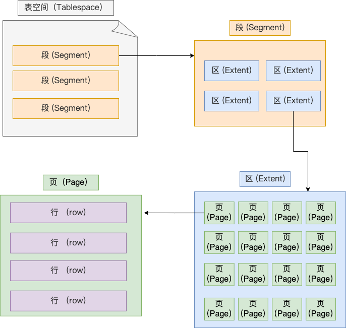
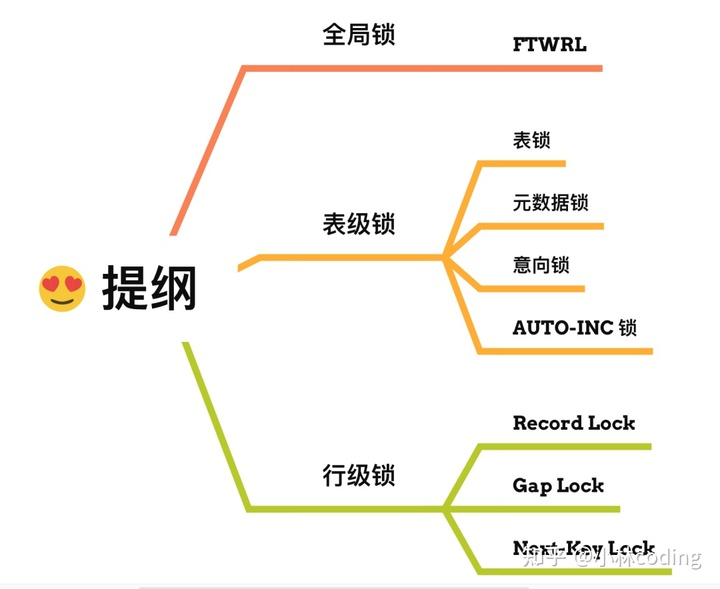
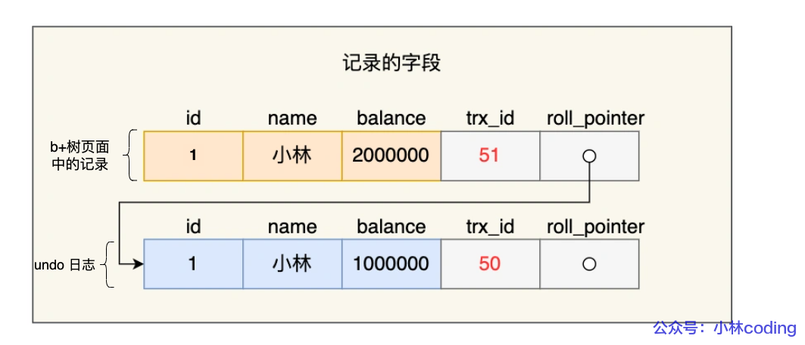

# 「小林 coding - 图解 MySQL」学习笔记

## 基础

### 执行一条 SQL 查询语句，期间发生了什么？

- 连接器：建立连接，管理连接、校验用户身份；
- 查询缓存：查询语句如果命中查询缓存则直接返回，否则继续往下执行。MySQL 8.0 已删除该模块；
- 解析 SQL，通过解析器对 SQL 查询语句进行词法分析、语法分析，然后构建语法树，方便后续模块读取表名、字段、语句类型；
- 执行 SQL：执行 SQL 共有三个阶段：
  - 预处理阶段：检查表或字段是否存在；将 `select *` 中的 `*` 符号扩展为表上的所有列。
  - 优化阶段：基于查询成本的考虑， 选择查询成本最小的执行计划；
  - 执行阶段：根据执行计划执行 SQL 查询语句，从存储引擎读取记录，返回给客户端；

### MySQL 一行记录是怎么存储的？

> 以下是 InnoDB 存储引擎的实现

#### MySQL 的数据存放在哪里？

一个数据库在文件系统中对应一个与之同名的文件夹，其中包含：

- `db.opt` - 数据库配置文件
- `tb_name.frm` - 表结构文件，存放表的元信息，主要包含表结构定义
- `tb_name.ibd` - 独占表空间文件，存放表中的数据

#### 表空间文件的结构是什么样的？

表空间由段（segment）、区（extent）、页（page）、行（row）组成。

1. 行

   数据库表中的记录都是按行（row）进行存放的，每行记录根据不同的行格式，有不同的存储结构。

2. 页

   数据是按页为单位来读写的，页的大小默认是 16KB。

3. 区

   B+ 树中每一层都是通过双向链表连接起来的，如果是以页为单位来分配存储空间，那么链表中相邻的两个页之间的物理位置并不是连续的，可能离得非常远，那么磁盘查询时就会有大量的随机 I/O，随机 I/O 是非常慢的。

   解决这个问题也很简单，就是让链表中相邻的页的物理位置也相邻，这样就可以使用顺序 I/O 了，那么在范围查询（扫描叶子节点）的时候性能就会很高。

   那具体怎么解决呢？

   在表中数据量大的时候，为某个索引分配空间的时候就不再按照页为单位分配了，而是按照区（extent）为单位分配。每个区的大小为 1MB，对于 16KB 的页来说，连续的 64 个页会被划为一个区，这样就使得链表中相邻的页的物理位置也相邻，就能使用顺序 I/O 了。

4. 段

   表空间是由各个段组成的，段是由多个区组成的。段一般分为数据段、索引段和回滚段等。

   - 索引段：存放 B + 树的非叶子节点的区的集合；
   - 数据段：存放 B + 树的叶子节点的区的集合；
   - 回滚段：存放的是回滚数据的区的集合

#### Compact 行格式长什么样？

一条完整的记录分为「记录的额外信息」和「记录的真实数据」两个部分。

1. 额外信息

   - 变长字段长度列表 - 记录每个变长字段实际使用的字节数量
   - NULL 值列表 - 记录每个允许 NULL 的字段是否是 NULL，每个允许 NULL 的字段对应一个二进制位，真实数据部分不含 NULL 值字段
   - 头信息 - `delete_mask`、`next_record` 等

   > 变长字段长度列表和 NULL 值列表都不是必需的，只有含有变长字段或允许 NULL 的字段时才存在。

2. 真实数据

   - row_id

     非必需，占用 6 字节。如果我们建表的时候指定了主键或者唯一约束列，那么就没有 row_id 隐藏字段了。

   - trx_id

     必需，占用 6 字节，表示这个数据是由哪个事务生成的。

   - roll_pointer

     必需，占用 7 字节，记录上一个版本的指针。

#### varchar(n) 中的 n 最大为多少？

MySQL 规定除了 TEXT、BLOBs 这种大对象类型之外，所有字段 + 变长字段长度列表数 +  NULL 值列表 <= 65535。

#### 行溢出后是怎么处理的？

Compact 行格式针对行溢出的处理是这样的：当发生行溢出时，在记录的真实数据处只会保存该列的一部分数据，而把剩余的数据放在「溢出页」中，然后真实数据处用 20 字节存储指向溢出页的地址，从而可以找到剩余数据所在的页。

## 索引

### 索引是什么？

索引是用于快速查询数据的数据结构。在数据之外，数据库系统还维护着满足特定查找算法的数据结构，这些数据结构以某种方式指向数据，这样就可以在

### 索引的分类

- 按「数据结构」分类：

  - B+ Tree 索引
  - Hash 索引
  - Full-text 索引

- 按「物理存储」分类：

  - 聚簇索引：索引结构和数据记录一起存放的索引，主键索引就属于聚簇索引。
  - 非聚簇索引：索引结构和数据记录分开存放的索引，二级索引（辅助索引）就属于非聚簇索引。

  > - 主键索引的 B+Tree 的叶子节点存放的是完整的一条记录。
  > - 二级索引的 B+Tree 的叶子节点存放的是主键值，而不是完整的一条记录。
  >
  > 所以，如果查询条件所涉及字段不是主键，会先在相应的二级索引中找到主键值，然后再根据这个主键值，在主键索引中找到相应的记录，完成查询。换言之，其中涉及两次查找索引结构的过程，第二次过程也称为「回表」。

- 按「字段（关键字）特性」分类：

  - 主键索引：以主键为关键字的索引
  - 唯一索引：以 `UNIQUE` 字段为关键字的索引
  - 普通索引：以普通字段为关键字的索引
  - 前缀索引：以字符类型字段的前几个字符为关键字的索引

  > 除了主键索引，其他索引都为二级索引/辅助索引。主键索引是必须的，其他索引不是必须的。

- 按「字段个数」分类：

  - 单列索引：以单个字段为关键字的索引
  - 联合索引：以多个字段为关键字的索引

  > 「最左匹配原则」：如果查询条件中含有联合索引的最左边的一个或多个连续字段时，就可以利用这些字段进行匹配，当遇到范围查找条件时停止。

### 索引下推

对于联合索引（a, b），在执行 `select * from table where a > 1 and b = 2` 语句的时候，在联合索引中查找时只有 a 字段被用到，那在联合索引中找到第一个满足条件 `a > 1` 的记录后，还需要通过遍历的方式判断其他条件（`b = 2`）是否满足。那么，是在联合索引里判断呢？还是回主键索引去判断呢？

- 在 MySQL 5.6 之前，只能一个个回表，到「主键索引」上找出整条记录，再对 b 字段进行比对。
- MySQL 5.6 引入索引下推优化（index condition pushdown)， 可以先对联合索引中包含的字段先进行比对，直接过滤掉不满足条件的记录，减少回表次数。

### 什么时候应该/不应该创建索引？

- 经常用于 `where`、`group by`、`order by` 的字段应该创建索引。
- 经常更新的字段不应该创建索引。
- 区分度很低的字段不应该创建索引。
- 表数据太少的时候不应该创建索引。

### 有什么优化索引的方法？

- 使用前缀索引

  使用前缀索引可以减少关键字占用的内存空间，从而增加单个非叶子结点中所能包含的关键字数量，使得树更矮，磁盘 I/O 次数更少。

- 使用覆盖索引

  覆盖索引是指查询语句中的字段在二级索引的叶子结点就能找到，不需要回表，从而减少磁盘 I/O 次数。我们可以通过建立联合索引来实现这一点。

- 使用递增的主键

  如果我们使用自增的主键的话，新记录总是在尾部追加，从而减少索引的分裂和重组。

- 防止索引失效

  > 什么情况下会失效？没看懂，后面再了解一下。

### 在 B+ 树中的查找过程是怎么样的？

在 B+ 树中，非叶结点仅起索引作用，不含有该关键字对应的记录。记录存放在叶子结点中，记录之间有序排列，以双向链表的形式链接起来。

在一个 B+ 树中查找的过程是这样的：从磁盘中读取根结点，使用二分查找找到下一层结点的磁盘地址，从磁盘中读取该结点，继续使用二分查找找到下一层结点的磁盘地址，以此类推，直到搜索到叶子结点，进而在叶子结点中找到相应的记录。如果查询的字段是二级索引的关键字，则涉及两次在 B+ 树中查找的过程。第一次是在二级索引的 B+ 树中查找关键字对应的主键，再根据这个主键值，回到主键索引的 B+ 树中查找相应的记录。

### 为什么采用 B+ 树实现索引？

作为数据库表索引的数据结构，至少要满足两个要求：

- 既能够高效地查找单个元素，也能够高效地进行范围查找。
- 完成查找所需的磁盘 I/O 尽可能地少。

查找快的数据结构，无非就两类：哈希表和有序树。

- 哈希表虽然查找快，但不支持范围查找。
- AVL 树和红黑树虽然查找快，也支持范围查找，但树较高，完成查找所需的磁盘 I/O 较多。
- B 树和 B+ 树都是多叉树，树较矮，完成查找所需的磁盘 I/O 较少。但相比于 B 树，B+ 树具备更少的磁盘 I/O、更稳定的查询效率和更适合于范围查询等优势。

> 在二叉搜索树中完成一次查找，需要访问的结点个数等于树的高度，而访问一个结点通常对应一次磁盘 I/O。因此，要想减少磁盘 I/O，树需要尽量地“矮胖”，换言之，单个结点要尽可能地大，但又不能超过一个数据页的大小，因为在数据库中磁盘 I/O 是以数据页为单位的。因此，在实现中，B+ 树中的每个结点都占用一个数据页。

### 什么情况下会导致索引失效？

> 索引失效是指，对于给定的查询条件，已建立的索引都不能起作用，只能进行全表扫描。

- 使用左模糊匹配或左右模糊匹配（索引中的元素是按字符串前缀排序的）
- 对字段使用函数（除非建立了相应的函数索引）
- 对字段进行算术运算（如 `where id + 1 = 10`）
- 对字段使用隐式类型转换（相当于对字段使用函数）
- 在联合索引中查询，但查询条件未遵循最左匹配原则
- `or` 条件中存在非索引字段

## 事务

### 事务隔离级别是怎么实现的？

#### 事务是什么？

事务（Transaction）是由一个或多个数据库操作组成的序列，这些操作是原子的，要么都执行，要么都不执行。

> 我们在进行多个数据库操作前先开启事务，等所有数据库操作执行完成后，才提交事务。对于已经提交的事务来说，该事务对数据库所做的修改将永久生效，如果中途发生发生中断或错误，那么数据库会被回滚到事务开启之前的状态。

#### 事务有哪些特性？

事务要具备 4 个特性：

- 原子性：要么都执行，要么都不执行，中途发生中断或错误会进行回滚。
- 持久性：事务处理结束后，对数据的修改是永久性的。
- 隔离性：允许多个事务并发执行，操作共享数据不会出现不一致的情况，每个事务都有一个独立的数据空间，各个并发事务之间是隔离的。
- 一致性：事务处理前后，数据满足完整性约束，数据库保持一致性状态。

> InnoDB 引擎通过什么技术来保证事务的这四个特性的呢？
>
> - 原子性通过 Undo Log（回滚日志） 来保证。
> - 持久性通过 Redo Log （重做日志）来保证。
> - 隔离性通过 MVCC（多版本并发控制） 或锁机制来保证。
> - 一致性通过持久性、原子性、隔离性来保证。

#### 并行事务会引发什么问题？

MySQL 服务端是允许多个客户端同时连接的，这意味着 MySQL 可能会出现同时处理多个事务的情况。那么在同时处理多个事务的时候，就可能出现脏读（dirty read）、不可重复读（non-repeatable read）、幻读（phantom read）的问题。

- 脏读：一个事务读到了另一个未提交事务修改过的数据。

- 不可重复读：在一个事务内多次读取同一数据，但前后读到的数据不一致。

- 幻读：在一个事务内多次执行同一个查询语句，但前后产生的结果集不一致。

  > 一个幻读的例子：同一个 `select` 语句执行了两次，但第二次返回了第一次没有返回的行，则该行就像是“幻像”行。

SQL 标准提出了四种隔离级别来规避这些现象，隔离级别越高，性能效率就越低，这四个隔离级别从低到高依次是：

- 读未提交（read uncommitted）：一个事务还没提交时，它做的变更就能被其他事务看到。
- 读提交（read committed）：一个事务提交之后，它做的变更才能被其他事务看到。
- 可重复读（repeatable read）：一个事务执行过程中看到的数据，一直跟这个事务启动时看到的数据是一致的（InnoDB 引擎的默认隔离级别）。
- 串行化（serializable）：会对记录加上读写锁，在多个事务对这条记录进行读写操作时，如果发生了读写冲突的时候，后访问的事务必须等待前一个事务执行完成。

> - 在“读未提交”下，可能发生脏读、不可重复读和幻读现象。
> - 在“读提交”下，可能发生不可重复读和幻读现象。
> - 在“可重复读”下，可能发生幻读现象。
> - 在“串行化”下，三种情况都不可能发生。

#### 重要概念

- MVCC
  MVCC（多版本并发控制）目的是使得并发事务之间的读写操作没有冲突，它的实现主要依赖于 3 个机制：“聚簇索引记录中的两个隐藏字段”、“Read View”以及“Undo Log 版本链”。
- 快照读
  普通的查询是快照读。快照读读取的是对当前事务可见的版本，有可能是历史版本，不加锁。
- 当前读
  除了快照读都是当前读，比如 update、insert、delete。当前读读取的是最新版本，读取时还要保证其他并发事务不能修改当前记录，会加锁。
- Undo Log 版本链
  Undo Log 记录的是反向操作，通过它能够得到记录的历史版本，多个历史版本之间通过链表的形式链接起来。

#### MVCC 是如何工作的？

Read View 中有 4 个字段：

- `m_ids` - 当前活跃的事务 ID 集合
- `min_trx_id` - 最小活跃事务 ID
- `max_trx_id` - 预分配事务 ID，当前最大事务 ID + 1（事务 ID 是自增的）
- `creator_trx_id` - 创建者的事务 ID

聚簇索引记录中有 2 个隐藏字段：

- `trx_id` - 最后一次更新该记录的事务 ID
- `roll_ptr` - 回滚指针，指向这条记录的上一个版本

当一个事务创建 Read View 后，根据记录中的 `trx_id` 字段以及 Read View 中的字段，可以知道更新该记录的事务是截至创建 Read View 之时“已提交的事务”，还是“未提交或未启动的事务”，从而判断这条记录对于当前事务是否可见。

> Read View 就像是对数据的一次截屏，截至 Read View 创建之时的最新记录是对当前事务可见的。

具体而言，有以下几种情况：

1. `trx_id` 等于当前事务 ID，说明这条记录就是被当前事务更新的 -> 可见
2. `trx_id` 小于 `min_trx_id`，说明这条记录的更新时间在创建 Read View 之前 -> 可见
3. `trx_id` 大于等于 `max_trx_id`，说明这条记录的更新时间在创建 Read View 之后 -> 不可见
4. `trx_id` 在 `min_trx_id` 和 `mat_trx_id` 之间
   - `trx_id` 在 `m_ids` 中，说明这条记录的更新时间在创建 Read View 之后 -> 不可见
   - `trx_id` 不在 `m_ids` 中，说明这条记录的更新时间在创建 Read View 之前 -> 可见

当得知当前记录不可见时，就会通过回滚指针 `roll_ptr` 找到上一个版本，继续比对。

#### 读提交和可重复读是如何实现的？

- 在“读提交”隔离级别下，在事务期间每次读取数据，都会创建一个 Read View。
- 在“可重复读”隔离级别下，启动事务时创建一个 Read View，然后在整个事务期间都复用这个 Read View。

### 可重复读隔离级别，完全避免幻读了吗？

#### 可重复读隔离级别是如何避免幻读的？

“可重复读”隔离级别很大程度上避免了幻读。

- 对于快照读，通过 MVCC 来避免幻读。

  > 启动事务时创建一个 Read View，然后在整个事务期间都复用这个 Read View。从而保证事务期间读取到的数据一直是事务开始时的模样，即使中途有其他事务插入了一条记录，当前事务是读取不出来这条记录的，这就避免了幻读。

- 对于当前读，通过 Next-Key Lock（记录锁+间隙锁）来避免幻读。

  > 当执行 select ... for update 语句的时候，会加上 Next-Key Lock，如果有其他事务打算在 Next-Key Lock 锁范围内插入一条记录，那么这个插入操作就会被阻塞，无法立即成功插入，从而避免了幻读。

#### 完全避免幻读了吗？

“可重复读”隔离级别没有完全避免幻读。

考虑这样一个情景：事务 A 先进行“快照读”，然后事务 B 插入了一条记录并提交，接下来事务 A 再进行“当前读”，就会读到事务 B 插入的那条记录。

如果要确实避免幻读的话，尽量在开启事务之后，就马上进行“当前读”，这样就会对记录加 next-key lock，从而避免其他事务在锁的范围内插入一条新记录。

## 锁

### MySQL 有哪些锁？

在 MySQL 中，根据加锁的范围，有三类锁：全局锁、表级锁、行级锁。

> 数据库中的锁都是读写锁。

#### 全局锁

加上全局锁后，整个数据库处于只读状态，所有对数据库的写操作都会被阻塞。

全局锁主要用于全库逻辑备份。但是在全库逻辑备份的时候使用全局锁会导致业务停滞，如果数据库引擎支持“可重复读”隔离级别，就没有必要使用全局锁，通过开启事务来进行全库逻辑备份即可。

#### 表级锁

表级锁有这几种：表锁、元数据锁、意向锁、AUTO-INC 锁。

- 表锁

  加上表锁后，整个表处于只读状态，所有对表的写操作都会被阻塞。

  由于表锁的粒度太大，会影响并发性能，应该尽量避免使用表锁。

- 元数据锁

  我们不需要显式地使用元数据锁，当我们对数据库表进行操作时，会自动给这个表加上元数据锁，当事务提交后解锁。

  - 对表进行 CRUD 操作时，加的是元数据读锁（共享锁定）
  - 对表进行结构变更操作时，加的是元数据写锁（独占锁定）

- 意向锁

  在对记录加上行级锁之前，会在表上加上意向锁。

  - 意向锁是表级锁，不会与行级锁发生冲突，意向锁之间也不会发生冲突，意向锁只会和表锁发生冲突。
  - 意向锁用于快速判断表里是否存在行级锁。

- AUTO-INC 锁

  AUTO-INC 锁用于保证自增字段的值是线程安全的。当事务插入一条记录时，会加锁，插入完毕后释放锁。

#### 行级锁

行级锁主要有三类：Record Lock、Gap Lock、Next-Key Lock

- Record Lock（记录锁）

  记录锁用于锁住一条记录。一条记录被锁住后，其他事务不能对这条记录进行写操作。

- Gap Lock（间隙锁）

  间隙锁用于锁住一个开区间。一个开区间被锁住后，其他事务不能在这个开区间内插入记录。

  > 间隙锁的意义只在于阻止区间被插入，因此是可以共存的。一个事务获取的间隙锁不会阻止另一个事务获取同一个间隙范围的间隙锁，共享和排他的间隙锁是没有区别的，它们相互不冲突，且功能相同，即两个事务可以同时持有包含共同间隙的间隙锁。

- Next-Key Lock（临键锁）

  临键锁由一个记录锁和一个间隙锁组成，不仅锁住了一个开区间，还锁住了一条记录，对应一个左开右闭的区间。
  
- 插入意向锁

  一个事务在插入一条记录的时候，需要获取插入意向锁，插入意向锁获取成功的前提是，没有其他任何事务持有相应区间的间隙锁。

  > 插入意向锁名字虽然有意向锁，但是它并不是意向锁，它是一种特殊的间隙锁，属于行级锁。

### MySQL 是怎么加行级锁的？

行级锁加锁的对象是记录（行），加锁的基本单位是临键锁。

当进行“当前读”时，就会对目标记录进行加锁。

但是，当仅使用记录锁或间隙锁就能避免幻读时，临键锁会退化成记录锁或间隙锁。

> 如果一个“当前读”语句走的是“全表扫描”，在一行行扫描的过程中，不仅给记录加上了行锁，还给记录两边的空隙也加上了间隙锁，相当于锁住了整个表。

### MySQL 如何避免死锁？

- 一个死锁的案例

  两个事务同时持有某个区间上的间隙锁之后，分别执行插入语句，这需要获取插入意向锁。然而，双方都必须等待对方释放间隙锁之后才能获取插入意向锁，这就形成了死锁。

- 避免死锁的方法

  - 设置事务等待锁的超时时间
  - 开启主动死锁检测

## 日志

- Undo Log（回滚日志）用于事务回滚和 MVCC，保证了事务的原子性，由 Innodb 存储引擎层实现。
- Redo Log（重做日志） 用于崩溃恢复，保证了事务的持久性，由 Innodb 存储引擎层实现。
- Binlog（二进制日志）用于备份恢复、主从复制的日志，由服务层实现。

### Undo Log

Undo Log 是一种用于撤销回退的日志，记录了在事务期间对数据所做的更新操作的逆操作。当事务需要回滚时，就可以利用 Undo Log 恢复数据。

利用 Undo Log 可以还原出各个历史版本的记录，这些历史版本的记录通过记录中的 roll_pointer 隐藏字段按时序链接起来，形成 Undo Log 版本链。

### Redo Log

Redo Log 是一种用于重做的日志，记录了在事务期间某个页被做了什么修改。

在事务提交时，先将 Redo Log 写入到磁盘，这样的话，当系统崩溃时，即使脏页没有被写入到磁盘，等系统重启后，也可以根据 Redo Log 中的内容，将数据恢复到最新的状态。

Redo Log 的写入只需要在尾部追加，是顺序写。而脏页的写入需要先找到写入的位置，然后再进行写操作，是随机写。顺序写要比随机写高效的多，因此将 Redo Log 写入磁盘的开销更小。

> Redo Log 文件大小是固定的，类似于一个循环队列。它只保存未被写入磁盘的脏页日志，一旦脏页被写入磁盘，相关的 Redo Log 内容就会被清除。

Redo Log 也不是实时被写入到磁盘的，它有自己的缓冲区——Redo Log buffer，InnoDB 会在合适的时机会将 Redo Log buffer 中的内容写入到磁盘。

> 所以说，Redo Log 也不能保证能够完全恢复数据。
>
> Redo Log buffer 持久化的时机可以通过设置特定的参数进行调整，需要在性能和数据安全性之间进行权衡。

### Binlog

Binlog 是一种用于备份恢复、主从复制的日志，记录了事务对表结构或表数据的所有修改操作。

Binlog 也不是实时被写入到磁盘的，会先被保存到 Binlog Cache 中，在事务提交后才会统一将该事务的所有 Binlog 写入到磁盘。

#### 两阶段提交

在事务提交后，Redo Log 和 Binlog 都要被写入到磁盘。这两个操作是独立的，如果出现半成功的状态，磁盘中两份日志的逻辑就会不一致，进而导致主库和从库的数据不一致。为了避免这个问题，使用“两阶段提交”来解决。

“两阶段提交”是指把单个事务的提交分成了两个阶段：准备阶段和提交阶段。

#### 主从复制

主从复制是一种数据复制技术，用于在多个数据库服务器之间的数据同步。在主从复制架构中，一个服务器被设置为主服务器（Master），充当数据源，其他服务器被设置为从服务器（Slave），用来复制主服务器的数据。

主从复制主要是基于 Binlog 实现的，它的实现流程如下：

1. 主数据库的修改记录被记录到 Binlog 中
2. 从数据库的 IO 线程读取主数据库的 Binlog，将其内容记录到 Relay Log（中继日志）中
3. 从数据库的 SQL 线程读取 Relay Log，根据其内容对从数据库中的数据进行修改

## 内存

### Buffer Pool

MySQL 的数据是存储在磁盘上的。为了提高读写效率，MySQL 维护一个 Buffer Pool 用于缓存最近访问的页。

当需要访问某个页时，首先查找 Buffer Pool，如果 Buffer Pool 未命中，再去磁盘中读取该页，并放入 Buffer Pool 中。Buffer Pool 中被修改过的页被称为脏页，脏页会在后续某个合适的时机被后台线程写入到磁盘。

> Buffer Pool 对缓存页的管理跟操作系统对内存块的管理很类似。

InnoDB 维护了三种链表来管理缓存页：

- 空闲页链表 - 记录哪些页是空闲页
- 脏页链表 - 记录哪些页是脏页
- LRU 链表 - 记录哪些缓存页是最近访问过的
