# 操作系统

## 计算机系统概述

### 操作系统的基本概念

#### 操作系统的概念

操作系统是指控制和管理整个计算机系统的硬件和软件资源，合理地组织、调度计算机的工作与资源的分配，进而为用户和其他软件提供方便接口与环境的程序集合。操作系统是计算机系统中最基本的系统软件。

#### 操作系统的特征

1. 并发

   并发是指两个或多个事件在同一时间间隔内发生，操作系统的并发性是指计算机系统中同时存在多个运行的程序，因此它们具有处理和调度多个程序同时执行的能力。注意同一时间间隔（并发）和同一时刻（并行）的区别。在多道程序环境下，一段时间内，宏观上有多道程序在同时执行，而在每个时刻，单处理机环境下实际仅能有一道程序执行，因此微观上这些程序仍是分时交替执行的。

2. 共享

   共享是指系统中的资源可供内存中多个并发执行的进程共同使用。共享可分为互斥共享方式和同时访问方式，其中同时访问方式中的“同时”通常是宏观上的，而在微观上，可能还是“分时”的。

3. 虚拟

   虚拟是指把一个物理上的实体变为若干逻辑上的对应物。物理实体是实的，即实际存在的；而后者是虚的，是用户感觉上的事物。操作系统中利用了多种虚拟技术（时分复用和空分复用）来实现虚拟处理器、虚拟内存和虚拟外部设备等。

4. 异步

   多道程序环境允许多个程序并发执行，但由于资源有限，进程的执行并不是一贯到底的，而是走走停停的，它以不可预知的速度向前推进，这就是进程的异步性。异步性使得操作系统运行在一种随机的环境下，可能导致进程产生与时间有关的错误。然而，只要运行环境相同，操作系统就须保证多次运行进程后都能获得相同的结果。

#### △操作系统的目标和功能

1. 操作系统作为计算机系统资源的管理者

   1. 处理机管理

      在多道程序环境下，处理机的分配和运行都以进程（或线程）为基本单位，因而对处理机的管理可归结为对进程的管理。进程何时创建、何时撤销、如何管理、如何避免冲突、合理共享是进程管理最主要的任务。进程管理的主要功能包括进程控制、进程同步、进程通信、死锁处理、处理机调度等。

   2. 存储器管理

      存储器管理主要包括内存分配与回收、地址映射、内存保护与共享和内存扩充等功能。

   3. 文件管理

      文件管理包括文件存储空间的管理、目录管理及文件读写管理和保护等。

   4. 设备管理

      设备管理的主要任务是完成用户的I/O请求，主要包括缓冲管理、设备分配、设备处理和虚拟设备等功能。

2. 操作系统作为用户与计算机硬件系统之间的接口

   1. 命令接口

      按照作业控制方式的不同，可将命令接口分为联机命令接口（交互式命令接口）和脱机命令接口（批处理命令接口）。

   2. 程序接口

      程序接口由一组系统调用（也称广义指令）组成。用户通过在程序中使用这些系统调用来请求操作系统为其提供服务，如使用各种外部设备、申请分配和回收内存等。

3. 操作系统实现了对计算机资源的扩充

   没有任何软件支持的计算机称为裸机，它仅构成计算机系统的物质基础，而实际呈现在用户面前的计算机系统是经过若干层软件改造的计算机。裸机在最里层，其外面是操作系统。操作系统所提供的资源管理功能和方便用户的各种服务功能，将裸机改造成功能更强、使用更方便的机器。因此，我们通常把覆盖了软件的机器称为扩充机器或虚拟机。

### *操作系统的发展历程

#### 手工操作阶段（此阶段无操作系统）

#### 批处理阶段（操作系统开始出现）

#### 分时操作系统

#### 实时操作系统

#### 网络操作系统和分布式操作系统

#### 个人计算机操作系统

### 操作系统运行环境

#### △处理器运行模式

计算机系统中，通常CPU执行两种不同性质的程序：一种是操作系统内核程序；另一种是用户程序。内核程序是用户程序的管理者，内核程序要执行一些特权指令，而用户程序出于安全考虑不能执行这些指令。在具体实现上，将CPU的运行模式划分为用户态（目态）和核心态（管态、内核态），这种状态被记录在CPU的程序状态字寄存器（PSW）中。用户程序运行在用户态，操作系统内核程序运行在核心态。

在操作系统中引入核心态和用户态这两种工作状态后，就需要考虑这两种状态之间如何切换：

1. 核心态 -> 用户态

   这是由内核程序主动引发的。在合适的时候，内核程序会用一条特权指令把PSW的标志位设置为“用户态”，操作系统主动让出CPU的使用权。

2. 用户态 -> 核心态

   这是由中断和异常引发的，硬件自动完成CPU状态的转变，操作系统强行夺回CPU的使用权。

#### △中断和异常

1. 中断和异常的定义

   - 中断(Interruption)：也称外中断，是指来自CPU执行指令外部的事件，与当前执行的指令无关。如I/O结束中断、时钟中断。
   - 异常(Exception)：也称内中断，是指来自CPU执行指令内部的事件，与当前执行的指令有关。如特权指令、地址越界、运算溢出、缺页、陷入指令等。异常不能被屏蔽，一旦出现，就应立即处理。

2. 中断和异常的分类

   - 外中断可分为可屏蔽中断和不可屏蔽中断。可屏蔽中断在CPU处于关中断状态下不能中断程序；不可屏蔽中断可以随时中断程序，通常是紧急的硬件故障。
   - 异常可分为故障、自陷和终止。故障(Fault)通常是由指令执行引起的异常，如非法操作码、缺页故障、除数为0、运算溢出等。自陷(Trap)是一种事先安排的“异常”事件，用于在用户态下调用操作系统的内核程序，如陷入指令。终止(Abort)是指出现了使得CPU无法继续执行的硬件故障，如控制器出错、存储器校验错等。故障异常和自陷异常属于软件中断（程序性异常），终止异常和外中断属于硬件中断。

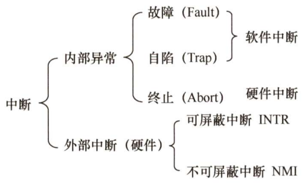

3. 中断和异常的处理过程

   当CPU在执行用户程序的第i条指令时检测到一个异常或中断，则CPU打断当前的用户程序，然后转到相应的中断或异常处理程序去执行。若中断或异常处理程序能够解决相应的问题，则在中断或异常处理程序的最后，CPU通过执行中断或异常返回指令，回到被打断的用户程序的第i条指令或第i+1条指令继续执行；若中断或异常处理程序发现是不可恢复的致命错误，则终止用户程序。通常情况下，对中断和异常的具体处理过程由操作系统（和驱动程序）完成。

#### △系统调用

系统调用是指用户在程序中调用操作系统所提供的一些子功能，系统调用可视为特殊的公共子程序。系统中的各种共享资源都由操作系统统一掌管，因此在用户程序中，凡是与资源有关的操作（如存储分配、I/O传输及文件管理等），都必须通过系统调用方式向操作系统提出服务请求，并由操作系统代为完成。通常，一个操作系统提供的系统调用命令有几十条乃至上百条之多。这些系统调用可大致分为：

- 设备管理
- 文件管理
- 进程管理
- 进程通信
- 内存管理

系统调用的处理需要由操作系统内核程序负责完成，要运行在核心态。用户程序可以执行陷入指令（访管指令、trap指令）来发起系统调用，请求操作系统提供服务。因此，系统调用程序也算是一种异常处理程序。

### *操作系统结构

### 操作系统引导

操作系统是一种程序，程序以数据的形式存放在硬盘中，而硬盘通常分为多个区，一台计算机中又有多个或多种外部存储设备。操作系统引导是指计算机利用CPU运行特定程序，通过程序识别硬盘，识别硬盘分区，识别硬盘分区上的操作系统，最后通过程序启动操作系统。

常见的操作系统引导过程如下：

1. 激活CPU

   激活的CPU读取ROM中的boot程序，将指令寄存器置为BIOS（基本输入/输出系统）的第一条指令，即开始执行BIOS的指令。

2. 硬件自检

   启动BIOS程序后，先进行硬件自检，检查硬件是否出现故障。如有故障，主板会发出不同含义的蜂鸣，启动终止；如无故障，屏幕会显示CPU、内存、硬盘等信息。

3. 加载带有操作系统的硬盘

   硬件自检后，BIOS开始读取Boot Sequence（通过CMOS里保存的启动顺序，或者通过与用户交互的方式），把控制权交给启动顺序排在第一位的存储设备，然后CPU将该存储设备引导扇区的内容加载到内存中。

4. 加载主引导记录MBR

   硬盘以特定的标识符区分引导硬盘和非引导硬盘。如果发现一个存储设备不是可引导硬盘，就检查下一个存储设备。如无其他启动设备，就会死机。主引导记录MBR的作用是告诉CPU去硬盘的哪个主分区去找操作系统。

5. 扫描硬盘分区表，并加载硬盘活动分区

   MBR包含硬盘分区表，硬盘分区表以特定的标识符区分活动分区和非活动分区。主引导记录扫描硬盘分区表，进而识别含有操作系统的硬盘分区（活动分区）。找到硬盘活动分区后，开始加载硬盘活动分区，将控制权交给活动分区。

6. 加载分区引导记录PBR

   读取活动分区的第一个扇区，这个扇区称为分区引导记录(PBR)，其作用是寻找并激活分区根目录下用于引导操作系统的程序（启动管理器）。

7. 加载启动管理器

   分区引导记录搜索活动分区中的启动管理器，加载启动管理器

8. 加载操作系统

### *虚拟机

## 进程与线程

### 进程与线程

#### △进程的概念和特征

1. 进程的概念

   - 进程是程序的一次执行过程，是系统进行资源分配和调度的一个独立单位
   - 进程控制块(PCB)是系统用于描述进程的基本情况和运行状态的一种数据结构，是进程存在的唯一标志
   - 进程实体（进程映像）由PCB、程序段、数据段三部分构成
   - 所谓创建进程和撤销进程，实质上是创建和撤销进程实体中的PCB
   - 进程映像是静态的，进程是动态的

2. 进程的特征

   进程是由多道程序的并发执行而引出的，它和程序是两个截然不同的概念。进程的基本特征是对比单个程序的顺序执行提出的，也是对进程管理提出的基本要求。

   1. 动态性

      进程是程序的一次执行，它有着创建、活动、暂停、终止等过程，具有一定的生命周期，是动态地产生、变化和消亡的。

   2. 并发性

      指多个进程实体同存于内存中，能在一段时间内同时运行。引入进程的目的就是使进程能和其他进程并发执行。

   3. 独立性

      指进程实体是一个独立运行、独立获得资源和独立接受调度的基本单位。

   4. 异步性

      由于进程的相互制约，使得进程按各自独立的、不可预知的速度向前推进。异步性会导致执行结果的不可再现性，为此在操作系统中必须配置相应的进程同步机制。

#### △进程的状态和转换

通常进程有以下5种状态，前3种是进程的基本状态

1. 运行态

   进程正在处理机上运行。在单处理机种，每个时刻只有一个进程处于运行态。

2. 就绪态

   进程获得了除处理机外的一切所需资源，一旦得到处理机，便可立即运行。系统通常将处于就绪态的进程排成一个就绪队列。

3. 阻塞态（等待态）

   进程正在等待某一事件而暂停运行，如等待某资源（不包括处理机）为可用或等待输入/输出完成。即使处理机空闲，该进程也不能运行。系统通常将处于阻塞态的进程也排一个队列，甚至根据阻塞原因的不同，设置多个阻塞队列。

4. 创建态

   进程正在被创建，尚未转到就绪态。创建进程需要多个步骤：首先申请一个空白PCB，并向PCB种填写用于控制和管理进程的信息；然后为该进程分配运行时所必须的资源；最后把该进程转入就绪态并插入就绪队列。但是，如果进程所需的资源尚不能得到满足，如内存不足，则创建工作尚未完成，进程此时所处的状态称为创建态。

5. 结束态

   进程正在从系统消失，可能是进程正常结束或由于其他原因退出运行。进程需要结束运行时，系统首先将其设置为结束态，然后进一步处理资源释放和回收等工作。


#### 进程的组织

为了方便进程的调度和管理，需要将各进程的PCB用适当的方法组织起来。目前，常用的组织方式有链接方式和索引方式两种。

1. 链接方式：将同一状态的PCB链接成一个队列，不同状态对应不同队列
2. 索引方式：将同一状态的进程组织在一个索引表中，索引表的表项指向相应的PCB

#### 进程控制

- 进程控制的主要功能是实现进程状态的转换
- 一般把用于进程控制的程序段称为原语
- 按照功能的不同，可将原语分为创建原语、终止原语、阻塞原语、唤醒原语
- 无论是哪个进程控制原语，要做的无非三类事情：更新PCB中的信息，更新PCB所在队列、分配或回收资源

#### △进程通信

- 共享存储
- 消息传递
- 管道通信

（详见《2023年王道操作系统考研复习指导》P41）

#### △线程和多线程模型

1. 线程的基本概念

   - 线程最直接的理解就是“轻量级的进程”，它是一个基本的CPU执行单元，也是程序执行流的最小单元
   - 线程是进程中的一个实体，是被系统调度的基本单位
   - 线程自己不拥有系统资源，但它可以与同属于一个进程的其他线程共享进程所拥有的全部资源
   - 一个线程可以创建和撤销另一个线程，同一进程中的多个线程之间可以并发执行
   - 线程也有就绪、阻塞和运行三种基本状态
   - 引入线程后，进程只作为除CPU外的系统资源的分配单元，而线程作为处理机的分配单元

2. 线程与进程的比较

   1. 调度

      在传统的操作系统中，进程是调度的基本单位。每次调度都需要进行上下文切换，开销较大。引入线程后，线程变成调度的基本单位，在同一进程中线程切换的开销远小于进程切换。

   2. 并发性

      引入线程后，不仅进程之间可以并发执行，而且一个进程中的多个线程之间也可以并发执行，操作系统具有更好的并发性。

   3. 拥有资源

      进程是系统中拥有资源的资本单位，而线程不拥有资源，但线程可以访问其隶属进程的系统资源。

   4. 独立性

      每个进程都有独立的地址空间和资源，同一进程中的不同线程共享进程的地址空间和资源。

   5. 系统开销

      在创建、撤销、调度/切换、通信方面，线程的开销比进程小得多。

   6. 支持多处理机系统

      对于传统单线程进程，不管有多少处理机，进程只能运行在一个处理机上。对于多线程进程，可以将进程中的多个线程分配到多个处理机上执行。

3. 线程的实现方式

   线程的实现可以分为两类：用户级线程和内核级线程

   1. 用户级线程

      在用户级线程中，有关线程管理的所有工作都由应用程序在用户空间中完成，内核意识不到线程的存在。应用程序可以通过线程库设计成多线程程序。通常，应用程序从单线程开始，在该线程中开始运行，在其运行的任何时刻，可以通过调用线程库创建一个在相同进程中运行的新线程。

      - 优点：①线程切换不需要转换到内核空间，节省了模式切换的开销；②调度算法可以是进程专用的，不同的进程可以根据自身的需要，对自己的线程选择不同的调度算法；③用户级线程的实现与操作系统平台无关，对线程管理的代码是属于用户程序的一部分
      - 缺点：①当线程执行一个系统调用时，不仅该线程被阻塞，而且进程内的所有线程都被阻塞；②不能发挥多处理机的优势，内核每次分配给进程的仅有一个CPU，因此进程中仅有一个线程能执行

   2. 内核级线程

      在内核级线程中，有关线程管理的所有工作在内核空间内实现。内核空间为每个内核级线程设置一个线程控制块，内核根据该控制块感知某线程的存在，并对其加以控制。

      - 优点：①能发挥多处理机的优势，内核能同时调度同一进程中的多个线程并行执行；②如果进程中的一个线程被阻塞，其他线程不受影响；③内核支持线程具有很小的数据结构和堆栈，线程切换比较快、开销小；④内核本身也可以采用多线程技术，可以提高系统的执行速度和效率
      - 缺点：同一进程中的线程切换，需要从用户态转到核心态，系统开销较大

   3. 组合方式

      将用户级线程和内核级线程组合可以集两者之所长。

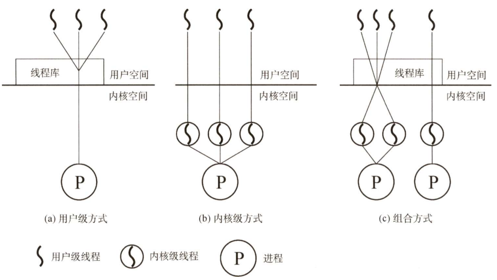

   4. 多线程模型

      有些系统同时支持用户线程和内核线程，由于用户级线程和内核级线程的连接方式不同，从而形成了三种不同的多线程模型。

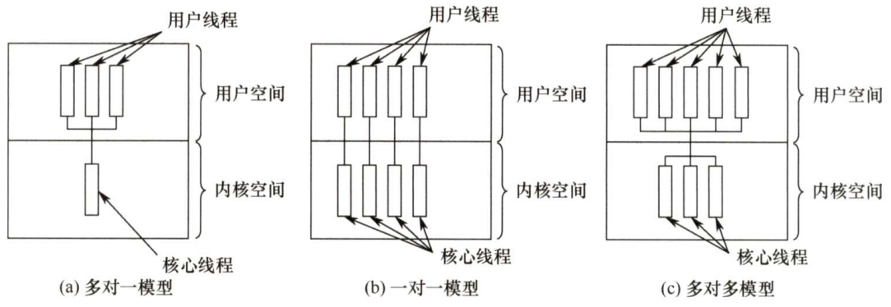

### 处理机调度

#### 调度的概念

处理机调度是对处理机进行分配，即按照一定的算法选择一个进程并将处理机分配给它运行，以实现进程并发地执行。

一个作业从提交开始直到完成，往往要经历以下三级调度：

- 高级调度（作业调度）：按照某种规则，从后备队列中选择合适的作业将其从外存调入内存，并为其创建进程

- 中级调度（内存调度）：按照某种规则，从挂起队列中选择合适的进程将其数据从外存调回内存，并放在就绪队列

- 低级调度（进程调度）：按照某种规则，从就绪队列中选择一个进程为其分配处理机

三级调度有以下特点：

- 作业调度为进程活动做准备，进程调度使进程正常活动起来
- 某些进程因系统内存不足而被挂起（调回外存），中级调度负责在合适的时候把被挂起的进程重新调入内存，并修改其状态为就绪态
- 进程调度是最基本的，不可或缺
- 作业调度次数少，中级调度次数略多，进程调度频率最高

#### 调度算法的评价指标

- CPU利用率：CPU有效工作时间与总工作时间之比
- 系统吞吐量：单位时间内CPU完成作业的数量
- 周转时间：作业提交到作业完成所经历的时间
- 等待时间：进程处于等处理机的时间之和
- 响应时间：用户提交请求到系统首次产生响应所用的时间

#### 调度的实现

1. 调度程序（调度器）

   在操作系统中，用于调度和分派CPU的组件称为调度程序。它通常由三部分组成：

   1. 排队器

      将系统中的所有就绪进程按照一定的策略排成一个或多个队列，以便于调度程序选择。

   2. 分派器

      依据调度程序所选的进程，将其从就绪队列中取出，将CPU分配给新进程。

   3. 上下文切换器

      切换CPU现场信息。

2. 调度的时机、切换与过程

   不能进行进程调度与切换的情况有以下几种：

   1. 处理中断的过程中
   2. 进程在操作系统内核临界区中
   3. 原子操作

   应该进行进程调度与切换的情况如下：

   1. 发生引起调度的条件且当前进程无法继续运行下去时，可以马上进行调度与切换
   2. 中断处理结束或自陷处理结束后，返回被中断进程的用户态程序执行现场前，若置上请调度标志，即可马上进行进程调度与切换

3. 进程调度方式

   当某个进程正在处理机上执行，若有某个更为重要或紧迫的进程需要处理，即有优先权更高的进程进入就绪队列，如何分配处理机？

   1. 非抢占调度方式（非剥夺方式）

      仍然让正在执行的进程进程继续执行，直到该进程运行结束或进入阻塞态时，才把处理机分配给这个更为重要或紧迫的进程。

   2. 抢占调度方式（剥夺方式）

      允许调度程序根据某种规则去暂停正在执行的进程，将处理机分配给这个更为重要或紧迫的进程。

#### *典型的调度算法

1. 先来先服务(FCFS)调度算法
2. 短作业优先(SJF)调度算法
3. 优先级调度算法
4. 高响应比优先调度算法
5. 时间片轮转调度算法
6. 多级队列调度算法
7. 多级反馈队列调度算法

### 同步与互斥

#### 同步与互斥的基本概念

1. 临界资源

   一次仅允许一个进程使用的资源称为临界资源。

   可以将访问临界资源的代码分为4个部分：

   1. 进入区。检查是否可以进入临界区，若能进入，则设置正在访问临界区的标志
   2. 临界区。进程中真正访问/操作临界资源的那段代码，又称临界段
   3. 退出区。将正在访问临界区的标志清除
   4. 剩余区。代码的其余部分

2. 同步（（直接制约关系））

   在多道程序系统中，多个进程以不可预知的速度并发执行。当两个或多个进程需要合作时，往往需要在某些位置上协调它们的工作次序，这样就产生了一种制约关系。

3. 互斥（间接制约关系）

   当一个进程进入临界区使用临界资源时，另一个进程必须等待，当占用临界资源的进程退出临界区后，另一进程才允许去访问此临界资源。

   同步机制应遵循以下准则：

   1. 空闲让进
   2. 忙则等待
   3. 有限等待
   4. 让权等待

#### 实现临界区互斥的基本方法

1. 软件实现方法

   1. 单标志法

      - 通俗理解：谦让

      - 设置一个公用整型变量turn，用于指示被允许进入临界区的进程编号

      - 违背“空闲让进”：两个进程必须交替进入临界区，若某个进程不再进入临界区，则另一个进程也无法进入临界区

      - ```cpp
        // P0进程						// P1进程
        while (turn != 0);				while (turn != 1);
        critical section;				critical section;
        turn = 1;					   turn = 0;
        remainder section;				remainder section;
        ```

   2. 双标志先检查法

      - 通俗理解：先看看是否空闲

      - 在每个进程访问临界区之前，先检查临界资源是否正在被访问

      - 为此，设置一个数据flag[i]，如第i个元素值为false，表示Pi进程没进入临界区

      - 违背“忙则等待”：多道程序并发执行时，有可能会同时进入临界区

      - ```cpp
        // P0进程						// P1进程
        while (flag[1]);			    while (flag[0]);
        flag[0] = true;				    flag[1] = true;
        critical section;			    critical section;
        flag[0] = false;			    flag[1] = false;
        remainder section;				remainder section;
        ```

   3. 双标志后检查法

      - 与双标志先检查法类似，区别在于检查和上锁的次序不同

      - 违背“空闲让进”：多道程序并发时，有可能都进入不了临界区

      - ```cpp
        // P0进程						// P1进程
        flag[0] = true;				    flag[1] = true;
        while (flag[1]);			    while (flag[0]);
        critical section;			    critical section;
        flag[0] = false;			    flag[1] = false;
        remainder section;				remainder section;
        ```

      - 两种双标志法的问题在于：检查和上锁不能一气呵成，导致了bug的出现

   4. Peterson算法

      - 通俗理解：先看看是否空闲，若空闲，就谦让对方先进去

      - 结合了双标志法和单标志法

      - 好像没什么缺点

      - ```cpp
        // P0进程						// P1进程
        flag[0] = true;				    flag[1] = true;
        turn = 1;					   turn = 0
        while (flag[1] && turn == 1);	  while (flag[0] && turn == 0);
        critical section;			    critical section;
        flag[0] = false;			    flag[1] = false;
        remainder section;				remainder section;
        ```

2. 硬件实现方法

   1. 中断屏蔽方法

      - 中断屏蔽过程中CPU不能进行进程切换，因此能保证当前进程顺利执行完临界区代码，从而达到互斥的目的
      - 只适用于单处理机系统

   2. 硬件指令方法

      由硬件逻辑直接实现，不会被中断，是原子操作。

      - TestAndSet指令：功能是读出指定标志后把该标志设置为真，其实就是填补了双标志法缺陷

        ```cpp
        while TestAndSet(&lock);
        critical section;
        lock = false;
        remainder section;
        ```

      - Swap指令：交换两个字（字节）的内容

        ```cpp
        key = true;
        while (key != false)
            Swap(&lock, key);
        critical section;
        lock = false;
        remainder section;
        ```

#### 互斥锁

解决临界区最简单的工具就是互斥锁(mutex lock)。一个进程在进入临界区时应获得锁；在退出临界区时释放锁。函数acquire()获得锁，函数release()释放锁。

每个互斥锁有一个布尔变量available，表示锁是否可用。如果锁是可用的，调用acqiure()会成功，且锁不再可用。当一个进程试图获取不可用的锁时，会被阻塞，直到锁被释放。

```cpp
acquire() {
    while(!available)
        ;				// 忙等待
    available = false;	  // 获得锁
}
release() {
    available = true;	  // 释放锁
}
```

acquire()和release()必须是原子操作，因此互斥锁通常采用硬件机制来实现。

互斥锁的主要缺点是忙等待，当有一个进程在临界区中，任何其他进程在进入临界区时必须连续循环调用acquire()。当多个进程共享一个CPU时，就浪费了CPU周期。因此，互斥锁通常用于多处理机系统，一个线程可以在一个处理机上等待，不影响其他线程的执行。

#### 信号量

信号量机制是一种功能较强的机制，可以用来解决互斥与同步问题，它只能被两个标准的原语wait(S)和signal(S)访问，也可以记为“P操作”和“V操作”。

1. 整型信号量

   整型信号量被定义为一个用于表示资源数目的整型量S，与普通整型变量不同的是，它只能执行初始化、wait和signal操作。

   ```cpp
   wait(S) {
       while (S <= 0);
       S = S - 1;
   }
   signal(S) {
       S = S + 1;
   }
   ```

   在整型信号量机制中的wait操作，只要信号量S<=0，就会不断地测试。因此，该机制为遵循“让权等待”准则，而是让进程“忙等”。

2. 记录型信号量

   记录型信号量机制是一种不存在“忙等”现象的进程同步机制。除了需要一个用于代表资源数目的整型变量value外，还需要一个进程链表L，用于链接所有等待该资源的进程。记录型信号量得名于采用了记录型的数据结构。记录型信号量可描述为：

   ```cpp
   typedef struct {
       int value;
       struct process *L
   } semaphore;
   ```

   相应wait(S)和signal(S)操作如下：

   ```cpp
   void wait(semaphore S) {
       --S.value;
       if (S.value < 0) {
           add this process to S.L;
           block(S.L);  // 阻塞该进程
       }
   }
   
   void signal(semaphore S) {
       ++S.value;
       if(S.value <= 0) {
           remove a process P from S.L;
           wakeup(P);  // 唤醒P进程
       }
   }
   ```

3. 利用信号量实现互斥

   在互斥问题中，PV操作要紧夹使用互斥资源的那个行为，中间不能有其他冗余代码

   ```cpp
   semaphore S = 1;	  // 初始化信号量
   P1() {
       ...
       P(S);			 // 准备开始访问临界资源，加锁
       进程P1的临界区；
       V(S)；			// 访问结束，解锁
       ...
   }
   P2() {
       ...
       P(S);			 // 准备开始访问临界资源，加锁
       进程P2的临界区；
       V(S)；			// 访问结束，解锁
       ...
   }
   ```

4. 利用信号量实现同步

   ```cpp
   semaphore S = 0;    // 初始化信号量
   P1() {
       ...
       前操作;
       V(S);           // 告诉进程P2，前操作已经完成
       ...
   }
   P2() {
       ...
       P(S);		   // 检查前操作是否运行完成
       后操作;
       ...
   }
   ```

   前V后P：在前操作之后进行V操作，在后操作之前进行P操作

5. 利用信号量实现前驱关系

   为每一对关系分别设置信号量，遵循前V后P的规律编写代码即可


#### 管程

管程就是对为实现同步与互斥而进行的各种复杂操作的一种封装，使得程序员只需要调用相应的接口即可实现同步与互斥。

#### 经典同步问题

1. 生产者-消费者问题

   - 问题描述：

     一组生产者进程和一组消费者进程共享一个初始为空、大小为n的缓冲区，只有当缓冲区没满时，生产者才能把消息放入缓冲区，否则必须等待；只有缓冲区不为空时，消费者才能从中取出消息，否则必须等待。由于缓冲区是临界资源，它只允许一个生产者放入消息，或一个消费者从中取出消息

   - 问题分析：

     - 对缓冲区的互斥访问比较简单，只需要让设置一个互斥信号量mutex，然后让每个进程进入临界区前后分别进行P操作和V操作即可
     - 这里有两种同步关系：①缓冲区中需要先有消息，消费者才能取出消息，为此设置一个信号量full，初值为0；②缓冲区中需要先有空位，生产者才能放入消息，为此设置一个信号量empty，初值为n

   - 代码实现：

     ```cpp
     semaphore mutex = 1;
     semaphore full = 0;
     semaphore empty = n;
     producer() {
         while(true) {
             produce an item;
             P(empty);		// 申请获取空缓冲区单元
             P(mutex);
             add an item to buffer;
             P(mutex);
             V(full);		// 缓冲区单元数+1
         }
     }
     consumer() {
         while(true) {
             P(full);		// 申请获取非空缓冲区单元
             P(mutex);
             remove an item in buffer;
             V(mutex);
             V(empty);		// 空缓冲区单元数+1
         }
     }
     ```

   - 问题描述：

     桌上有一个盘子，每次只能向其中放入一个水果。爸爸专向盘子中放苹果，妈妈专向盘子中放句子，儿子专等吃盘子中的句子，女儿专等吃盘子中的苹果。只有盘子为空时，爸爸或妈妈才可以向盘子中放一个水果；仅当盘子中有自己需要的水果时，儿子或女儿可以从盘子中取出

   - 问题分析：

     - 互斥访问，设置一个互斥信号量mutex，然后让每个进程进入临界区前后分别进行P操作和V操作即可
     - 这里有三种同步关系：①只有当盘子为空时，爸爸或妈妈才可以向盘子中放一个水果。注意，盘子为空这个事件既可以由儿子吃苹果触发，又可以由女儿吃橘子触发。为此设置一个信号量plate，初值为1,表示有空位，允许放入。儿子或女儿吃完后，要V(plate)，爸爸或妈妈放入前，要P(plate)；②只有当盘子中有苹果时，儿子才能吃苹果。为此设置一个信号量apple，初值为0，表示没有苹果。爸爸放入苹果后，要V(apple)，儿子吃苹果前，要P(apple);③女儿跟妈妈之间也有类似的同步关系

2. 读者-写者问题（较复杂）

   - 问题描述：

     有读者和写者两组并发进程，共享一个文件，当两个或以上的读进程同时访问共享数据时不会产生副作用，但若某个写进程和其他进程（读进程或写进程）同时访问共享数据时则可能导致数据不一致的错误。因此要求：①允许多个读者可以同时对文件执行读操作；②只允许一个写者往文件中写信息；③任一写者在完成写操作之前不允许其他读者或写者工作；④写者执行写操作前，应让已有的读者和写者全部退出

   - 问题分析：

     - 读者和写者是互斥的，写者和写者也是互斥的，而读者和读者不存在互斥问题。设置信号量rw用于互斥访问，设置count变量用于记录当前的读者数量。在读者进程中，当且仅当count==0时，才需要对rw进行PV操作
     - 在读者进程对count变量进行读写时，如果发生进程切换，会出现问题。解决办法是设置互斥信号量mutex，用对mutex的PV操作将读写count变量的代码部分包起来，从而使其“一气呵成”（其实只是阻止了其他读者进程的干预）
     - 为了防止写进程“饿死”，设置信号量w，在读进程和写进程中各增加一对PV操作，可以实现先来先服务的效果

   - 代码实现：

     ```cpp
     int count = 0;			// 用于记录当前的读者数量
     semaphore mutex = 1;	 // 用于保护读写count变量时的互斥
     semaphore rw = 1;		// 用于保护读者和写者互斥地访问文件
     semaphore w = 1;		// 与上述信号量一起，实现排队
     writer() {
         while(true) {
             P(w);
             P(rw);
             writing;
             V(rw);
             V(w);
         }
     }
     reader() {
         while(true) {
             P(w);
             P(mutex);
             if (count == 0)
                 P(rw);
             ++count;
             V(mutex);
             V(w);
             reading;
             P(mutex);
             --count;
             if (count == 0)
                 V(rw);
             V(mutex);
         }
     }
     ```

3. 哲学家进餐问题

   - 问题描述：

     一张圆桌边上坐着5名哲学家，每两名哲学家之间的桌上摆一根筷子，两根筷子中间是一碗米饭，如图2.12所示。哲学家们倾注毕生精力用于思考和进餐，哲学家在思考时，并不影响他人。只有当哲学家饥饿时，才试图拿起左、右两根筷子（一根一根地拿起）。若筷子已在他人手上，则需要等待。饥饿的哲学家只有同时拿到了两根筷子才可以开始进餐，进餐完毕后，放下筷子继续思考

4. 吸烟者问题

   - 问题描述：

     假设一个系统有三个抽烟者进程和一个供应者进程。每个抽烟者不停地卷烟并抽掉它，但要卷起并抽掉一支烟，抽烟者需要有三种材料：烟草、纸和胶水。三个抽烟者中，第一个拥有烟草，第二个拥有纸，第三个拥有胶水。供应者进程无限地提供三种材料，供应者每次将两种材料放到桌子上，拥有剩下那种材料的抽烟者卷一根烟并抽掉它，并给供应者一个信号告诉已完成，此时供应者就会将另外两种材料放到桌上，如此重复（让三个抽烟者轮流地抽烟）

   - 问题分析：

     - 互斥访问，设置一个互斥信号量mutex，然后让每个进程进入临界区前后分别进行P操作和V操作即可
     - 对于三个抽烟者而言，必须先有对应材料，才能卷烟并抽掉，为此分别设置三个信号量offer1,offer2,offer3；对于供应者而言，必须先有任一一个抽烟者的给出的完成信号，才能把材料放桌子上，为此设置一个信号量finish


### 死锁

#### 死锁的概念

1. 死锁的定义

   所谓死锁，是指多个进程因竞争资源而造成的一种僵局（互相等待），若无外力作用，这些进程都将无法向前推进。

2. 死锁产生的必要条件

   产生死锁必须同时满足以下4个条件，只要其中任意一个条件不成立，死锁就不会发生

   1. 互斥条件：进程要求对所分配的资源进行排他性使用
   2. 不剥夺条件：进程所获得的资源在未使用完之前，不能被其他进程强行夺走，只能由获得该资源的进程自己主动释放
   3. 请求并保持条件：进程对自身本来拥有的资源保持不放，并请求其他资源
   4. 循环等待条件：存在一种进程资源的循环等待链，链中每个进程已获得的资源同时被链中下一个进程所请求

3. 死锁的处理策略

   1. 死锁预防

      设置某些限制条件，破坏产生死锁的4个必要条件中的一个或几个。

   2. 避免死锁

      在资源的动态分配过程中，用某种方法防止系统进入不安全状态。

   3. 死锁的检测及解除

      不采取任何限制性措施，允许发生死锁。通过系统的检测机制及时地检测出死锁的发生，然后采取某种措施解除死锁。

#### 死锁预防

缺陷很多，pass!

#### 避免死锁

1. 系统安全状态

   所谓安全状态，是指系统能按某种进程推进顺序(P~1~,P~2~,...,P~n~)为每个进程P~i~分配其所需的资源，直至满足每个进程对资源的最大需求，使每个进程都可以顺序完成。此时成P~1~,P~2~,...,P~n~为安全序列。若系统无法找到一个安全序列，则称系统处于不安全状态

2. 银行家算法

   ①进程运行之前先声明对各种资源的最大需求量；②当进程在执行过程中继续申请资源时，先检查是否超出了最大需求量；③检查现有的资源数能否满足该进程的请求；④试着把资源分配给该进程，考察此时系统是否仍处于安全状态

   1. 数据结构描述

      - 可利用资源向量Available：含有m个元素的数组，其中每个元素代表一类可用的资源数目
      - 最大需求矩阵Max：n×m矩阵，定义系统中n个进程中的每个进程对m类资源的最大需求
      - 分配矩阵Allocation：n×m矩阵，定义系统中每类资源当前已分配给每个进程的资源数
      - 需求矩阵Need：n×m矩阵，表示每个进程接下来最多还需要多少资源

   2. 银行家算法描述

      设Request~i~是进程P~i~的请求向量，Request~i~[j]=K表示进程P~i~需要j类资源K个。当P~i~发出资源请求后，系统按下述步骤进行检查：

      1. 若Request~i~[j]<=Need[i,j]，则转向步骤2；否则认为出错，因为它所需要的资源数已超过它所声明的最大值
      2. 若Request~i~[j]<=Available[j]，则转向步骤3；否则，表示尚无足够资源，P~i~须等待
      3. 系统试着把资源分配给进程P~i~，并更新Available、Allocation、Need
      4. 系统执行安全性算法，检查此此资源分配后，系统是否处于安全状态。若安全，才正式将资源分配给进程P~i~，以完成本次分配；否则，将本次的试探性分配作废，恢复原来的资源分配状态，让进程P~i~等待

   3. 安全性算法

      设置工作向量Work，有m个元素，表示系统中的剩余可用资源数目。在执行安全性算法开始时，Work=Available

      1. 初始时安全序列为空
      2. 从Need矩阵中找出符合以下条件的行：该行对应的进程不在安全序列中，而且该行小于等于Work向量，找到后，把对应的进程加入安全序列；若找不到，则执行步骤4
      3. 进程P~i~进入安全序列后，可顺序执行，直至完成，并释放分配给它的资源，因此应执行Work = Work + Allocation[i]，返回步骤2
      4. 若此时所有进程都在安全序列中，则系统处于安全状态，否则系统处于不安全状态

#### 死锁的检测及解除

1. 资源分配图

   用圆圈代表一个进程，用框代表一类资源，从进程到资源的有向边称为请求边，从资源到进程的边称为分配边

2. 死锁定理

   如果资源分配图是不可完全简化的，则说明发生了死锁

3. 死锁解除

   资源剥夺法、撤销进程法、进程回退法

## 内存管理

### 内存管理概念

#### 内存管理的基本原理和要求

内存管理的主要功能：

- 内存空间的分配与回收
- 地址转换
- 内存空间的扩充
- 内存共享
- 内存保护

1. 程序的链接与装入

   将用户源程序变为可在内存中执行的程序，通常需要以下几个步骤：

   - 编译。由编译程序将用户源代码编译成若干目标模块
   - 链接。由链接程序将编译后形成的一组目标模块以及它们所需的库函数链接在一起，形成一个完整的装入模块
   - 装入。由装入程序将装入模块装入内存运行

   程序的链接有三种方式：

   1. 静态链接

      在程序运行之前，先将各目标模块及它们所需的库函数链接成一个完整的装配模块，以后不再拆开。

   2. 装入时动态链接

      在装入内存时，对各目标模块进行边装入边链接。

   3. 运行时动态链接

      对于某些目标模块的链接，是在程序执行过程中需要该目标模块时才进行的。

   将装入模块装入内存时，同样有以下三种方式：

   1. 绝对装入

      目标程序中的逻辑地址就是绝对地址，不需要进行地址转换，仅适用于单道程序环境。

   2. 静态重定位

      重定位是指在装入时对目标程序中的指令和数据地址进行修改的过程，地址转换是在进程装入时一次完成的。

   3. 动态重定位

      装入时不立即把逻辑地址转换为绝对地址，而是把这种地址转换推迟到程序真正要执行时才进行（通过重定位寄存器实现）。

2. 逻辑地址与物理地址

   - 逻辑地址是程序员看得到、使用得到的地址
   - 物理地址是数据在主存中的实际地址
   - 当装入程序将可执行代码装入内存时，必须通过地址转换将逻辑地址转换成物理地址，这个过程称为地址重定位

3. 进程的内存映像

   不同于存放在硬盘上的可执行程序文件，当一个程序调入内存运行时，就构成了进程的内存映像。

   一个进程的内存映像一般有几个要素：

   - 代码段：即程序的二进制代码，代码段是只读的，可以被多个进程共享
   - 数据段：即程序运行时加工处理的对象，包括全局变量和静态变量
   - 进程控制块(PCB)：存放在系统区。操作系统通过PCB来控制和管理进程
   - 堆：用来存放动态分配的变量。通过调用malloc函数动态地向高地址分配空间
   - 栈：用来实现函数调用。从用户空间的最大地址往低地址方向增长

   代码段和数据段在程序调入内存时就指定了大小，而堆和栈不一样。当调用像malloc和free这样的C标准库函数时，堆可以在运行时动态地扩展和收缩。用户栈在程序运行时也可以动态地扩展和收缩，每次调用一个函数，栈就会增长；从一个函数返回时，栈就会收缩。

4. 内存保护

   内存保护是指要确保每个进程都有一个单独的内存空间，进程之间互不影响。

   内存保护可采取两种方法：

   1. 在CPU中设置一对上、下限寄存器，存放用户作业在主存中的上限和下限地址，每当CPU要访问一个地址时，判断有无越界。
   2. 采用重定位寄存器（基址寄存器）和界地址寄存器（限长寄存器）来实现这种保护。重定位寄存器含最小的物理地址值，界地址寄存器含逻辑地址的最大值。内存管理机构动态地将逻辑地址与界地址寄存器进行比较，若未发生越界，则加上重定位寄存器的值后映射成物理地址，再送交内存单元。

5. 内存共享

   并不是所有的进程内存空间都适合共享，只有那些只读的区域才可以共享。

6. 内存分配与回收

   存储管理方式随着操作系统的发展而发展。在操作系统由单道向多道发展时，存储管理方式便由单一连续分配发展为固定分区分配。为了能更好地适应不同大小的程序要求，又从固定分区分配发展到动态分区分配。为了更好地提高内存的利用率，进而从连续分配方式发展到离散分配方式————页式存储管理。引入分段存储管理的目的，主要是为了满足用户在编程和使用方面的要求，其中某些要求是其他几种存储管理方式难以满足的。

#### *覆盖与交换

1. 覆盖

   把用户程序的内存空间分为一个固定区和若干覆盖区，将经常活跃的部分放在固定区，将那些即将要访问的部分放入覆盖区，其余部分放在外存，在需要时再调入覆盖区，替换覆盖区原有的内容。

   覆盖技术对用户和程序员不透明，增加了编码的难度，已经成为了历史。

2. 交换

   把处于等待状态（或在CPU调度原则下被剥夺运行权利）的程序从内存移到辅存，把内存空间腾出来，这一过程又称换出；把准备号竞争CPU运行的程序从辅存移到内存，这一过程又称换入。第2章介绍的中级调度采用的就是交换技术。

#### 连续分配管理方式

连续分配方式是指为一个用户程序分配一个连续的内存空间，主要包括单一连续分配、固定分区分配和动态分区分配

1. 单一连续分配

   内存分为系统区和用户区，系统区仅供操作系统使用，通常在低地址部分；在用户区内存中，仅有一道用户程序，即整个内存的用户空间由该程序独占。

2. 固定分区分配

   将用户内存空间划分成若干固定大小的区域，每个分区只装入一道作业。其中又分为两种类型：分区大小相等、分区大小不等。为便于内存分配，通常将分区按大小排队，并为之建立一张分区说明表，其中各表项包括每个分区的起始地址、大小和状态。当有用户程序要装入时，就检索该表，以找到合适的分区给予分配并更改其状态为“已分配”；未找到合适分区时，则拒绝为该程序分配内存。

3. 动态分区分配

   在进程装入内存时，根据进程的实际需要，动态地为之分配内存，使其分区大小正好适合进程的需要。因此，系统中分区的大小和数目是可变的。与固定分区分配类似，在动态分区分配中也会设置一张空闲分区表（链）。

   动态分区在开始时是很好的，但随着时间的推移，内存中会产生越来越多的外部碎片。外部碎片的问题可以通过紧凑技术来解决，即操作系统不时地对进程进行移动和整理，这需要动态重定位寄存器的支持，且相对费时。紧凑的过程实际上类似于windows系统中的磁盘碎片整理程序，只不过后者是对外存空间的紧凑。

#### 基本分页存储管理

固定分区会产生内部碎片，动态分区会产生外部碎片，这两种技术对内存的利用率都比较低。 们希望内存的使用能尽量避免碎片的产生，这就引入了分页的思想：

- 把主存空间划分为大小相等且固定的块，作为主存的基本单元
- 每个进程也以块为单位进行划分，进程在执行时，以块为单位逐个申请主存中的块空间

1. 分页存储的几个基本概念

   1. 页面和页面大小

      - 进程中的块称为页或页面(Page)
      - 内存中的块称为页框或页帧(Page Frame)

   2. 地址结构

      - 逻辑地址结构包含两部分：页号P、页内偏移量W
      - 页号的位数反映页数，页内地址的位数反映页面大小

   3. 页表

      为了便于在内存中找到进程的每个页面所对应的物理块，系统为每个进程建立一张页表，它记录页面在内存中对应的物理块号（页号是隐含的，不占用存储空间），页表一般存放在内存中。因此，页表的作用是实现从页号到物理块号的地址映射

2. 基本地址变换机构

   在系统中通常设置一个页表寄存器(PTR)，存放页表在内存的起始地址F和页表长度M。进程未上处理机执行时，页表始址和页表长度存放在进程的PCB中，当进程被调度执行时，才将页表始址和页表长度装入页表寄存器中。

   设页面大小为L，逻辑地址A到物理地址E的变换过程如下：

   1. 计算页号P和页内偏移量W （P = A / L, W = A % L）
   2. 比较页号P和页表长度M，若P ≥ M，则产生地址越界中断
   3. 页表中页号P对应的页表项地址 = 页表始址F + 页号P × 页表项长度，取出该页表项内容b，即为物理块号
   4. 物理地址E = b × L + W

3. 具有快表的地址变换机构

   快表是一种高速缓冲存储器，又称相联存储器(TLB)，用来存放当前访问的若干页表项（含页号）

4. 两级页表

   单级页表存在的问题：

   1. 所有的页表项必须连续存放，页表过大时需要很大的连续空间
   2. 在一段时间内并非所有页面都用得到，没必要让整个页表常驻内存

   为此，进一步延伸页表映射的思想，就可以得到二级分页

   - 为查询方便，顶级页表最多只能有一个页面
   - 逻辑地址空间结构：一级页号、二级页号、页内偏移量
   - 在进程执行时，只需要将这一页的上一级页表调入内存即可，进程的页表和进程本身的页面可在后面的执行中再调入内存

#### 基本分段存储管理

分页管理方式是从计算机的角度考虑设计的，目的是提高内存的利用率。分页通过硬件机制实现，对用户完全透明。分段管理方式的提出则考虑了用户和程序元，以满足方便编程、信息保护和共享、动态增长及动态链接等多方面的需要。

1. 分段

   - 分段管理方式按照用户进程中的自然段划分逻辑空间，其逻辑地址由段号S与段内偏移量W两部分组成

   - 若段号为16位，段内偏移量为16位，则一个作业最多有2^16^段，最大段长为2^16^B

   - 在页式系统中，逻辑地址的页号和页内偏移量对用户是透明的，但在段式系统中，段号和段内偏移量和必须由用户显式提供，在高级语言中，这个工作由编译程序完成

2. 段表

   每个段表项对应进程的一段，段表项记录该段在内存中的始址和长度，段号是隐含的

3. 地址变换机构

   段表寄存器中记录了段表始址F和段表长度M

   1. 从逻辑地址A中分离出段号S和段内偏移量W
   2. 比较段号S和段表长度M的大小，若S>=M，则产生越界中断，否则继续执行
   3. 段表中段号S对应的段表项地址 = 段表始址F + 段号S × 段表项长度，取出该段表项记录的段长C。若段内偏移量W>=C，则产生越界中断，否则继续执行
   4. 取出段表项中记录的始址，计算E=b+W，用得到的物理地址E去访问内存

4. 段的共享

   在分段系统中，段的共享是通过两个作业的段表中相应表项指向被共享的段的同一个物理副本来实现的

#### 段页式管理

分页存储管理能有效地提高内存利用率，而分段存储管理能反应程序的逻辑结构并有利于段的共享和保护。将这两种存储管理方法结合起来，便形成了段页式存储管理方式。

在段页式系统中，作业的地址空间首先被分成若干逻辑段，每段都有自己的段号，然后将每段分成若干大小固定的页。对内存空间的管理仍然和分页存储管理一样，将其分成若干和页面大小相同的存储块，对内存的分配以存储块为单位。

在段页式系统中，逻辑地址分为三部分：段号、页号和页内偏移量，页号的位数决定了一个段最多能分成多少页。

在段页式系统中，系统为每个进程建立一张段表，每个分段有一张页表。段表项中包括段号（隐含的）、页表长度和页表始址，页表项中包括页号和块号。此外，系统中还有一个段表寄存器，指出作业的段表始址和段表长度。

在进行地址变换时，首先通过段表查到页表始址，然后通过页表找到页帧号，最后形成物理地址。进行一次访问实际需要三次访存。

### 虚拟内存管理

#### 虚拟内存的基本概念

1. 传统存储管理方式的特征

   - 一次性：作业必须一次性全部装入内存后，才能开始运行
   - 驻留性：作业被装入内存后，就一直驻留在内存中，其任何部分都不会被换出，直至作业运行结束

   许多在程序运行中不用或暂时不用的程序（数据）占据了大量的内存空间，而一些需要运行的作业又无法装入运行。

2. 局部性原理

   - 时间局部性
   - 空间局部性

3. 虚拟存储器的定义和特征

   1. 虚拟存储器的定义

      基于局部性原理，在程序装入时，仅须将程序当前要运行的少数页面或段先装入内存，其余部分暂留在外存，便可启动程序执行。在程序执行过程中，当所访问的信息不在内存时，由操作系统将所需要的部分调入内存，然后继续执行程序。另一方面，操作系统将内存中暂时不用的内容换出到外存，从而腾出内存空间。这样，系统好像为用户提供了一个比实际内存容量大得多的存储器，称为虚拟存储器。

   2. 虚拟存储器的特征

      1. 多次性：允许作业被分成多次调入内存运行
      2. 对换性：允许将那些暂不使用的程序和数据从内存调至外存的对换区，待需要时再将它们从外存调至内存
      3. 虚拟性：从逻辑上扩充了内存的容量

4. 虚拟内存技术的实现

   虚拟内存的实现需要建立在离散分配的内存管理方式的基础上，有三种实现方式：

   - 请求分页存储管理
   - 请求分段存储管理
   - 请求段页式存储管理

   不管哪种方式，都需要有一定的硬件支持。一般需要的支持有以下几个方面：
   
   - 一定容量的内存和外存
   - 页表机制（或段表机制），作为主要的数据结构
   - 中断机构，当用户程序要访问的部分尚未调入内存时，则产生中断
   - 地址变换机构，逻辑地址到物理地址的变换
   

#### 请求分页管理方式

请求分页系统建立在基本分页系统基础之上，为了支持虚拟存储器功能而增加了请求调页功能和页面置换功能。

1. 页表机制

   请求页表项中增加了4个字段：

   - 状态位P。用于指示该页是否调入内存，供程序访问时参考
   - 访问字段A。用于记录本页最近的访问情况，供置换算法换出页面时参考
   - 修改位M。标识该页在调入内存后是否被修改过，以确定页面置换时是否写回外存
   - 外存地址。用于指出该页在外存的地址，通常是物理块号，供调入该页时参考

2. 缺页中断机构

   在请求分页系统中，每当所要访问的页面不在内存中时，便产生一个缺页中断，请求操作系统将所缺的页面调入内存。此时应将缺页的进程阻塞（调页完成后唤醒）。若内存中有空闲块，则分配一个块，将要调入的页装入该块，并修改页表中相应的页表项；若内存中没有空闲块，则要淘汰某页（若被淘汰页在内存期间被修改过，则要将其写回内存）。

   缺页中断作为中断，同样要经历诸如保护CPU现场、分析中断原因、转入缺页中断处理程序、恢复CPU现场等步骤。但与一般的中断相比，它有以下两个明显的区别：

   - 在指令执行期间而非一条指令执行完后产生和处理中断信号，属于内中断/异常
   - 一条指令在执行期间，可能产生多次缺页中断

3. 地址变换机构

   在进行地址变换时，先检索快表：

   - 若找到要访问的页，则修改页表项中的访问位（写指令还需要重置修改位），然后利用页表项中给出的物理块号和页内地址形成物理地址
   - 若未找到该页的页表项，则应到内存中去查找页表，再比对页表项中的状态位P，看该页是否已调入内存。若页面已调入，则将该页的页表写入快表，若快表已满，则需采用某种算法替换。若页面未调入，则产生缺页中断，请求从外存把该页调入内存


#### 页框分配

1. 驻留集大小

   驻留集是指给一个进程分配的物理页框的集合，其大小应该保持较高的并发度和较低的缺页率

2. 内存分配策略

   在请求分页系统中，可采取两种内存分配策略，即固定和可变分配策略。在进行置换时，也可以采取两种策略，即全局置换和局部置换。于是可组合除下面三种适用的策略。

   1. 固定分配局部置换

      为每个进程分配一定数目的物理块，在进程运行期间都不改变。如果发生缺页，则只能从该进程在内存中的页面中选择一页进行置换，以保证分配给该进程的内存空间不变。

   2. 可变分配全局置换

      先为每个进程分配一定数目的物理块，在进程运行期间可根据情况适当地增加或减少。如果发生缺页，系统从空闲的物理块队列中选择一块进行置换。

   3. 可变分配局部置换

      为每个进程分配一定数目的物理块，在进程运行期间可以根据情况适当地增加或减少。如果发生缺页，则从该进程在内存中的页面中选择一页进行置换。在进程运行期间，系统会根据进程的缺页率调整分配给该进程的物理块数目。

3. 如何调入页面

   当进程所访问的页面不在内存中时（存在位为0），便向CPU发出缺页中断，中断响应后便转入缺页中断处理程序。该程序通过查找页表得到该页的物理块，此时如果内存未满，则启动磁盘I/O，将所缺页调入内存，并修改页表。如果内存已满，则先按某种置换算法从内存中选出一页准备换出；如果该页未被修改过（修改位为0），则无须将该页写回磁盘；如果该页已被修改（修改位为1），则必须将该页写回磁盘，然后将所缺页调入内存，并修改页表中的相应表项，置其存在位为1。调入完成后，进程就可利用修改后的页表形成所要访问数据的内存地址。

#### 页面置换算法

1. 最佳(OPT)置换算法

   OPT算法选择淘汰在最长时间内不再被访问的页面，以便保证获得最低的缺页率。然而，这个算法实现的前提是页面号引用串已知，但这是无法预知的，因此该算法无法实现。

2. 先进先出(FIFO)置换算法

   FIFO算法实现简单，但忽略没有考虑进程实际运行时的规律，可能产生所分配的物理块数增大而缺页故障数不减反增的异常现象（Belady异常）。

3. 最近最久未使用（LRU）置换算法

   LRU算法选择淘汰最近最长时间未访问过的页面。该算法为每个页面设置一个访问字段，用来记录页面自上次被访问以来所经历的时间，淘汰页面时选择现有页面中值最大的予以淘汰。

4. 时钟(CLOCK)置换算法

   LRU算法的性能接近OPT算法，但实现起来的开销较大。因此，操作系统的设计者尝试了很多算法，试图用比较小的开销接近LRU算法的性能，这类算法都是CLOCK算法的变体。

   1. 简单的CLOCK置换算法
      - 为每帧设置一位访问位，当某页首次被装入或被访问时，其访问位被置为1
      - 将内存中的所有页面视为一个循环队列，并有一个替换指针与之相关联，当某一页被替换时，该指针被设置指向被替换页面的下一页。依次循环检查每一个页面的访问位，若为0，就选择该页换出；若为1，则将它置为0
      - 又称最近未用(NRU)算法
   2. 改进型CLOCK置换算法
      - 除了考虑页面使用情况外，还考虑了置换代价，为此设置一位修改位
      - 由访问位和修改位M可以组合成四种类型的页面：
        1. A=0, M=0: 最近未被访问且未被修改，是最佳淘汰页
        2. A=0, M=1: 最近未被访问，但已被修改，不是很好的淘汰页
        3. A=1, M=0: 最近已被访问，但未被修改，可能再被访问
        4. A=1, M=1: 最近已被访问且已被修改，可能再被访问
      - 在选择页面换出时，优先考虑既未使用过又未修改过的页面

#### 抖动和工作集

1. 抖动

   在页面置换过程中，一种最糟糕的情形是，刚刚换出的页面马上又要换入主存，刚刚换入的页面马上又要换出主存，这种频繁的页面调度行为称为抖动或颠簸。

2. 工作集

   工作集是指在某段时间间隔内，进程要访问的页面的集合。基于局部性原理，可以用最近访问过的页面来确定工作集。一般来说，工作集W可以由时间t和工作集窗口大小Δ来确定。

## 文件管理

### 文件系统基础

#### 文件的基本概念

- 文件是以硬盘为载体的存储在计算机上的信息集合
- 文件包含存储空间、分类、索引、访问权限等信息

#### 文件控制块和索引结点

1. 文件的属性

   除了文件数据，操作系统还会保存与文件相关的信息，这些信息称为文件属性或文件元数据。

2. 文件控制块

   - 文件控制块(FCB)是用于存放控制文件需要的各种信息的数据结构，以实现“按名存取”
   - FCB的有序集合称为文件目录，一个FCB就是一个文件目录项
   - FCB主要包含以下信息：
     - 基本信息，如文件名、文件的物理位置、文件的逻辑结构、文件的物理结构等
     - 存取控制信息，包括文件主的存取权限、核准用户的存取权限以及一般用户的存取权限
     - 使用信息，如文件建立时间、上次修改时间等
   - 一个文件目录也被视为一个文件，称为目录文件

3. 索引结点

   文件目录通常存放在磁盘上，当文件很多时，文件目录会占用大量的盘块。在查找文件时，需要依次调入每一个盘块中的目录项并根据文件名查找。如果目录项较长，一个盘块中所能容纳的目录项数目就较少，查找效率低。而实际查找过程中只需要使用到文件名。因此，有的系统（如UNIX）便采用了文件名和文件描述信息分开的方法，是文件描述信息单独形成一个称为索引结点的数据结构，简称i结点(inode)。在文件目录中的每个目录项仅由文件名和指向该文件所对应的i结点的指针构成。

   1. 磁盘索引结点

      它是指存放在磁盘上的索引结点。每个文件由一个唯一的磁盘索引结点，主要包含以下内容：

      - 文件主标识符
      - 文件类型
      - 文件存取权限
      - 文件物理地址
      - 文件长度
      - 文件链接计数
      - 文件存取时间

   2. 内存索引结点

      它是指放在内存中的索引结点。当文件被打开时，要将磁盘索引结点复制到内存的索引结点中。在内存索引结点中增加了以下内容：

      - 索引结点编号
      - 状态
      - 访问计数
      - 逻辑设备号
      - 链接指针

#### 文件的操作

1. 文件的基本操作

   操作系统提供系统调用，它对文件进行创建、写、读、重定位、删除和截断等操作。

   - 创建文件

     创建文件由两个必要步骤：一是为新文件分配必要的外存空间；二是在目录中为之创建一个目录项。

   - 写文件

     给定文件名，搜索目录以查找文件位置。系统维护一个写位置的指针。每当发生写操作时，更新写指针。

   - 读文件

     给定文件名，搜索目录以查找文件位置。系统维护一个读位置的指针。每当发生读操作时，更新读指针。

   - 文件重定位

     搜索目录以找到适当的条目，并将当前文件位置指针重新定位到给定值。

   - 删除文件

     从目录中检索指定文件名的目录项，然后释放该文件所占的存储空间，并删除目录项

   - 截断文件

     允许文件所有属性不变，并删除文件内容，将其长度置为0并释放其空间

2. 文件的打开与关闭

当用户对一个文件实施操作时，每次都要从检索目录开始。为了避免多次重复地检索目录，大多数操作系统要求，在文件使用之前通过系统调用open显式地打开文件。操作系统维护一个包含所有打开文件信息的表（打开文件表）。所谓“打开”，是指调用open根据文件名搜索目录，将指明文件的属性（包括该文件在外存上的物理位置），从外存复制到内存打开文件表的一个表目中，并将该表目的编号（也称索引）返回给用户。当用户再次向系统发出文件操作请求时，可通过索引在打开文件表中查到文件信息，从而节省再次搜索目录的开销。当文件不再使用时，可利用系统调用close关闭它，操作系统将会从打开文件表中删除这一条目。

文件名不必是打开文件表的一部分，因为一旦完成对FCB在磁盘上的定位，系统就不再使用文件名。对于访问打开文件表的索引，UNIX称为文件描述符，而Windows称之为文件句柄。因此，只要文件未被关闭，所有文件操作就通过打开文件表来进行。

每个打开文件都具有如下关联信息：

- 文件指针

  系统跟踪上次读写位置作为当前文件位置的指针，这种指针对于打开文件的某一个进程来说是唯一的，必须与磁盘文件属性分开保存。

- 文件打开计数

  计数器跟踪当前文件打开的数量。因为多个进程可能打开同一个文件，仅当计数器为0时，系统才会删除打开文件条目。

- 文件磁盘位置

  大多数文件操作要求系统修改文件数据。查找磁盘上的文件所需的信息保存在内存中，以便系统不必为每个操作都从磁盘上读取该信息。

- 访问权限

  每个进程打开文件都需要由一个访问模式。该信息保存在进程的打开文件表中，以便操作系统能够允许或拒绝后续的I/O请求。

#### 文件保护

1. 访问类型

   对文件的保护可从限制对文件的访问类型中出发。可加以控制的访问类型主要有以下几种：

   - 读：从文件中读
   - 写：向文件中写
   - 执行：将文件装入内存并执行
   - 添加：将新信息添加到文件结尾
   - 删除：删除文件，释放空间
   - 列表清单：列出文件名和文件属性

2. 访问控制

   解决访问控制最常用的方法是根据用户身份进行控制。而实现基于身份访问的最为普通的方法是，为每个文件和目录增加一个访问控制列表，以规定每个用户及其所允许的访问类型。

   精简的访问列表采用拥有者、组和其他三种用户类型。

   - 拥有者：创建文件的用户
   - 组：一组需要共享文件且具有类似访问的用户
   - 其他：系统内的所有其他用户

#### 文件的逻辑结构

文件的逻辑结构是从用户观点出发看到的文件的组织形式，它是指在文件的内部，数据逻辑上是如何组织起来的。

1. 无结构文件（流式文件）

   无结构文件是最简单的文件组织形式。无结构文件将数据按顺序组织成记录并积累、保存，它是有序相关信息项的集合，以字节为单位。由于无结构文件没有结构，因此对记录的访问只能通过穷举搜索的方式，因此这种文件形式对大多数应用不适用。但字符流的无结构文件管理简单，用户可以方便地对其进行操作。所以，那些对基本信息单位操作不多的文件较适于采用字符流的无结构方式，如源程序文件、目标代码文件等。

2. 有结构文件（记录式文件）

   有结构文件由一组相似的记录组成，按记录的组织形式可以分为以下几种：

   - 顺序文件

     文件中的记录一个接一个地顺序排列，记录通常是定长的，在物理上可以顺序存储或以链表形式存储，但一般所说的顺序文件指的是物理上顺序存储的顺序文件。顺序文件有两种结构：第一种是串结构，记录之间的顺序与关键字无关，通常是按存入时间的先后进行排列，对串结构文件进行检索必须从头开始顺序依次查找，比较费时。第二种是顺序结构，指文件中的所有记录按关键字顺序排列，可采用折半查找法，提高了检索效率。

     在对记录进行批量操作，即每次要读或写一大批记录时，顺序文件的效率是所有逻辑文件中最高的。此外，对于顺序存储设备，也只有顺序文件才能被存储并能有效地工作。在经常需要查找、修改、增加或删除单个记录的场合，顺序文件的性能也比较差。

   - 索引文件

     变长记录的顺序文件只能顺序查找，效率较低。为此，可以建立一张索引表，为主文件的每个记录在索引表中分别设置一个表项，包含指向索引号、变长记录的指针（逻辑起始地址）和记录长度，索引表按索引号（关键字）排序，因此其本身也是一个定长记录的顺序文件。这样就把对变长记录顺序文件的检索转变为对定长记录索引文件的随机检索，从而加快了记录的检索速度。

   - 索引顺序文件

     索引顺序文件是顺序文件和索引文件的结合。最简单的索引顺序文件只使用一级索引。索引顺序文件将顺序文件中的所有记录分为若干组，为顺序文件建立一张索引表，在索引表中为每组中的第一条记录建立一个索引项，其中包含该记录的关键字和指向该记录的指针。查找一条记录时，首先通过索引表找到其所在的组，然后在该组中使用顺序查找。

   - 直接文件或散列文件(Hash File)

     给定记录的关键字或通过散列函数转换的关键字直接决定记录的物理地址。这种映射结构不同于顺序文件或索引文件，没有顺序的特性。散列文件有很高的存取速度，但会引起冲突，即不同关键字的散列函数值相同。

#### 文件的物理结构

文件的物理结构描述的是文件数据在物理存储设备上是如何分布和组织的。文件分配对应于文件的物理结构，是指如何为文件分配磁盘块。常用的磁盘空间分配方式有三种：连续分配、链接分配和索引分配。

1. 连续分配

   - 每个文件在磁盘上占有一组连续的块
   - 修改文件长度将涉及大量的操作
   - 会产生外部碎片
   - 很难确定一个文件需要的空间大小

2. 链接分配

   - 隐式链接
     - 目录项中含有文件第一块的指针和最后一块的指针
     - 每个文件对应一个磁盘块的链表
     - 只能顺序访问文件，需要多次访问磁盘
   - 显式链接
     - 为整个磁盘设置一张文件分配表(File Allocation Table, FAT)，每个表项中存放链接指针，即下一个盘块号
     - 文件的第一个盘块号记录在目录项“物理地址”字段中，后续的盘块可通过查FAT找到
     - FAT表在系统启动时就会被读入内存，不仅显著地提高了检索速度，而且大大减少了访问磁盘的次数

3. 索引分配

   链接分配解决了连续分配的外部碎片和文件大小管理的问题。但依然存在问题：

   - 隐式链接不能有效支持直接访问
   - 显式链接的FAT需要占用较大的内存空间，而且没有必要将整个FAT调入内存

   索引分配将每个文件所有的盘块号都集中放在一起构成索引块（表），这里类似于页式存储中的页表。每个文件都有其索引块，这是一个磁盘块地址的数组，其本身也是一个磁盘块。索引分配的一个重要问题是索引块大小一方面要尽可能小，另一方面又要支持大文件。对此可以采用以下机制来处理。

   - 链接方案：将多个索引块链接起来
   - 多层索引：通过第一级索引块指向一组第二级索引块，第二级索引块再指向文件块
   - 混合索引：既采用直接地址，又采用单级索引分配方式或两级索引分配方式

### 目录

#### 目录的基本概念

- 文件目录是一种数据结构，用于标识系统中的文件及其物理地址，供检索时使用
- 一个文件目录也被视为一个文件
- FCB的有序集合称为文件目录，一个FCB就是一个文件目录项

#### 目录结构

1. 单级目录结构
   - 在整个文件系统中只建立一张目录表，每个文件占一个目录项
   - 查找速度慢、文件不允许重名、不便于文件共享
2. 两级目录结构
   - 将文件目录分成主文件目录和用户文件目录两级
   - 主文件目录项记录用户名及相应用户文件目录所在的存储位置
   - 用户文件目录项记录该用户文件的FCB信息
   - 提高了检索的速度，解决了多用户之间的文件重名问题，文件系统可以在目录上实现访问控制，但不能对文件进行分类
3. 树形目录结构
   - 目前大多数操作系统如UNIX、Linux和Windows系统都采用树形文件目录
4. 无环图目录结构
   - 在树形目录结构的基础上增加了一些指向同一结点的有向边，使整个目录成为一个有向无环图
   - 为每个共享结点设置一个共享计数器，仅当共享计数器为0时，才真正删除该结点，否则仅删除请求用户的共享链
   - 方便地实现了文件的共享，但使得系统的管理变得更加复杂

#### 目录的操作

- 搜索：当用户使用一个文件时，需要搜索目录，以找到该文件的对应目录项
- 创建文件：当创建一个新文件时，需要在目录中增加一个目录项
- 删除文件：当删除一个文件时，需要在目录中删除相应的目录项
- 创建目录：在树形目录结构中，用户可创建自己的用户文件目录，并可再创建子目录
- 删除目录：删除目录中的文件和子目录
- 移动目录：将文件或子目录在不同的父目录之间移动，文件的路径名也随之改变
- 显示目录：用户可以请求显示目录的内容，如显示该用户目录中所有文件及属性
- 修改目录：某些文件属性保存在目录中，因而这些属性的变化需要改变相应的目录项

#### *目录实现

1. 线性列表
   - 采用文件名和数据块指针的线性列表
   - 实现简单，但查找比较费时
2. 哈希表
   - 根据文件名得到一个值，并返回一个指向线性列表中元素的指针
   - 查找非常迅速，插入和删除也比较简单，不过需要一些措施来避免冲突

#### 文件共享

1. 基于索引结点的共享方式（硬链接）

2. 利用符号链实现文件共享（软链接）

   由系统创建一个LINK类型的新文件，新文件中只包含被链接文件的路径名（Windows系统中的快捷方式）

### 文件系统

#### 文件系统结构

- 文件系统提供高效和便捷的磁盘访问，以便允许存储、定位、提取数据

- 文件系统有两个不同的设计问题：

  1. 定义文件系统的用户接口，它涉及定义文件及其属性、所允许的文件操作、如何组织文件的目录结构
  2. 创建算法和数据结构，以便映射逻辑文件系统到物理外存设备

- 现代操作系统有多种文件系统类型，因此文件系统的层次结构也不尽相同，以下是一个合理的文件系统层次结构

  1. I/O控制

     包括设备驱动程序和中断处理程序，在内存和磁盘系统之间传输信息。设备驱动程序将输入的命令翻译成底层硬件的特定指令，硬件控制器利用这些指令使I/O设备与系统交互。设备驱动程序告诉I/O控制器对设备的什么位置采取什么动作。

  2. 基本文件系统

     向对应的设备驱动程序发送通用命令，以读取和写入磁盘的物理块。每个物理块由磁盘地址标识。该层也管理内存缓冲区，并保存各种文件系统、目录和数据块的缓存。在进行磁盘块传输前，分配合适的缓冲区，并对缓冲区进行管理。管理它们对于系统性能的优化至关重要。

  3. 文件组织模块

     组织文件机器逻辑块和物理块。文件组织模块可以将逻辑块地址转换成物理块地址，每个文件的逻辑块从0到N编号，它与数据的物理块不匹配，因此需要通过转换来定位。文件组织模块还包括空闲空间管理器，以跟踪未分配的块，根据需求提供给文件组织模块。

  4. 逻辑文件系统

     用于管理元数据信息。元数据包括文件系统的所有结构，而不包括实际数据（或文件内容）。逻辑文件系统管理目录结构，以便根据给定文件名称为文件组织模块提供所需要的信息。它通过文件控制块来维护文件结构。逻辑文件系统还负责文件保护。


#### 文件系统布局

1. 文件系统在磁盘中的结构

   - 文件系统存放在磁盘上，多数磁盘划分为一个或多个分区，每个分区中有一个独立的文件系统

   - 文件系统可能包括如下信息：启动存储在那里的操作系统的方式、总的块数、空闲块数量和位置、目录结构以及各个具体文件等

   - 以下为一个可能的文件系统布局


     1. 主引导记录(Master Boot Record, MBR)，位于磁盘的0号扇区，用来引导计算机，MBR后面是分区表，该表给出每个分区的起始和结束地址。表中的一个分区被标记为活动分区，当计算机启动时，BIOS读入并执行MBR。MBR做的第一件事是确定活动分区，读入它的第一个块，即引导块。
     2. 引导块(boot block)，MBR执行引导块中的程序后，该程序负责启动该分区中的操作系统。为统一起见，每个分区都从一个引导块开始，即使它不含有一个可启动的出道作系统，也不排除以后会在该分区安装一个操作系统。Windows系统称之为分区引导扇区。
     3. 超级块(super block)，包含文件系统的所有关键信息，在计算机启动时，或者在该文件系统首次使用时，超级块会被载入内存。超级块中的典型信息包括分区的块的数量、块的大小、空闲块的数量和指针、空闲的FCB数量和FCB指针等。
     4. 文件系统中空闲块的信息，可以使用位示图或指针链接的形式给出。后面也许跟的是一组i结点，每个文件对应一个结点，i结点说明了文件的方方面面。接着可能是根目录，它存放文件系统目录树的根部。最后，磁盘的其他部分存放了其他所有的目录和文件。

2. 文件系统在内存中的结构

   内存中的信息用于管理文件系统并通过缓存来提高性能。这些数据在安装文件系统时被加载，在文件系统操作期间被更新，在卸载时被丢弃。这些结构的类型可能包括：

   1. 内存中的安装表(mount table)，包含每个已安装文件系统分区的有关信息。
   2. 内存中的目录结构的缓存包含最近访问目录的信息。对安装分区的目录，它可以包括一个指向分区表的指针。
   3. 整个系统的打开文件表，包含每个打开文件的FCB副本及其他信息。
   4. 每个进程的打开文件表，包含一个指向整个系统的打开文件表中的适当条目的指针，以及其他信息。

#### 外存空闲空间管理

- 包含文件系统的分区通常称为卷(volume)
- 在一个卷中，存放文件数据的空间（文件区）和FCB的空间（目录区）是分离的
- 卷在提供文件服务前，必须由对应的文件程序进行初始化，划分好目录区和文件区，建立空闲空间管理表格及存放卷信息的超级块

1. 空闲表法

   空闲表法属于连续分配方式，它与内存的动态分配方式类似，为每个文件分配一块连续的存储空间。系统为外存上的所有空闲区建立一张空闲盘块表，每个空闲区对应于一个空闲表项，其中包括表项序号、该空闲区的第一个盘块号、该区的空闲盘块数等信息。再将所有空闲区按期起始盘块号递增的次序排列。

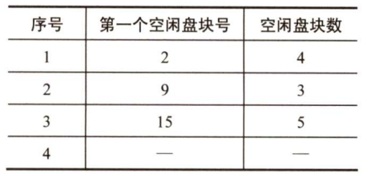

2. 空闲链表法

   将所有空闲盘区拉成一条空闲链。根据构成链所用基本元素的不同，分为空闲盘块链和空闲盘区链两种形式。

3. 位示图法

   利用二进制的一位来表示一个盘块的使用情况，这样，一个m×n位组成的位示图就可用来表示m×n个盘块的使用情况。

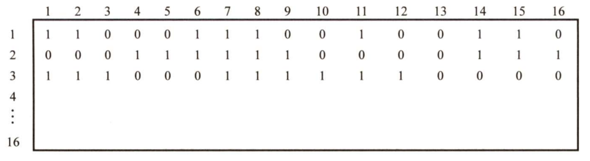

4. *成组链接法（UNIX系统中采用的方法）

#### 虚拟文件系统

虚拟文件系统(VFS)为用户程序提供了文件系统操作的统一接口，屏蔽了不同文件系统的差异和操作细节。

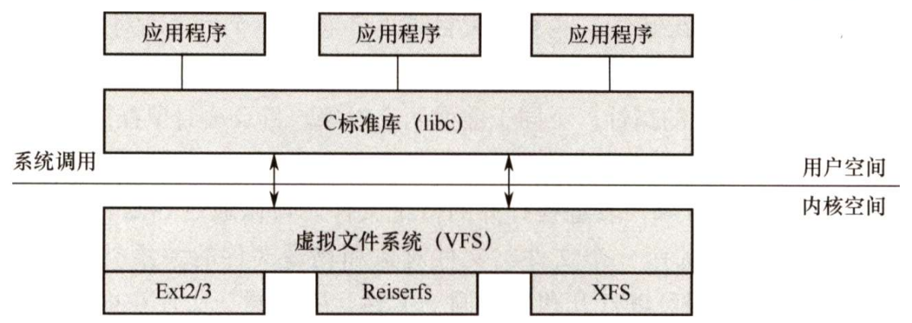

#### 分区和安装

一个磁盘可以划分为多个分区，每个分区都可以用于创建单独的文件系统，每个分区还可以包含不同的操作系统。分区可以是原始的，没有文件系统，当没有合适的文件系统时，可以使用原始磁盘。例如，UNIX交换空间可以使用原始磁盘格式，而不使用文件系统。
第1章介绍过操作系统的引导。Linux启动后，首先载入MBR，随后MBR识别活动分区，并且加载活动分区中的引导程序。
分区的第一部分是引导块，里面存储着引导信息，它有自身的格式，因为在引导时系统并未加载文件系统代码，因此不能解释文件系统的格式。引导信息是一系列可以加载到内存中的连续块，加载到内存后从其第一条代码开始执行，引导程序便启动一个具体的操作系统。引导块之后是超级块，它存储文件系统的有关信息，包括文件系统的类型、i结点的数目、数据块的数目、随后是多个索引结点，它们是实现文件存储的关键。每个文件对应一个索引结点，索引结点中包含多个指针，指向属于该文件的各个数据块。最后是文件数据块。
如文件在使用前必须打开一样，文件系统在进程使用前必须先安装，也称挂载。
Windows系统维护一个扩展的两级目录结构，用驱动器字母表示设备和卷。卷具有常规树结构的目录，与驱动器号相关联，还含有指向已安装文件系统的指针。操作系统找到相应文件系统的指针，并且遍历该设备的目录结构，以查找指定的文件。新版本的Windows允许文件系统安装在目录树下的任意位置，就像UNIX一样。在启动时，Windows操作系统自动发现所有设备，并且安装所有找到的文件系统。
UNIX使用系统的根文件系统，由内核在引导阶段直接安装，其他文件系统要么由初始化脚本安装，要么由用户安装在已安装文件系统的目录下。作为一个目录树，每个文件系统都拥有自己的根目录。安装文件系统的这个目录称为安装点，安装就是将磁盘分区挂载到该安装点下，进入该目录就可以读取该分区的数据。已安装文件系统属于安装点目录的一个子文件系统。安装的实现是在目录inode的内存副本上加上一个标志，表示该目录是安装点。还有一个域指向安装表的条目，表示哪个设备安装在哪里，这个条目还包括该设备的文件系统超级块的一个指针。
我们可以这么理解：UNIX本身是一个固定的目录树，只要安装就有，但是如果不给它分配存储空间，就不能对它进行操作，所以首先要给根目录分配空间，这样才能操作这个目录树.

## 输入/输出(I/O)管理

### I/O管理概述

#### I/O设备

1. 设备的分类

   按信息交换的单位分类，I/O设备可分为：

   - 块设备
   - 字符设备

   按传输速率分类，I/O设备可分为：

   - 低速设备
   - 中速设备
   - 高速设备

2. I/O接口

   I/O接口（设备控制器）位于CPU与设备之间，是两者通信的桥梁，主要由三部分组成：

   - 设备控制器与CPU的接口

     该接口有三类信号线：数据线、地址线和控制线。数据线通常与两类寄存器相连：数据寄存器、控制/状态寄存器。

   - 设备控制器与设备的接口

     一个设备控制器可以连接一个或多个设备，因此控制器中有一个或多个设备接口，每个接口都存在数据、控制和状态三种类型的信号。

   - I/O逻辑

     用于实现对设备的控制。它通过一组控制线与CPU交互，对从CPU收到的I/O命令进行译码。CPU启动设备时，将启动命令发送给控制器，同时通过地址线把地址发送给控制器，由控制器的I/O逻辑对地址进行译码，并相应地对所选设备进行控制。

   设备控制器的主要功能有：

   1. 接受和识别CPU发来的命令，如磁盘控制器能接收读、写、查找等命令
   2. 数据交换，包括设备和控制器之间的数据传输，以及控制器和贮存之间的数据传输
   3. 标识和报告设备的状态，以供CPU处理
   4. 地址识别
   5. 数据缓冲
   6. 差错控制

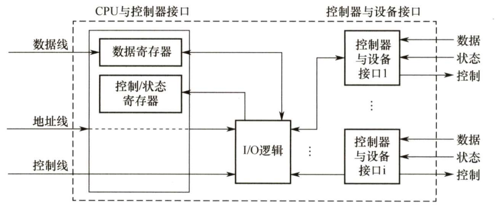

3. I/O端口

   I/O端口是指设备控制器中可被CPU直接访问的寄存器，主要有以下三类寄存器

   - 数据寄存器：实现CPU与外设之间的数据缓冲
   - 状态寄存器：获取执行结果和设备的状态信息
   - 控制寄存器：由CPU写入，以便启动命令或更改设备模式

   为了实现CPU与I/O端口进行通信，有两种方法：

   1. 独立编址
   2. 统一编址（内存映射I/O）

#### I/O控制方式

设备管理的主要任务之一是控制设备和内存或CPU之间的数据传送。外设和内存之间的I/O控制方式有4种：

1. 程序直接控制方式

   - CPU干预的频率：很频繁，I/O操作开始之前、完成之后都需要CPU接入，并且在等待I/O完成的过程中需要CPU不断地轮询检查
   - 数据传送的单位：字
   - 数据的流向：数据在I/O设备和内存之间双向流动都需要经过CPU

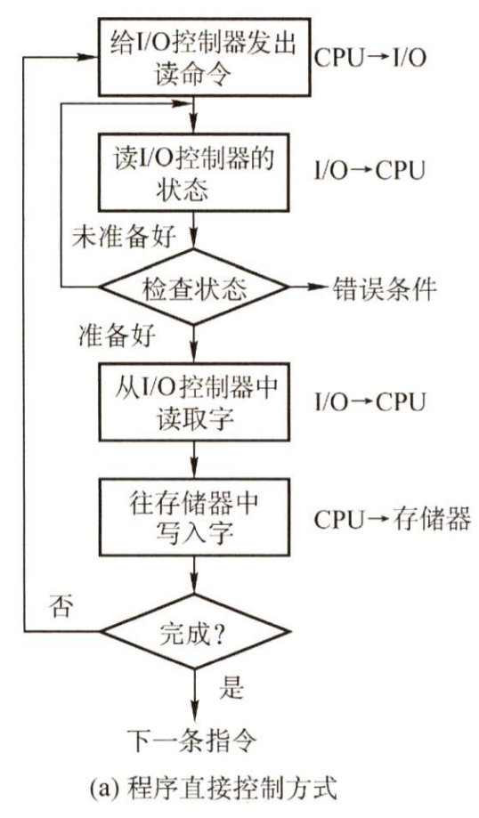

2. 中断驱动方式

   - CPU干预的频率：I/O操作开始之前、完成之后都需要CPU接入，在等待I/O完成的过程中CPU可以切换到别的进程执行
   - 数据传送的单位：字
   - 数据的流向：数据在I/O设备和内存之间双向流动都需要经过CPU

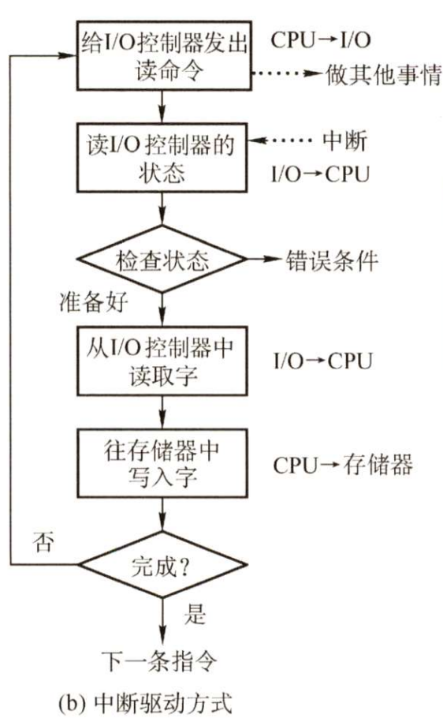

3. DMA方式(Direct Memory Access, 直接存储器存取)

   DMA控制器也是一种I/O控制器，相比于普通的I/O控制器，DMA控制器增加了一些寄存器来扩展它的功能。

   - CPU干预的频率：仅在传送一个或多个连续数据块的开始和结束时，才需要CPU干预
   - 数据的传送单位：块（一个或多个连续的数据块）
   - 数据的流向：数据在I/O设备和内存之间直接流动，无需经过CPU

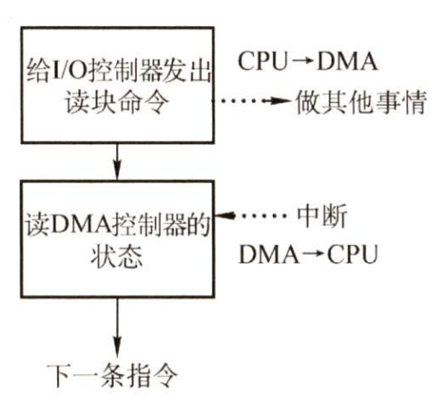

4. *通道控制方式

   I/O通道是指专门负责I/O的处理机，可以理解为是“弱鸡版的CPU”，它可以识别并执行一系列通道指令。

   - CPU干预的频率：极低，通道会根据CPU的指示执行相应的通道程序，只有完成一组数据块的读/写后才需要发出中断信号，请求CPU干预
   - 数据的传送单位：块（一组可以是不连续的数据块）
   - 数据的流向：数据在I/O设备和内存之间直接流动，无需经过CPU

#### I/O软件层次结构

一个比较合理的层次结构包含：

1. 用户层软件
2. 设备独立性软件
3. 设备驱动程序
4. 中断处理程序

其中设备独立性软件、设备驱动程序、中断处理程序属于操作系统的内核部分，即I/O系统，或称I/O核心子系统

### 设备独立性软件

#### 高速缓存与缓冲区

1. 磁盘高速缓存(Disk Cache)

   - 磁盘高速缓存技术是指利用内存中的存储空间来暂存从磁盘中读出的一系列盘块中的信息
   - 磁盘高速缓存逻辑上属于磁盘，物理上则是驻留在内存中的盘块

2. 缓冲区(Buffer)

   引入缓冲区的目的主要如下：

   - 缓和CPU与I/O设备间速度不匹配的矛盾

   - 减少对CPU的中断频率，放宽对CPU中断响应时间的限制

   - 解决基本数据单元大小（即数据粒度）不匹配的问题

   - 提高CPU和I/O设备之间的并行性

   其实现方法如下：

   - 采用硬件缓冲器，但由于成本太高，除一些关键部位外，一般不采用

   - 采用缓冲区（位于内存区域）

   根据系统设置缓冲区的个数，缓冲技术可以分为如下几种：

   1. 单缓冲（同一时刻只能实现单向的数据传输）
   2. 双缓冲（同一可以实现双向的数据传输）
   3. 循环缓冲（多个大小相等的缓冲区链接成一个环形，in指针和out指针分别指向可以输入/输出数据的第一个缓冲区）
   4. *缓冲池

   缓冲区的要点：全空时才能输入，全满时才能输出

#### 设备分配与回收

1. 设备分配概述

   设备分配是指根据用户的I/O请求分配所需的设备。分配的总原则是充分发挥设备的使用效率，尽可能地让设备忙碌，又要避免由于不合理的分配方法造成进程死锁。从设备的特性来看，采用下述三种使用方式的设备分别称为独占设备、共享设备和虚拟设备。

   - 独占式使用设备。进程分配到该独占设备后，便由其独占，直至该进程释放该设备
   - 分时式共享使用设备。对于共享设备，可同时分配给多个进程，通过分时共享使用
   - 以SPOOLing方式使用设备。SPOOLing技术实现了虚拟设备功能，可以将设备同时分配给多个进程。这种技术实质上就是实现了对设备的I/O操作的批处理

2. 设备分配的数据结构

   - 设备控制表(DCT)：一个设备控制表表征一个设备，表项是设备的各个属性，
   - 控制器控制表(COCT)：一个设备控制表表征一个控制器，表项是控制器的各个属性
   - 通道控制表(CHCT)：一个设备控制表表征一个通道，表项是通道的各个属性
   - 系统设备表(SDT)：整个系统只有一张SDT，它记录已连接到系统中的所有物理设备的情况，每个物理设备占一个表目

   COCT与DCT、CHCT与COCT都是一对多的关系

3. 设备分配策略

   - 设备分配方式：静态分配（一次性分配）、动态分配（需要时才分配）
   - 设备分配算法：先来先服务、优先级高者优先等

4. 设备分配的安全性

   设备分配的安全性是指设备分配中应防止发生进程死锁。

   - 安全分配方式

     每当进程发出I/O请求后便进入阻塞态，直到其I/O操作完成时才被唤醒。这样，一旦进程已经获得某种设备后便阻塞，不能再请求任何资源，而它在阻塞时也不保持任何资源。其优点是设备分配安全，缺点是CPU和I/O设备是串行工作的。

   - 不安全分配方式。进程在发出I/O请求后仍继续运行，需要时又发出第二个、第三个I/O请求等。仅当进程所请求的设备已被另一进程占用时，才进入阻塞态。优点是一个进程可同时操作多个设备，使进程推进迅速；缺点是有可能造成死锁。

5. 逻辑设备名到物理设备名的映射

   为了实现设备独立性，在应用程序中使用逻辑设备名来请求使用某类设备，在系统中设置一张逻辑设备表(Logical Unit Table, LUT)，用于将逻辑设备名映射为物理设备名。LUT表项包括逻辑设备名、物理设备名和设备驱动程序入口地址；当进程使用逻辑设备名来请求分配设备时，系统为它分配一台相应的物理设备，并在LUT中建立一个表目，当以后进程再利用该逻辑设备名请求I/O操作时，系统通过查找LUT来寻找对应的物理设备和驱动程序。

   在系统中可采用两种方式设置逻辑设备表：

   - 在整个系统只设置一张LUT。这样，所有进程的设备分配情况都记录在同一张LUT中，因此不允许LUT具有相同的逻辑设备名，主要适用于单用户系统。
   - 为每个用户设置一张LUT。每当用户登陆时，系统便为用户建立一个进程，同时也为之建立一张LUT，并将该表放入进程的PCB中。

#### SPOOLing技术（假脱机技术）

为了缓和CPU的高速性与I/O设备低速性之间的矛盾，引入了脱机输入/输出技术，它是操作系统中采用的一项将独占设备改造成共享设备的技术。该技术利用专门的外围控制机，将低速I/O设备上的数据传送到高速磁盘上，或者相反。

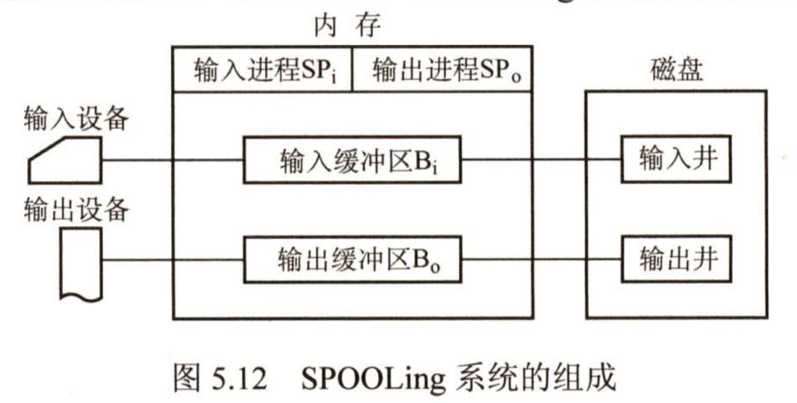

- 输入井和输出井

  在磁盘上开辟出的两个存储区域。输入井模拟脱机输入时的磁盘，用于收容I/O设备输入的 数据。输出井模拟脱机输出时的磁盘，用于收容用户程序的输出数据。一个进程的输入（或输出）数据保存为一个文件，所有进程的数据输入（或输出）文件链接成一个输入（或输出）队列。

- 输入缓冲区和输出缓冲区

  在内存中开辟的两个缓冲区。输入缓冲区用于暂存由输入设备送来的数据，以后再传送到输入井。输出缓冲区用于暂存从输出井送来的数据，以后再传送到输出设备。

- 输入进程和输岀进程

  输入/输出进程用于模拟脱机输入/输出时的外围控制机。用户要求的数据从输入设备经过输入缓冲区送到输入井，当CPU需要输入数据时，直接从输入井读入内存。用户要求输出的数据先从内存送到输出井，待输出设备空闲时，再将输出井中的数据经过输出缓冲区送到输出设备。

共享打印机是使用SPOOLing技术的实例。当用户进程请求打印输出时，SPOOLing系统同意打印，但是并不真正立即把打印机分配给该进程，而由假脱机管理进程完成两项任务： 

1. 在磁盘缓冲区中为之申请一个空闲盘块，并将要打印的数据送入其中暂存。
2. 为用户进程申请一张空白的用户请求打印表，并将用户的打印要求填入其中，再将该表挂到假脱机文件队列上。 

这两项工作完成后，虽然还没有任何实际的打印输岀，但是对于用户进程而言，其打印任务已完成。对用户而言，系统并非立即执行真实的打印操作，而只是立即将数据输岀到缓冲区，真正的打印操作是在打印机空闲且该打印任务已排在等待队列队首时进行的。

### 磁盘和固态硬盘

#### 磁盘


- 扇区是磁盘可寻址的最小单位
- 磁盘地址用“柱面号•盘面号•扇区号”表示
- 磁盘按不同的方式可分为若干类型：磁头相对于盘片的径向方向固定的，称为固定头磁盘，每个磁道一个磁头；磁头可移动的，称为活动头磁盘，磁头臂可来回伸缩定位磁道；磁盘永久固定在磁盘驱动器内的，称为固定盘磁盘；可移动和替换的，称为可换盘磁盘

#### 磁盘的管理

1. 磁盘初始化

   一个新的磁盘只是一个磁性记录材料的空白盘。在磁盘可以存储数据之前，必须将它分成扇区，以便磁盘控制器能够进行读写操作，这个过程称为低级格式化（或称物理格式化）。低级格式化为每个扇区使用特殊的数据结构，填充磁盘。每个扇区的数据结构通常由头部、数据区域（通常为512B大小）和尾部组成。头部和尾部包含了一些磁盘控制器的使用信息。

   大多数磁盘在工厂时作为制造过程的一部分就已经进行过低级格式化，这种格式化能够让制造商测试磁盘，并且初始化逻辑块号到无损磁盘扇区的映射。

2. 分区

   在可以使用磁盘存储文件之前，操作系统还要将自己的数据结构记录到磁盘上，分为两步：

   1. 将磁盘分为由一个或多个柱面组成的分区（即我们熟悉的C盘、D盘等形式的分区），每个分区的起始扇区和大小都记录在磁盘主引导记录的分区表中；
   2. 对物理分区进行逻辑格式化（创建文件系统），操作系统将初始的文件系统数据结构存储到磁盘上，这些数据结构包括空闲空间和已分配的空间以及一个初始为空的目录。

   因扇区的单位太小，为了提高效率，操作系统将多个相邻的扇区组合在一起，形成一簇（在 Linux中称为块）。为了更高效地管理磁盘，一簇只能存放一个文件的内容，文件所占用的空间只能是簇的整数倍；如果文件大小小于一簇（甚至是0字节），也要占用一簇的空间。

3. 引导块

   计算机启动时需要运行一个初始化程序（自举程序），它初始化CPU、寄存器、设备控制器和内存等，接着启动操作系统。为此，自举程序找到磁盘上的操作系统内核，将它加载到内存，并转到起始地址，从而开始操作系统的运行。

   自举程序通常存放在ROM中，为了避免改变自举代码而需要改变ROM硬件的问题，通常只在ROM中保留很小的自举装入程序，而将完整功能的引导程序保存在磁盘的启动块上，启动块位于磁盘的固定位置。具有启动分区的磁盘称为启动磁盘或系统磁盘。

   引导ROM中的代码指示磁盘控制器将引导块读入内存，然后开始执行，它可以从非固定的磁盘位置加载整个操作系统，并且开始运行操作系统。下面以Windows为例来分析引导过程。Windows允许将磁盘分为多个分区，有一个分区为引导分区，它包含操作系统和设备驱动程序。Windows系统将引导代码存储在磁盘的第0号扇区，它称为主引导记录（MBR）。引导首先运行ROM中的代码，这个代码指示系统从MBR中读取引导代码。除了包含引导代码，MBR还包含：一个磁盘分区表和一个标志（以指示从哪个分区引导系统），当系统找到引导分区时，读取分区的第一个扇区，称为引导扇区，并继续余下的引导过程，包括加载各种系统服务。

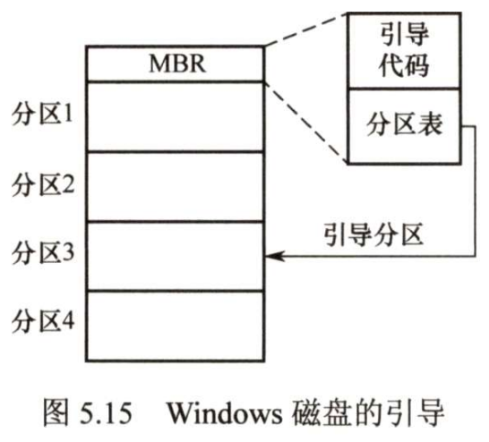

4. 坏块

   由于磁盘有移动部件且容错能力弱，因此容易导致一个或多个扇区损坏。部分磁盘甚至在出厂时就有坏块。对坏块的处理实质上就是用某种机制使系统不去使用坏块。

#### 磁盘调度算法

一次磁盘读写操作的时间由寻找（寻道）时间、旋转延迟时间和传输时间决定。其中，寻道时间与磁盘调度算法相关；而延迟时间和传输时间都与磁盘旋转速度相关，且为线性相关，所以在硬件上，转速是磁盘性能的一个非常重要的参数。

目前常用的磁盘调度算法有以下几种：

- 先来先服务(First Come First Served, FCFS)算法
- 最短寻找时间优先(Shortest Seek Time First, SSTF)算法
- 扫描(SCAN)算法（电梯调度算法）
- 循环扫描(Circular SCAN, C-SCAN)算法

#### 固态硬盘

1. 固态硬盘的特性

   - 一种基于闪存技术的存储器，与U盘无本质差别，只是容量更大，存取性能更好
   - 一个SSD由一个闪存芯片和闪存翻译层组成
   - 一个闪存由若干块组成，每块由若干页组成，数据是以页为单位读写的，只有在一个页所属的块整个被擦除后，才能写这一页
   - 随机写很慢；比起传统磁盘，随机访问要快得多

2. 磨损均衡(Wear Leveling)

   闪存的擦写寿命是有限的，一般是几百次到几千次。如果直接用普通闪存组装SSD，那么实际的寿命表现可能非常令人失望——读写数据时会集中在SSD的一部分闪存，这部分闪存的寿命会损耗得特别快。一旦这部分闪存损坏，整块SSD也就损坏了。这种磨损不均衡的情况，可能会导致一块256GB的SSD,只因数兆空间的闪存损坏而整块损坏。

   为了弥补SSD的寿命缺陷，引入了磨损均衡。SSD磨损均衡技术大致分为两种：

   - 动态磨损均衡

     写入数据时，自动选择较新的闪存块。老的闪存块先歇一歇。

   - 静态磨损均衡

     这种技术更为先进，就算没有数据写入，SSD也会监测并自动进行数据分配，让老的闪存块承担无须写数据的存储任务，同时让较新的闪存块腾出空间，平常的读写操作在较新的闪存块中进行。如此一来，各闪存块的寿命损耗就都差不多。

   有了这种算法加持，SSD的寿命就比较可观了。例如，对于一个256GB的SSD，如果闪存的擦写寿命是500次，那么就需要写入125TB数据，才寿终正寝。就算每天写入10GB数据，也要三十多年才能将闪存磨损坏，更何况很少有人每天往SSD中写入10GB数据。
