# 数据结构

## 绪论

### 数据结构的基本概念

- 数据结构是相互之间存在一种或多种特定关系的数据元素的集合
- 数据结构包括三方面的内容：逻辑结构、存储结构、数据的运算
- 数据的逻辑结构和存储结构是密不可分的两个方面，一个算法的设计取决于所选定的逻辑结构，而算法的实现依赖于所采用的存储结构

1. 逻辑结构

   - 逻辑结构是指数据之间的逻辑关系，它与数据的存储无关，是独立于计算机的
   - 数据的逻辑结构分为线性结构和非线性结构，线性表是典型的线性结构，集合、树和图是典型的非线性结构

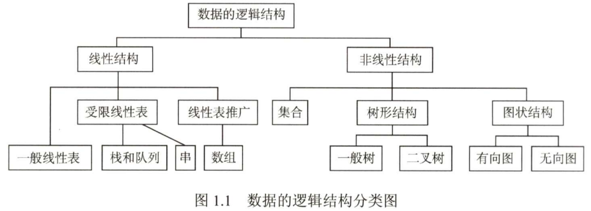

2. 存储结构

   - 存储结构是指数据结构在计算机中的表示（又称映像），也称物理结构
   - 数据的存储结构是用计算机语言实现的逻辑结构，它依赖于计算机语言
   - 数据的存储结构主要有顺序存储、链式存储、索引存储和散列存储

3. 数据的运算

   施加在数据上的运算包括运算的定义和实现。运算的定义是针对逻辑结构的，指出运算的功能；运算的实现是针对存储结构的，指出运算的具体操作步骤

### 算法和算法评价

- 算法是对特定问题求解步骤的一种描述，它是指令的有限序列，其中的每条指令表示一个或多个操作

- 算法效率的度量是通过时间复杂度和空间复杂度来描述的
  - 时间复杂度：以算法中基本运算的频度的数量级来表示
  - 空间复杂度：以算法所耗费的存储空间的数量级来表示

## 线性表

线性表是具有相同数据类型的n个数据元素的有限序列

### 顺序表

#### 顺序表的定义

- 顺序表是以顺序存储方式实现的线性表
- 用一组地址连续的存储单元依次存储线性表中的数据元素
- 表中元素的逻辑顺序与其物理顺序相同

#### 顺序表上基本操作的实现

- 查找：顺序查找给定元素，并返回其位序

- 插入：找到要删除的位置，将当前位置及其后元素依次往后移动一个位置，腾出空位插入新元素
- 删除：找到要删除的位置，将当前位置以后得元素依次往前移动一个位置

### 链表

#### 单链表

- 单链表是以链式存储方式实现的线性表
- 用一组任意的存储单元来存储线性表中的数据元素
- 对每个结点，除存放元素本身的信息外，还存放一个指向其后继的指针next
- 通常用头指针来表示一个单链表
- 为了操作上的方便，一般设置一个不存储信息的头结点

#### 单链表上基本操作的实现

1. 创建
   - 头插法：将读取到的结点依次插在头结点之后（简单、逆序）
   - 尾插法：将读取到的结点依次插在表尾，为此必须增加一个始终指向表尾的尾指针（顺序）
2. 查找
   - 按位查找：顺着next指针遍历链表，直到找到第i个结点为止，返回指向该结点的指针，否则返回NULL
   - 按值查找：顺着next指针遍历链表，直到找到值为给定值的结点为止，返回指向该结点的指针，否则返回NULL
3. 插入
   - 后插：找到待插入位置的前驱结点，即第i-1个结点，在其后插入新结点
   - 前插：先后插，再交换数据域
4. 删除
   - 直接删除：找到被删结点的前驱结点，将其next指向被删结点的下一结点，释放被删结点的存储空间
   - 间接删除：找到被删结点，将其后继结点的值赋予其自身，然后删除后继结点

#### 双链表

- 为克服单链表只能单向顺序访问的缺点，引入双链表
- 双链表的结点中有两个指针prior和next，分别指向其前驱结点和后继结点

#### 循环链表

1. 循环单链表
   - 表中最后一个结点的指针不是NULL，而改为指向头结点，从而整个链表形成一个环
   - 判空条件不是头结点的指针是否为空，而是它是否等于头指针
   - 因为循环单链表是一个“环”，因此在任何一个位置上的插入和删除操作都是等价的，无须判断是否是表尾
   - 有时对单链表常做的操作是在表头和表尾进行的，此时对循环单链表不设头指针而仅设尾指针，从而使得操作效率更高
2. 循环双链表
   - 与循环单链表相比，循环双链表头结点的prior指针还要指向表尾结点

#### 静态链表

- 静态链表是数组形式的链表，占用是一块连续的存储空间
- 结点也由数据域和指针域构成，但这里的指针是后继结点的相对地址（数组下标），又称游标
- 静态链表没有单链表使用起来方便，但在一些不支持指针的高级语言中，这是一种非常巧妙的设计方法

#### 顺序表和链表的比较

- 存取方式
- 逻辑结构与物理结构
- 查找、插入和删除操作
- 空间分配

## 栈、队列和数组

### 栈

#### 栈的基本概念

- 栈是只允许在一端进行插入或删除操作的线性表
- 栈的操作特性是后进先出
- n个不同元素进栈，出栈元素不同排列的个数为$\frac{1}{n+1}C_{2n}^{n}$（卡特兰数）

#### 栈的顺序存储

- 利用一组地址连续的存储单元存放自栈底到栈顶的数据元素，同时附设一个指针top指示当前栈顶元素的位置
- 可让两个顺序栈共享一个一维数组空间，将两个栈的栈底分别设置在共享空间的两端，两个栈顶向共享空间的中间延伸

#### 栈的链式存储

- 链栈一般采用单链表实现，并规定所有操作都是在单链表的表头进行的
- 链栈的优点是便于多个栈共享存储空间和提高其效率，且不存在栈满且产生上溢的问题

### 队列

#### 队列的基本概念

- 队列是一种只允许在一端进行插入、在另一端进行删除的线性表
- 队列的操作特性是先进先出

#### 队列的顺序存储

- 利用一组地址连续的存储单元存放队列中的元素，并附设两个指针：front指向队头元素，rear指向队尾元素的下一个位置
- 一般将顺序队列从逻辑上视为一个环，称为循环队列
  - 初始时：Q.front=Q.rear=0
  - 队首指针进1：Q.front=(Q.front+1)%MaxSize
  - 队尾指针进1：Q.rear=(Q.rear+1)%MaxSize
  - 队列长度：(Q.rear+MaxSize-Q.front)%MaxSize
  - 判空条件：Q.front==Q.rear
  - 判满条件：
    - 牺牲一个单元来区分队空和队满，以“队头指针在队尾指针的下一位置”作为队满的标志
    - 增设size数据成员，用于记录元素个数
    - 增设tag数据成员，用于记录上一次增删操作的类型

#### 队列的链式存储

- 链队列实际上是一个同时带有队头指针和队尾指针的单链表
- 链队列特别适合于数据元素变动比较大的情形，而且不存在队列满且产生溢出的问题

#### 双端队列

- 双端队列是指允许两端都可以进行入队和出队操作的队列
- 输出受限的双端队列：允许在一端进行插入和删除，但在另一端只允许插入的双端队列
- 输入受限的双端队列：允许在一端进行插入和删除，但在另一端只允许删除的双端队列

### 栈和队列的应用

- 栈在括号匹配中的应用
- 栈在表达式求值中的应用
- 栈在递归中的应用
- 队列在层次遍历中的应用
- 队列在计算机系统中的应用

### 数组和特殊矩阵

特殊矩阵具有许多相同元素或零元素，且这些相同元素或零元素的分布有一定的规律性。可以根据这种规律性，把二维数组中的信息压缩存储到一维数组中。只需确定二维数组中的元素下标和一维数组中的元素下标之间的对应关系，就能实现两者之间的转换。

## 串

### 串的定义与实现

#### 串的定义

- 串的逻辑结构和线性表极为相似，区别仅在于串的数据对象限定为字符集
- 线性表的操作主要以单个元素作为操作对象，而串的操作通常以子串作为操作对象

#### 串的存储结构

- 定长顺序存储表示
- 堆分配存储表示
- 块链存储表示

#### 串的基本操作

串赋值、串比较、求串长、串联接、求子串、串清除、串销毁...

### 串的模式匹配

串的定位操作通常称为串的模式匹配，它求的是子串（常称模式串）在主串中的位置

#### 朴素模式匹配算法

- 穷举、暴力匹配
- 时间复杂度为O(nm)

#### KMP算法

- 利用部分匹配产生的信息，可以求出next数组
- next数组的用法：在模式串下标为j的位置与主串发生失配时，跳转到next[j-1]的位置重新与主串的当前位置进行比较
- next[j]的含义是：模式串中0-j子串的最长相等前后缀的长度
- 借助next数组，可以实现主串指针不回溯，时间复杂度为O(n+m)

## 树与二叉树

### 树的基本概念

#### 树的定义

树是n个结点的有限集。当n=0时，称为空树。在任意一棵非空树中应满足：

- 有且仅有一个根结点
- 当n>1时，其余结点可分为m个互不相交的有限集T~1~,T~2~,...,T~m~，其中每个集合本身又是一棵树，称为根的子树

显然，树的定义是递归的，树是一种递归的数据结构。

#### 基本术语

- 树中一个结点的孩子个数称为结点的度，树中结点的最大度数称为树的度
- 度大于0的结点称为分支节点，度为0的结点称为叶子结点
- 树的高度（或深度）是树中结点的最大层数
- 根据树中结点的各子树从左到右是否有次序、不能互换，可分为有序树和无序树
- 树中两个结点之间的路径是由这两个结点之间所经过的结点序列构成的，路径长度是路径上所经过的边的个数
- 森林是m棵互不相交的树的集合

#### 树的性质

- 结点总数 = 所有结点的度数之和 + 1
- 度为m的树中第i层上至多有m^i-1^个结点
- 高度为h的m叉树至多有(m^h^-1)/(m-1)个结点
- 具有n个结点的m叉树的最小高度为[log~m~(n(m-1)+1)]

### 二叉树的概念

#### 二叉树的定义及其主要特性

1. 二叉树的定义
   - 二叉树是每个结点至多只有两棵子树的有序树（即使树种结点只有一棵子树，也要区分它是左子树还是右子树）
   - 二叉树是n个结点的有限集合：
     - 或者为空二叉树，即n=0
     - 或者由一个根结点和两个互不相交的左子树和右子树组成
2. 几个特殊的二叉树
   - 满二叉树：树中的每层都含有最多的结点
     - 可以对满二叉树按层序编号，自上而下，从左到右，每个结点对应一个编号
     - 从1开始编号，对于编号为i的节点，双亲为i/2，左孩子为2i，右孩子为2i+1
   - 完全二叉树：每个结点都与满二叉树的编号一一对应
     - 若i<=n/2，则结点i为分支结点，否则为叶子结点
     - 若n为奇数，则每个分支结点都有左孩子和右孩子；若n为偶数，则编号最大的分支结点只有左孩子，没有右孩子
   - 二叉排序树：左子树上所有结点的关键字均小于根结点的关键字，右子树上所有结点的关键字均大于根结点的关键字
   - 平衡二叉树：树上任一结点的左子树和右子树的深度只差不超过1
3. 二叉树的性质
   - 非空二叉树上的叶子结点数等于度为2的结点数加1，即n~0~=n~2~+1
   - 结点i所在层次（深度）为[log~2~i]+1
   - 具有n个结点的完全二叉树的高度为[log~2~(n+1)]或[log~2~n]+1

#### 二叉树的存储结构

1. 顺序存储结构
   - 将完全二叉树上编号为i的结点元素存储在一维数组下标为i-1的位置
   - 可以利用数组元素的下标值确定结点在二叉树中的位置，以及结点之间的关系
   - 仅适用于完全二叉树，用于非完全二叉树会造成存储空间的浪费
2. 链式存储结构
   - 二叉链表至少包含3个域：数据域data、左指针域left、右指针域right
   - 在含有n个结点的二叉链表中，含有n+1个空链域

### 二叉树的遍历和线索二叉树

#### 二叉树的遍历

按照先遍历左子树再遍历右子树的原则，常见的遍历次序有先序、中序和后序三种，其中“序”指的是根结点在何时被访问。

1. 先序遍历

   ```cpp
   void PreOrder(BiTree T) {
       if (T != nullptr) {
           visit(T);
           PreOrder(T->lchild);
           PreOrder(T->rchild);
       }
   }
   ```

2. 中序遍历

   ```cpp
   void InOrder(BiTree T) {
       if (T != nullptr) {
           PreOrder(T->lchild);
           visit(T);
           PreOrder(T->rchild);
       }
   }
   ```

3. 后序遍历

   ```cpp
   void PostOrder(BiTree T) {
       if (T != nullptr) {
           PreOrder(T->lchild);
           PreOrder(T->rchild);
           visit(T);
       }
   }
   ```

4. 递归算法和非递归算法的转换

   在先序、中序和后序遍历中，三者走过的路径都是相同的，区别在于它们分别在第一次、第二次和第三次经过结点时访问该结点。

   借助栈，可以写出先序、中序、后序遍历的非递归算法：

   - 中序遍历

     ①令遍历指针指向根结点

     ②若遍历指针不为空，将其入栈，令遍历指针指向左孩子，继续执行②；若结点为空，转执行③

     ③栈顶元素出栈并将其加入到遍历序列，令遍历指针指向右孩子

     ```cpp
     vector<int> inorderTraversal(TreeNode* root) {
         vector<int> res;
         stack<TreeNode*> sta;
         TreeNode* node = root;
         while (node != nullptr || !sta.empty()) {
             if (node != nullptr) {
                 sta.push(node);
                 node = node->left;
             } else {
                 node = sta.top();
                 sta.pop();
                 res.push_back(node->val);
                 node = node->right;
             }
         }
         return res;
     }
     ```

   - 先序遍历

     ①非空根结点入栈

     ②循环：当栈不为空时，栈顶元素出栈，访问该结点。将该结点加入到遍历序列，再依次将其非空右孩子和非空左孩子入栈

   - 后序遍历

     只需将先序遍历中，右孩子和左孩子入栈的顺序颠倒，最后将遍历序列反转一下（本质上不是后序遍历，真正的后序遍历挺难的）

5. 层次遍历

   要进行层次遍历，需要借助一个队列。先将二叉树根结点入队，然后出队，访问出队结点。若它有左子树，则将左子树根结点入队；若它有右子树，则将右子树根结点入队。然后出队，访问出队结点……如此反复，直至队列为空。

6. 由遍历序列构造二叉树

   - 由先序序列和中序序列可以唯一确定一棵二叉树
   - 由后续序列和中序序列可以唯一确定一棵二叉树
   - 由层序序列和中序序列可以唯一确定一棵二叉树

#### 线索二叉树（难）

1. 线索二叉树的基本概念

   - 遍历二叉树是以一定的规则将二叉树中的结点排列成一个线性序列，产生结点之间的前驱和后继关系
   - 传统的二叉链表仅能体现父子关系，不能直接得到结点在遍历中的前驱或后继
   - 在含n个结点的二叉树中，有n+1个空链域，考虑利用这些空链域来存放其前驱或后继的指针
     - 若无左子树，令lchild指向其前驱结点；若无右子树，令rchild指向其后继结点
     - 增加两个标志域标识指针域是指向左右孩子还是指向前驱后继
     - 线索二叉树的结点结构：lchild, ltag, data, rtag, rchild

2. 中序线索二叉树的构造

   二叉树的线索化是将二叉链表中的空链域改为指向前驱或后继的线索。而前驱或后继的信息只有在遍历时才能得到，因此线索化的实质就是遍历一次二叉树。

   ```cpp
   void InThred(ThreadTree &p, ThreadTree &pre) {
       if (p != nullptr) {
           InThread(p->lchild, pre);
           if (p->lchild == nullptr) {
               p->lchild = pre;
               p->ltag = 1;
           }
           if (pre && pre->rchild == nullptr) {
               pre->rchild = p;
               pre->tag = 1;
           }
           pre = p;
           InThread(p->rchild, pre)
       }
   }
   
   void CreateInThread(ThreadTree T) {
       ThreadTree pre = nullptr;
       if (T != nullptr) {
           InTread(T, pre);
           pre->rchild = nullptr;		// 处理遍历的最后一个结点
           pre->rtag = 1;
       }
   }
   ```

3. 中序线索二叉树的遍历

   在中序线索二叉树中找结点后继的规律是：若其右标志位为“1”，则右链为线索，指示其后继，否则遍历右子树中第一个访问的结点（右子树最左下的结点）为其后继。

   1. 求中序线索二叉树的第一个结点：

      ```cpp
      ThreadNode *Firstnode(ThreadNode *p) {
          while (p->ltag == 0) p = p->lchild;		// 最左下结点（不一定是叶子结点）
          return p;
      }
      ```

   2. 求中序线索二叉树中结点p的后继：

      ```cpp
      ThreadNode *Nextnode(ThreadNode *p) {
          if (p->rtag==0) return Firstnode(p->rchild);	// 右子树最左下结点（不一定是叶子结点）
          else return p->rchild;
      }
      ```

   3. 利用上面两个算法，可以写出中序线索二叉树中的中序遍历的算法：

      ```cpp
      void Inorder(ThreadNode *T) {
          for (ThreadNode *p = Firstnode(T); p != nullptr; p = Nextnode(p)) {
              visit(p);
          }
      }
      ```

4. 先序线索二叉树和后序线索二叉树

   建立先序线索二叉树和后序线索二叉树的代码与建立中序线索二叉树类似，只需变动线索化改造的代码段(visit)与调用线索化左右子树递归函数的位置。

   如何在先序线索二叉树中找结点的后继？如果有左孩子，则左孩子就是其后继；如果无左孩子，但有右孩子，则右孩子就是其后继；如果为叶子结点，则右链域直接指示了其后继。

   在后序线索二叉树中找结点的后继较为复杂，可分3种情况：①若结点x是二叉树的根，则其后继为空；②若结点x是其双亲的右孩子，或是其双亲的左孩子且其双亲没有右子树，则其后继即为双亲；③若结点x是其双亲的左孩子，且其双亲有右子树，则其后继为双亲的右子树上按后序遍历列岀的第一个结点。可见在后序线索二叉树上找后继时需知道结点双亲，即需采用带标志域的三叉链表作为存储结构。

### 树、森林

#### 树的存储结构

1. 双亲表示法

   采用一组连续空间来存储每个结点，同时在每个结点中增设一个伪指针，指示其双亲结点在数组中的位置。该存储结构可以很快得到每个结点的双亲，但求结点的孩子时需要遍历整个结构。

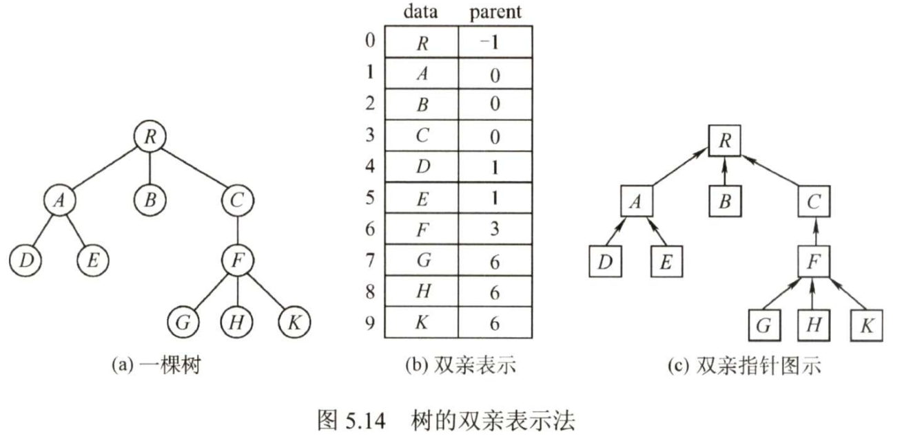

2. 孩子表示法

   将每个结点的孩子结点都用单链表链接起来形成一个线性结构，此时n个结点就有n个孩子链表。这种存储方式寻找子女的操作非常直接，而寻找双亲的操作需要遍历n个孩子链表。

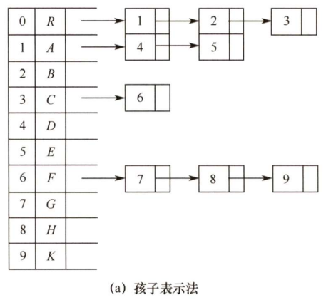

3. 孩子兄弟表示法（二叉树表示法）

   每个结点包括三部分内容：结点值、指向第一个孩子的指针、指向右兄弟的指针，从而使得一般的树转换为二叉树。


#### 树、森林与二叉树的转换

树转换为二叉树的规则：“左孩子右兄弟”。由于根结点没有兄弟，所以对应的二叉树没有右子树。

树转换为二叉树的画法：①将兄弟结点连起来；②对每个结点，只保留它与第一个孩子的连线；③以树根为轴心，顺时针旋转45°。

将森林转换为二叉树的规则：先将森林中的每棵树转换为二叉树，再把每棵树的根结点视为兄弟结点，依次连接。

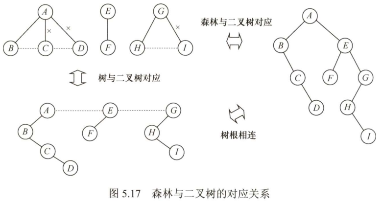

#### 树和森林的遍历

1. 树的遍历

   - 先根遍历：先访问根结点，再依次遍历根结点的每棵子树。其遍历序列与这棵树相应二叉树的先序序列相同。
   - 后根遍历：先依次遍历根结点的每棵子树，再访问根结点。其遍历序列与这棵树相应二叉树的中序序列相同。
   - 层次遍历：与二叉树的层次遍历思想基本相同，借助队列实现。

2. 森林的遍历

   - 先序遍历
     - 访问第一棵树的根结点
     - 先序遍历第一棵树的根结点的子树森林
     - 先序遍历除去第一棵树之后剩余的树构成的森林
   - 中序遍历
     - 中序遍历第一棵树的根结点的子树森林
     - 访问第一棵树的根结点
     - 中序遍历除去第一棵树之后剩余的树构成的森林

   当森林转换成二叉树时，其第一棵树的子树森林转换成左子树，剩余树的森林转换成右子树，可知森林的先序和中序遍历即为对应二叉树的先序和中序遍历。

### 哈夫曼树和哈夫曼编码

1. 哈夫曼树的定义

   - 在许多应用中，树中结点常常被赋予一个表示某种意义的数值，称为该结点的权
   - 从树的根到任意结点的路径长度（经过的边数）与该结点上权值的乘积，称为该结点的带权路径长度
   - 树中所有叶结点的带权路径长度之和称为该树的带权路径长度
   - 在含有n个带权叶结点的二叉树中，其中带权路径长度最小的二叉树称为哈夫曼树，也称最优二叉树

2. 哈夫曼树的构造

   给定n个带权结点，构造哈夫曼树的算法描述如下：

   ①将这n个结点分别作为n棵仅含一个结点的二叉树，构成森林F

   ②构造一个新结点，从F中选取两棵根结点权值最小的树作为新结点的左右子树，并将新结点的权值置为左右子树根结点的权值之和

   ③从F中删除刚才选出的两棵树，同时将新得到的树加入F中

   ④重复步骤②和③，直至F中只剩下一棵树为止

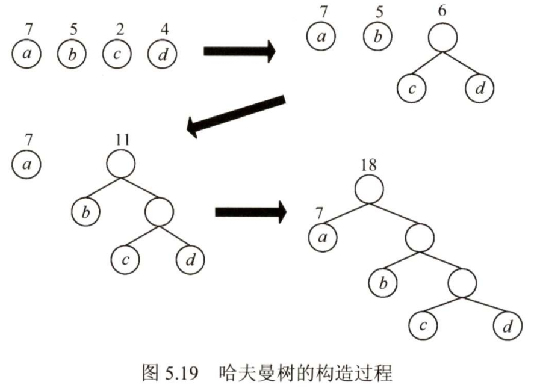

   从上述构造过程可以看出哈夫曼树具有如下特点：

   - 每个初始结点最终都成为叶结点，且权值越小的结点到根结点的路径长度越大
   - 构造过程中共新建了n-1个（双分支）结点，因此哈夫曼树的结点总数为2n-1
   - 每次构造都选择2棵树作为新结点的孩子，因此哈夫曼树中不存在度为1的结点

3. 哈夫曼编码

   利用哈夫曼树可以设计出总长度最短的二进制前缀编码（没有一个编码是另一个编码的前缀）

   ①将每个出现的字符当作一个独立的结点，其权值为它出现的频度，构造出对应的哈夫曼树

   ②将字符的编码解释为从根至字符的路径上边标记的序列

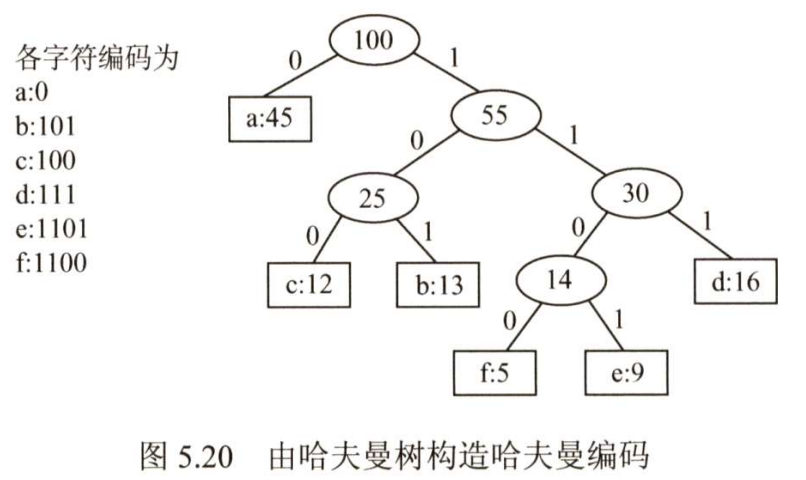

## 图

### 图的基本概念

#### 图的定义

图G由顶点集V和边集E组成，记为G=(V,E)。其中V(G)表示图G中顶点的有限非空集；E(G)表示图G中顶点之间的关系（边）集合。若V={v~1~,v~2~,…,v~n~}，则用|V|表示图G中顶点的个数，E={(u,v)|u∈V,v∈V}，用|E|表示图G中边的条数。

1. 有向图

   若E是有向边（也称弧）的有限集合时，则图G为有向图。弧是顶点的有序对，记为<v,w>，v称为弧尾，w称为弧头，<v,w>称为从v到w的弧，也称v邻接到w。

2. 无向图

   若E是无向边（简称边）的有限集合时，则图G为无向图。边是顶点的无序对，记为(v,w)或(w,v)。可以说v和w互为邻接点。边(v,w)依附于w和v，或称边(v,w)和v,w相关联。

3. 简单图、多重图

   一个图G如果满足：①不存在重复边；②不存在顶点到自身的边，那么称图G为简单图。若图G中某两个顶点之间的边数大于1条，又允许顶点通过一条边和自身关联，则称图G为多重图。多重图和简单图的定义是相对的。数据结构中仅讨论简单图。

4. 完全图（也称简单完全图）

   任意两个顶点之间都存在边的无向图称为无向完全图；任意两个顶点之间都存在方向相反的两条弧的无向图称为无向完全图。

5. 子图

   设有两个图G=(V,E)和G'=(V',E')，若V‘是V的子集，且E'是E的子集，则称G'是G的子图。若有满足V(G')=V(G')的子图G'，则称其为G的生成子图。

6. 连通、连通图、连通分量

   在无向图中，若从顶点v到顶点w有路径存在，则称v和w是连通的。若图G中任意两个顶点都是连通的，则称图G为连通图，否则称为非连通图。无向图中的极大连通子图称为连通分量。

7. 强连通图、强连通分量

   在有向图中，如果有一对顶点v和w,从v到w和从w到v之间都有路径，则称这两个顶点是强连通的。若图中任何一对顶点都是强连通的，则称此图为强连通图。有向图中的极大强连通子图称为有向图的强连通分量。

8. 生成树、生成森林

   连通图的生成树是包含图中全部顶点的一个极小连通子图。若图中顶点数为n，则它的生成树含有n-1条边。包含图中全部顶点的极小连通子图，只有生成树满足这个极小条件，对生成树而言，若砍去它的一条边，则会变成非连通图，若加上一条边则会形成一个回路。在非连通图中，连通分量的生成树构成了非连通图的生成森林。

9. 顶点的度、入度和出度

   在无向图中，顶点v的度是指依附于顶点v的边的条数，记为TD(v)。在有向图中，顶点v的度分为入度和出度，入度是以顶点v为终点的有向边的数目，记为ID(v)；而出度是以顶点v为起点的有向边的数目，记为OD(v)。

10. 带权图

    在一个图中，每条边都可以标上具有某种含义的数值，该数值称为该边的权值。这种边上带有权值的图称为带权图，也称网。

11. 稠密图、稀疏图

    边数很少的图称为稀疏图，反之称为稠密图。稀疏图和稠密图常常是相对而言的。

12. 路径、路径长度和回路

    路径是指两个顶点之间所经过的顶点序列，当然关联的边也可理解为路径的构成要素。路径上边的数目称为路径长度。第一个顶点和最后一个顶点相同的路径称为回路或环。若一个图有n个顶点，并且有大于n-1条边，则此图一定有环。

13. 简单路径、简单回路

    在路径序列中，顶点不重复出现的路径称为简单路径。除第一个顶点和最后一个顶点歪，其余顶点不重复出现的回路称为简单回路。

14. 距离

    从顶点u出发到顶点v的最短路径若存在，则此路径的长度称为从u到v的距离。若从u到v根本不存在路径，则记该距离为无穷(∞)。

15. 有向树

    一个顶点的入度为0、其余顶点的入度均为1的有向图，称为有向树。

### 图的存储及基本操作

#### 邻接矩阵法

- 用一个一维数组存储图中顶点的信息，用一个二维数组存储图中边的信息（即各顶点之间的邻接关系），这个二维数组称为邻接矩阵

- 结点数为n的图的邻接矩阵A是n×n的，A\[i][j]的值表示第i个顶点和第j个顶点是否邻接

- 对于带权图，邻接矩阵存放的是边的权值，若两点不相连，则用∞来表示

- 空间复杂度为O(n^2^)，适合存储稠密图

- 设图G的邻接矩阵为A，A^n^的元素A^n^\[i][j]等于由顶点i到顶点j的长度为n的路径的数目

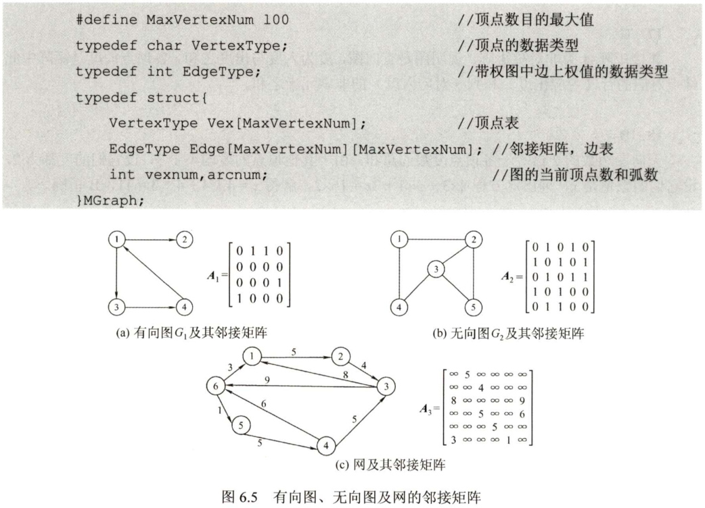

#### 邻接表法

- 对每个顶点v~i~建立一个单链表，第i个单链表中的结点表示依附于顶点v~i~的边（对于有向图则是顶点v~i~的出边）

- 对于无向图和有向图，空间复杂度分别为O(|V|+2|E|)和O(|V|+|E|)，适合存储稀疏图

- 求有向图的顶点入度需要遍历全部邻接表，效率较低

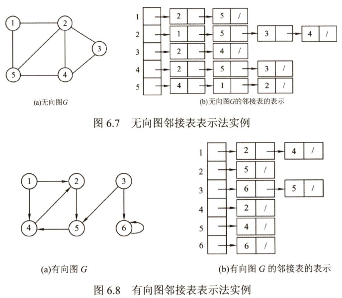

#### 十字链表法

- 十字链表是有向图的一种链式存储结构

- 在十字链表中，对应于有向图中的每条弧有一个结点，对应于每个顶点也有一个结点

- 弧结点中有5个域：尾域和头域分别指示弧尾和弧头的位置；链域hlink指向弧头相同的下一条弧；链域tlink指向弧尾相同的下一条弧；info域指向该弧的相关信息。这样，弧头相同的弧就在同一个链表上，弧尾相同的弧也在同一条链表上

- 顶点结点中有3个域：data域存放数据信息；firstin和firstout两个域分别指向第一条入边和第一条出边

- 顶点结点是顺序存储的

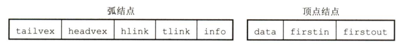

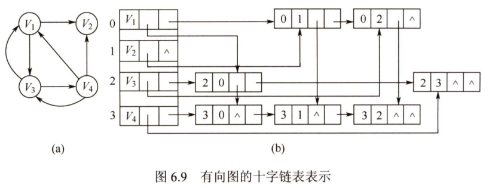

#### 邻接多重表

- 邻接多重表是无向图的一种链式存储结构

- 在邻接多重表中，对应于无向图中的每条弧有一个结点，对应于每个顶点也有一个结点

- 弧结点中有6个域：mark为标志域，可用于标记该边是否被搜索过；ivex和jvex分别指示该边依附的两个顶点的位置；ilink指向下一条依附于顶点ivex的边；jlink指向下一条依附于顶点jvex的边，info为指向和边相关的各种信息的指针域

- 顶点结点中有2个域：data域存储数据信息，firstedge域指示第一条依附于该顶点的边

- 所有依附于同一顶点的边串联在同一条链表中，由于每条边依附于两个顶点，因此每个边结点同时链接在两个链表中

- 对无向图而言，邻接多重表和邻接表的差别进在于，同一条边在邻接表中用两个结点表示，而在邻接多重表中只有一个结点

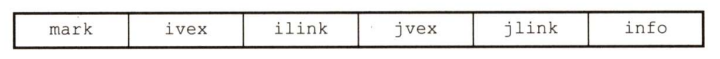

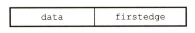


#### 图的基本操作

图的基本操作是独立于图的存储结构的。而对于不同的存储方式，操作算法的具体实现会有着不同的性能。

- Adjacent(G, x, y)：判断图G是否存在边<x,y>或(x,y)
- Neighbors(G, x)：列出图G中与结点x邻接的边
- InsertVertex(G, x)：在图G中插入顶点x
- DeleteVertex(G, x)：从图G中删除顶点x
- AddEdge(G, x, y)：若(x,y)或<x,y>不存在，则向图G中添加此边
- RemoveEdge(G, x, y)：若(x,y)或<x,y>存在，则从图G中删除此边
- FirstNeighbor(G, x)：求图G中顶点x的第一个邻接点，若有则返回顶点号。若x没有邻接点或图中不存在x，则返回-1
- NextNerghbor(G, x, y)：假设图G中顶点y是顶点x的一个邻接点，返回除y外顶点x的下一个邻接点的顶点号，没有则返回-1
- Get_edge_value(G, x, y)：获取图G中边(x,y)或<x,y>对应的权值
- Set_edge_value(G, x, y, v)：设置图G中边(x,y)或<x,y>对应的权值为v
- 深度优先遍历
- 广度优先遍历

### 图的遍历

图的遍历算法是求解图的连通性、拓扑排序和求关键路径等算法的基础。树是一种特殊的图，因此树的遍历实际上也可以视为一种特殊的图的遍历。但一般来说，图的遍历比树的遍历要复杂得多，因为图的任一顶点都可能和其余顶点相邻接，所以在访问某个顶点后，可能沿着某条路径搜索又回到了该顶点上。为避免同一顶点被重复访问，在遍历图的过程中，必须记下每个已经访问过的顶点，为此可以设置一个辅助数组visited[]来标记顶点是否被访问过。

#### 广度优先搜索

广度优先搜索(Breadth-First-Search, BFS)类似于二叉树的层序遍历算法。基本思想是：首先访问起始顶点v，然后依次访问v的各个未访问过的邻接顶点w~i~,w~2~,…,w~i~，接着依次访问w~i~,w~2~,…,w~i~的所有未访问过的邻接顶点，以此类推，直至沿路径找不到未访问过的顶点为止。若此时图中尚有顶点未被访问，则另选图中一个未曾被访问的顶点作为起始点，重复上述过程，直至图中所有顶点都被访问到为止。换句话说，广度优先搜索遍历图的过程是以v为起始点，由近至远一次访问和v有路径相通的顶点。

```cpp
bool visited[MAX_VERTEX_NUM];			// 访问标记数组
void BFSTraverse(Graph G) {				// 对图G进行广度优先遍历
    for (int i = 0; i < G.vexnum; ++i)
        visited[i] = false;				// 访问标记数组初始化
    InitQueue(Q);						// 初始化辅助队列
    for (int i = 0; i < G.vexnum; ++i) {
        if (!visited[i])
            BFS(G,i);					// vi未访问过，从vi开始BFS
    }
}
void BFS(Graph G, int v) {
    visit(v);
    visited[v] = true;
    EnQueue(Q,v);						// 顶点v入队列Q
    while (!isEmpty(Q)) {
        DeQueue(Q,v);					// 顶点v出队列
        for (auto w = FirstNeighbor(G,v); w >= 0; w = NextNeighbor(G,v,w)) {	// 检测所有邻接点
            if(!visited[w]) {
                visit(w);
                visited[w] = true;
                EnQueue(Q,w);			// 顶点w入队列
            }
        }
    }
}
```

1. BFS算法求解单源最短路径问题

   若图G为非带权图，定义从顶点u到顶点v的最短路径d(u,v)为从u到v的任何路径中最少的边数；若没有通路，则d(u,v)=∞。

   由于BFS总是按照距离由近到远地赖遍历图中每个顶点，因此BFS可以用于求解非带权图的单元最短路径问题。

   需要设置一个数组dist和一个数组path，用于记录每个顶点到起始点的最短路径长度和最短路径上的前驱。

2. 广度优先生成树

   在广度优先搜索的过程中，我们可以得到一棵遍历树，称为广度优先生成树。


#### 深度优先搜索

深度优先搜索(Depth-First-Search, DFS)类似于树的先序遍历。基本思想是：首先访问起始顶点v，然后访问与v邻接且未被访问的任一顶点w~1~，再访问与w~1~邻接且未被访问的任一顶点w~2~，以此类推。当不能再继续向下访问时，依次退回到最近被访问的顶点，若它还有邻接顶点未被访问过，则从该点开始继续上述搜索过程，直至图中所有顶点均被访问过为止。

```cpp
bool visited[MAX_VERTEX_NUM];			// 访问标记数组
void DFSTraverse(Graph G) {				// 对图G进行深度优先遍历
    for (int i = 0; i < G.vexnum; ++i)
        visited[i] = false;				// 访问标记数组初始化
    for (int i = 0; i < G.vexnum; ++i) {
        if(!visited[i])
            DFS(G,i)					// vi未访问过，从vi开始DFS
    }
}
void DFS(Graph G, int v) {				// 从顶点v出发，深度优先遍历图G
    visit(v);
    visited[v] = true;
    for (auto w = FirstNeighbor(G,v); w >= 0; w = NextNeighbor(G,v,w)) {
        if (!visited[w]) {				// w为与v邻接且尚未被访问的顶点
            DFS(G,w);					// 递归
        }
    }
}
```

与广度优先搜索一样，深度优先搜索也会产生一棵深度优先生成树或深度优先生成森林。

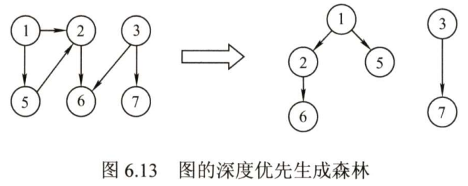

#### 图的遍历与图的连通性

- 对于无向图来说，调用BFS或DFS的次数等于该图的连通分量数
- 对于有向图来说，强连通图从任意顶点出发都只需要调用一次DFS或BFS函数，非强连通图则要看起始顶点到其他顶点是否都有路径

### 图的应用

#### 最小生成树

一个连通图的生成树包含图的所有结点，并且只含尽可能少的边。对于生成树来说，若砍去一条边，则会使生成树变成非连通图；若增加一条边，则会形成环。对于一个带权连通无向图G=(V,E)，生成树不同，每棵树的权（即树中所有边的权值之和）也可能不同，其中权最小的那棵生成树则为G的最小生成树(Minimum-Spanning-Tree, MST)。

1. Prim算法

   - 思想：从某一个顶点开始构建生成树，每次将代价最小的新顶点纳入生成树，直到所有顶点都纳入为止
   - 时间复杂度：O(|V|^2^)，不依赖于|E|，适合用于稠密图

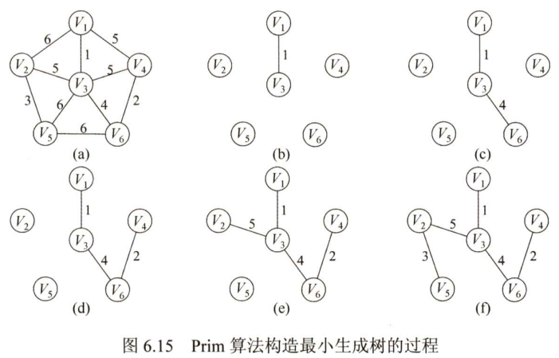

2. Kruskal算法

   - 思想：每次选择一条权值最小的边，使这条边的两头连通（原本已经连通的就不选），直到所有顶点都连通
   - 时间复杂度：O(|E|log|E|)，适合用于稀疏图

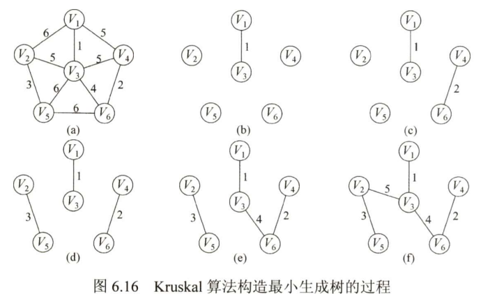

#### 最短路径

1. Dijkstra算法求单源最短路径

   设置一个集合S记录已求得的最短路径顶点，初始时把源点v~0~放入S，集合S每并入一个新顶点v~i~，都要修改源点v~0~到集合V-S中顶点当前的最短路径长度值。

   在构造的过程中设置三个辅助数组：

   - final[]：标记各个顶点是否已找到最短路径

   - dist[]：记录从源点v~0~到其他顶点当前的最短路径长度，它的初态为：若从v~0~到v~i~有弧，则dist[i]为弧上的权值，否则为∞
   - path[]：记录各顶点在最短路径上的前驱，在算法结束时，可以根据其值向前追溯得到最短路径

   算法流程：

   ①设置好三个辅助数组的初态

   ②循环遍历所有顶点，找到还没确定最短路径，且dist最小的顶点v~i~，令final[i]=true

   ③检查所有邻接自v~i~的顶点，若其final值为false，则更新其dist和path信息，返回②

   算法特点：

   - 基于贪心策略
   - 时间复杂度为O(|V|^2^)
   - 人们可能只希望找到从源点到某个特定顶点的最短路径，但这个问题和求解源点到其他所有顶点的最短路径一样复杂
   - 不适用于边上带有负权值的图

2. Floy算法求各顶点之间的最短路径

   基本思想：递推产生一个n阶方阵序列A^(-1)^,A^(0)^,...,A^(k)^,...,A^(n-1)^，其中A^(k)^\[i][j]表示从顶点v~i~到顶点v~j~的路径长度，k表示绕行第k个顶点的运算步骤。初始时，对任意两个顶点v~i~和v~j~，若它们之间存在边，则以此边上的权值作为它们之间的最短路径长度，否则将最短路径长度设为∞。以后逐步尝试在原路径中加入顶点k(k=0,1,...,n-1)作为中转顶点。若增加中转顶点后，得到的路径比原来的路径长度小，则以此新路径代替原路径。

   ```cpp
   // ...根据图的信息初始化矩阵A和path
   for (int k = 0; k < n; ++k) {		// 考虑以Vk作为中转点
       for (int i = 0; i < n; ++i) {	// 遍历整个矩阵
           for (int j = 0; j < n; ++j) {
               if (A[i][j] > A[i][k] + A[k][j]) {	// 以Vk为中转点的路径更短
                   A[i][j] = A[i][k] + A[k][j];	// 更新最短路径长度
                   path[i][j] = k;					// 从Vi到Vk的中转点为Vk
               }
           }
   	}
   }
   ```

#### 有向无环图描述表达式

- 有向无环图，简称DAG图

- 有向无环图是描述含有公共子式的表达式的有效工具，可实现对相同子式的共享，从而节省存储空间

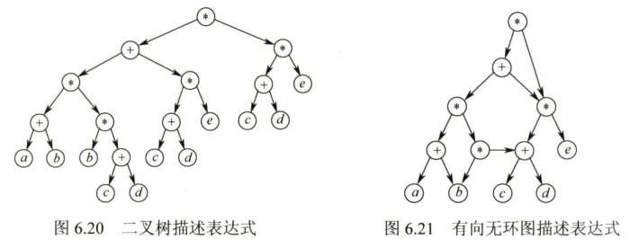

#### 拓扑排序

1. AOV网

   若用DAG图表示一个工程，其顶点表示活动，有向边\<v~i~,v~j~\>表示活动v~i~必须先于活动v~j~进行的这样一种关系，则将这种有向图称为顶点表示活动的网络，记为AOV网。

2. 拓扑排序

   拓扑排序是对有向无环图的顶点的一种排序，它使得若存在一条从顶点A到顶点B的路径，则在排序中顶点B出现在顶点A的后面。每个AOV网都有一个或多个拓扑排序序列。

   一种比较常用的拓扑排序算法：

   ①从AOV网中选择一个没有前驱的顶点并输出。

   ②从网中删除该顶点和所有以它为起点的有向边。

   ③重复①和②，知道当前的AOV网为空或当前网中不存在无前驱的顶点位置，后一种情况说明有向图中必定存在环。

   ```cpp
   bool TopologicalSort(Graph G) {
       InitStack(S);				// 初始化栈，用于存储入度为0的顶点
       for (int i = 0; i < G.vexnum; ++i) {
           if (indegree[i] == 0)
               Push(S, i);			// 将所有入度为0的顶点进栈
       }
       int count = 0;				// 计数，记录当前已经输出的顶点数
       while(!isEmpty(S)) {		// 栈不空，即存在入度为0的顶点
           Pop(S, i);
           print[count++] = i;		// 输出顶点i
           for (p = G.vertices[i].firstarc; p; p->nextarc) {
               // 将所有i指向的顶点入度减1，并将入度减为0的顶点压入栈
               v = p->adjvec;
               if ((--indegree[v]) == 0)
                   Push(S, v);
           }
       }
       if (count < G.vexnum)
           return false;
       else
           return true;
   }
   ```

   利用深度优先遍历也可以实现拓扑排序。另外，只需稍微修改上述算法，就能实现逆拓扑排序。请思考其实现方法。

#### 关键路径

在DAG图中，以顶点表示事件，以有向边表示活动，以边上的权值表示完成该活动的开销，称之为用边表示活动的网络，简称AOE网。

AOE网具有以下两个性质：

- 只有在某顶点所代表的事件发生后，从该顶点出发的各有向边所代表的活动才能开始
- 只有在进入某顶点的各有向边所代表的活动都已结束时，该顶点所代表的事件才能发生

在AOE网中仅有一个入度为0的顶点和一个出度为0的顶点，分别称为开始顶点（源点）和结束顶点（汇点），分别表示整个工程的开始和结束。

在AOE网中，有些活动是可以并行进行的。从源点到汇点的有向路径可能有多条，并且这些路径长度可能不同。完成不同路径上的活动所需的时间虽然不同，但是只有所有路径上的活动都已完成，整个工程才能算结束。因此，从源点到汇点的所有路径中，具有最大路径长度的路径称为关键路径，而把关键路径上的活动称为关键活动。

下面给出在寻找关键活动时所用到的几个参量的定义：

1. 事件v~k~的最早发生时间ve(k)：从源点v~1~到顶点v~k~的最长路径长度
2. 事件v~k~的最迟发生时间vl(k)：在不推迟整个工程完成的前提下，该事件最迟必须发生的时间
3. 活动a~i~的最早开始时间e(i)：活动弧尾所表示事件的最早发生事件
4. 活动a~i~的最迟开始时间l(i)：活动弧头所表示事件的最迟发生事件与该活动所需时间之差
5. 活动a~i~的时间余量d(i)：其最迟开始时间l(i)与其最早开始时间e(i)之差，即活动a~i~可以拖延的时间

求关键路径的算法步骤：

①从源点出发，令ve(源点)=0，按拓扑排序序列求其余顶点的最早发生时间ve()

②从汇点出发，令vl(汇点)=ve(汇点)，按逆拓扑排序序列求其余顶点的最迟发生时间vl()

③根据各顶点的ve()值求所有弧的最早开始时间e()

④根据各顶点的vl()值求所有弧的最迟开始时间l()

⑤求AOE网中所有活动的差额d()，找出所有d()=0的活动构成关键路径

## 查找

### 查找的基本概念

- 查找：在数据集合中寻找满足某种条件的数据元素的过程
- 查找表（查找结构）：用于查找的数据集合（可以是各种数据结构）
- 静态查找表：只涉及查询操作，不涉及增删操作的查找表
- 动态查找表：既涉及查询操作，也涉及增删操作的查找表
- 平均查找长度：关键字比较次数的平均值

### 顺序查找和折半查找

#### 顺序查找

- 又称线性查找，适用于顺序表和链表
- 通过依次扫描每个元素来寻找目标元素
- 对于有序表，查找失败时可以不用再比较到表的另一端就能返回查找失败的信息
- 时间复杂度为O(n)

#### 折半查找

- 又称二分查找，仅适用于有序的顺序表

- 首先将给定值与中间位置的元素比较，若相等，则查找成功；若不等，则在中间元素以外的前半部分或后半部分查找

- 折半查找的过程可以用判定树来描述，判定树是一棵平衡二叉树

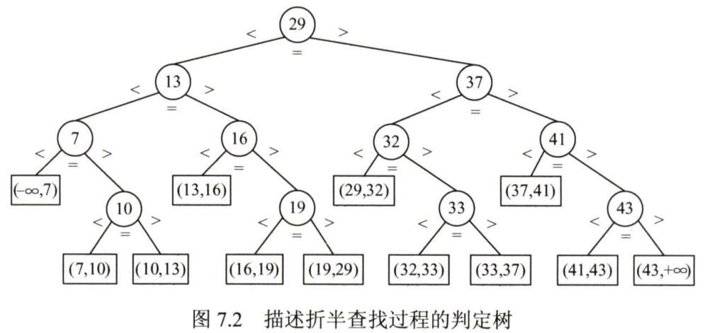

  比较次数最多不会超过树的高度，时间复杂度为O(log~2~n)

#### 分块查找

- 又称索引顺序查找，结合了顺序查找和折半查找各自的优点，既有动态结构，又适于快速查找
- 将查找表分为若干子块，块内无序，块间有序。再建立一个索引表，索引表中的每个元素含有各块的最大关键字和各块中的第一个元素的地址，索引表按关键字有序排列
- 分块查找的过程分为两步：第一步是顺序查找或折半查找索引表，第二步是在块内顺序查找
- 对索引表进行折半查找时，若索引表中不包含目标关键字，则折半查找最终停在low>high，要在low所指的分块中查找
- 如果均匀分块，分块查找的平均查找长度为索引查找和块内查找的平均长度之和

### 树型查找

#### 二叉排序树(BST)

1. 二叉排序树的定义

   二叉排序树（也称二叉查找树）或者是一棵空树，或者是具有下列特性的二叉树：

   - 若左子树非空，则左子树上所有结点的值均小于根结点的值
   - 若右子树非空，则右子树上所有结点的值均大于根结点的值
   - 左、右子树也分别是一棵二叉排序树

2. 二叉排序树的查找

   ```cpp
   BSTNode *BST_Search(BiTree T, ElemType key) {
       while (T != nullptr && key != T->data) {		// 若树空或等于根结点值，则结束循环
           if (key < T->data)
               T = T->lchild;		// 小于，则在左子树上查找
           else
               T = T->rchild;		// 大于，则在右子树上查找
       }
   }
   ```

3. 二叉排序树的插入

   二叉排序树作为一种动态链表，其特点是树的结构通常不是一次生成的，而是在查找过程中，当树中不存在关键字值等于给定值的结点时再进行插入的。

   ```cpp
   int BST_Insert(BiTree &T, KeyType k) {
       if (T == nullptr) {						// 树为空，新插入的记录为根结点
           T = new BSTNode();
           T->data = k;
           T->lchild = T-> rchild = nullptr;
           return 1;
       } else if (k == T->data)				// 树中存在相同关键字的结点，插入失败
           return 0;
       else if (k < T->data)					// 小于，则插入到T的左子树
           return BST_Insert(T->lchild, k);
       else									// 大于，则插入到T的右子树
           return BST_Insert(T->rchild, k);
   }
   ```

4. 二叉排序树的构造

   从一棵空树出发，依次输入元素，将它们插入二叉排序树中的合适位置。

5. 二叉排序树的删除

   在二叉排序树中删除一个结点时，不能把以该结点为根的子树上的结点都删除，必须先把被删除结点从存储二叉树的链表上摘下，将因删除结点而断开的二叉链表重新连接起来，同时确保二叉排序树的性质不会丢失。删除操作的实现按3种情况来处理：

   - 若结点z是叶结点，则直接删除
   - 若结点z只有一棵左子树或右子树，则让z的子树成为z父结点的子树，替代z的位置
   - 若结点z有左、右两棵子树，则令z的直接后继（或直接前驱）替代z，然后从二叉排序树中删去这个直接后继（或直接前驱），这样就转换成了第一或第二种情况

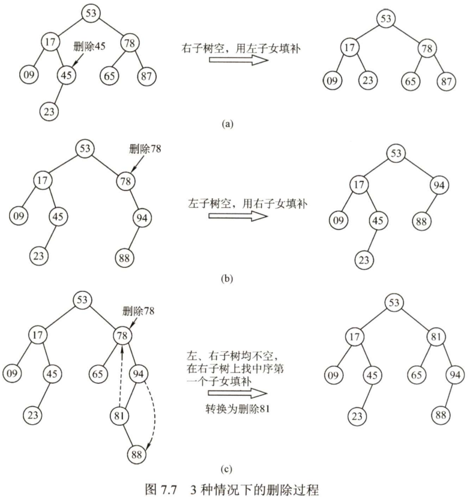

6. 二叉排序树的查找效率分析

   二叉排序树的查找效率，主要取决于树的高度。若二叉排序树的左、右子树高度之差的绝对值不超过1，则这样的二叉排序树称为平衡二叉树，它的平均查找长度为O(log~2~n)。

#### 平衡二叉树(AVL树)

1. 平衡二叉树的定义

   - 平衡二叉树：任意结点的左、右子树高度差的绝对值不超过1的二叉排序树
   - 平衡因子：结点左子树与右子树的高度差为该结点的平衡因子

2. 平衡二叉树的插入

   基本思想：每当二叉排序树中插入一个结点时，首先检查其插入路径上的结点是否因为此次操作导致了不平衡。若导致了不平衡，则先找到最小不平衡子树A，再针对具体情形对最小不平衡子树A做出相应不同的调整。

   - LL - 在A的左孩子的左子树中插入导致不平衡

     需要对A的左孩子B做一次右旋操作：将A的左孩子B向右上旋转代替A成为根结点，将A结点向右下旋转成为B的右子树的根结点，而B的原右子树则作为A结点的左子树。

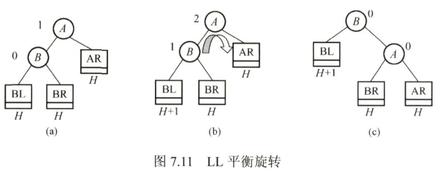

   - RR - 在A的右孩子的右子树中插入导致不平衡

     需要对A的右孩子B做一次左旋操作：将A的右孩子B向左上旋转代替A成为根结点，将A结点向左下旋转成为B的左子树的根结点，而B的原左子树则作为A结点的右子树。

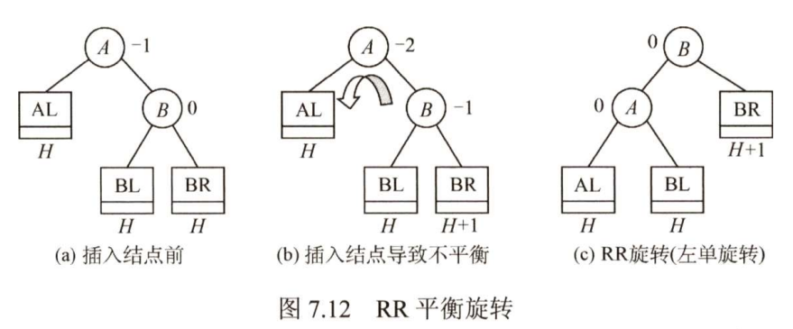

   - LR - 在A的左孩子的右子树中插入导致不平衡

     需要对A的左孩子B的右孩子C依次做一次左旋操作和一次右旋操作。

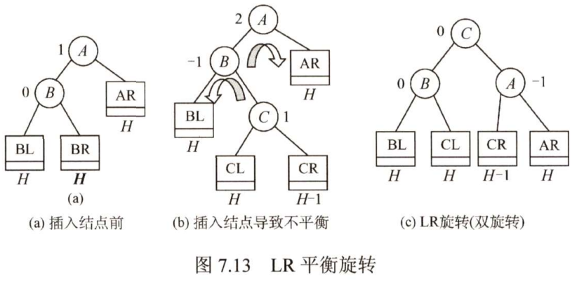

   - RL - 在A的右孩子的左子树中插入导致不平衡

     需要对A的右孩子B的左孩子C依次做一次右旋操作和一次左旋操作。

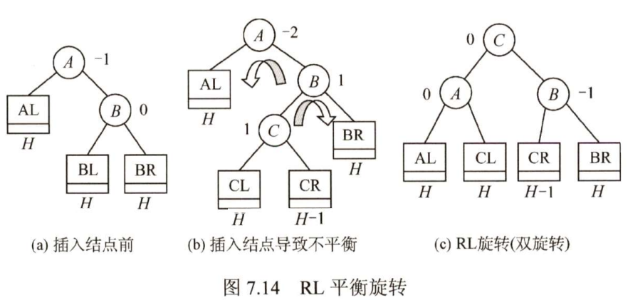

3. 平衡二叉树的删除

   ①用二叉排序树的方法对结点w执行删除操作。

   ②从结点w开始，向上回溯，找到最小不平衡子树（根结点为z），y为结点z的高度最高的孩子，x是结点y的高度最高的孩子。

   ③对以z为根的子树进行平衡调整，其中x、y和z可能得位置有4种情况：

   - y是z的左孩子，x是y的右孩子（LL，右旋转）
   - y是z的左孩子，x是y的右孩子（LR，左旋转+右旋转）
   - y是z的右孩子，x是y的右孩子（RR，左旋转）
   - y是z的右孩子，x是y的左孩子（RL，右旋转+左旋转）

   这四种情况与插入操作的调整方式一样，不同之处在于，插入操作仅需要对以z为根的子树进行平衡调整；而删除操作就不一样，先对以z为根的子树进行平衡调整，如果调整后子树的高度减1，则可能需要对z的祖先结点进行平衡调整，甚至回溯到根结点（导致树高减1）

4. 平衡二叉树的查找效率

   在平衡二叉树上进行查找的过程与二叉排序树的相同。因此，在查找过程中，与给定值进行比较的关键字个数不超过树的深度。假设以n~h~表示深度为h的平衡树中含有的最少结点数。显然有n~0~=0, n~1~=1, n~2~=2，并且有n~h~=n~h-1~+n~h-2~+1。可以证明，含有n个结点的平衡二叉树的最大深度为O(log~2~n)，因此平衡二叉树的平均查找长度为O(log~2~n)。

#### 红黑树

为了保持AVL树的平衡性，插入和删除操作后，非常频繁地调整全树整体拓扑结构，代价较大。为此在AVL树的平衡标准上进一步放宽条件，引入了红黑树的结构。

一棵红黑树是满足如下性质的二叉排序树：

- 每个结点是红色或黑色的
- 根结点是黑色的
- 叶结点（虚拟的外部结点、空结点）都是黑色的
- 不存在两个相邻的红结点（即红结点的父结点和孩子结点都是黑色的）
- 对每个结点，该结点到任一叶结点，途经的黑结点数量（黑高）相同

为了便于对红黑树的实现和理解，引入了n+1个外部叶结点，以保证红黑树中每个结点（内部结点）的左、右孩子均非空。

红黑树有以下结论：

- 从根到叶结点的最长路径不大于最短路径的2倍
- 有n个内部结点的红黑树的高度$h≤2log_2(n+1)$

### B树和B+树

#### B树及其基本操作

B树，又称多路平衡查找树，B树中所有结点的孩子个数的最大值称为B树的阶，通常用m表示。一棵m阶B树有如下核心特性：

- 根结点的子树数∈[2,m]，关键字数∈[1,m-1]

- 非根结点的子树数∈$[\lceil m/2 \rceil,m]$，关键字数∈$[\lceil m/2-1 \rceil,m-1]$

- 对任一结点，其所有子树高度都相同

- 对关键字的值，子树0 < 关键字1 < 子树1 < 关键字2 < 子树2 < ... （类比二叉排序树）

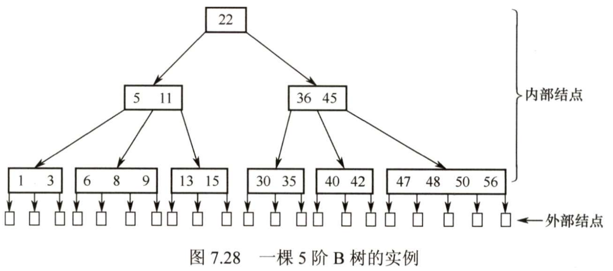

1. B树的高度

   首先明确B树的高度不包括最后的不带任何信息的叶结点所处的那一层。

   若n≥1，则对任何一棵包含n个关键字、高度为h、阶数为m的B树：

   - 最小高度

     此时，每个结点的关键字要尽可能多。因为B树中每个结点最多有m棵子树、m-1个关键字，所以n≤(m-1)(1+m+m^2^+...+m^h-1^)，因此有h≥log~m~(n+1)

   - 最大高度

     此时，每个结点的关键字要尽可能少。由B树的定义：第一层至少有1个结点；第二层至少有2个结点；除根结点外的每个非终端结点至少有$\lceil m/2 \rceil$棵子树，则第三层至少有$2\lceil m/2 \rceil$个结点...第h+1层至少有$2\lceil m/2 \rceil^{h-1}$。注意到第h+1层是不包含任何信息的叶结点，对于关键字个数为n的B树，叶结点即查找不成功的结点数为n+1，由此有$n+1≥2\lceil m/2 \rceil^{h-1}$,即$h≤log_{\lceil m/2 \rceil}((n+1)/2)+1$

2. B树的查找

   在B树上进行查找和二叉查找树很类似，只是每个结点都是多个关键字的有序表，在每个结点上所做的不是两路分支决定，而是根据该结点的子树所做的多路分支决定。

3. B树的插入

   将关键字key插入B树的过程如下：

   ①定位。找到表示查找失败的叶结点，这样就确定了最底层非叶结点的插入位置。

   ②插入。若插入后结点关键字个数小于m，可以直接插入；插入后检查被插入结点内关键字的个数，溢出时，必须对结点进行分裂。

   分裂的方法是：取一个新结点，在插入key后的原结点，从中间位置($\lceil m/2 \rceil$)将其中的关键字分为两部分，左部分包含的关键字放在原结点中，右部分包含的关键字放到新结点中，中间位置的结点插入到原结点的父结点。

4. B树的删除

   当被删关键字k不在终端结点中时，可以用k的前驱或后继k'来代替k，然后在相应的结点删除k'，关键字k'必定落在某终端结点中，则转换成被删关键字在终端结点中的情形。

   当被删关键字在终端结点中时，有下列三种情况：

   ①可以直接删除关键字

   ②不可以直接删除关键字，但兄弟够借

   ③不可以直接删除关键字，且兄弟不够借

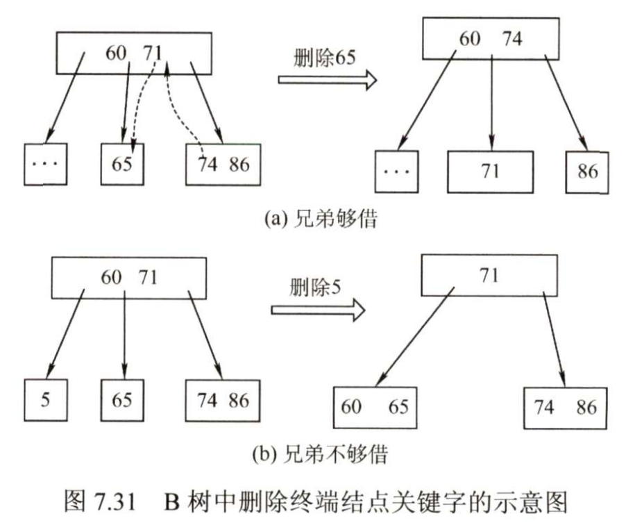

#### B+树的基本概念

B+树是应数据库所需而出现的一种B树的变形。

一棵m阶B+树虚满足下列条件：

- 每个分支结点最多有m棵子树
- 非叶根结点至少有两棵子树，其他每个分支结点至少有$\lceil m/2 \rceil$棵子树
- 结点的子树个数与关键字个数相等
- 所有叶结点包含全部关键字及指向相应记录的指针，叶结点中的关键字有序排列，并且相邻叶结点按大小顺序相互链接起来
- 所有分支结点中仅包含它的各个子树中关键字的最大值及指向其子树的指针

在B+树中，非叶结点仅起索引作用，不含有该关键字对应记录的存储地址。这样可以使一个磁盘块能够包含更多关键字，使得B+树的阶更大，树更矮，读磁盘次数更少，查找更快。


### 散列表

#### 散列表的基本概念

1. 散列函数
   - 散列函数是一个把查找表中的关键字映射成该关键字对应的地址的函数
   - 散列函数可能会把两个或两个以上的不同关键字映射到同一地址，称这种情况为冲突，这些发生碰撞的不同关键字称为同义词
   - 一方面，设计良好的散列函数应该尽量减少这样的冲突；另一方面，由于这样的冲突是不可避免的，所以还要设计好处理冲突的方法
2. 散列表
   - 散列表是基于散列函数而实现的，能够根据关键字直接进行访问的数据结构
   - 理想情况下，对散列表进行查找的时间复杂度为O(1)，即与表中元素的个数无关
   - 散列表是一个典型的“用空间换时间”的例子

#### 散列函数的构造方法

在构造散列函数时，必须注意以下几点：

- 散列函数的定义域必须包含全部需要存储的的关键字，而值域的范围则依赖于散列表的大小或地址范围
- 散列函数计算出来的地址应该能等概率、均匀地分布在整个地址空间中，从而减少冲突的发生
- 散列函数应尽量简单，能够在较短时间内计算出任一关键字对应的散列地址

1. 直接定址法

   直接取关键字的某个线性函数值为散列地址。这种方法计算最简单，且不会产生冲突。它适合关键字的分布基本连续的情况，若关键字分布不连续，空位较多，则会造成存储空间的浪费。

2. 除留余数法

   这是一种最简单、最常用的方法，假定散列表表长为m，取一个不大于m但最接近或等于m的质数p，以取模结果作为散列地址。

3. 数字分析法

   设关键字是r进制数，而r个数码在各位上出现的频率不一定相同，可能在某些位上分布均匀一些，每种数码出现的机会均等；而在某些位上分布不均匀，只有某几种数码经常出现，此时可以选取数码分布较为均匀的若干位作为散列地址。这种方法适合于已知的关键字集合，若更换了关键字，则需要重新构造新的散列函数。

4. 平方取中法

   取关键字的平方值的中间几位作为散列地址，具体取多少要视实际情况而定。这种方法得到的散列地址与关键字的每位都有关系，因此使得散列地址分布比较均匀，适用于关键字的每位取值都不够均匀或均小于散列地址所需的位数的情况。

#### 处理冲突的方法

1. 开放定址法

   可存放新表项的空闲地址既向同义词开放，又向非同义词开放。其数学递推公式为
   $$
   H_i = (H(key) + d_i) \% m
   $$
   式中，H(key)为散列函数；i = 0, 1, 2, ..., k；m为散列表长；d~i~为增量序列。

   取定某一增量序列后，对应的处理方法就是确定的。通常有以下4种取法：

   1. 线性探测法
      - d~i~ = 0, 1, 2, ..., m-1
      - 冲突发生时，顺序查看表中下一个单元，直到找出一个空闲单元或查遍全表为止
      - 可能造成大量元素在相邻的散列地址上“聚集”，降低查找效率
   2. 平方探测法
      - d~i~ = 0^2^, 1^2^, -1^2^, 2^2^, -2^2^, ..., k^2^, -k^2^ (k≤m/2)
      - 散列表长度m必须是一个可以表示成4k+3的素数，否则不能探测到所有单元
      - 可以避免出现“聚集”问题
   3. 伪随机序列法
      - d~i~ = 伪随机序列
   4. 再散列法
      - 多准备几个散列函数，当一个散列函数发生冲突时，用下一个散列函数，直到不冲突为止

   需要注意的是，在开放定址的情形下，不能随便在物理上删除表中的已有元素。因为若删除元素，则会截断其他具有相同散列地址的元素的查找地址。因此，要删除一个元素时，可给它做一个删除标记，进行逻辑上的删除。但这样做的副作用是：执行多次删除后，表面上看起来散列表很满，实际上有许多位置未利用，因此需要定期维护散列表，要把删除标记的元素物理删除。

2. 拉链法（链地址法）

   - 把所有的同义词存储在一个线性链表中，其头指针存放在散列表的某个单元中
   - 这种方法在实际应用中用得最多

#### 散列查找及性能分析

1. 散列查找

   ①检测散列地址的位置上是否有记录，若无记录，则查找失败；若有记录，比较它与key的值，若相等，则查找成功，否则执行步骤②。

   ②用给定的处理冲突的方法计算“下一个散列地址”，转入步骤①。

2. 散列查找性能分析

   散列表的查找效率取决于三个因素：散列函数、处理冲突的方法、装填因子。

   装填因子，定义为一个表的装满程度，即
   $$
   α = \frac{表中记录数n}{散列表长度m}
   $$
   直观地看，α越大，表示散列表越“满”，发生冲突的可能性越大，反之发生冲突的可能性越小。

## 排序

### 排序的基本概念

- 排序算法的稳定性：若经过某个排序算法排序后，关键字相同的元素的相对次序保持不变，则称这个排序算法是稳定的
- 在排序过程中，根据数据元素是否完全在内存中，可将排序算法分为两类：①内部排序；②外部排序
- 通常可以将排序算法分为五大类：①插入排序；②交换排序；③选择排序；④归并排序；⑤基数排序

### 插入排序

插入排序是一种简单直观的排序方法，其基本思想是每次将一个待排序的记录按其关键字大小插入前面已排好序的子序列，直到全部记录插入完成。由插入排序的思想可以引申出三个重要的排序算法：直接插入排序、折半插入排序、希尔排序。

#### 直接插入排序

要将元素L(i)插入已有序的子序列L[1...i-1]，需要执行以下操作：

①查找L(i)在L[1...i-1]中插入的位置k。

②将L[k...i-1]中所有元素依次后移一个位置。

③将L(i)复制到L(k)。

为实现对L[1...n]的排序，可以将L(2)~L(n)依次插入前面已排好序的子序列，初始L[1]可以视为一个已排好序的子序列。上述操作执行n-1次就能得到一个有序的表。

```cpp
void InsertSort(int arr[], int n) {
    int i, j;
    int temp;
    for (i = 1; i < n; ++i) {		// 将各元素插入到前面排好序的子序列中
        temp = arr[i];				// 用temp暂存arr[i]
        for (j = i - 1; j >= 0 && temp < arr[j]; j--)	// 检查前面已排好序的元素
            arr[j + 1] = arr[j];		// 比temp大的都需要后移一个位置
        arr[j + 1] = temp;			// 将temp复制到插入位置
    }
}
```

- 空间复杂度为O(1)，时间复杂度为O(n^2^)
- 每次插入元素时总是从后向前先比较再移动，不改变相同元素的相对次序，是一个稳定的排序算法
- 适用于顺序存储和链式存储的线性表。为链式存储时，可以从前往后查找插入位置

#### 折半插入排序

当排序表是顺序表时，可以对直接插入排序算法做如下改进：使用折半查找来确定待插入位置，然后再统一地向后移动元素。

```cpp
void InsertSort(int arr[], int n) {
    int low, high, mid;
    int temp;
    for (int i = 1; i < n; ++i) {			// 将各元素插入到前面排好序的子序列中
        temp = arr[i];						// 用temp暂存arr[i]
        low = 0;
        high = i - 1;
        while (low <= high) {
            mid = low + (high - low) / 2;
            if (arr[mid] > temp)
                high = mid - 1;
            else 							// 包含arr[mid] == temp的情况
                low = mid + 1;
        }
        for (j = i - 1; j >= low; --j)		// 统一后移元素，空出插入位置
            arr[j + 1] = arr[j];
        arr[low] = temp;					// 插入
    }
}
```

与直接插入排序相比：

- 仅减少了比较元素的次数，而移动元素的次数并未改变，因此时间复杂度仍为O(n^2^)
- 仅适用于顺序表

#### 希尔排序

直接插入排序算法的时间复杂度为O(n^2^)，但若待排序列为“正序”时，其时间复杂度可提高至O(n)，由此可见它更适用于基本有序的排序表和数据量不大的排序表。希尔排序正是基于这两点分析对直接插入排序进行改进而得来的，又称缩小增量排序。

希尔排序的基本思想是：先将待排序表分割成若干形如L[i, i+d, i+2d, ..., i+kd]的“子表”，即把相隔某个“增量”的记录组成一个子表，对各个子表分别进行直接插入排序。逐步减少增量d，使排序表逐步呈现“基本有序”的情形，最终d=1，即对全体记录进行一次直接插入排序。

```cpp
void ShellSort(int arr[], int n) {
    int i, j;
    int temp, d;
    for (d = n/2; d >= 1; d /= 2) {			// 步长变化
        for (i = d; i < n; ++i) {			// 从子表的第二个元素开始
            temp = arr[i];					// 暂存arr[i]
            for (j = i - d; j >= 0 && temp < arr[j]; j -= d)	// 检查子表中前面已排好序的元素
                arr[j + d] = arr[j];			// 后移，空出插入位置
            arr[j + d] = temp;				// 插入
        }
    }
}
```

与直接插入排序相比：

- 时间复杂度更低，但具体多少未知，这是数学上尚未解决的难题
- 当相同的元素被划分到不同的子表时，可能会改变它们之间的相对次序，因此希尔排序是一种不稳定的排序算法
- 仅适用于顺序表

### 交换排序

#### 冒泡排序

冒泡排序的基本思想是：从后往前（或从前往后）两两比较相邻元素值，若为逆序，则交换它们，直到待排序列比较完为止。我们称这是一趟冒泡，每趟冒泡的结果会将最小的元素交换到待排序列的第一个位置（或将最大的元素交换到待排序列的最后一个位置）。下一趟冒泡时，前一趟确定的最小元素（或最大元素）不再参与比较。这样最多做n-1趟冒泡就能把所有元素排好序。

```cpp
void BubbleSort(int arr[], int n) {
    for (int i = 0; i < n - 1; ++i) {
        bool flag = false;					// 记录本趟冒泡是否发生过交换
        for (int j = n - 1; j > i; --j) {		// 一趟冒泡过程
            if (arr[j - 1] > arr[j]) {		// 若为逆序
                swap(arr[j - 1], arr[j]);		// 交换
                flag = true;
            }
        }
        if (flag == false)					// 本趟冒泡没有发生过交换，说明表已经有序
            return;
    }
}
```

冒泡排序的性能分析：

- 空间复杂度为O(1)，时间复杂度为O(n^2^)
- 由于相邻元素相等时，不会发生交换，因此冒泡排序是一种稳定的排序算法
- 不仅适用于顺序表，还适用于链表

#### 快速排序※

快速排序的基本思想是基于分治法的：在待排序表L[1...n]中任取一个元素pivot作为枢轴（或基准，通常取首元素），通过一趟排序将排序表划分为独立的两部分L[1...k-1]和L[k+1...n]，使得L[1...k-1]中的所有元素小于pivot，L[k+1...n]中的所有元素大于等于pivot，则pivot放在了其最终位置L(k)上，这个过程称为一趟快速排序（或一次划分）。然后分别递归地对两个子表重复上述过程，直至子表内只有一个元素或空为止，即所有元素放在了其最终位置上。

```cpp
void QuickSort(int arr[], int low, int high) {
    if (low < high) {									// 递归跳出的条件
        int pivotpos = Partition(arr, low, high);		// 划分
        QuickSort(arr, low, pivotpos-1);				// 依次对两个子表进行递归排序
        QuickSort(arr, pivotpos+1, high);
    }
}

int Partition(int arr[], int low, int high) {
    int pivot = arr[low];			// 将第一个元素作为枢轴
    while (low < high) {			// 循环跳出条件
        while (low < high && arr[high] >= pivot)
            --high;
        arr[low] = arr[high];		// 将比枢轴小的元素移动到左端
        while (low < high && arr[low] <= pivot)
            ++low;
        arr[high] = arr[low];		// 将比枢轴大的元素移动到右端
    }
    arr[low] = pivot;				// 将枢轴元素放到最终位置
    return low;						// 返回最终位置
}
```

快速排序的性能分析：

- 空间效率：递归调用栈的最大深度等于在快速排序划分过程中所形成的二叉树深度，最好空间复杂度为O(log~2~n)，最坏空间复杂度为O(n)，平均空间复杂度为O(log~2~n)
- 时间效率：快速排序的运行时间与划分是否对称有关，最好时间复杂度为O(nlog~2~n)，最坏时间复杂度为O(n^2^)
- 优化方法：尽量选取一个可以将数据中分的枢轴元素（随机选）
- 稳定性：不稳定
- 快速排序是所有内部排序算法中平均性能最优的排序算法

### 选择排序

基本思想：每一趟（如第i趟）在后面n-i+1个待排序元素中选取最小的元素，作为有序子序列的第i个元素，直到第n-1趟做完。

#### 简单选择排序

```cpp
void SelectSort(int arr[], int n) {
    for (int i = 0; i < n - 1; ++i) {
        int min = i;						// 记录最小元素位置
        for (int j = i + 1; j < n; ++j) {
            if (A[j] < A[min])
                min = j;					// 更新最小元素位置
        }
        if (min != i)
            swap(A[i], A[min]);
    }
}
```

简单选择排序算法的性能分析：

- 空间效率：O(1)
- 时间效率：元素间的比较次数与序列的初始状态无关，时间复杂度始终是O(n^2^)
- 稳定性：{2,2',1}经过一趟排序后为{1,2',2}，2与2'的相对次序发生变化。因此简单选择排序是一种不稳定的排序算法

#### 堆排序

将一个一维数组视为一棵完全二叉树：

- 如果其任一分支结点的值都大于等于两个孩子的值，则称其为大根堆
- 如果其任一分支结点的值都小于等于两个孩子的值，则称其为小根堆


堆排序的思路：首先将存放在L[1..n]中的n个元素建成初始堆，由于堆本身的特性（以大根堆为例），堆顶元素就是最大值。输出堆顶元素（将堆顶元素与堆底元素交换，这样最大的元素的位置就确定下来了）。此时，堆底元素被送入堆顶，根结点已不满足大根堆的性质，堆被破坏，将堆顶元素向下调整（“下坠”）使其继续保持大根堆的性质，再输出堆顶元素。如此重复，直到堆中只剩下一个元素位置。

堆排序的关键是构造初始堆。n个结点的完全二叉树，最后一个结点是第$\lceil n/2 \rceil$个结点的孩子。对第$\lceil n/2 \rceil$个结点为根的子树筛选（对于大根堆，若根结点的关键字小于左右孩子中关键字较大者，则交换，使该子树成为堆。之后向前依次对以各结点($\lceil n/2 \rceil$-1 ~ 1) 为根的子树进行筛选，看该结点值是否大于其左右子结点的值，若不大于，则将左右子结点中的较大值与之交换，交换后可能会破坏下一级的堆，于是继续采用上述方法构造下一级的堆，直到以该结点为根的子树构成堆为止。反复利用上述调整堆的方法建堆，直到根结点。

把所有分支节点都检查一遍，是否满足大根堆的要求，如果不满足，则进行调整，即将当前节点与更大的孩子互换。若互换后破坏了下一级的堆，则采用相同的方法继续调整（小元素不断“下坠”。）

每一趟将堆顶元素加入有序子表，与待排序表中的最后一个元素交换

交换后会破坏大根堆，此时要恢复成大根堆，需要将堆顶元素不断“下坠”

```cpp
void BuildMaxHeap(int A[], int len) {
    for (int i = len/2; i > 0; --i) {		// 从i=[n/2]~1，反复调整堆
        HeadAdjust(A, i, len);
    }
}

void HeadAdjust(int A[], int k, int len) {
// 将以k为根的子树进行调整为大根堆
    A[0] = A[k];							// A[0]暂存子树的根结点
    for (int i = 2*k; i <= len; i *= 2) {	// 寻找根元素要放置的位置（根元素下坠）
        if (i < len && A[i] < A[i+1])
            ++i;							// 取两个孩子结点中较大的一个
        if (A[0] >= A[i])
            break;							// 调整结束
        else {
            A[k] = A[i];					// 将A[i]调整到双亲结点上
            k = i;							// 修改k值，以便继续向下筛选
        }
    }
    A[k] = A[0];							// 放入最终位置
}

void HeapSort(int A[], int len) {
    BuildMaxHeap(A, len);					// 初始建堆
    for (int i = len; i > 1; i--) {			// n-1趟的交换和调整堆
        swap(A[i], A[1]);					// 输出堆顶元素（和堆底元素交换）
        HeadAdjust(A, 1, i-1);				// 调整，把剩余的i-1个元素整理成堆
    }
}
```

堆排序算法的性能分析：

- 空间效率：O(1)
- 时间效率：建堆时间为O(n)，之后有n-1次向下调整的操作，每次调整的时间复杂度为O(h)，时间复杂度为O(nlog~2~n)
- 稳定性：对于{1,2,2'}，构造初始堆后为{2,1,2'}，输出堆顶元素后为{2',1,2}...最终排序结果为{1,2',2}。因此堆排序算法是一种不稳定的排序算法

同时，堆也支持插入和删除操作。进行插入操作时，先将新结点放到堆底，然后再对其进行向上调整的操作。进行删除操作时，将堆底元素移动到被删除元素的位置，然后再对其进行向下调整的操作。

### 归并排序和基数排序

#### 归并排序

“归并”的含义是将两个或两个以上的有序表组合成一个新的有序表。假定待排序表含有n个元素，则可将其视为n个有序的子表，然后两两归并，得到$\lceil n/2 \rceil$个长度为2或1的有序表；继续两两归并，如此重复，直到合并成一个长度为n的有序表为止，这种排序方法称为2路归并排序。

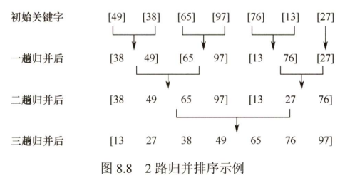

```cpp
int *B = new int[n];		// 辅助数组B

void Merge(int A[], int low, int mid, int high) {
// A[low...mid]和A[mid+1...high]各自有序，将二者归并
    int i, j, k;
    for (k = low; k <= high; ++k)
        B[k] = A[k];					// 将A中所有元素复制到B中
    for (i = low, j = mid+1, k = i; i <= mid && j <= high; ++k) {
        if (B[i] <= B[j])
            A[k] = B[i++];				// 将较小值复制到A中
        else
            A[k] = B[j++];
    }
    while(i <= mid)
        A[k++] = B[i++];
    while(j <= high)
        A[k++] = B[j++]
}

void MergeSort(int A[], int low, int high) {
    if (low < high) {
        int mid = low + (high - low) / 2;		// 从中间划分
        MergeSort(A, low, mid);					// 对左半部分归并排序
        MergeSort(A, mid+1, high);				// 对右半部分归并排序
        Merge(A, low, mid, high);				// 归并
    }
}

```

2路归并排序算法的性能分析：

- 空间效率：辅助数组所需空间为O(n)，递归栈所需空间为O(log~2~n)，空间复杂度为O(n)
- 时间效率：每趟归并的时间复杂度为O(n)，共需进行$\lceil log_2n \rceil$趟归并，时间复杂度为O(nlog~2~n)
- 稳定性：由于Merge操作不会改变相同元素的相对次序，因此2路归并排序是一种稳定的排序算法

#### 基数排序

基数排序是一种很特别的排序算法，它不基于比较和移动，而基于关键字各“分组”的大小进行排序。

假设长度为n的线性表中每个结点的关键字可拆分为d个位（或“组”），每个关键字位可能取得有限的r个值。按照各个位递增的次序，做d趟“分配”和“收集”，这个过程中需要建立r个队列。

- 分配：顺序扫描各个元素，根据当前处理的关键字位，将元素插入相应队列
- 收集：把各个队列中的元素依次出队并链接

基数排序算法的性能分析：

- 空间效率：需要r个辅助队列，空间复杂度为O(r)
- 时间效率：需要进行d趟分配和收集，一趟分配需要O(n)，一趟收集需要O(r)，因此时间复杂度为O(d(n+r))
- 稳定性：稳定

基数排序算法擅长处理：

①关键字可以方便地拆分成d组，且d较小

②每组关键字的取值范围不大，即r较小

③数据元素个数n较大

### 各种内部排序算法的比较和应用

#### 内部排序算法的比较

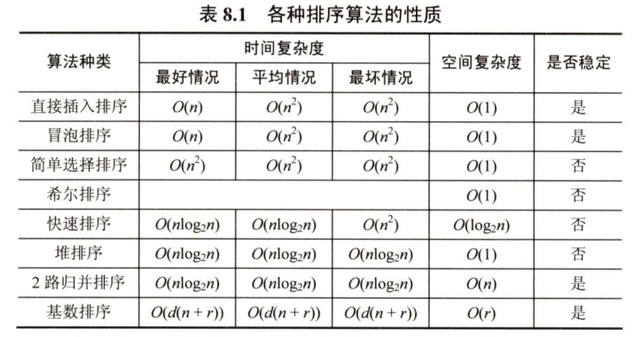

#### 内部排序算法的应用

选取排序算法需要考虑的因素

- 待排序表长度n
- 元素本身所占空间大小
- 关键字的结构及其分布情况
- 稳定性的要求
- 语言工具的条件，存储结构及辅助空间的大小等

### 外部排序

#### 外部排序的基本概念

内部排序是在内存中进行的。而在许多应用中，经常需要对大文件进行排序，因为文件中的记录很多、信息量庞大，无法将整个文件复制进内存中进行排序。因此，需要将待排序的记录存储在外存中，排序时再把数据一部分一部分地调入内存进行排序，在排序过程中需要多次进行内存和外存之间的交换。这种排序方法就称为外部排序。外部排序的时间开销主要考虑访问磁盘的次数，即I/O次数。

#### 外部排序的方法

1. 外部排序流程

外部排序通常采用归并排序法，它包括两个相对独立的阶段：

①在内存工作区中，读入一部分文件块，利用内部排序算法对其进行排序，再将排序后的块写回外存，得到1个有序的初始归并段。如此重复，得到r个有序的初始归并段。

②在内存中设置k个输入缓冲区和1个输出缓冲区，进行S趟k路归并（归并趟数$S=\lceil log_kr \rceil$）

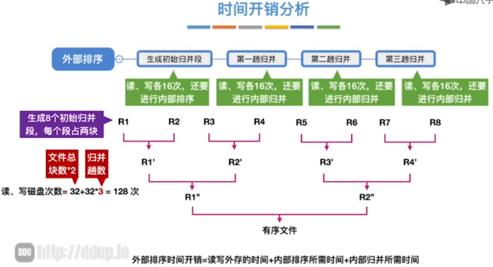

2. 外部排序的优化

外部排序方法的优化主要考虑如何减少归并趟数$S=\lceil log_kr \rceil$，从而减少读写磁盘的次数，可以从以下两个方面进行优化：

- 增加归并路数k
  - 需要增加相应的输入缓冲区
  - 每次从k个归并段中选一个最小元素需要(k-1)次关键字比较 -> 引入败者树（减少关键字比较次数）
- 减少初始归并段数量r
  - 需要开辟更大的内存进行内部排序 -> 使用置换-选择排序（利用较小的内存空间，也能生成较大的长度不一的初始归并段）

#### 多路平衡归并与败者树

为了使内部归并的时间开销不受k的增大的影响，引入败者树。败者树可视为一棵完全二叉树。k个叶结点分别存放k个归并段在归并过程中当前参加比较的记录，内部结点用来记忆左右子树中的“失败者”，而让胜者往上继续比较，一直到根结点。


值得说明的是，归并路数k并不是越大越好。归并路数k增大时，相应地需要增加输入缓冲区的个数。若可供使用的内存空间不变，势必要减少每个输入缓冲区的容量，使得内存、外存交换数据的次数增大。当k值过大时，虽然归并趟数会减少，但读写外存的次数仍会增加

#### 置换-选择排序（生成初始归并段）

设初始待排文件为FI，初始归并段输出文件为FO，内存工作区为WA，FO和WA的初始状态为空，WA可容纳w个记录。

①从FI输入w个记录到工作区WA。

②从WA中选出其中关键字最小的记录，记为MINIMAX记录。

③将MINIMAX记录输出到FO中去。

④若FI不空，则从FI输入下一个记录到WA中。

⑤从WA中所有关键字比MINMAX记录的关键字大的记录中，选出关键字最小的记录，作为新的MINIMAX记录。

⑥重复③~⑤，直至WA中选不出新的MINIMAX记录为止，由此得到一个初始归并段，输出一个归并段的结束标志到FO中去。

⑦重复②~⑥，直至WA为空。由此得到全部初始归并段。

#### 最佳归并树

文件经过置换-选择排序后，得到的是长度不等的初始归并段。如何组织这些长度不等的初始归并段的归并顺序，使得I/O次数最少？

最佳归并树为k叉哈夫曼树，若初始归并段数目不足以构成一棵严格的k叉树时，需增加长度为0的“虚段”，然后再构造哈夫曼树。

如何判定添加虚段的数目？

可以证明，若$(初始归并数量-1) \% (k-1) = u = 0$,说明刚好可以构成严格k叉树，否则需要补充(k-1)-u个虚段。
