# 计算机组成原理

## 计算机系统概述

### 计算机发展历程

#### 计算机硬件的发展

1. 计算机的四代变化
   1. 电子管时代（1946-1957）
   2. 晶体管时代（1958-1964）
   3. 中小规模集成电路时代（1965-1971）
   4. 大规模和超大规模集成电路（1972年至今）

#### 计算机软件的发展

机器语言 -> 汇编语言 -> 高级语言（FORTRAN、PASCAL、C++、Java...）

Windows、UNIX、Linux

### 计算机系统层次结构

#### 计算机硬件

1. 冯诺依曼机
   1. 采用“存储程序”的工作方式
   2. 由运算器、存储器、控制器、输入设备和输出设备5大部件组成
   3. 指令和数据以同等地位存储在存储器中，可按地址寻访
   4. 指令和数据均用二进制代码表示
   5. 指令由操作码和地址码组成
   6. 以运算器为中心（现代计算机以存储器为中心）

2. 计算机的功能部件

   1. 输入设备

   2. 输出设备

   3. 存储器

      存储器分为主存和辅存。主存就是内存，辅存是硬盘容量（属于外设）。CPU能够直接访问的是主存，辅存的信息必须调入主存后，才能被CPU访问。

      主存由存储体、MAR（地址寄存器）、MDR（数据寄存器）组成。存储体由多个存储单元组成，每个存储单元包含若干存储元件，每个存储元件存储一位二进制代码。因此存储单元可以存储一串二进制代码，称这串代码为存储字，这串代码的位数为存储字长。MAR用于存放访存地址，其位数反映存储单元的个数。MDR用于暂存要从存储体中读写的数据，其位数与存储字长相等。

      注意：MAR与MDR虽然是存储器的一部分，但在现代计算机中却是存在于CPU中的

   4. 运算器

      运算器的核心是算术逻辑单元（ALU）。运算器包含若干寄存器，用于暂存操作数和中间结果，如累加器（ACC）、乘商寄存器（MQ）、通用寄存器（X）、变址寄存器（IX）、基址寄存器（BR）等，其中前3个是必备的。

   5. 控制器

      控制器由程序计数器（PC）、指令寄存器（IR）和控制单元（CU）组成

      PC用于存放当前要执行指令的地址，可以自动加1，与主存的MAR之间有一条直接通路

      IR用于存放当前指令，其内容来自主存的MDR。指令中的操作码送至CU，用以分析指令并发出各种微操作指令序列；而地址码则送往MAR，用以取操作数

   运算器和控制器构成CPU，CPU和主存构成主机，除主机外的硬件设备为外设

#### 计算机软件

1. 系统软件和应用软件

2. 三个级别的语言

   1. 机器语言。二进制代码，是计算机唯一可以直接识别和执行的语言。
   2. 汇编语言。用英文单词或其缩写代替指令的操作码。
   3. 高级语言。

   汇编语言、高级语言都需要翻译程序将其翻译成机器语言。翻译程序有以下三类：

   - 汇编程序（汇编器）
   - 编译程序（编译器）
   - 解释程序（解释器）：逐条翻译成机器指令并立即执行

### 计算机的性能指标

#### 计算机的主要性能指标

1. （机器）字长：计算机进行一次整数运算所能处理的二进制数据的位数，等于CPU内部用于整数运算的运算器位数和通用寄存器宽度  
2. 数据通路带宽（数据字长）：数据总线一次所能并行传送信息的位数
3. 主存容量：主存储器所能存储信息的最大容量
4. 吞吐量：系统在单位时间内处理请求的数量，主要取决于主存的存取周期
5. 响应时间：从用户向计算机发送一个请求，到系统对该请求做出响应并获得所需结果的等待时间
6. CPU时钟周期：主频的倒数，是CPU中最小的时间单位，执行指令的每个动作至少需要1个时钟周期
7. 主频：衡量机器速度的重要参数。对于同一型号的计算机，其主频越高，执行指令的速度越快
8. CPI：执行一条指令平均所需的时钟周期数
9. CPU执行时间：运行一个程序所花费的时间，取决于主频、CPI、指令条数
10. MIPS：每秒执行多少百万条指令
11. MFLOPS、GFLOPS、TFLOPS、PFLOPS、EFLOPS、ZFLOPS：每秒执行多少次浮点运算

在描述存储容量、文件大小等时，K、M、G、T通常用2的幂次表示，而在描述速率、频率等时，k、M、G、T通常用10的幂次表示。通常前者用大写的K，后者用小写的k，但其他均为大写。

## 数据的表示和运算

### 数制与编码

#### 进位计数制及其相互转换

1. 进位计数法

   一个r进制数K~n~K~n-1~...K~0~K~-1~...K~-m~的数值可以表示为多个数码与其位权之和
   $$
   K_nr^n + K_{n-1}r^{n-1} + ... + K_0r^0 + K_{-1}r^{-1} + ... + K_{-m}r^{-m}
   $$

2. 不同进制数之间的相互转换

   - 二进制转八进制和十六进制

     以小数点为界，分别向左向右数，将一串二进制数分3位或4位一组，然后分别用对应的八进制数或十六进制数取代。

   - 十进制转任意进制数

     整数部分的转换：除基取余法；小数部分的转换：乘基取整法

3. 真值和机器数

#### *BCD码

二进制编码的十进制数(Binary-Coded Decimal, BCD)通常用4位二进制数来表示一位十进制数中的0~9这10数码，这样可以快速转换。

1. 8421码（常用）。一种有权码，位权依次为8、4、2、1。若两个8421码相加之和超出合法范围，则要加6修正，向高位进位。
2. 余3码。一种无权码，是在8421码的基础上加(0011)~2~形成的。
3. 2421码，一种有权码，位权依次为2、4、2、1。大于等于5的4位二进制数最高位为1，小于5的最高位为0。如5→1011而非0101。

#### 定点数的编码标识

1. 机器数的定点表示

   1. 定点小数。纯小数，小数点在符号位之后、尾数之前
   2. 定点整数。纯整数，小数点在尾数之后

2. 原码、补码、反码、移码

   1. 计算方法
      - 0（包括+0和-0）和正数的原码、补码、反码都是相同的
      - 负数的反码等于其原码符号位不变，数值位取反
      - 负数的补码等于其反码加1
      - 负数的原码到补码、补码到原码的转换均为“符号位不变，数值位取反，末位加1”
      - *对原码由低位向高位找到第一个“1”，在此“1”左边的各位与反码相同，而此“1”及其右边的各位与原码相同，即得到补码
      - 移码等于补码的符号位取反（移码只能表示整数）
      
   2. 特点
      - 原码、反码的表示在数轴上对称，二者都存在+0和-0两个零
      - 补码、移码的表示在数轴上不对称，零的表示唯一，比原码、反码多表示一个负数
      - 补码可以使得减法操作转变为等价的加法操作，节省硬件成本，因此计算机中的带符号整数都用补码表示（补码的原生定义：模(2^8^) - 绝对值 = 补数）
      - 用移码表示的整数可以很方便地比大小，移码 = （真值 + 偏置值（一般为2^n-1^））的无符号原码

### 运算方法和运算电路

#### 定点数的移位运算

1. 算术移位

   算术移位的对象是有符号数，在移位过程中符号位保持不变，且移位后都相当于对真值补0

   - 对于正数，原码、反码、补码都添0
   - 对于负数，原码添0，反码添1，补码左移添0、右移添1

2. 逻辑移位

   逻辑移位将操作数视为无符号数

3. 循环移位

   适合于将数据的低字节数据和高字节数据互换

#### 定点数的加减运算

1. 补码的加减法运算

   - 若做加法，两数的补码直接相加；若做减法，则将减数变为其负数，再将两数的补码直接相加
   - 符号位和数值位一起参与运算
   - 运算结果亦为补码

2. 溢出判别方法

   核心思想：两个正数相加得到负数或者两个负数相加得到正数，则表示出现溢出。

   1. 采用一位符号位

      设A的符号位A~s~，B的符号位为B~s~，运算结果的符号位为S~s~，则溢出逻辑表达式为
      $$
      V = A_sB_s\overline{S_s}+\overline{A_s}\overline{B_s}S_s
      $$

   2. 采用双符号位

      双符号位法也称模4补码。运算结果的两个符号位相同，表示无溢出；不同，表示有溢出。

   3. 采用一位符号位根据数据位的进位情况判断溢出

      若符号位的进位C~s~与最高数位的进位C~1~相同，则说明无溢出，否则表示有溢出

#### *定点数的乘除运算

1. 定点数的乘法运算

   乘法运算由累加和右移操作实现，可分为原码一位乘法和补码一位乘法

   1. 原码一位乘法

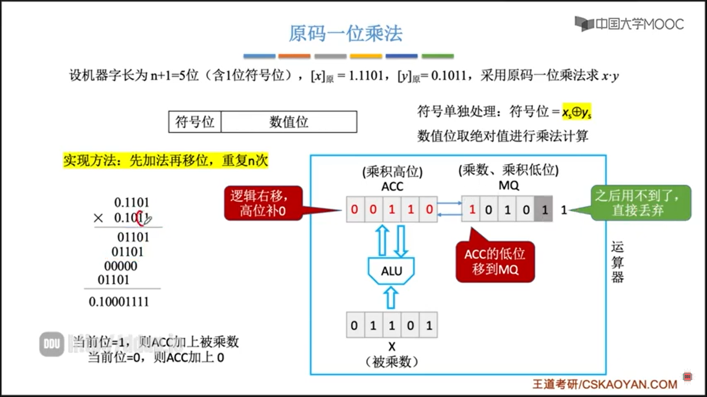

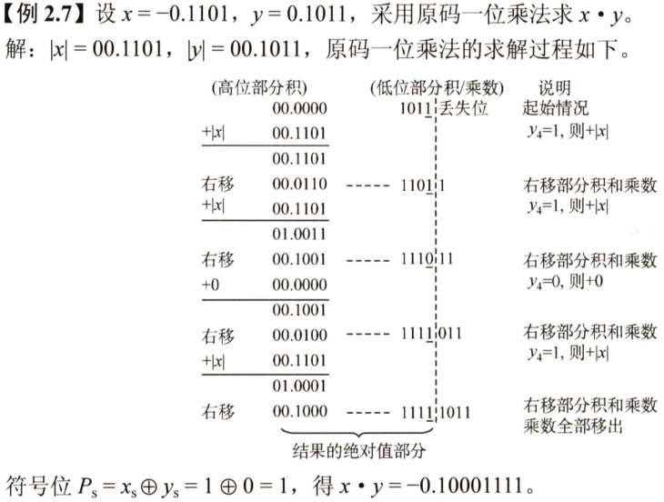

   2. 补码一位乘法

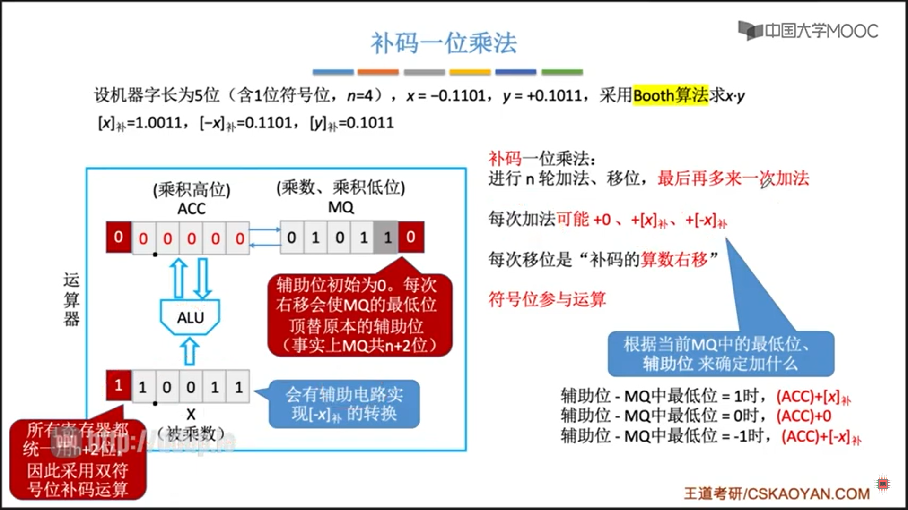

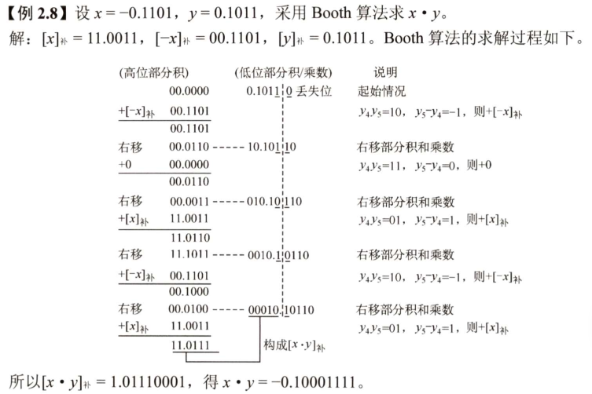

2. 定点数的除法运算

   除法运算由累加和逻辑左移操作实现，分为原码除法和补码除法

### 浮点数的表示与运算

#### 浮点数的表示

- 阶码+尾数（类比科学计数法）
- 尾数给出具体数值，阶码指明小数点前移或后移多少位
- 阶码通常是补码、移码表示的定点整数
- 尾数通常是补码、原码表示的定点小数
- 尾数的最高数值位必须是一个有效值（非0），即尾数需要进行规格化
- 真值 N = r^E^ × M

#### 浮点数的表示范围

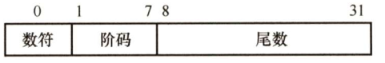

#### IEEE754

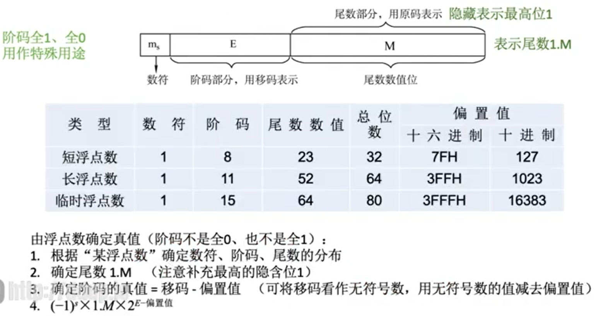

- IEEE754标准中阶码的移码表示范围为-128\~127，由于11111111(-128)和00000000(-127)有特殊用途，因此实际表示范围为-126~127
- 最小的正规化数（normalized）：1.0 × 2^-126^ ≈ 1.1755 × 10^-38^ 
- 最大的正规化数（normalized）：(2 - 2^-23^) × 2^127^ ≈ 3.4028 × 10^38^

#### 浮点数的加减运算

阶码运算和尾数运算分开进行，基本步骤如下：

1. 对阶（小阶向大阶看齐）
2. 尾数加减
3. 规格化
4. 舍入（尾数的有效位有限）
5. 溢出判断（阶码溢出才是真正的溢出，尾数溢出未必导致整体溢出）

#### 定点、浮点表示的区别

1. 数值的表示范围

   若字长相同，则浮点表示法所表示的数值范围远大于定点表示法

2. 数的精度

   若字长相同，浮点数虽然扩大了数的表示范围，但精度降低了

3. 数的运算

   浮点运算比定点运算复杂。尾数、阶码分开运算，运算结果要求规格化

4. 溢出问题

   在定点运算中，当运算结果超出表示范围时，发生溢出；浮点运算中，运算结果超出尾数表示范围却不一定溢出，只有规格化后阶码超出表示范围时，才发生溢出

## 存储系统

### 存储器概述

#### 存储器的分类

1. 按在计算机中的作用（层次）分类
   - 高速缓冲存储器(Cache)。用来存放当前CPU经常使用的指令和数据
   - 主存储器（主存）。用来存放计算机运行期间所需的程序和数据，CPU可以直接随机地对其进行访问
   - 辅助存储器（辅存）。用来存放当前暂不使用的程序和数据，其内容需要调入主存后才能被CPU访问
2. 按存储介质分类
   - 半导体存储器（主存、Cache）
   - 磁表面存储器（磁盘、磁带）
   - 光存储器（光盘）
3. 按存取方式分类
   - 随机存储器（RAM）。随机存储，且存取时间与存储单元的物理位置无关
   - 只读存储器（ROM）。只能随机读出而不能写入（有的ROM也可以写入），断电内容不会丢失，也有随机存储特性
   - 串行访问存储器。进行读写操作时，需按存储单元的物理位置的先后顺序寻址，包括顺序存取存储器（磁带）与直接存取存储器（磁盘、光盘）
4. 按信息的可保存性分类
   - 易失性存储器。断电后存储信息即消失，如RAM
   - 非易失性存储器。断电后信息仍保持，如ROM

#### 存储器的性能指标

- 存储容量 = 存储单元数量 × 存储字长
- 单位成本：每位价格 = 总成本 / 总容量
- 存储速度：数据传输率 = 数据的宽度 / 存储周期（存取周期 = 存储时间 + 恢复时间）

#### 存储系统的多级层次结构

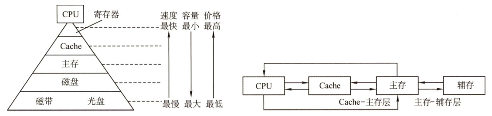

### 主存储器

#### （易失性存储器）SRAM和DRAM

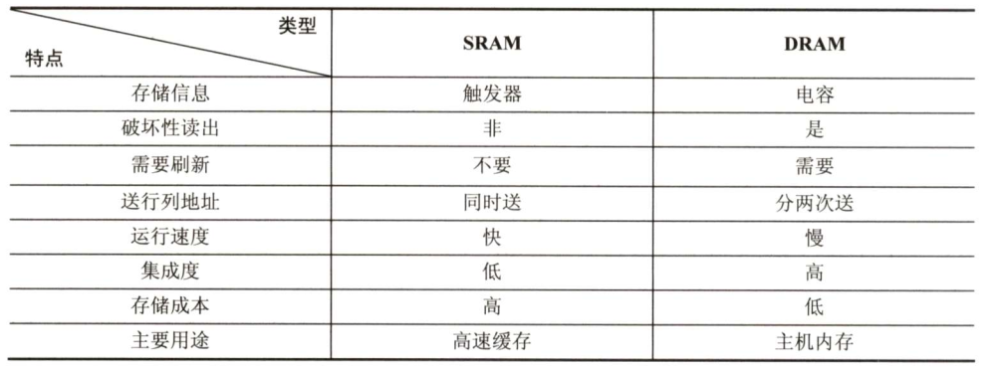

#### （非易失性存储器）ROM

- MROM——掩模式只读存储器

  厂家按照客户需求，在芯片生成过程中直接写入信息，之后任何人不可重写

- PROM——可编程只读存储器

  用户可用专门的PROM写入器写入信息，写一次后就不可更改

- EPROM——可擦除可编程只读存储器

  允许用户写入信息，之后用某种方法擦除数据，可进行多次重写

- Flash Memory——闪速存储器（如U盘、SD卡就是闪存）

  可进行多次快速擦除重写，写的速度比读的速度更慢

- SSD——固态硬盘

  由控制单元和存储单元（Flash芯片）构成，与闪速存储器的核心区别在于控制单元不同，但存储介质类似，可进行多次快速擦除重写

### 主存储器与CPU连接

#### 连接原理

- 主存储器通过数据总线、地址总线和读写控制总线与CPU连接
- 数据总线的位数（数据线数）等于存储字长
- 地址总线的位数（地址线数）等于地址位数，反映了存储单元数量
- 读写控制总线指出总线周期的类型和本次输入/输出操作完成的时刻
- 存储芯片的金属引脚 = 数据线数 + 地址线数 + 读 写控制线(1条或2条) + 片选线(1条)

#### 主存容量的扩展

由于单个存储芯片的容量有限，它在字数或字长方面与实际存储器的要求都有差距，因此需要在字和位两方面进行扩充才能满足实际存储器的容量要求。通常采用位扩展法、字扩展法、字位同时扩展法来扩展主存容量

#### 存储芯片的地址分配和片选

CPU要实现对存储单元的访问，首先要选择存储芯片，即进行片选；然后为选中的芯片依地址码选择相应的存储单元，以进行数据的存取，即进行字选。片内的字选通常是由CPU送出的N条低位地址线完成的，地址线直接接到所有存储芯片的地址输入端（N由片内存储容量2"决定）。片选信号的产生分为线选法和译码片选法。  

#### 多模块存储器

多模块存储器是一种空间并行技术，利用多个结构完全相同的存储模块的并行工作来提高存储器的吞吐率。常用的有单体多字存储器和多体低位交叉存储器

- 单体多字存储器

  单体多字系统的特点是存储器中只有一个存储体，每个存储单元存储m个字，总线宽度也为m个字。一次并行读出m个字，地址必须顺序排列并处于同一存储单元。  

- 多体并行存储器

  高位交叉编址。访问一个连续主存块时，总是先在一个模块内访问，等到该模块访问完才能转到下一个模块访问，CPU总数按顺序访问存储模块，各模块不饿能并行访问，因而不能提高存储器的吞吐率。

  低位交叉编址。低位交叉方式下，总是把高位的体内地址送到由低位体号确定的模块内进行译码。程序连续存放在相邻模块中，因此称采用此编址方式的存储器为交叉存储器。釆用低位交叉编址后，可在不改变每个模块存取周期的前提下，采用流水线的方式并行存取，提高存储器的带宽。

### 外部存储器

#### 磁盘存储器 

- 存储容量大，位价格低
- 记录介质可重复使用
- 记录信息可长期保存，甚至可以脱机存档
- 非破坏性读出，读出时不需要再生
- 存取速度慢，机械结构复杂
- RAID（独立冗余磁盘阵列）通过在多个磁盘上并行存取来大幅提高存储系统的数据吞吐量；通过镜像功能，提高安全可靠性；通过数据校验，提供容错能力

#### 固态硬盘

- 一种基于闪存技术的存储器，与U盘没有本质区别，只是容量更大，存取性能更好
- 重复写会磨损坏，不能再使用（实际要经过很多年才会磨损坏）
- 随机写很慢（但也高于磁盘）

### 高速缓冲存储器

#### 程序访问的局部性原理

- 时间局部性：最近的未来要用到的信息，很可能是现在正在使用的信息
- 空间局部性：最近的未来要用到的信息，很可能与现在正在使用的信息在存储空间上的邻近的

高速缓冲技术就是利用局部性原理，把程序中正在使用的部分数据存放在一个高速的、容量较小的Cache中，使CPU的访存操作大多数针对Cache进行，从而提高程序的执行速度

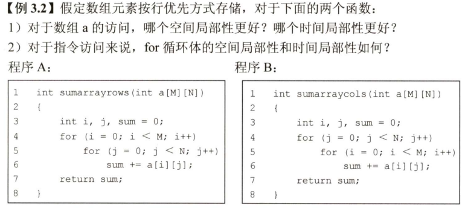

#### Cache的基本工作原理

Cache位于存储器层次结构的顶层，通常由SRAM构成。为便于Cache与主存间交换信息，Cache和主存都被划分为相等大小的块，但Cache中的块数要远小于主存中国的块数，它仅保存主存中最活跃的若干块的副本。因此Cache按照某种策略，预测CPU在未来一段时间内欲访存的数据，将其装入Cache

#### Cache和主存的映射方式

主存中的某个块要放在Cache中的哪个位置？

- 直接映射：只能放在特定的一个位置
- 全相联映射：可以放在任意位置
- 组相联映射：只能放在特定的一个组中的某一个位置

#### Cache中主存块的替换算法

当有新的主存块要进入Cache，但Cache已满时，如何确定要替换的Cache块？

- 随机算法(RAND)
- 先进先出算法(FIFO)
- 近期最少使用算法(LRU)
- 最不经常使用算法(LFU)

#### Cache写策略

因为Cache中的内容是主存块的副本，当对Cache中的内容进行更新时，就需选用写操作策略使Cache内容和主存内容保持一致

1. 写命中
   - 全写法
   - 回写法

2. 写不命中
   - 写分配法
   - 非写分配法

### 页式存储

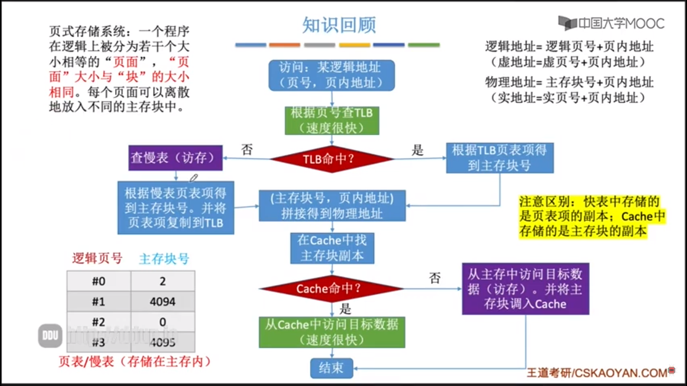

### 虚拟存储器

（详见操作系统）

## 指令系统

指令是指计算机执行某种操作的命令。一台计算机的所有指令的集合构成该机的指令系统，也称指令集。

### 指令格式

#### 指令的基本格式

一条指令由操作码、地址码组成，其中地址码可能有0~4个，根据地址码数目不同可分为零/一/二/三/四地址指令

#### 定长操作码指令格式

定长操作码是指在指令字的最高位部分分配固定的若干位表示操作码，这对于简化计算机硬件设计，提高指令译码和识别速度很有利。当机器字长为32位或更长时，这是常规做法

#### 扩展操作码指令格式

最常见的变长操作码方法是扩展操作码，它使操作码的长度随地址码的减少而增加，不同地址数的指令可具有不同长度的操作码，从而在满足需要的前提下，有效地缩短指令字长。在设计扩展操作码指令格式时，必须注意以下两点：

1. 短码不能是长码的前缀，即短操作码不能与长操作码的前面部分的代码相同
2. 各指令的操作码一定不能重复

#### 指令的操作类型

- 数据传送
- 算数和逻辑运算
- 移位操作
- 转移操作
- 输入输出操作

### 指令的寻址方式

寻址方式分为指令寻址和数据寻址两大类。寻找下一条将要执行的指令地址称为指令寻址；寻找本条指令的数据地址称为数据寻址

指令中的地址码并不代表操作数的真实地址，这种地址称为形式地址（A）。形式地址结合寻址方式，可以计算出操作数在存储器中的真实地址，这种地址称为有效地址（EA）

#### 指令寻址方式

- 顺序寻址：通过程序计算器PC加1（1个指令字长），自动生成下一条指令的地址
- 跳跃寻址：通过转移类指令实现，由当前指令直接修改PC值，所以下一条指令的地址仍然通过PC给出

#### 数据寻址方式

- 隐含寻址
- 立即寻址
- 直接寻址
- 间接寻址
- 寄存器寻址
- 寄存器间接寻址
- 相对寻址
- 基址寻址
- 变址寻址
- 堆栈寻址

### CISC和RISC的基本概念

指令系统朝两个截然不同的方向发展

1. 复杂指令系统计算机(CISC)：增强原有指令的功能，设置更为复杂的新指令实现软件功能的硬化（x86架构的计算机）
2. 精简指令系统计算机(RISC)：减少指令种类和简化指令功能，提高指令的执行速度（ARM、MIPS架构的计算机）

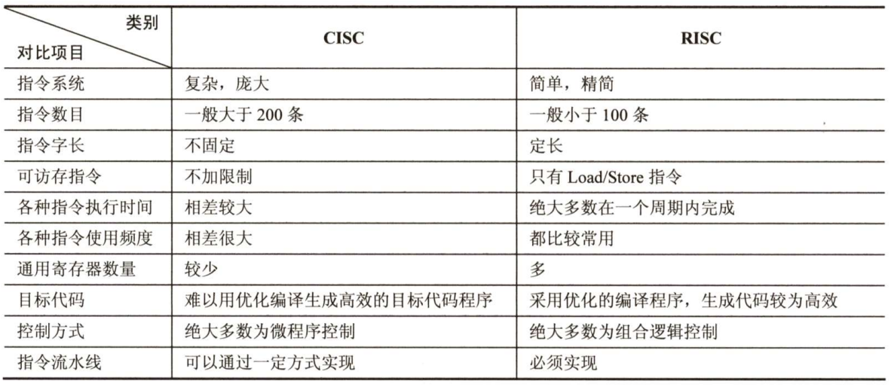

值得注意的是，从指令系统兼容性看，CISC大多能实现软件兼容，即高档机包含了低档机的全部指令，并可加以扩充。但RISC简化了指令系统，指令条数少，格式也不同于老机器，因此大多数RISC机不能与老机器兼容。由于RISC具有更强的实用性，因此应该是未来处理器的 发展方向。但事实上，当今时代Intel几乎一统江湖，且早期很多软件都是根据CISC设计的，单纯的RISC将无法兼容。此外，现代CISC结构的CPU已经融合了很多RISC的成分，其性能差距已经越来越小。CISC可以提供更多的功能，这是程序设计所需要的。

## 中央处理器

### CPU的功能和基本结构

#### CPU的功能

CPU由运算器和控制器组成

- 控制器的功能：负责协调并控制计算机各部件执行程序的指令序列，包括取指令、分析指令和执行指令
- 运算器的功能：对数据进行加工

CPU的具体功能包括：

- 指令控制。完成取指令、分析指令和执行指令的操作，即程序的顺序控制
- 操作控制。一条指令的功能往往由若干操作信号的组合来实现，CPU把各种操作信号送往相应的部件，从而控制这些部件按照指令的要求进行动作
- 时间控制。对各种操作加以时间上的控制
- 数据加工。对数据进行算数和逻辑运算
- 中断处理。对计算机运行过程中出现的异常情况和特殊请求进行处理

#### CPU的基本结构

1. 运算器

   运算器接受从控制器送来的命令并执行相应的动作，对数据进行加工和处理。主要由算术逻辑单元(ALU)、暂存寄存器、累加寄存器(ACC)、通用寄存器组、程序状态字寄存器(PSW)、移位器、计数器(CT)等组成

   - 算术逻辑单元。用于进行算数/逻辑运算
   - 暂存寄存器。用于暂存从主存读来的数据
   - 累加寄存器。是一个通用寄存器，用于暂时存放ALU运算的结果信息，可以作为加法运算的一个输入端
   - 通用寄存器组。如AX、BX、CX、DX、SP等，用于存放操作数（包括源操作数、目的操作数及中间结果）和各种地址信息等。SP是堆栈指针，用于指示栈顶的地址
   - 程序状态字寄存器。保留由算数逻辑运算指令或测试指令的结果而建立的各种状态信息，如溢出标志、符号标志、零标志、进位标志等
   - 移位器。用于进行==进行移位运算
   - 计数器。控制乘除运算的操作步数

2. 控制器

   - 控制器是整个系统的指挥中心，根据指令要求指挥各部件协调工作

   - 控制器的基本功能是执行指令，每条指令的执行是由控制器发出的一组位操作实现的

   控制器由程序计数器(PC)、指令寄存器(IR)、指令译码器、存储器地址寄存器(MAR)、存储器数据寄存器(MDR)、时序系统和微操作信号发生器等组成

   - 程序计数器。用于指出下一条指令在主存中的存放地址，由自增功能
   - 指令寄存器。用于保存当前正在执行的那条指令
   - 指令译码器。仅对操作码字段进行译码，向控制器提供特定的操作信号
   - 存储器地址寄存器。用于存放要访问的主存单元的地址
   - 存储器数据寄存器。用于存放向主存写入的信息或从主存读出的信息
   - 时序系统。用于产生各种时序信号，它们都由统一时钟(CLOCK)分频得到
   - 微操作信号发生器。根据IR的内容（指令）、PSW的内容（状态信息）及时序信号，产生控制整个计算机系统所需的各种控制信号

### 指令执行过程

#### 指令周期

- 指令周期：CPU从主存中取出并执行一条指令的时间称为指令周期，不同指令的指令周期可能不同
- 指令周期常用若干机器周期来表示，一个机器周期又包含若干时钟周期（节拍）
- 每个指令周期内的机器周期数可以不等，每个机器周期内的节拍数也可以不等

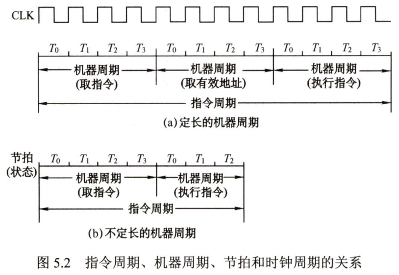

#### 指令周期的数据流

数据流是指根据指令要求依次访问的数据序列。在指令执行的不同阶段，要求依次访问的数据序列是不同的。而且对于不同的指令，它们的数据流往往也是不同的

1. 取指周期

   取指周期的任务是根据PC中的内容从主存中取出指令代码并存放在IR中

   1. PC→MAR→地址总线→主存
   2. CU发出读命令→控制总线→主存
   3. 主存→数据总线→MDR→IR（存放指令）
   4. CU发出控制信号→PC内容加1

2. 间址周期

   间址周期的任务是取操作数有效地址

   1. Ad(IR)（或MDR）→MAR→地址总线→主存
   2. CU发出读命令→控制总线→主存
   3. 主存→数据总线→MDR（存放有效地址）

   其中，Ad(IR)表示取出IR中存放的指令字的地址字段

3. 执行周期

   执行周期的任务是取操作数，并根据IR中指令字的操作码通过ALU操作产生执行结果

   不同指令的执行周期操作不同，因此没有统一的数据流向

4. 中断周期

   中断周期的任务是处理中断请求。假设程序断点存入堆栈中，并用SP指示栈顶地址，而且进栈操作是先修改栈顶指针，后存入数据

   1. CU控制将SP减1，SP→MAR→地址总线→主存
   2. CU发出写命令→控制总线→主存
   3. PC→MDR→数据总线→主存（程序断点存入主存）
   4. CU（中断服务程序的入口地址）→PC

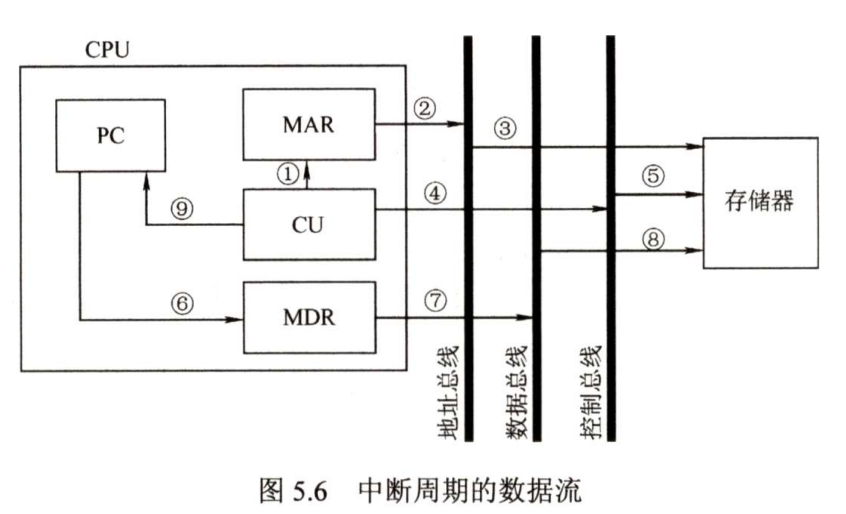

#### 指令执行方案

一个指令通常要包括几个时间段（执行步骤），每个步骤完成指令的一部分功能，几个依次执行的步骤完成指令的全部功能

出于性能和硬件成本等考虑，可以选用3种不同的方案来安排指令的执行周期

- 单指令周期。对所有指令都选用相同的执行时间来完成，指令之间串行执行
- 多指令周期。对不同类型的指令选用不同的执行步骤，指令之间串行执行
- 流水线方案。指令之间可以并行执行

### 数据通路的功能和基本结构

#### 数据通路的功能

- 数据通路：数据在功能部件之间传送的路径，包括路径上流经的部件
- 数据通路的功能：实现CPU内部的运算器与寄存器及寄存器之间的数据交换

#### 数据通路的基本结构

- CPU内部单总线方式。将所有寄存器的输入端和输出端都连接到一条公共通路上
- CPU内部三总线方式。将所有寄存器的输入端和输出端都连接到多条公共通路上
- 专用数据通路方式。根据指令执行过程中的数据和地址的流动方向安排专门的连接线路

### 控制器的功能和工作原理

#### 控制器的结构和功能

控制器是计算机系统的指挥中心，其主要功能有：

1. 从主存中取出一条指令，并指出下一条指令在主存中的位置
2. 对指令进行译码或测试，产生相应的操作控制信号，以便启动规定的动作
3. 指挥并控制CPU、主存、输入和输出设备之间的数据流动方向

根据控制器产生微操作控制信号的方式的不同，控制器可分为硬布线控制器和微程序控制器，两类控制器中的PC和IR是相同的，但确定和表示指令执行步骤的方法以及给出控制各部件运行所需要的控制信号的方案是不同的

#### *硬布线控制器

#### *微程序控制器

### 异常和中断机制

#### 异常和中断的基本概念

- 异常：由CPU内部产生的意外事件，有些教材中也称内中断
- 中断：由来自CPU外部的设备向CPU发出的中断请求，有些教材中也称外中断
- 异常是CPU执行一条指令时，由CPU在其内部检测到的、与正在执行的指令相关的同步事件
- 中断是一种典型的由外部设备触发的、与当前正在执行的指令无关的异步事件

#### 异常和中断的处理过程

当CPU在执行用户程序的第i条指令时检测到一个异常事件或发现一个中断请求信号，则CPU打断当前用户程序，然后转到相应的异常或中断处理程序去执行。若异常或中断处理程序能够解决相应的问题，则在异常或中断处理程序的最后，CPU通过执行异常或中断返回指令，回到被打断的用户程序的第i条指令或第i+1条指令继续执行；若异常或中断处理程序发现是不可恢复的致命错误，则终止用户程序。

#### 异常和中断响应过程

1. 关中断
2. 保存断点和程序状态
3. 识别异常和中断并转到相应的处理程序

### *指令流水线

### 多处理器的基本概念

#### *SISD、SIMD、MIMD的基本概念

#### *硬件多线程的基本概念

#### 多核处理器的基本概念

- 多核处理器：将多个处理单元（核）集成到单个CPU中，每个核可以有自己的Cache，也可以共享Cache，所有核共享主存储器
- 要充分发挥多核处理器的性能，必须采用多线程（或多进程）执行，使得每个核在同一时刻都有线程在执行

#### 共享内存多处理器的基本概念

- 共享内存多处理器：具有共享的单一物理地址空间的多处理器
- 通过存储器中的共享变量互相通信，所有处理器都能通过存取指令访问任何存储器的位置
- 即使这些系统共享同一个物理地址空间，它们仍然可以在自己的虚拟地址空间中单独地运行程序
- 可能回出现多个处理器同时访问同一共享变量的情况，解决方法是通过对共享变量加锁的方式来控制对共享变量互斥访问

## 总线

### 总线概述

#### 总线基本概念

- 总线：一组能为多个部件分时共享的公共信息传送线路
- 分时是指同一时刻只允许由一个部件向总线发送信息；共享是指总线上可以挂接多个部件，多个部件可同时从总线上接收相同的信息

#### 总线的分类

按功能可分为以下3类

1. 片内总线

   片内总线是芯片内部的总线，它是CPU芯片内部寄存器与寄存器之间、寄存器与ALU之间的公共连接线

2. 系统总线

   系统总线是计算机系统内各功能部件（CPU、主存、I/O接口）之间相互连接的总线

   1. 数据总线

      用于传输数据信息，是双向传输总线，其位数与机器字长、存储字长有关

   2. 地址总线

      用于指出数据总线上的源数据或目的数据所在的主存单元或I/O端口的地址，是单向传输总线，其位数与主存地址空间的大小有关

   3. 控制总线

      用于传输控制信息，包括CPU送出的控制命令和主存（或外设）返回CPU的反馈信号

3. 通信总线

   通信总线是计算机系统之间或计算机系统与其他系统之间传送信息的总线，也称外部总线

按时序控制方式可分为同步总线和异步总线，按数据传输格式可分为并行总线和串行总线

#### 系统总线结构

1. 单总线结构

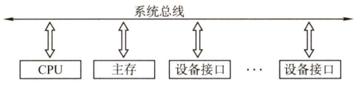

2. 双总线结构

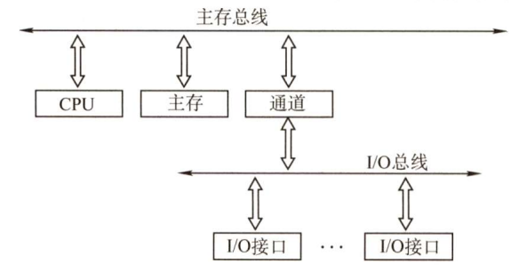

3. 三总线结构

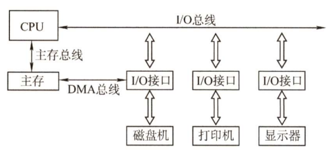

#### *常见的总线标准

#### *总线的性能指标

### 总线事务与定时

#### 总线事务

总线事务：从请求总线到完成总线使用的操作序列

典型的总线事务包括请求操作、仲裁操作、地址传输、数据传输和总线释放

1. 请求阶段。主设备发出总线传输请求，并且获得总线控制权
2. 仲裁阶段。总线仲裁机构决定将下一个传输周期的总线使用权授予某个申请者
3. 寻址阶段。主设备通过总线给出要访问的从设备地址及有关命令，启动从模块
4. 传输阶段。主模块和从模块进行数据交换
5. 释放阶段。主模块的有关信息均从系统总线上撤出，让出总线使用权

在总线事务的传输阶段，主、从设备之间一般只能传输一个字长的数据
突发（猝发）传送方式能够进行连续成组数据的传送，其寻址阶段发送的是连续数据单元的首地址，在传输阶段传送多个连续单元的数据，每个时钟周期可以传送一个字长的信息，但是不释放总线，直到一组数据全部传送完毕后，再释放总线

#### 同步定时方式

系统采用一个统一的时钟信号来协调发送和接收双方的传送定时关系。时钟产生相等的时间间隔，每个间隔构成一个总线周期。在一个总线周期中，发送方和接收方可以进行一次数据传送。因为采用统一的时钟，每个部件或设备发送或接收信息都在固定的总线传送周期中，一个总线的传送周期结束，下一个总线的传送周期开始

#### 异步定时方式

系统没有统一的时钟，也没有固定的时间间隔，完全依靠传送双方相互制约的“握手”信号来实现定时控制。通常，把交换信息的两个部件或谁被分为主设备和从设备，主设备提出交换信息的“请求”信号，经接口传送到从设备；从设备接到主设备的请求后，通过接口向主设备发出“回答”信号

根据“请求”和“回答”信号的撤销是否互锁，异步定时方式又分为以下3种类型

1. 不互锁方式
2. 半互锁方式
3. 全互锁方式

## 输入/输出系统

### I/O系统基本概念

#### 输入/输出系统

- 外部设备。包括输入/输出设备及通过输入/输出接口才能访问的外存储设备
- 接口。在各个外设与主机之间传输数据时进行各种协调工作的逻辑部件。协调包括传输过程中速度的匹配、电平和格式的转换等
- 输入设备。用于向计算机系统输入命令和文本、数据等信息的部件
- 输出设备。用于将计算机系统中的信息输出到计算机外部进行显示、交换等的部件
- 外存设备。指除计算机内存及CPU缓存等外的存储器。如硬盘、光盘等

#### I/O控制方式

在输入/输出系统中，经常需要进行大量的数据传输，而传输过程中有各种不同的I/O控制方式，基本的控制方式主要有以下4种：

1. 程序查询方式

   由CPU通过程序不断查询I/O设备是否已经做好准备，从而控制I/O设备与主机交换信息

2. 程序中断方式

   只在I/O设备准备就绪并向CPU发出中断请求时才予以响应（启动中断处理程序）

3. DMA方式

   主存和I/O设备之间有一条直接数据通路（DMA总线）。CPU向DMA接口发出“读/写”命令，并指明主存地址、磁盘地址、读写数据量等参数。DMA接口自动控制磁盘与主存的数据读写，每完成一整块数据读写（如1KB为一整块），才向CPU发出一次中断请求

4. 通道方式

   在系统中设有通道控制部件，每个通道都挂接若干外设，主机在执行I/O命令时，只需启动有关通道，通道将执行通道程序，从而完成I/O操作

其中，方式1和方式2主要用于数据传输率较低的外部设备，方式3和方式4主要用于数据传输率较高的外部设备

#### 外部设备

1. 输入设备
   1. 键盘
   2. 鼠标
2. 输出设备
   1. 显示器
   2. 打印机
3. 外部存储器（辅存）
   1. 磁表面存储器
   2. 固态硬盘(SSD)
   3. 光盘存储器

### I/O接口

- I/O接口（I/O控制器）是主机和外设之间的交接界面，通过接口可以实现主机和外设之间的信息交换
- 主机和外设具有各自的工作特点，它们在信息形式和工作速度上具有很大的差异，接口正是为了解决这些差异而设置的

#### I/O接口的功能

1. 数据缓冲：通过数据缓冲寄存器实现主机和外设工作速度匹配
1. 错误或状态检测：通过状态寄存器反馈谁被的各种错误、状态信息，供CPU查用
1. 控制和定时：接受从控制总线发来的控制信号、时钟信号
1. 数据格式转换：串-并、并-串等格式转换
1. 与主机和设备通信：实现主机-I/O接口-I/O设备之间的通信

#### *I/O接口的基本结构

#### I/O端口及其编址

- I/O端口是指接口电路中可被CPU直接访问的寄存器，主要有数据端口、状态湍口和控制端口，若干端口加上相应的控制逻辑电路组成接口
- 通常，CPU能对数据端口执行读写操作，但对状态端口只能执行读操作，对控制端口只能执行写操作

I/O端口要想能够被CPU访问，就必须要对各个端口进行编址，编址方式有与存储器统一编址和独立编址两种

1. 统一编址（存储器映射方式）

   把I/O端口当作存储器的单元进行地址分配，这种方式CPU不需要设置专门的I/O指令，用统一的访存指令就可以访问I/O端口

2. 独立编址（I/O映射方式）

   I/O端口的地址空间与主存地址空间是两个独立的地址 空间，因而无法从地址码的形式上区分，需要设置专门的I/O指令来访问I/O端口

### I/O方式

#### 程序查询方式

信息交换的控制完全由CPU执行程序实现，程序查询方式接口中设置一个数据缓冲寄存器（数据端口）和一个设备状态寄存器（状态端口）。主机进行I/O操作时，先发出询问信号，读取设备状态并根据设备状态决定下一步操作究竟是进行数据传送还是等待

程序查询的工作流程：

1. CPU执行初始化程序，并预置传送参数
2. 向I/O接口发出命令字，启动I/O设备
3. 从外设接口中读取其状态信息
4. CPU不断查询I/O设备状态，直到外设准备就绪
5. 传送一次数据
6. 修改地址和计数器参数
7. 判断传送是否结束，若未结束则转至第3步，直到计数器为0

CPU一旦启动I/O，就必须停止现行程序的运行，并在现行程序中插入一段程序；CPU有“踏步”等待的现象，CPU与I/O串行工作

#### 程序中断方式

程序中断：计算机执行现行程序的过程中，出现某些急需处理的异常情况或特殊请求，CPU暂时中止现行程序，而转去对这些异常情况或特殊请求进行处理，处理完毕后再返回到现行程序的断点处继续执行

程序中断方式的思想：CPU在程序中安排好在某个时机启动某台外设，然后CPU继续执行当前程序，不需要像查询方式那样一直等待外设准备就绪。一旦外设完成数据传送的准备工作，就主动向CPU发出中断请求，请求CPU为自己服务。在可以响应中断的条件下，CPU暂时中止正在执行的程序，转去执行中断服务程序为外设服务，在中断服务程序完成一次主机与外设之间的数据传送，传送完成后，CPU返回原来的程序

程序中断的工作流程：

1. 中断请求

   中断源向CPU发出中断请求

2. 中断响应判优

   当多个中断源同时发出中断请求时，需按照优先级来确定响应哪个中断源的请求

3. 判断CPU是否具备响应中断的条件

   CPU响应中断必须满足以下条件：
   CPU允许中断及开中断（异常和不可屏蔽中断不受此限制）
   一条指令执行完毕（异常不受此限制），且没有更紧迫的任务

4. 中断处理（中断响应+执行中断处理程序）

   - 中断响应阶段执行的操作是由硬件完成的，这些操作称为中断隐指令
   - 中断隐指令不是指令系统中的一条真正的命令，只是一种虚拟的说法，本质上是硬件的一系列自动操作

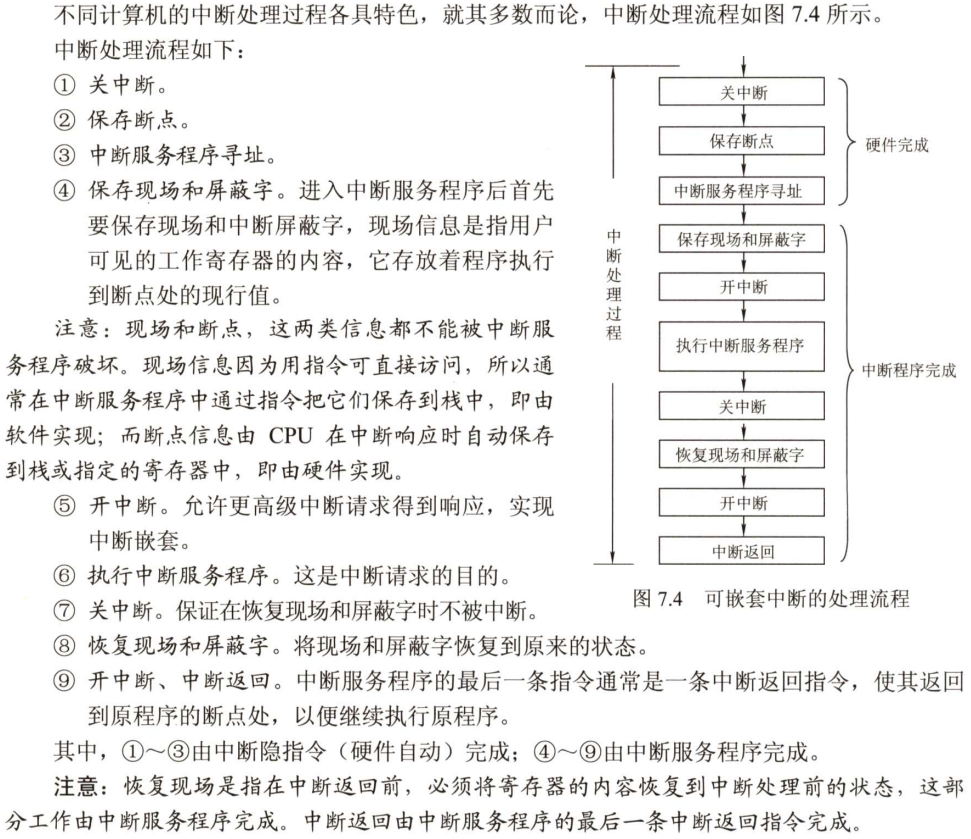

在执行中断服务程序过程中，若CPU处于开中断状态，优先级别高的中断源有权中断优先级别低的中断源，从而实现多重中断

中断处理优先级可以利用中断屏蔽技术动态调整，每个中断源都有一个中断屏蔽字，其中指明了哪些中断源被自己屏蔽

#### DMA方式

DMA方式是一种完全由硬件进行成组信息传送的控制方式，它具有程序中断方式的优点，即在数据准备阶段，CPU与外设并行工作。DMA方式在外设与主存之间开辟一条“直接数据通道”，信息传送不再经过CPU，降低了CPU在传送数据时的开销，因此称为直接存储器存取方式。由于数据传送不经过CPU，也就不需要保护、恢复CPU现场等繁琐操作。

这种方式适用于磁盘、显卡、声卡、网卡等高速设备大批量数据的传送，它的硬件开销比较大。在DMA方式中，中断的作用仅限于故障和正常传送结束时的处理

1. DMA方式的特点

   1. 它使主存与CPU的固定联系脱钩，主存既可以被CPU访问，又可以被外设访问
   2. 在数据块传送时，主存地址的确定、传送数据的计数等都由硬件电路直接实现
   3. 主存中要开辟专用缓冲区，及时供给和接收外设的数据
   4. DMA传送速度快，CPU和外设并行工作，提高了系统效率
   5. DMA在传送开始前要通过程序进行预处理，结束后要通过中断方式进行后处理

2. DMA控制器的功能

   当I/O设备需要进行数据传送时，通过DMA控制器向CPU发出DMA传送请求，CPU响应后将让出系统总线，由DMA控制器接管总线进行数据传送，其主要功能如下：

   1. 接受外设发出的DMA请求，并向CPU发出总线请求
   2. CPU响应此总线请求，发出总线响应信号，接管总线控制权，进入DMA操作周期
   3. 确定传送数据的主存单元地址及长度，并自动修改主存地址计数和传送长度计数
   4. 规定数据在主存和外设间的传送方向，发出读写等控制信号，执行数据传送操作
   5. 向CPU报告DMA操作结束

3. DMA的传送过程

   DMA的数据传送过程分为预处理、数据传送和后处理3个阶段：

   1. 预处理。由CPU完成一些必要的准备工作。首先，CPU执行几条I/O指令，用以测试I/O设备状态，向DMA控制器的有关寄存器置初值、设置传送方向、启动该设备等。然后CPU继续执行原来的程序，直到I/O设备准备好发送的数据或接收的数据时，I/O设备向DMA控制器发送DMA请求，再由DMA控制器向CPU发送总线请求（有时将这两个过程统称为DMA请求），用以传送数据
   2. 数据传送。DMA的数据传送可以以单字节（或字）为基本单位，也可以以数据块为基本单元。对于以数据块为单元的传送（如硬盘），DMA占用总线后的数据输入和输出操作都是通过循环来实现的。需要指出的是，这一循环也是由DMA控制器（而非通过CPU执行程序）实现的，即数据传送阶段完全由DMA（硬件）控制
   3. 后处理。DMA控制器向CPU发出中断请求，CPU执行中断服务程序做DMA结束处理，包括数据校验等
