# 计算机网络

## 绪论

### 计算机网络概述

#### 计算机网络的概念

- 网络由若干结点和连接这些结点的链路组成
- 多个计算机网络可以通过路由器互连起来，这样就构成了一个覆盖范围更大的计算机网络，即互连网(internet)
- 互联网/因特网（Internet）是世界上最大的互连网络

#### 计算机网络的组成

计算机网络（这里主要指Internet）可分为边缘部分和核心部分。

- 边缘部分由所有连接到因特网上、供用户直接使用的主机组成，用来进行通信（如传输数据、音频或视频）和资源共享
- 核心部分由大量的网络和连接这些网络的路由器组成，它为边缘部分提供连通性和交换服务

#### 计算机网络的功能

计算机网络的功能很多，主要有五大功能：数据通信、资源共享、分布式处理、提高可靠性、负载均衡

#### 计算机网络的分类

1. 按覆盖范围分类

   - 广域网(WAN)

     提供长距离通信，覆盖范围通常是直径为几十千米到几千千米的区域，因而有时也称远程网。广域网是因特网的核心部分。连接广域网的各结点交换机的链路一般都是高速链路，具有较大的通信容量。

   - 城域网(MAN)

     覆盖范围可以跨越几个街区甚至整个城市，覆盖区域的直径为5~50km。城域网大多采用以太网技术，因此有时也常并入局域网的范围讨论。

   - 局域网(LAN)

     一般用微机或工作站通过高速线路相连，覆盖范围较小，通常是直径为几十米到几千米的区域。局域网在计算机配置的数量上没有太多的限制，少的可以只有两台，多的可达几百台。传统上，局域网使用广播技术，而广域网使用交换技术。

   - 个人区域网(PAN)

     是指在个人工作的地方将消费电子设备（如平板电脑、智能手机等）用无线技术连接起来的网络，覆盖区域的直径约为10m。

2. 按传输技术分类

   - 广播式网络

     所有联网计算机都共享一个公共通信信道。当一台计算机利用共享通信信道发送报文分组时，所有其他的计算机都会“收听”到这个分组。接受到该分组的计算机将通过检查目的地址来决定是否接受该分组。局域网基本上都采用广播式通信技术，广域网中的无线、卫星通信网络也采用广播式通信技术。

   - 点对点网络

     每条物理链路连接一对计算机。若通信的两台主机之间没有直接连接的线路，则它们之间的分组传输就要通过中间结点进行接收、存储、转发，直至目的结点。

   是否采用分组存储转发与路由选择机制是点对点网络与广播式网络的重要区别，广域网基本都属于点对点网络。

3. 按拓扑结构分类

   - 总线形网络

     用单根传输线把计算机连接起来。优点是建网容易、增删结点方便、节省线路。缺点是重负载时通信效率不高、总线任意一处出现故障则全网瘫痪。

   - 星形网络

     每个终端或计算机都以单独的线路与中央设备相连。中央设备早期是计算机，现在一般是交换机或路由器。优点是便于集中控制和管理，因为端用户之间的通信必须经过中央设备。缺点是成本高、中央设备故障则全网瘫痪。

   - 环形网络

     所有计算机接口设备连接成一个环。环可以是单环，也可以是双环，环中信号是单向传输的。

   - 网状网络

     一般情况下，每个结点至少有两条路径与其他结点相连，多用在广域网中。优点是可靠性高，缺点是控制复杂、线路成本高。

   以上4种基本的网络拓扑结构可以互连为更复杂的网络。

4. 按使用者分类

   - 公用网(Public Network)

     指电信公司出资建造的大型网络。“公用”的意思是指所有愿意按电信公司的规定交纳费用的人都可以使用这种网络。

   - 专用网(Private Network)

     指某个部门为满足本单位特殊业务的需要而建造的网络。这种网络不向本单位以外的人提供服务。

5. 按交换技术分类

   - 电路交换网络

     在源结点与目的结点之间建立一条专用的通路用于传送数据，包括建立连接、传输数据、断开连接三个阶段。最典型的电路交换网是传统电话网络。该类网络的主要特点是整个报文的比特流连续地从源点直达终点，好像是在一条管道中传送。优点是数据直接传送、时延小。缺点是线路利用率低、不能充分利用线路容量、不便于进行差错控制。

   - 报文交换网络

     将数据加上源地址、目的地址、校验码等辅助信息，然后封装成报文。整个报文传送到相邻结点，全部存储后，再转发给下一个结点，重复这一过程直到到达目的结点。这种传输方式称为存储-转发方式。优点是可以较为充分地利用线路容量，可以实现不同链路之间不同数据传输速率的转换，可以实现格式转换，可以实现一对多、多对一的访问，可以实现差错控制。缺点是增大了资源开销（如辅助信息导致处理时间和存储资源的开销），增加了缓冲时延，需要额外的控制机制来保证多个报文的顺序不乱序，缓冲区难以管理（因为报文的大小不确定，接收方在接收到报文之前不能预知报文的大小）。

   - 分组交换网络※

     将数据分成较短的固定长度的数据块，在每个数据块中加上目的地址、源地址、校验码等辅助信息，然后封装成分组（包），以存储-转发方式传输。除具备报文交换网络的优点外，分组交换网络还具有自身的优点：缓冲易于管理；包的平均时延更小，网络占用的平均缓冲区更少；更易于标准化；更适合应用。现在的主流网络基本上都可视为分组交换网络。

6. 按传输介质分类

   - 有线网络
   - 无线网络

#### 计算机网络的标准化工作

#### 计算机网络的性能指标

- 速率(Speed)

  指连接到计算机网络上的主机在数字信道上传送数据的速率，也称数据传输速率、数据率或比特率，单位为比特每秒(b/s, bit/s, bps)。数据率较高时，可用kb/s、Mb/s、Gb/s表示。

- 带宽(Bandwidth)

  原表示通信线路允许通过的信号频带范围，单位是赫兹(Hz)。而在计算机网络中，带宽表示网络的通信线路所能传送数据的能力，是数字信道所能传送的“最高数据传输速率”的同义词，单位是bps

- 吞吐量(Throughput)

  指单位时间内通过某个网络（或信道、接口）的数据量，受网络带宽或网络额定速率的限制

- 时延(Delay)

  指数据（一个报文或分组）从网络（或链路）的一端传送到另一端所需要的总时间，由以下4部分组成：

  - 发送时延 = 数据长度(b) / 发送速率(b/s)
  - 传播时延 = 信道长度(m) / 电磁波传播速率(m/s)（自由空间：3×10^8^m/s，光纤：2×10^8^m/s）
  - 处理时延
  - 排队时延

  对于高速链路，提高的仅是数据发送速率，而非比特在链路上的传播速率，从而减少数据的发送时延。

- 时延带宽积

  是传播时延与信道带宽的乘积，表示发送端发送的第一个比特即将到达终点时，发送端已经发出了多少个比特，因此由称以比特为单位的链路长度。考虑一个代表链路的圆柱形管道，其长度表示链路的传播时延，横截面积表示链路带宽，则时延带宽积表示该管道可以容纳的比特数量。

- 往返时延(Round-Trip Time, RTT)

  指从发送端发出一个分组，到发送端收到来自接收端的确认，总共经历的时延。

- 信道利用率

  指某信道由百分之几的时间是有数据通过的。

- 丢包率

  指在一定的时间范围内，传输过程中丢失的分组数量与总分组数量的比率。丢包的两个主要原因是分组误码和网络拥塞。

### 计算机网络体系结构

#### 计算机网络分层结构

两个系统中实体间的通信是一个很复杂的过程，为了降低协议设计和调试过程的复杂性，也为了便于对网络进行研究、实现和维护，促进标准化工作，通常对计算机网络的体系结构以分层的方式进行建模。

我们把计算机网络的各层及其协议的集合称为网络的体系结构(Architecture)。换言之，计算机网络的体系结构就是这个计算机网络及其所完成的功能的精确定义，它是计算机网络中的层次、各层的协议及层间接口的集合。

分层的基本原则如下：

- 每层都实现一种相对独立的功能，降低大系统的复杂度
- 各层之间界面自然清晰，易于理解，相互交流尽可能少
- 各层功能的精确定义独立于具体的实现方法，可以采用最合适的技术来实现
- 保持下层对上层的独立性，上层单向使用下层提供的服务
- 整个分层结构应能促进标准化工作

#### 常见的计算机网络体系结构

1. OSI体系结构

   国际标准化组织(ISO)提出的网络体系结构。OSI体系结构有7层，自下而上依次为：

   - 物理层
   - 数据链路层
   - 网络层
   - 传输层
   - 会话层
   - 表示层
   - 应用层

2. TCP/IP体系结构

   ARPA在研究ARPAnet时提出了TCP/IP体系结构。TCP/IP由于得到广泛应用而成为事实上的国际标准，自下而上依次为：

   - 网络接口层
   - 网际层
   - 传输层
   - 应用层

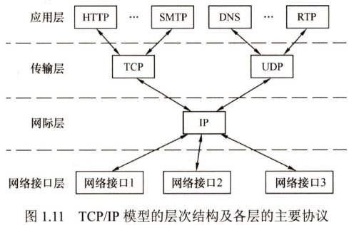

3. 五层协议的原理体系结构

   无论是OSI还是TCP/IP，都不是完美的。学习计算机网络时，我们往往采取折中的办法，即综合两者的优点，采用一种只有5层协议的体系结构，自下而上依次为：

   - 物理层 - 解决使用何种信号来传输比特的问题
   - 数据链路层 - 解决分组正在一个网络（或一段链路）上传输的问题
   - 网络层 - 解决分组在多个网络上传输（路由）的问题
   - 运输层 - 解决进程之间基于网络的通信问题
   - 应用层 - 解决通过应用进程的交互来实现特定网络应用的问题

   简单介绍使用通信协议栈进行通信的结点的数据传输过程。每个协议栈的最顶端都是一个面向用户的接口，下面各层是为通信服务的协议。用户传输一个数据报时，通常给出用户能够理解的自然语言，然后通过应用层，将自然语言会转化为用于通信的通信数据。通信数据到达传输层，作为传输层的数据部分（传输层SDU），加上传输层的控制信息（传输层PCI），组成传输层的PDU，然后交到网络层，传输层的PDU下放到网络层后，就成为网络层的SDU，然后加上网络层的PCI，又组成了网络层的PDU，下放到数据链路层，就这样层层下放，层层包裹，最后形成的数据报通过通信线路传输，到达接收方结点协议栈，接收方再逆向地逐层把“包裹”拆开，然后把收到的数据提交给用户。

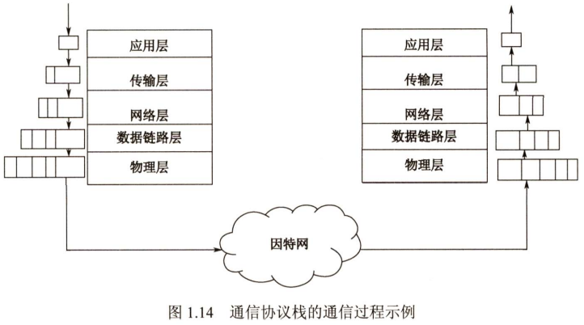

#### 计算机网络体系结构中的专用术语

- 实体：任何可发送或接受信息的硬件或软件进程
- 对等实体：同一层的实体
- 协议：控制两个对等实体进行逻辑通信的规则的集合，是水平的
- 协议的三要素
  - 语法：规定了传输数据的格式
  - 语义：规定了所要完成的功能，即需要发出何种控制信息、完成何种动作及做出何种应答
  - 同步：规定了执行各种操作的条件、时序关系等，即事件实现顺序的详细说明
- 服务：下层为紧邻的上层提供的功能调用，是垂直的
- 服务访问点：在同一结点中相邻两层的实体交换信息的逻辑接口，用于区分不同的服务类型
- 服务原语：上层使用下层所提供的服务时必须与下层交换一些命令，这些命令称为服务原语
- 服务数据单元SDU：在同一结点中，层与层之间交换的数据单位
- 协议控制信息PCI：控制协议操作的信息
- 协议数据单元PDU：对等层次之间传送的数据单位称为该层的协议数据单元

在计算机网络体系结构的各个层次中，每个报文都分为两部分：一是数据部分(SDU)；二是控制信息部分(PCI)，它们共同组成PDU。

## 物理层

### 物理层的基本概念

1. 物理层所要解决的问题

   物理层考虑的是如何在连接各种计算机的传输媒体上传输数据比特流。

2. 物理层协议的主要任务

   - 机械特性 - 指明接口所用接线器的形状和尺寸、引脚数目和排列、固定和锁定装置
   - 电气特性 - 指明在接口电缆的各条线上出现的电压的范围
   - 功能特性 - 指明某条线上出现的某一电平的电压表示何种意义
   - 过程特性 - 指明对于不同功能的各种可能事件的出现顺序

### 通信基础*

#### 基本概念

1. 数据、信号和码元

   - 数据是传送信息的实体，信号是数据的电气或电磁表现，是数据在传输过程中的存在形式
   - 数据和信号都可用“模拟的”或“数字的”来修饰：
     - 连续变化的数据（或信号）称为模拟数据（或模拟信号）
     - 取值仅允许为有限的几个离散数值的数据（或信号）称为数字数据（或数据信号）
   - 数据的传输方式可分为串行传输和并行传输：
     - 串行传输还是指1比特1比特地按照时间顺序传输（计算机网络使用）
     - 并行传输是指若干比特通过多条通信信道同时传输（计算机内部使用）
   - 码元是指用一个固定时长的信号波形（数字脉冲）表示一位k进制数字，代表不同离散数值的基本波形

2. 信源、信道与信宿

   - 信源是产生和发送数据的源头，信宿是接收数据的终点
   - 信源发出的信息需要通过变换器转换成适合在信道上传输的信号，传输完毕后再通过反变换器转换成原始信息由信宿接收
   - 信道是信号的传输媒介。按传输信号形式的不同，可分为模拟信道和数字信号；按传输介质的不同，可分为无线信道和有线信道
   - 从通信双方信息的交互方式看，可分为三种基本方式：
     - 单向通信：只有一个方向的通信，仅需要一条信道。例如，无线广播、电视广播
     - 半双工通信：通信双方都可以发送或接收信息，但任何一方都不能同时发送和接收信息，此时需要两条信道。例如，对讲机
     - 全双工通信：通信双方可以同时发送和接收信息，也需要两条信道。例如，电话
   - 信道的极限容量是指信道的最高码元传输速率或信道的极限信息传输速率

3. 速率、波特与带宽

   速率也称数据率，指的是数据传输速率，表示单位时间内传输的数据量。可以用码元传输速率和信息传输速率表示。

   - 码元传输速率

     又称波特率，它表示单位时间内数字通信系统所传输的码元个数（也可称为脉冲个数或信号变化的次数），单位是波特(Baud)，即码元/秒。

   - 信息传输速率

     又称信息速率、比特率等，它表示单位时间内数字通信系统传输的二进制码元个数（即比特数），单位是比特/秒(b/s)。

   比特和比特是两个不同的概念，码元传输速率也称调制速率、波形速率或符号速率。但码元传输速率与信息传输速率在数量上又有一定的关系。若一个码元携带n比特地信息量，则M波特率的码元传输速率对应的信息传输速率为Mn比特/秒。

#### 奈奎斯特定理与香农定理

1. 奈奎斯特定理

   奈奎斯特定理又称奈氏准则，它规定：在理想低通（没有噪声、带宽有限）的信道中，为了避免码间串扰，极限码元传输速率为2W波特，其中W是理想低通信道的带宽。

   对于奈氏准则，可以得岀以下结论：

   - 在任何信道中，码元传输速率是有上限的。若传输速率超过此上限，就会出现严重的码间串扰问题，使得接收端不可能完全正确识别码元
   - 信道的频带越宽（即通过的信号高频分量越多），就可用更高的速率进行码元的有效传输
   - 奈氏准则给出了码元传输速率的限制，但并未对信息传输速率给出限制，即未对一个码元可以对应多少个二进制位给出限制

   由于码元传输速率受奈氏准则的制约，所以要提高数据传输速率，就必须设法使每个码元携带更多比特的信息量，此时就需要釆用多元制的调制方法。

2. 香农定理

   香农定理给出了带宽受限且有高斯白噪声干扰的信道的极限数据传输速率，当用此速率进行传输时，可以做到不产生误差。

   对于香农定理，可以得出以下结论：

   - 信道的带宽或信道中的信噪比越大，信息的极限传输速率越高
   - 对一定的传输带宽和一定的信噪比，信息传输速率的上限是确定的
   - 只要信息传输速率低于信道的极限传输速率，就能找到某种方法来实现无差错的传输
   - 香农定理得出的是极限信息传输速率，实际信道能达到的传输速率要比它低不少

#### 编码与调制

数据无论是数字的还是模拟的，为了传输的目的都必须转变成信号。把数据变换为模拟信号的过程称为调制，把数据变换为数字信号的过程称为编码。

### 传输介质

传输介质也称传输媒体，它是数据传输系统中发送设备和接收设备之间的物理通路。传输介质不属于物理层，处于物理层之下。

1. 双绞线

   双绞线是最常用的古老传输介质，它由两根采用一定规则并排绞合的、相互绝缘的铜导线组成。绞合可以减少对相邻导线的电磁干扰。双绞线的价格便宜，是最常用的传输介质之一，在局域网和传统电话网中普遍使用。双绞线的带宽取决于铜线的粗细和传输的距离。

2. 同轴电缆

   同轴电缆由内导体、绝缘层、网状编制屏蔽层和塑料外层构成。按特性阻抗数值的不同，通常将将同轴电缆分为两类：50Ω同轴电缆和75Ω同轴电缆。其中，50Ω同轴电缆主 要用于传送基带数字信号，又称基带同轴电缆，它在局域网中应用广泛；75Q同轴电缆主要用于传送宽带信号，又称宽带同轴电缆，主要用于有线电视系统。由于外导体屏蔽层的作用，同轴电缆具有良好的抗干扰特性，被广泛用于传输较高速率的数据，其传输距离更远，但价格较双绞线贵。

3. 光纤

   光纤通信就是利用光导纤维（简称光纤）传递光脉冲来进行通信。有光脉冲表示1，无光脉冲表示0。可见光的频率约为10^8^MHz，因此光纤通信系统的带宽范围极大。光纤不仅具有通信容量非常大的优点，还具有如下特点：

   - 传输损耗小，中继距离长，对远距离传输特别经济
   - 抗雷电和电磁干扰性能好
   - 无串音干扰，保密性好，也不易被窃听或截取数据
   - 体积小，重量轻

4. 无线传输介质

   - 无线电波

     无线电波具有较强的穿透能力，可以传输很长的距离，所以它被广泛应用于通信领域，如无线手机通信、计算机网络中的无线局域网(WLAN)等。因为无线电波使信号向所有方向散播，因此有效距离范围内的接收设备无须对准某个方向，就可与无线电波发射者进行通信连接。这也是无线电传输的最重要优点之一。

   - 微波、红外线和激光

     目前高带宽的无线通信主要使用三种技术：微波、红外线和激光。它们都需要发送方和接收方之间存在一条视线通路，又很强的方向性，都沿直线传播，有时统称三者为视线介质。

     微波通信的频率较高，频段范围也很宽，载波频率通常为2~40GHz，因此通信信道的容量大。与通常的无线电波不同，微波通信的信号是沿直线传播的，因此在地面的传播距离有限，超过一定距离后就要用中继站来接力。卫星通信利用地球同步卫星作为中继来转发微波信号，可以克服地面微波通信距离的限制。三颗相隔120°的同步卫星几乎能覆盖整个地球表面，因而基本能实现全球通信。卫星通信的优点是通信容量大、距离远、覆盖广，缺点是保密性差、端到端传播时延长。

### 物理层设备

#### 中继器

中继器的主要功能是将信号整形并放大再转发出去，以消除信号经过一长段电缆后而产生的失真和衰减，使信号的波形和强度达到所需要的要求，进而扩大网络传输的距离。其原理是信号再生（而非简单地将衰减的信号放大）。

中继器是用来扩大网络规模的最简单廉价的互联设备。中继器两端的网络部分是网段，而不是子网，使用中继器连接的几个网段仍然是一个局域网。中继器若岀现故障，对相邻两个网段的工作都将产生影响。由于中继器工作在物理层，因此它不能连接两个具有不同速率的局域网。

从理论上讲，中继器的使用数目是无限的，网络因而也可以无限延长。但事实上这不可能，因为网络标准中对信号的延迟范围做了具体的规定，中继器只能在此规定范围内进行有效的工作，否则会引起网络故障。例如，在采用粗同轴电缆的10BASE5以太网规范中，互相串联的中继器的个数不能超过4个，而且用4个中继器串联的5段通信介质中只有3段可以挂接计算机，其余两段只能用作扩展通信范围的链路段，不能挂接计算机。这就是所谓的“5-4-3规则”。

#### 集线器

集线器(Hub)实质上是一个多端口的中继器。当Hub工作时，一个端口接收到数据信号后，由于信号在从端口到Hub的传输过程中已有衰减，所以Hub便将该信号进行整形放大，使之再生（恢复）到发送时的状态，紧接着转发到其他所有（除输入端口外）处于工作状态的端 口。如果同时有两个或多个端口输入，那么输出时会发生冲突，致使这些数据都无效。从Hub的工作方式可以看出，它在网络中只起信号放大和转发作用，目的是扩大网络的传输范围，而不具备信号的定向传送能力，即信号传输的方向是固定的，是一个标准的共享式设备。

Hub主要使用双绞线组建共享网络，是从服务器连接到桌面的最经济方案。在交换式网络中，Hub直接与交换机相连，将交换机端口的数据送到桌面上。使用Hub组网灵活，它把所有结点的通信集中在以其为中心的结点上，对结点相连的工作站进行集中管理，不让出问题的工作站影响整个网络的正常运行，并且用户的加入和退岀也很自由。由Hub组成的网络是共享式网络，但逻辑上仍是一个总线网。Hub的每个端口连接的网络部分是同一个网络的不同网段，同时Hub也只能在半双工状态下工作，网络的吞吐率因而受到限制。 

## 数据链路层

本章是历年考试中考查的重点。要求在了解数据链路层基本概念和功能的基础上，重点掌握滑动窗口机制、三种可靠传输协议、各种MAC协议和PPP协议，特别是CSMA/CD协议和以太网帧格式，以及局域网的争用期和最小帧长的概念、二进制指数退避算法。此外，中继器、网卡、集线器、网桥和局域网交换机的原理及区别也要重点掌握。

### 数据链路层的功能

1. 为网络层提供服务

   对网络层而言，数据链路层的基本任务是将源机器中来自网络层的数据传输到目标机器的网络层。数据链路层通常可为网络层提供如下服务：

   - 无确认的无连接服务

     源机器发送数据帧时不需先建立链路连接，目的机器收到数据帧时不需发回确认。对丢失的帧，数据链路层不负责重发而交给上层处理。该服务适用于实时通信或误码率较低的通信信道，如以太网。

   - 有确认的无连接服务

     源机器发送数据帧时不需先建立链路连接，但目的机器收到数据帧时必须发回确认。源机器在所规定的时间内未收到确认信号时，就重传丢失的帧，以提高传输的可靠性。该服务适用于误码率较高的通信信道，如无线通信。

   - 有确认的面向连接服务

     帧传输过程分为三个阶段：建立数据链路、传输帧、释放数据链路。目的机器对收到的每一帧都要给出确认，源机器收到确认后才能发送下一帧，因而该服务的可靠性最高。该服务适用于通信要求较高的场合。

2. 组帧（帧定界、帧同步与透明传输）

   两台主机之间传输信息时，必须将网络层的PDU封装成帧，以帧的格式进行传送。将一段数据的前后分别添加首部和尾部，就构成了帧。

   - 帧定界：首部和尾部中含有很多控制信息，它们的一个重要作用是确定帧的界限，即帧定界
   - 帧同步：接收方应能从接收到的二进制比特流中区分出帧的起始与终止
   - 透明传输：不管所传数据是什么样的比特组合（即使包含与帧定界符相同的比特组合），都应当能在链路上传送

3. 差错控制

   差错控制是指使发送方确定接收方是否正确收到由其发送的数据。

4. 链路管理

   数据链路层连接的建立、维持和释放过程称为链路管理，它主要用于面向连接的服务。

5. 流量控制

   流量控制是指限制发送方的数据流量，使其发送速率不超过接收方的接收能力。

### 组帧

为了使接收方能正确地接收并检查所传输的帧，发送方必须依据一定的规则把网络层递交的分组封装成帧（称为组帧）。组帧主要解决帧定界、帧同步、透明传输等问题。通常有以下4种方法实现组帧。 

1. 字符计数法

   字符计数法是指在帧头部使用一个计数字段来标明帧内字符数。目的结点的 数据链路层收到字节计数值时，就知道后面跟随的字节数，从而可以确定帧结束的位置。

2. 字符填充的首尾定界符法

   字符填充法使用特定字符来定界一帧的开始与结束。为了使信息位中出现的特殊字符不被误判为帧的首尾定界符，可在特殊字符前面填充一个转义字符(ESC)来加以区分。如果转义字符ESC也出现在数据中，那么解决办法仍是在转义字符前插入一个转义字符。

3. 零比特填充的首尾标志法

   零比特填充法允许数据帧包含任意个数的比特，也允许每个字符的编码包含任意个数的比特。它使用一个特定的比特模式，即01111110来标志一帧的开始和结束。为了不使信息位中出现的比特流01111110被误判为帧的首尾标志，发送方的数据链路层在信息位中遇到5个连续的“1”时，将自动在其后插入一个“0”；而接收方做该过程的逆操作，即每收到5个连续的“1”时，自动删除后面紧跟的“0”，以恢复原信息。

4. 违规编码法

   借用违规编码序列来定界帧的起始和终止，不需要采用任何填充技术，便能实现透明传输，但只适用于冗余编码环境。

由于字节计数法中计数字段的脆弱性和字符填充法实现上的复杂性与不兼容性，目前较常用的组帧方法是比特填充法和违规编码法。

### 差错控制

实际通信链路都不是理想的，比特在传输过程中可能会产生差错，1可能会变成0, 0也可能会变成1，这就是比特差错。比特差错是传输差错中的一种，本节仅讨论比特差错。通常利用编码技术进行差错控制，主要有两类：检错编码和纠错编码。

#### 检错编码

检错编码都采用冗余编码技术，其核心思想是在有效数据（信息位）的基础上，按某种规则附加一定的冗余位，再进行发送。接收端根据收到的码字是否仍符合规则来判断是否出错。

1. 奇偶校验码

   - 奇偶校验码是奇校验码和偶校验码的统称，是一种最基本的校验码
   - 在信息位的首部或尾部添加一个奇校验位（或偶校验位），使得整个校验码（信息位和校验位）中“1”的个数为奇数（或偶数）
   - 它只能检测出有奇数个位出错的情况，但并不知道哪些位错了
   - 偶校验可以使用异或运算实现

2. 循环冗余校验码(CRC)

   - 基本思想

     发送方和接收方约定一个“除数”，K个信息位+R个校验位作为“被除数”，添加校验位后需保证“除法”的余数为0，收到数据后，通过做除法检查余数是否为0判断是否出错。

   - 求解步骤

     - 构造校验码

       ①确定“除数”：由商定的生成多项式(x^3^+x^2^+1)确定“除数”(1101)，若x的最高次为R，则“除数”有R+1位

       ②确定“被除数”：K个信息位+R个0，作为“被除数”

       ③确定校验位数值：进行模二除，得到R位余数

       ④确定校验码：K个信息位+R位余数=CRC码

     - 校验

       ①收到K+R位数据，进行模二除，计算R位余数

       ②余数为0，说明无错误，否则说明出错

   - 补充

     循环冗余校验码是具有纠错能力的，其校验时得到的余数与出错位置之间具有一定的关系。但在计算机网络中，数据链路层仅使用了它的检错能力，检测到帧出错则直接丢弃，是为了方便协议的实现。

#### 纠错编码

在数据通信的过程中，解决差错问题的一种方法是在每个要发送的数据块上附加足够的冗余信息，使接收方能够推导出发送方实际送出的应该是什么样的比特串。最常见的纠错编码是海明码。

1. 海明码的基本思想

   将信息位分组进行偶校验，多个校验位可反映出错位置。

2. 海明码的求解步骤

   ①确定海明码的位数：2^k^>=n+k+1

   ②确定校验位的分布：校验位P~i~放在2^i-1^的位置上，信息位按顺序放到其余位置

   ③确定分组并求校验位的值：将信息位的位置序号用k位二进制数表示，校验位P~i~与位置序号第i位为1的信息位归为同一组，进行偶校验（主要是异或运算）

   ④纠错：对P~1~,P~2~,P~3~...所属各分组进行异或（即分组偶校验），若S~3~S~2~S~1~≠000，则该二进制数值即为出错位置

3. 补充

   - 海明码有1位纠错能力和2位检错能力
   - 为了区分1位错和2位错，还需添加“全校验位”对整体进行偶校验
     - 全校验通过、分组校验通过 -> 无出错
     - 全校验不通过、分组校验不通过 -> 1位错
     - 全校验通过、分组校验不通过 -> 2位错

### 流量控制与可靠传输机制

#### 流量控制

流量控制的基本方法是由接收方控制发送方发送数据的速率，常见的方式有两种：停止-等待协议和滑动窗口协议。

1. 停止-等待流量控制基本原理

   发送方每发送一帧，都要等待接收方的应答信号，之后才能发送下一帧；接收方每接收一帧，都要反馈一个应答信号，表示可接收下一帧，如果接收方不反馈应答信号，那么发送方必须一直等待。

2. 滑动窗口流量控制基本原理

   在任意时刻，发送方都维持一组连续的允许发送的帧的序号，称为发送窗口；同时，接收方也维持一组连续的允许接收的帧的序号，称为接收窗口。发送端每接收到一个确认帧，发送窗口就向前滑动一个帧的位置，当发送窗口内没有允许发送的帧时，发送方就会停止发送。接收端收到数据帧后，将窗口向前移动一个位置，并发回确认帧，若收到的数据帧落在接收窗口之外，则一律丢弃。

#### 可靠传输

数据链路层的可靠传输通常使用确认和超时重传两种机制来完成。

- 确认是一种无数据的控制帧，这种控制帧使得接收方可以让发送方知道哪些内容被正确接收
- 超时重传是指发送方在发送某个数据帧后就开启一个计时器，在一定时间内如果没有得到发送的数据帧的确认帧，就重新发送该数据帧

自动重传请求(Automatic Repeat reQuenst, ARQ)通过接收方请求发送方重传出错的数据帧来恢复出错的帧，是通信中用于处理信道所带来差错的方法之一。传动自动重传请求分为三种，即停止-等待(Stop-and-Wait)ARQ、回退N帧(Go-Back-N)ARQ和选择性重传(Selective Repeat)ARQ。后两种协议由于窗口尺寸开到足够大时，帧在线路上可以连续地流动，因此又称其为连续ARQ协议。注意，在数据链路层中流量控制机制和可靠传输机制是交织在一起的。 

#### 可靠传输的实现机制

1. 停止-等待协议

   - 停止-等待协议是发送窗口大小和接收窗口大小均为1的滑动窗口协议和超时重传机制的组合
   - 确认帧丢失或迟到会导致发送方或接收方收到重复分组
     - 为了让接收方能够判断收到的数据分组是否是重复的，需要给数据分组编号(1bit)
     - 为了让发送方能够判断收到的ACK分组是否是重复的，需要给ACK分组编号(1bit)
       - 数据链路层不一般不会出现ACK分组迟到的情况，因此在数据链路层实现停止-等待协议可以不用给ACK分组编号

   - 当往返时延RTT远大于数据帧发送时延T~D~时（例如使用卫星链路），信道利用率非常低
   - 若出现重传，信道利用率更低  
2. 回退N帧协议

   - 回退N帧协议是发送窗口大小大于1、接收窗口大小等于1的滑动窗口协议和超时重传机制的组合
   - 若采用n比特对帧编号，则其发送窗口的尺寸W~T~应满足1≤W~T~≤2^n^-1。若发送窗口的尺寸超出上限，接收方无法分辨新、旧数据帧
   - 当发送方需要重传某个帧时，还必须重传该帧之后的N个帧（回退N帧）
   - 接收方发出的确认帧必须指明是对哪一帧进行确认，为了减少开销，回退N帧协议还规定接收方不一定每收到一个正确的数据帧就必须立刻发回一个确认帧，而可以在连续收到好几个正确的数据帧后，才对最后一个数据帧发送确认帧，或者可在自己有数据要发送时才将对以前正确收到的帧加以捎带确认。换言之，对某一数据帧的确认就表明该数据帧以前的所有数据帧都已正确收到
   - 若信道的传输质量很差导致误码率较大时，回退N帧协议不一定优于停止-等待协议
3. 选择重传协议
   - 选择重传协议是发送窗口大小和接收窗口大小均大于1的滑动窗口协议和超时重传机制的组合
   - 若采用n比特对帧编号，则发送窗口尺寸W~T~应满足1<W~T~≤2^n-1^，接收窗口尺寸W~R~应满足1<W~R~≤W~T~
     - 若发送窗口尺寸超出上限，接收方将无法分辨新、旧数据帧
     - 若接收窗口尺寸超出上限，没有意义
   - 接收方可接收未按序到达但没有误码且序号落在接受窗口内的数据帧，但不能再采用累计确认
   - 发送方若收到未按序到达的确认帧时，对其进行记录，以防止其相应的数据帧超时重传（选择重传），但发送窗口不能向前滑动

### 介质访问控制

共享信道要着重考虑的一个问题时如何协调多个发送站点和接收站点对一个共享传输介质的占用，即介质访问控制(Medium Access Control, MAC)。常见的介质访问控制方法有信道划分介质访问控制、随机访问介质访问控制和轮询访问介质访问控制。其中前者是静态划分信道的方法，而后两者是动态分配信道的方法。

#### 信道划分介质访问控制

当传输介质的带宽超过传输单个信号所需的带宽时，就可以通过在一条传输介质上同时携带多个传输信号的方法来提高传输系统的利用率，这就是所谓的信道复用。采用信道复用技术可把多个输入通道的信息整合到一个复用通道中，在接收端把收到的信息分离出来并传送到对应的输出通道。

信道划分的实质就是通过分频、分时、分码等方法把原来的一条广播信道，逻辑上分为好几条互不干扰的子信道，实际上就是把广播信道转变为点对点信道。信道划分介质访问控制分为以下4种。

1. 频分复用(FDM)

   - 将一条物理信道的总带宽分割成若干与传输单个信号带宽相同（或略宽）的子信道，每个子信道传输一种信号
   - 所有用户同时占用不同的频带宽度并行通信

2. 时分复用(TDM)

   - 将一条物理信道按时间分成若干时间片，轮流地分配给多个信号使用
   - 所有用户在不同的时间占用同样的频带宽度

3. 波分复用(WDM)

   - 实质上就是光的频分复用

4. 码分复用(CDM)

   将每个比特时间再划分成m个短的时间槽，称为码片(Chip)，通常m的值为64或128。为简单起见，设m为8.美格站点被指派一个唯一的m位码片序列。发送1时，站点发送它的码片序列；发送0时，站点发送它的码片序列的反码。当两个或多个站点同时发送时，各路数据在信道中线性相加。为了最终能够从信道中分离出各路信号，要求各个站点的码片序列相互正交（规格化内积为0）。

下面举一个直观的例子来理解这4种信道复用的方式：假设A站和B站都要向C站运豆子，A站运的是黄豆，B站运的是绿豆，A与C、B与C之间有一条公共道路。在频分复用方式下，公共道路被划分成两个车道，两类车可以同时行走，但只分到了公共车道的一半。在时分复用方式下，先让A到C的车走一趟，再让B到C的车走一趟，两类车交替地占用整个公共车道。在码分复用方式下，黄豆与绿豆放在同一辆车上运送，到达C后，由C站负责把车上的黄豆和绿豆分开。

#### 随机访问介质访问控制

在随机访问协议中，不采用集中控制方式解决发送信息的次序问题，所有用户能根据自己的意愿随机地发送信息，占用信道的全部速率。在总线形网络中，当有两个或多个用户同时发送信息时，就会产生帧的冲突（碰撞，即前面所说的相互干扰），导致所有冲突用户的发送均以失败告终。为了解决随机接入发生的碰撞，每个用户需要按照一定的规则反复地重传它的帧，直到该帧无碰撞地通过。这些规则就是随机访问介质访问控制协议，常用的协议有ALOHA协议、CSMA协议、CSMA/CD协议和CSMA/CA协议等，它们的核心思想都是：胜利者通过争用获得信道，从而获得信息的发送权。因此，随机访问介质访问控制协议又称争用型协议。

1. CSMA协议

   载波监听多址接入(Carrier Sense Multiple Access, CSMA)协议的主要思想是：每个站点在发送前都先监听一下共用信道，发现信道空闲后再发送。这样就会大大降低冲突的可能，从而提高信道的利用率

2. CSMA/CD协议

   载波监听多址接入/碰撞检测(Carrier Sense Multiple Access with Collision Detection, CSMA/CD)适用于总线形局域网。

   - 工作原理

     - 多点接入MA：多个主机连接在一条总线上，竞争使用总线
     - 载波监听CS：发送帧前先检测总线，若总线空闲96比特时间，则立即发送；若总线忙，则持续检测总线直到总线空闲96比特时间后再重新发送
     - 碰撞检测CD：边发送边检测碰撞，若检测到碰撞，则立即停止发送，退避一段随机时间后再重新发送

     上述过程可以概括为：先听后说，边听边说；一旦冲突，立即停说；等待时机，重新再说。

   - 争用期（碰撞窗口）

     - 发送帧的主机最多经过以太网端到端往返传播时延2τ这么长时间，就可以检测本次传输是否发生了碰撞，2τ称为争用期
     - 只有经过争用期这段时间还没有检测到碰撞，才能肯定这次发送不会发生碰撞
     - 以太网规定2τ的取值为512比特时间（即发送512比特所耗费的时间）

   - 最小帧长和最大帧长

     - 为了确保主机在发送数据的同时能检测到碰撞，帧的发送时延至少为2τ，即 最小帧长 = 争用期 × 信道带宽（数据发送速率）
     - 为了防止主机长时间占用总线，以太网的帧不能太长。以太网V2的MAC帧最大长度为1518字节；插入VLAN标记的802.1Q帧最大长度为1522字节

   - 截断二进制退避算法

     - 随机退避时间 = 争用期 × 随机数r，其中r从离散的整数集合{0, 1, 2, 3,..., 2^k^-1}中随机选取，k=min{重传次,10}
     - 当重传达16次仍不能成功时，说明网络太拥挤，认为该帧永远无法正确发出，则丢弃该帧并向高层报告

3. CSMA/CA协议

   在无线局域网中，存在信号强度衰减和“隐蔽站”问题，无法实现碰撞检测，因此不能使用CSMA/CD协议。为此，802.11标准定义了广泛应用于无线局域网的CSMA/CA协议，它在CSMA/CD的基础上将碰撞检测改为碰撞避免(Collision Avoidance, CA)，设法尽量降低碰撞发生的概率。在使用CSMA/CA协议的同时，还使用停止-等待协议来实现可靠传输。

   - 帧间间隔(InterFrame Space, IFS)

     为了尽量避免碰撞，802.11标准规定，所有的站点必须在持续检测到信道空闲一段指定时间后才能发送帧。这段时间称为帧间间隔，其长短取决于该站要发送的帧的类型。常用的两种帧间间隔如下：

     - SIFS(28μs)：最短的帧间间隔，用于分隔开属于一次对话的各帧
     - DIFS(128μs)：用于异步帧竞争访问的时延

   - 退避

     为了进一步避免碰撞，802.11标准规定，当信道处于空闲时，所有站点要发送数据，不仅要等待一个帧间间隔，还很可能需要等待一个随机的退避时间。当且仅当站点一开始检测就检测到信道空闲，且所发送的数据帧不是成功发送完上一个数据帧之后立即连续发送的数据帧时，才不使用退避算法。其他情况都要使用退避算法，具体情况为：①在发送数据帧之前检测到信道处于忙状态时；②在每一次重传一个数据帧时；③在每一次成功发送后要连续发送下一个帧时（避免一个站点长时间占用信道）

     - 在执行退避算法时，站点为退避计时器设置一个随机的退避时间（具体数值由退避算法计算得到）：
       - 当退避计时器的时间减小到零时，就开始发送数据
       - 当退避计时器的时间还未减小到零时而信道又转变为忙状态，就冻结退避计时器的树脂，重新等待信道变为空闲，在经过时间DIFS后，继续启动退避计时器

   - 信道预约

     针对隐蔽站问题，802.11标准允许要发送数据的站点对信道进行预约。源站在发送数据帧之前先广播一个很短的请求发送RTS(Request To Send)控制帧，它包括源地址、目的地址和这次通信所持续的时间。若信道空闲，目的站广播一个允许发送CTS(Clear To Send)控制帧，它包括这次通信所需的持续时间。CTS帧有两个目的：①给源站明确的发送许可；②指示其他站点在预约期内不要发送。

   - 虚拟载波监听

     802.11无线局域网的MAC帧首部有一个持续期字段，用来填入在本帧结束后还要占用信道多久时间，其他站点通过该字段可实现虚拟载波监听。

### 局域网

#### 局域网的基本概念和体系结构

局域网(Local Area Network, LAN)是指在一个较小的地理范围（如一所学校）内，将各种计算机、外部设备和数据库系统等通过双绞线、同轴电缆等传输介质互相连接起来，组成资源和信息共享的计算机互联网络。主要特点如下：

- 为一个单位所拥有，且地理范围和站点数量均有限
- 所有站点共享较高的总带宽
- 较低的时延和较低的误码率
- 各站点为平等关系而非主从关系
- 能进行广播和组播

局域网的特性主要由三个要素决定：拓扑结构、传输介质、介质访问控制方式。

三种特殊的局域网拓扑实现如下：

- 以太网（IEEE 802.3）：逻辑拓扑是总线形结构，物理拓扑是星形或拓扑星形结构
- 令牌环(Token Ring, IEEE 802.5)：逻辑拓扑是环形结构，物理拓扑是星形结构
- FDDI（光纤分布数字接口，IEEE 802.8）：逻辑拓扑是环形结构，物理拓扑是双环结构

以太网在局域网市场处于垄断地位，几乎成为局域网的代名词，而802委员会制定的LLC子层已经作用不大，因此现在许多网卡仅装有MAC协议而没有LLC协议。

#### 以太网与IEEE 802.3

IEEE 802.3标准是一种基带总线形的局域网标准，它描述物理层和数据链路层的MAC子层的实现方法。

以太网逻辑上采用总线形拓扑结构，以太网中的所有计算机共享一条总线，信息以广播方式发送。为了保证数据通信的方便性和可靠性，以太网简化了通信流程并使用了CSMA/CD方式对总线进行访问控制。

严格来说，以太网应当是指符合DIX Ethernet V2标准的局域网，但DIX Ethernet V2标准与IEEE 802.3标准只有很小的差别，因此通常将802.3局域网简称为以太网。

以太网采用两项措施简化通信：

- 采用无连接的工作方式，不对发送的数据帧编号，也不要求接收方发送确认，即以太网尽最大努力交付数据，提供的是不可靠服务，对于差错的纠正则由高层完成
- 发送的数据都使用曼彻斯特编码的信号，每个码元的中间出现一次电压转换，接收端利用这种电压转换方便地把位同步信号提取出来

1. 以太网的传输介质与网卡

   以太网常用的传输介质有4种：粗缆、细缆、双绞线和光纤。

   

   计算机与外界局域网的连接是通过主机箱内插入的一块网络接口板（又称网络适配器或网络接口卡）实现的。网卡上装有处理器和存储器，是工作在数据链路层的网络组件。网卡和局域网的通信是通过电缆或双绞线以串行方式进行的，而网卡和计算机的通信则是通过计算机主板上的I/O总线以并行方式进行的。因此，网卡的重要功能就是进行数据的串并转换。网卡不仅能实现与局域网传输介质之间的物理连接和电信号匹配，还涉及帧的发送与接收、帧的封装与拆封、介质访问控制、数据的编码与解码及数据缓存功能等。

   全世界的每块网卡在出厂时都有一个唯一的代码，称为介质访问控制(MAC)地址，这个地址用于控制主机在网络上的数据通信。数据链路层设备（网桥、交换机等）都使用各个网卡的MAC地址。另外，网卡控制着主机对介质的访问，因此网卡也工作在物理层，因为它只关注比特，而不关注任何地址信息和高层协议信息。

2. 以太网的MAC帧

   每块网卡中的MAC地址也称物理地址；MAC地址长6字节，一般用由连字符（或冒号）分隔的12个十六进制数表示，如02-60-8c-e4-b1-21。高24位为厂商代码，低24位为厂商自行分配的网卡序列号。严格来讲，局域网的“地址”应是每个站的“名字”或标识符。

   由于总线上使用的是广播通信，因此网卡从网络上每收到一个MAC帧，首先要用硬件检查MAC帧中的MAC地址。如果是发往本站的帧，那么就收下，否则丢弃。

   以太网的MAC帧格式有两种标准：DIX Ethernet V2标准（即以太网V2标准）和IEEE 802.3标准。这里先介绍最常用的以太网V2的MAC帧格式。

   

   - 前导码：使接收端与发送端时钟同步。在帧前面插入的8字节可再分为两个字段：
     - 第一个字段共7字节，是前同步码，用来快速实现MAC帧的比特同步
     - 第二个字段是帧开始定界符，表示后面的信息就是MAC帧
   - 地址：通常使用6字节地址（MAC地址）
   - 类型：2字节，指出数据域中携带的数据应交给哪个协议实体处理
   - 数据：46~1500字节，包含高层的协议消息。由于CSMA/CD算法的限制，以太网的帧必须满足最小长度要求（64字节）
   - 校验码(FCS)：4字节，校验范围从目的地址段到数据段末尾，算法采用32位循环冗余校验码(CRC)

   802.3帧格式与DIX以太帧格式的不同之处在于用长度域替代了DIX帧中的类型域，指出数据域的长度。

3. 高速以太网

   速率达到或超过100Mb/s的以太网称为高速以太网。

   - 100BASE-T以太网

     100BASE-T以太网是在双绞线上传送100Mb/s基带信号的星形拓扑结构以太网，它使用CSMA/CD协议。这种以太网既支持全双工方式，又支持半双工方式，全双工方式下不使用CSMA/CD协议。

     MAC帧格式仍然是802.3标准规定的。保持最短帧长不变，但将一个网段的最大电缆长度减小到100m。帧间时间间隔从原来的9.6μs改为现在的0.96μs。

   - 吉比特以太网

     吉比特以太网又称千兆以太网，允许在1Gb/s速率下用全双工和半双工两种方式工作。使用802.3协议规定的帧格式。在半双工方式下使用CSMA/CD协议（全双工方式不需要使用CSMA/CD协议）。与10BASE-T和100BASE-T技术向后兼容。

   - 10吉比特以太网

     10吉比特以太网与10Mb/s、100Mb/s和1Gb/s以太网的帧格式完全相同。10吉比特以太网还保留了802.3标准规定的以太网最小和最大帧长，便于升级。10吉比特以太网不再使用铜线而只使用光纤作为传输媒体。10吉比特以太网只工作在全双工方式，因此没有争用问题，也不使用CSMA/CD协议。

   以太网从10Mb/s到10Gb/s的演进证明了以太网是可扩展的（从10Mb/s到10Gb/s）、灵活的 (多种传输媒体、全/半双工、共享/交换)，易于安装，稳健性好。

#### IEEE 802.11无线局域网

1. 无线局域网的组成

   无线局域网可分为两大类：有固定基础设施的无线局域网和无固定基础设施的移动自组织网络。所谓“固定基础设施”，是指预先建立的、能覆盖一定地理范围的固定基站。

   - 有固定基础设施的无线局域网

     ​	对于有固定基础设施的无线局域网，IEEE指定了无线局域网的802.11系列协议标准，包括802.11a/b/g/n等。802.11使用星形拓扑，其中心点称为接入点(Access Point, AP)，在MAC层使用CSMA/CA协议。使用802.11系列协议的局域网又称Wi-Fi。
     ​	802.11标准规定无线局域网的最小构件是基本服务集BSS(Basic Service Set, BSS)。一个基本服务集包括一个接入点和若干移动站。各站在本BSS内之间的通信，或与本BSS外部站的通信，都必须通过本BSS的AP。上面提到的AP就是基本服务集中的基站。安装AP时，必须为该AP分配一个不超过32字节的服务集标识符(Service Set IDentifier, SSID)和一个信道。SSID是指使用该AP的无线局域网的名字。一个基本服务集覆盖的地理范围称为一个基本服务区(Basic Service Area, BSA)，无线局域网的基本服务区的范围直径一般不超过100m。
     ​	一个基本服务集可以是孤立的，也可以通过AP连接到一个分配系统(Distribution System, DS)，然后再连接到另一个基本服务集，就构成了一个扩展的服务集(Extended Service Set, ESS)。分配系统的作用就是使扩展的服务集对上层的表现就像一个基本服务集一样。ESS还可以通过一种称为Portal（门户）的设备为无线用户提供到有线连接的以太网的接入。门户的作用相当于一个网桥。

     

   - 无固定基础设施移动自组织网络

     ​	无固定基础设施的无线局域网又称自组网络(ad hoc network)。自组网络没有上述基本服务集中的AP，而是由一些平等状态的移动站相互通信组成的临时网络。各结点之间地位平等，中间结点都为转发结点，因此都具有路由器功能。
     ​	自组网络通常是这样构成的：一些可移动设备发现在它们附近还有其他的可移动设备，并且要求和其他移动设备进行通信。自组网络中的每个移动站都要参与网络中其他移动站的路由的发现和维护，同时由移动站构成的网络拓扑可能随时间变化得很快，因此在固定网络中行之有效的一些路由选择协议对移动自组网络已不适用，需引起特别的关注。
     ​	自组网络和移动IP并不相同。移动IP技术使漫游的主机可以用多种方法连接到因特网，其核心网络功能仍然是基于固定网络中一直使用的各种路由选择协议。而自组网络是把移动性扩展到无线领域中的自治系统，具有自己特定的路由选择协议，并且可以不和因特网相连。

     

2. 802.11局域网的MAC帧

   802.11帧共有三种类型，即数据帧、控制帧和管理帧。

   802.11数据帧由以下三大部分组成：

   - MAC首部，共30字节
   - 帧主体，即帧的数据部分，不超过2312字节，它比以太网的最大长度长很多
   - 帧检验序列FCS是尾部，共4字节

   

   802.11帧的MAC首部中最重要的是4个地址字段，上述地址都是MAC硬件地址。这里仅讨论前三种地址（地址4用于自组网络）。这三个地址的内容取决于帧控制字段中的“去往AP”和“来自AP”这两个字段的数值。表3.3中给出了802.11帧的地址字段最常用的两种情况。

   

   地址1是直接接收到数据帧的结点地址，地址2是实际发送数据帧的结点地址。

   1. 现假定在一个基本服务集中的站A向站B发送数据帧。在站A发往接入点AP的数据帧的帧控制字段中，“去往AP=1”而“来自AP=0”；地址1是AP的MAC地址，地址2是A的MAC地址，地址3是B的MAC地址。注意，“接收地址”与“目的地址”并不等同。
   2. AP接收到数据帧后，转发给站B，此时在数据帧的帧控制字段中，“去往AP=0”而“来自AP=1”；地址1是B的MAC地址，地址2是AP的MAC地址，地址3是A的MAC地址。注意，“发送地址”与“源地址”也不等同。

   地址3在BBS和有线局域网互联中起着关键作用，它允许AP在构建以太网帧时能够确定目的MAC地址。

#### VLAN的基本概念与实现原理

1. 基本概念

   使用交换机互连起来的交换式以太网，其所有站点都属于同一个广播域，当站点太多时，往往会导致：

   - 广播风暴，实际上网络中会频繁出现广播信息（TCP/IP协议栈中很多协议都会使用广播，如ARP和DHCP等）
   - 难以维护和管理
   - 对信息保密和安全不利

   使用路由器可以隔离广播域，但路由器成本较高。虚拟局域网(VLAN)技术应运而生，它能够将局域网中的设备划分成与物理位置无关的逻辑组，每个逻辑组内的设备处在一个VLAN中，拥有独立的广播域。

2. 实现原理

   - VLAN技术是在交换机上实现的，需要交换机实现以下两大功能：
     - 能够处理IEEE 802.1Q帧
     - 支持不同的端口类型，不同类型的端口对帧的处理方式有所不同
   - IEEE 802.1Q帧对以太网的MAC帧格式进行了扩展，插入了4字节的VLAN标记
   - VLAN标记的最后12比特称为VLAN标识符VID，它唯一地标识了以太网帧属于哪个VLAN
   - 802.1Q帧是由交换机来处理的，而不是由用户主机来处理的
     - 当交换机收到普通以太网帧时，会将其插入4字节的VLAN标记，形成802.1Q帧，简称“打标签”
     - 当交换机转发802.1Q帧时，根据端口类型，可能会删除其4字节VLAN标记，形成普通以太网MAC帧，简称“去标签”
   
   

### 广域网

1. 广域网的定义

   - 广域网通常是指覆盖范围很广（远超一个城市的范围）的长距离网络
   - 广域网是因特网的核心部分，其任务是长距离运送主机所发送的数据
   - 连接广域网各结点交换机的链路都是高速链路，它可以是长达几千千米的光缆线路，也可以是长达几万千米的点对点卫星链路
   - 广域网首要考虑的问题是通信容量必须足够大，以便支持日益增长的通信量

2. 广域网的组成

   广域网由一些结点交换机及连接这些交换机的链路组成。结点交换机的功能是将分组存储并转发。结点之间都是点到点连接，但为了提高网络的可靠性，通常一个结点交换机往往与多个结点交换机相连。

3. 路由器与结点交换机

   结点交换机和路由器都用来转发分组，它们的工作原理也类似。结点交换机在单个网络中转发分组，而路由器在多个网络构成的互联网中中转发分组。

4. 广域网和局域网

   

   

### 数据链路层协议(PPP)

PPP(Point-to-Point Protocol)是使用串行线路通信的面向字节的协议，该协议应用在直接连接两个结点的链路上。设计的目的主要是用来通过拨号或专线方式建立点对点连接发送数据，使其成为各种主机、网桥和路由器之间简单连接的一种共同的解决方案。

PPP协议为在点对点链路传输各种协议数据报提供了一个标准方法，主要由以下三个部分构成：

- 对各种协议数据报的封装方法（封装成帧）
- 链路控制协议LCP（用于建立、配置、测试和管理数据链路）
- 网络控制协议NCPs（每个不同的网络层协议要用一个相应的NCP来配置，为网络层协议建立和配置逻辑连接）

以下为PPP帧的格式：

- PPP是点对点的，并不是总线形，所以无须采用CSMA/CD协议，自然就没有最短帧，所以数据部分大小的下限不是46
- 为了实现透明传输，当数据部分出现和标志字段相同的比特组合时，PPP协议会采取特定的填充操作
- PPP是不可靠的传输协议，仅提供差错检测但不提供纠错功能，不使用序号和确认机制
- PPP只支持全双工链路
- PPP的两端可以运行不同的网络层协议，但仍然可使用同一个PPP进行通信

### MAC地址、IP地址与ARP协议

- MAC地址是数据链路层所使用的地址
- IP地址是网络层所使用的地址
- ARP协议属于网络层，已知某设备的IP地址，可通过ARP协议获取其对应的MAC地址

在数据包转发过程中，源IP地址和目的IP地址保持不变，而源MAC地址和目的MAC地址逐个链路改变。由于有默认网关以及路由表的存在，主机和路由器知道要把数据包转发给哪个IP地址，但不知道其对应的MAC地址是什么。如何通过IP地址找到其相应的MAC地址？这就是地址解析协议ARP所要实现的主要功能。

ARP协议是在逐段链路上使用的，即源主机和目的主机必须处于同一条链路中。ARP协议的基本工作原理如下：

①在自己的ARP高速缓存表中查找相应记录，若没有找到，跳转到②。

②发送ARP请求报文（被封装在广播MAC帧中），内容是“我的IP地址是xxx，MAC地址是xxx，我想知道IP地址是xxx相应的MAC地址”。

③总线上的所有主机都会收到该广播帧，交往上层的ARP进程解析。如果发现问的是自己，则将该报文中的IP地址和MAC地址记录到自己的ARP高速缓存表中，然后发回ARP响应报文（被封装在单播MAC帧中），以告知自己的MAC地址。

④源主机收到ARP响应报文后，将其中的IP地址与MAC地址记录到自己的ARP高速缓存表中。

### 数据链路层设备（交换机）

#### 交换机与集线器的区别

1. 集线器(Hub)
   - 早期以太网的互连设备
   - 工作在OSI体系结构的物理层
   - 对接收到的信号进行放大、转发
   - 使用集线器作为互连设备的以太网，仍属于共享总线式以太网，所有主机共享总线带宽，属于同一个碰撞域和广播域
2. 交换机(Switch)
   - 目前以太网中使用最广泛的互连设备
   - 工作在OSI体系结构的数据链路层（也包括物理层）
   - 根据MAC地址对帧进行转发
   - 使用交换机作为互连设备的以太网，称为交换式以太网。交换机的每一个接口都是一个独立的碰撞域。交换机隔离碰撞域但不隔离广播域(VLAN除外)

#### 交换机自学习和转发帧的流程

- 交换机收到帧，在帧交换表中查找帧的目的MAC地址所对应的接口号，然后通过该接口转发帧

- 交换机是一种即插即用的设备，刚上电启动时其内部的帧交换表是空的。随着网络中各主机间的通信，交换机通过自学习算法自动逐渐建立起帧交换表

- 交换机自学习和转发帧的流程：

  ①收到帧后进行登记。登记的内容为帧的源MAC地址及进入交换机的接口号

  ②根据帧的目的MAC地址和交换机的帧交换表对帧进行转发，有以下三种情况：

  - 明确转发：交换机知道应当从哪个接口转发帧（单播、多播、广播）
  - 盲目转发：交换机不知道应道从哪个接口转发帧，只能将其通过除进入交换机的接口外的其他所有接口转发（也称为泛洪）
  - 明确丢弃：交换机知道不应该转发该帧，将其丢弃

- 由于MAC地址和接口的关系不是永久的，帧交换表中的每条记录都有自己的有效时间，到期删除

#### 交换机的生成树协议

如何提高以太网的可靠性？添加冗余链路。但冗余链路可能会形成网络环路，网络环路会带来以下问题：

- 广播风暴
- 主机收到重复的广播帧
- 交换机的帧交换表震荡

以太网交换机使用生成树协议STP(Spanning Tree Protocol)，可以在通过增加冗余链路来提高网络可靠性的同时又避免网络环路带来的问题

- 不论交换机之间采用怎样的物理连接，交换机都能够自动计算并构建一个逻辑上没有环路的网络，其逻辑拓扑结构必须是树型的（无逻辑环路）
- 最终生成的树型结构确保连通整个环路
- 当网络物理拓扑发生变化时，交换机将重新计算生成树

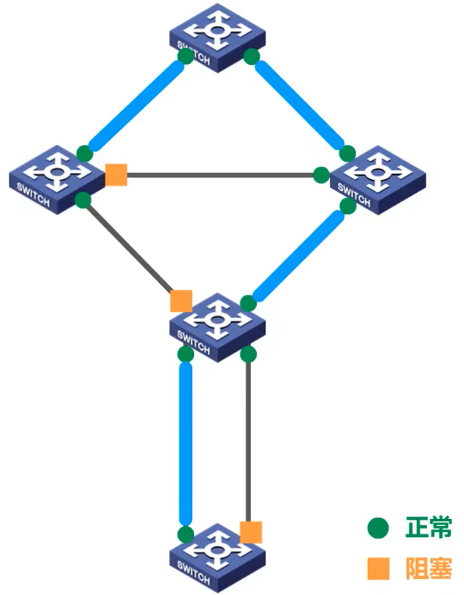

## 网络层

### 网络层概述

- 网络层的主要任务是实现网络互连，进而实现数据报在各网络之间的传输
- 要实现网络层任务，需要解决以下主要问题：
  - 向上提供怎样的服务（可靠传输还是不可靠传输）
  - 寻址问题
  - 路由选择问题
- 因特网是目前全世界用户数量最多的互联网，它使用TCP/IP协议栈
- 由于TCP/IP协议栈的网络层使用网际协议IP，它是整个协议栈的核心协议，因此在TCP/IP协议栈中网络层常称为网际层
- 我们通过学习TCP/IP协议栈的网际层来学习网络层的理论知识和实践技术

### 网络层的功能

- 因特网的网络层向上只提供简单灵活、无连接的、尽最大努力交付的数据报服务
- 所传送的分组可能出错、丢失、重复、失序或超时
- 如果主机中的进程之间需要可靠通信，那么可由更高层的传输层来负责
- 这样设计的好处是网络的造价大大降低，运行方式灵活，能够适应多种应用

### IPv4地址及其应用

#### IPv4地址概述

- IPv4地址是给因特网上的每一台主机（或路由器的每一个接口）分配的全球唯一标识符，由32个比特构成
- IPv4地址采用点分十进制表示方法，以方便用户使用
- IPv4的编址方法经历了如下三个历史阶段：
  - 分类编址(1981)
  - 划分子网(1985)
  - 无分类编址(1993)

#### 分类编址的IPv4地址

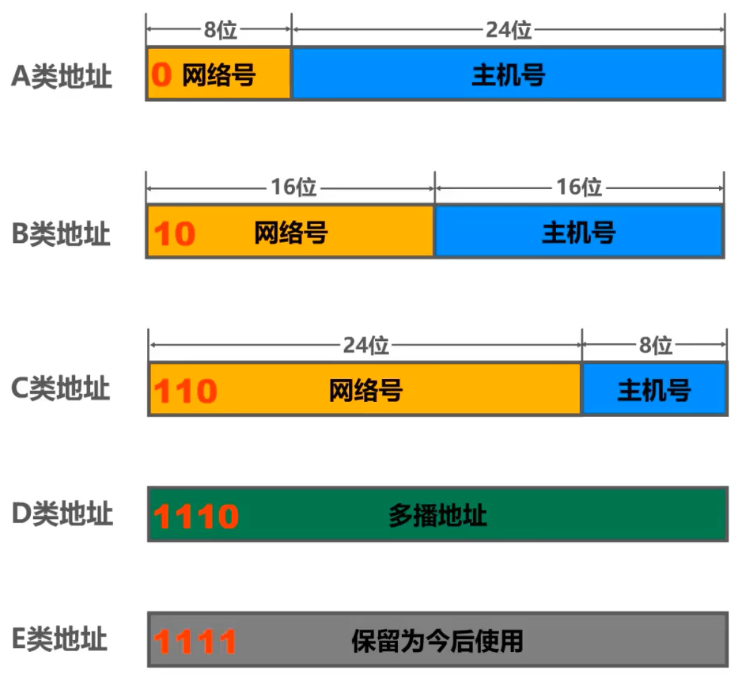

- 只有A类、B类和C类地址可以分配给网络中的主机或路由器的各接口（指派）
- 主机号为“全0”的地址是网络地址，不能指派
- 主机号为“全1”的地址是广播地址，不能指派
- A类地址的最小网络号0和最大网络号127被保留，不能指派
  - 0.0.0.0是一个特殊的IPv4地址，只能作为源地址使用，表示“在本网络的本主机”
  - 以127开头且后面三个字节非“全0”或“全1”的IP地址是一类特殊的IPv4地址，既可以作为源地址使用，也可以作为目的地址使用，用于本地软件环回测试
- 255.255.255.255是一个特殊的IPv4地址，只能作为目的地址使用，表示“只在本网络进行广播（各路由器均不转发）”

判断IPv4地址所属网络类别，只需观察第一个十进制数（0-127为A类，128-191为B类，192-223为C类）。

#### 划分子网的IPv4地址

有时我们需要将网络划分成多个子网，按道理来说应该为各子网申请新的网络号，但是这样既麻烦又浪费资源，于是在1985年出现了划分子网的IPv4地址。

- 通过从主机号中借用一部分比特作为子网号
- 使用32位子网掩码表明主机号部分被借用了几个比特作为子网号
- 给定一个IPv4地址及其相应的子网掩码，就可以知道子网划分的全部细节：
  - 划分出的子网数量
  - 每个子网可分配的IP地址范围
  - 每个子网的网络地址和广播地址

#### 无分类编址的IPv4地址

划分子网在一定程度上缓解了因特网在发展中的困难，但是数量巨大的C类网因为其地址空间太小并没有得到充分使用，而因特网的IPv4地址仍在加速消耗，整个IPv4地址空间面临全部耗尽的威胁。为此，因特网工程任务组(IETF)又提出了采用无分类编址的方法来解决IPv4地址紧张的问题，同时专门成立了IPv6工作组负责研究新版本的IP地址以彻底解决IPv4地址耗尽的问题。

- 1993年，IETF发布了无分类域间路由选择CIDR，消除了传统的分类编址、划分子网的概念
- CIDR使用“斜线记法”，即在IPv4地址后面加上斜线"/"，在斜线后面写上网络前缀所占的比特数量
- CIDR实际上是将网络前缀相同的连续IP地址组成了一个“CIDR地址块”
- 给定CIDR地址块中的任何一个地址，就可以知道该地址块的全部细节：
  - 地址块可分配的IP地址范围
  - 地址块的网络地址和广播地址
  - 地址掩码（也可以继续称为子网掩码）
  - 地址块聚合某类网络（A类、B类或C类）的数量
- 路由聚合（构造超网）的方法是找共同前缀
- 网络前缀越长，地址块越小，路由越具体。因此，若路由器查表转发分组时发现多条路由可选，则选择网络前缀最长的那条（最长前缀匹配）

#### IPv4地址的应用规划

给定一个IPv4地址块，如何将其划分成几个更小的地址块，并将这些地址块分配给互联网中的不同网络，进而可以给各网络中的主机和路由器接口分配IPv4地址？

1. 定长的子网掩码

   - 使用同一个子网掩码来划分子网
   - 每个子网所分配的IP地址数量相同，造成IP地址的浪费

   划分方法与划分子网的IPv4地址类似。

2. 变长的子网掩码

   - 使用不同的子网掩码来划分子网
   - 每个子网所分配的IP地址数量可以不同，尽可能减少对IP地址的浪费

   每个子块的起点位置不能随意选取，只能选取块大小整数倍的地址作为起点，建议先给较大的子块进行分配。

   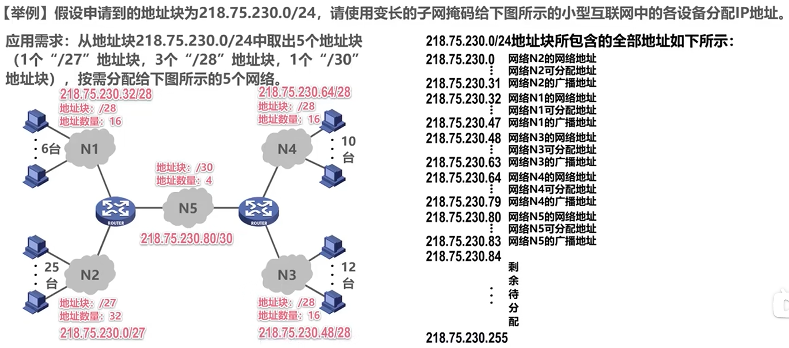

### IP数据报的发送和转发过程

1. 主机发送IP数据报

   判断目的主机是否与自己在同一个网络中（考察将目的IP地址与本机的子网掩码相与后得到的网络号是否与本机所处网络号相同）

   - 若在同一个网络中，则属于直接交付
   - 若不在同一个网络中，则属于间接交付，传输给主机所在网络的默认网关（路由器），由默认网关帮忙转发

   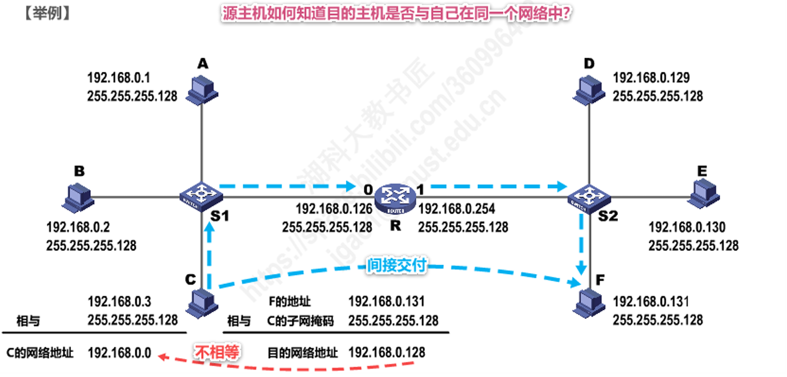

1. 路由器转发IP数据报

   ①检查IP数据报首部是否出错

   - 若出错，则直接丢弃该IP数据报并告知源主机
   - 若没有出错，则进行转发

   ②在路由表中查找匹配条目（考察将目的IP地址与条目中的子网掩码相与后得到的网络号是否与条目中的网络号相同）

   - 若找到匹配条目，则转发给条目中指示的下一跳
   - 若找不到，则丢弃该IP数据包并告知源主机

   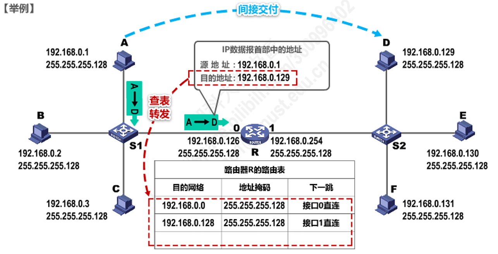

### 静态路由配置及其可能产生的路由环路问题

静态路由配置是指用户或网络管理员给路由器人工配置路由表。这种人工配置方式简单，但不能及时适应网络状态的变化，一般只在小规模网络中使用。

使用静态路由配置可能出现以下导致产生路由环路的错误：

- 配置错误
- 聚合了不存在的网络
- 网络故障

路由条目的类型：

- 直连网络（自动得出）
- 静态路由（人工配置）
- 动态路由（路由选择协议）

特殊的静态路由条目：

- 默认路由（目的网络为0.0.0.0，地址掩码为0.0.0.0）
- 特定主机路由（目的网络为特定主机的IP地址，地址掩码为255.255.255.255）
- 黑洞路由（下一跳为null0）

### 路由协议

#### 路由选择协议概述

静态路由不能及时适应网络状态的变化，在大规模网络中，一般采用路由选择协议实现动态路由选择。

因特网可划分为许多较小的自治系统。

- 域内路由选择：自治系统内部的路由选择
- 域间路由选择：自治系统之间的路由选择
- 内部网关协议(IGP)：域内路由选择使用的路由选择协议，它与其他自治系统选用的路由选择协议无关
- 外部网关协议(OGP)：域间路由选择使用的路由选择协议

#### 路由信息协议(RIP)

- 路由信息协议（Routing Information Protocol, RIP）是内部网关协议（IGP）中最先得到广泛应用的协议
- RIP是应用层协议，在传输层使用UDP传送数据

1. RIP规定

   - 自治系统内的每个路由器的路由表中记录从它自身到其他每个目的网络的距离和下一跳
   - 距离也称跳数(Hop Count)，规定从一个路由器到直连网络的距离为1，每经过一个路由器，距离加1
   - 一条路径最多只能包含15个路由器，距离等于16时，表示网络不可达。可见RIP只适用于小型网络
   - 好的路由就是“距离短”的路由，即优先选择跳数少的路径
   - 当到达某一目的网络有多条“距离相等”的路径时，可以进行等价负载均衡

2. RIP的特点

   - 仅和相邻路由器交换信息
   - 交换的信息是当前路由器所知道的全部信息，即自己的路由表
   - 周期性交换信息

3. RIP的基本工作过程

   ①刚开始工作时，只知道自己到直连网络的距离为1

   ②每个路由器仅和相邻路由器周期性地交换并更新路由信息

   ③若干次交换和更新后，每个路由器都知道到达本自治系统内各网络的最短距离和下一条地址，称为收敛

4. RIP路由条目的更新规则

   - 发现新的网络，添加
   - 到达目的网络，不同下一跳，距离更短，更新
   - 到达目的网络，不同下一跳，距离相同，添加（可用于等价负载均衡）
   - 到达目的网络，不同下一条，距离更长，不更新
   - 到达目的网络，相同下一跳，最新消息，更新

RIP存在“坏消息传得慢”的问题：假设路由器R1的直连网络N1出现故障，R1将自己的路由表中到达网络N1的条目的距离修改为16，此时与路由器R1相邻的路由器R2发来RIP更新报文，报文中指示“R2经过R1到达N1的距离为2”，这会让路由器R1误以为“自己可以通过R2到达N1，距离为3”，从而更新自己的路由表，掩盖了“网络N1故障”的事实，并形成长达数分钟的路由环路，直至两者的路由表中到达网络N1的条目中的距离都更新为16。

“坏消息传得慢”是RIP的固有问题，可以采取多种措施来减小出现问题的概率或其带来的危害：

- 限制最大路径距离为15
- 当路由表发生变化时就立即发送RIP更新报文，而不仅仅是周期性发送
- 让路由表记录收到某特定路由信息的接口，而不让同一路由信息再通过此接口向反方向传送（称为“水平分割”）

#### 开放最短路径优先(OSPF)协议

- 开放最短路径优先(Open Shortest Path First, OSPF)是为克服RIP的缺点在1989年开发出来的
- OSPF是网络层协议，它不使用UDP或TCP，而直接用IP数据报传送（其IP数据报首部的协议字段为89）

1. OSPF规定

   - 自治系统内的每个路由器的路由表中记录从它自身到其他每个目的网络的“代价”和下一跳
     - “代价”可以是带宽、时延、距离等等，由网络管理人员根据实际需求而定
   - 每个路由器在链路状态改变时或每隔一段时间都会产生链路状态通告(Link State Advertisement, LSA)
   - LSA包括直连网络和邻居路由器的链路状态信息，被封装在链路状态更新分组中，通过泛洪方式发送
   - 每个路由器都有一个链路状态数据库(LSDB)，用于存储LSA

2. OSPF特点

   - 与所有路由器交换信息
   - 交换的信息是当前路由器的直连网络和邻居路由器的链路状态信息，只是路由器所知道的部分信息
   - 在链路状态改变时就会交换信息

3. OSPF基本工作过程

   由于各路由器之间频繁地交换链路状态信息，因此所有路由器最终都能建立一个链路状态数据库。这个数据库可以转换为全网的拓扑结构图，它在全网范围内是一致的。然后，每个路由器根据这个拓扑结构图，使用Dijkstra算法计算从自己到各目的网络的最优路径，以此构造自己的路由表。此后，当链路状态发生变化时，每个路由器重新计算到各目的网络的最优路径，构造新的路由表。

4. OSPF的五种分组类型

   - 问候分组，用于发现和确认邻站的可达性
   - 数据库描述分组，向邻站给出自己的LSDB中所有链路状态条目的摘要信息
   - 链路状态请求分组，向对方请求发送某些链路状态条目的详细信息
   - 链路状态更新分组，通过泛洪方式要求全网更新链路状态
   - 链路状态确认分组，对链路更新分组进行确认

   通常每隔10秒，路由器之间就要交换一次问候分组，以便知道哪些站可达。在路由器刚开始工作时，OSPF让每个路由器使用数据库描述分组和相邻路由器交换LSDB中已有的链路状态摘要信息。然后，路由器使用链路状态请求分组，向对方请求发送自己所缺少的某些链路状态条目的详细信息。经过一系列的这种分组交换，就建立了全网同步的LSDB。

OSPF不仅没有“坏消息传播得慢”的问题，还适用于规模很大的网络。

#### *边界网关协议(BGP)

由于不同自治系统内部使用的“代价”可能不同，在域间路由选择中，并不能找到最佳路由，此外还需要考虑相关策略（政治、安全等）。

- 边界网关协议(Border Gateway Protocol, BGP)是一种常用的外部网关协议
- BGP是应用层协议，它是基于TCP的
- BGP只能是力求寻找一条能够到达目的网络且比较好的路由（不兜圈），即构造出各自治系统之间的连通图

### IPv4数据报的首部格式

IP数据报的首部格式由20字节的固定部分和最大40字节的可变部分组成，常以4字节为单位进行描述。固定部分是所有IP数据报都必须具有的，可变部分包含可选字段和填充字段。可选字段用来提供错误检测及安全等机制，一般情况下不使用。填充字段用来确保首部长度为4字节的整数倍。

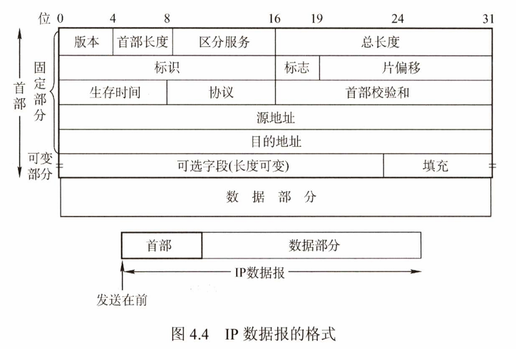

- 版本。占4位，表示IP协议的版本，目前广泛使用的IP协议版本号为4（即IPv4）
- 首部长度。占4位，表示IP数据报首部的长度，以4字节为单位
- 区分服务。占8位，用来获得更好的服务，一般情况下不使用
- 总长度。占16位，表示IP数据报的总长度（首部+数据部分），以字节为单位
- 标识。占16位，属于同一个数据报的各分片数据报应该具有相同的标识。IP软件维持一个计数器，将计数器的值赋给数据报的标识字段
- 标志。占3位，DF位表示“是否不允许分片”，MF位表示“后面是否还有分片”，保留位必须为0
- 片偏移。占13位，表示分片数据报的数据部分在原数据报中的偏移量，以8个字节为单位，因此分片时需保证分片数据报的数据部分长度为8的倍数
- 生存时间TTL。占8位，以“跳数”为单位，路由器转发IP数据报时，将该字段的值减1，若不为0则转发，否则就丢弃
- 协议。占8位，表示数据部分是何种协议数据单元
- 首部检验和。占16位，用来检测首部在传输过程中是否出现差错，比CRC检验码简单。IPv6已不再计算首部检验和，以更快转发IP数据报
- 源地址。发送该IP数据报的源主机的IP地址
- 目的地址。接受该IP数据报的目的主机的IP地址

一个数据链路层数据报能承载的最大数据量成为最大传送单元(MTU)。如果一个IP数据报的总长度超出MTU，就需要将IP数据报中的数据分装在多个较小的IP数据报中，这些较小的数据报称为片。片在目的地的网络层被重新组装。目的主机使用IP首部中的标识、标志和片偏移字段来完成对片的重组。

### 网际控制报文协议ICMP

- 为了提高IP数据报交付成功的机会，在网络层使用网际控制报文协议(Internet Control Message Protocol, ICMP)
- ICMP是IP层协议，ICMP报文被封装在IP数据报中发送
- ICMP报文种类有两种，即ICMP差错报告报文和ICMP询问报文
  - ICMP差错报告报文用于目的主机或途经的路由器向源主机报告差错和异常情况，共有以下5种类型：
    - 终点不可达。由于不能交付而丢弃数据报时发送
    - 源点抑制。由于拥塞而丢弃数据报时发送
    - 时间超过。由于TTL为0而丢弃数据报时发送
    - 参数问题。由于首部字段的值不正确而丢弃数据报时发送
    - 改变路由（重定向）。路由器告知源主机下次应将数据报发给另外的路由器（更好的路由）
  - ICMP询问报文主要用于测试，常用的类型有以下两种：
    - 回送请求和回答报文
    - 时间戳请求和回答报文
- ICMP的应用
  - 分组网间探测(PING)。使用ICMP回送请求和回答报文来测试两台主机之间的连通性
  - 跟踪路由(traceroute)。使用ICMP回送请求和回答报文以及ICMP时间超过报文来跟踪两台主机之间经过的路由

### 虚拟专用网VPN与网络地址转换NAT

1. 虚拟专用网(Virtual Private Network, VPN)

   - 利用公用的因特网作为本机构各专用网之间的通信载体，这样的专用网称为虚拟专用网(VPN)

   - VPN要保证传输数据的安全性，会将原始的内部数据报进行加密，然后将其封装成为能够在因特网上发送的外部数据报

     假设部门A中的某主机要给部门B中的某主机发送IP数据报

     - 部门A和B各自至少需要一个路由器具有合法的全球IP地址，这样它们各自的专用网才能利用公用的因特网进行通信
     - 内部IP数据报会被R1再次封装成外部数据报，其首部的源地址和目的地址字段的值分别为R1和R2的全球地址
     - R2收到该外部数据包后，去掉其首部，恢复出原来的内部IP数据报，根据内部IP数据报中的专用地址进行转发

     

2. 网络地址转换(Network Address Translation, NAT)

   网络地址转换(NAT)是指通过将专用网络地址转换为公用网络地址，从而对外隐藏内部管理的IP地址。它使得整个专用网只需要一个全球IP地址就可以与因特网连通，由于专用网本地IP地址是可重用的，所以NAT大大节省了IP地址的消耗。同时，它隐藏了内部网络结构，从而降低了内部网络受到攻击的风险

   - 私有IP地址网段

     - 10.0.0.0 - 10.255.255.255 (10/8)
     - 172.16.0.0 - 172.31.255.255 (172.16/12)
     - 192.168.0.0 - 192.168.255.255 (192.168/16)

   - NAT基本工作原理

     - 在因特网中的所有路由器，对目的地址是私有地址的数据报一律不进行转发
     - 要实现使用本地地址的主机与外界的通信，至少要有一个NAT路由器，该NAT路由器具有至少一个全球IP地址
     - 使用本地地址的主机向外界发送的IP数据报会经过NAT路由器转发，NAT路由器将IP数据报中的源IP地址修改为它自己的全球IP地址，并在NAT转换表中记录两者的转换关系。由此可见，NAT路由器就像是一个代理人
     - 外界向NAT路由器发回IP数据报时，NAT路由器根据NAT转换表修改IP数据报的目的IP地址，再转发给使用本地地址的主机

     这样带来一个问题：NAT路由器的每个全球IP地址只能供一台本地主机与外界通信。

     由于绝大多数网络应用都是使用运输层协议TCP或UDP来传送数据，因此可以利用运输层的端口号和IP地址一起进行转换。这样，用一个全球IP地址就可以使多个拥有本地地址的主机同时和因特网上的主机进行通信。这种将端口号和IP地址一起进行转换的技术叫作网络地址与端口号转换(Network Address and Port Translation, NAPT)。

## 运输层

### 运输层概述

- 物理层、数据链路层和网络层共同解决了将主机通过异构网络互联起来所面临的问题，实现了主机到主机的通信
- 在计算机网络中进行通信的真正实体是位于两台主机中的进程
- 如何为运行在不同主机上的应用进程提供直接的通信服务是运输层的任务，运输层协议又称为端到端协议
- 根据应用需求的不同，因特网的运输层为应用层提供了两种不同的运输协议，即面向连接的TCP和无连接的UDP

### 运输层端口号、复用与分用的概念

1. 端口号

   - 端口号概述

     在TCP/IP体系结构中，使用端口号来标识主机中的应用进程。应用层的各种应用进程将其数据通过端口号向下交付给运输层，运输层能够根据报文段中的端口号交付给应用层中相应的应用进程。换言之，端口是运输层的服务访问点，它在运输层的作用类似于IP地址在网络层的作用或MAC地址在数据链路层的作用。

   - 端口号分类

     端口号长度为16位，根据端口号的范围可将端口号分为两类：

     - 服务器端使用的端口号

       它又分为两类，一类是熟知端口号，数值为0-1023，IANA把这些端口号指派给TCP/IP最重要的一些应用程序，让所有的用户都知道。另一类是登记端口号，数值为1024-49151。它是供没有熟知端口号的应用程序使用的，使用这类端口号必须在IANA登记，以防止重复。

       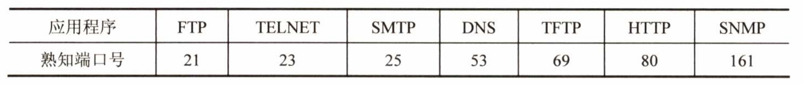

     - 客户端使用的端口号

       数值为49152-65535。这类端口号仅在客户端进程运行时才动态地选择，又称为“短暂端口号”或“临时端口号”。通信结束后，端口号就会被回收，供其他客户端进程以后使用。

2. 复用与分用

   - 复用：指发送方不同的应用进程都可使用同一个传输层协议传送数据
   - 分用：是指接收方的传输层在剥去报文的首部后能够把这些数据正确交付到目的应用进程

### UDP和TCP的对比

| 用户数据报协议UDP(User Datagram Protocol)  | 传输控制协议TCP(Transmission Control Protocol) |
| ------------------------------------------ | ---------------------------------------------- |
| 无连接                                     | 面向连接                                       |
| 支持一对一、一对多、多对一和多对多交互通信 | 每一条TCP连接只能有两个端点，只能是一对一通信  |
| 对应用层交付的报文直接打包                 | 面向字节流                                     |
| 不可靠传输，不使用流量控制和拥塞控制       | 可靠传输，使用流量控制和拥塞控制               |
| 首部仅8字节                                | 首部最小20字节，最大60字节                     |

### UDP

UDP仅在IP的数据报服务之上增加了两个最基本的服务：复用和分用以及差错检测。如果应用开发者选择UDP而非TCP，那么应用程序几乎直接与IP打交道。UDP不保证可靠交付，但这并不意味着应用对数据的要求是不可靠的，所有维护可靠性的工作可由用户在应用层来完成。

#### UDP数据报的首部格式

- 源端口号。在需要对方回信时选用，不需要时可用全0
- 目的端口号。在终点交付报文时必须使用到
- 长度。UDP数据报的总长度，其最小值为8（仅有首部）
- 校验和。用来检测UDP数据报在传输过程中是否出现差错。该字段是可选的，不需要时可用全0

#### UDP校验

在计算校验和时，要在UDP数据报之前增加12B的伪首部，伪首部并不是UDP的真正首部。只是在计算校验和时，临时添加在UDP数据报的前面，得到一个临时的UDP数据报。校验和就是按照这个临时的UDP数据报来计算的。伪首部既不向下传送又不向上递交，而只是为了计算校验和。

### TCP

#### TCP的流量控制

TCP提供一种基于滑动窗口协议的流量控制机制（滑动窗口+超时重传+累计确认）。

- 在通信过程中，接收方根据自己的接收窗口大小rwnd，动态地限制发送方的发送窗口大小
- 发送方在收到接收方的零窗口通知(rwnd=0)后，应启动持续计时器。持续计时器超时后，向接收方发送零窗口探测报文（你现在的接收窗口是多少）

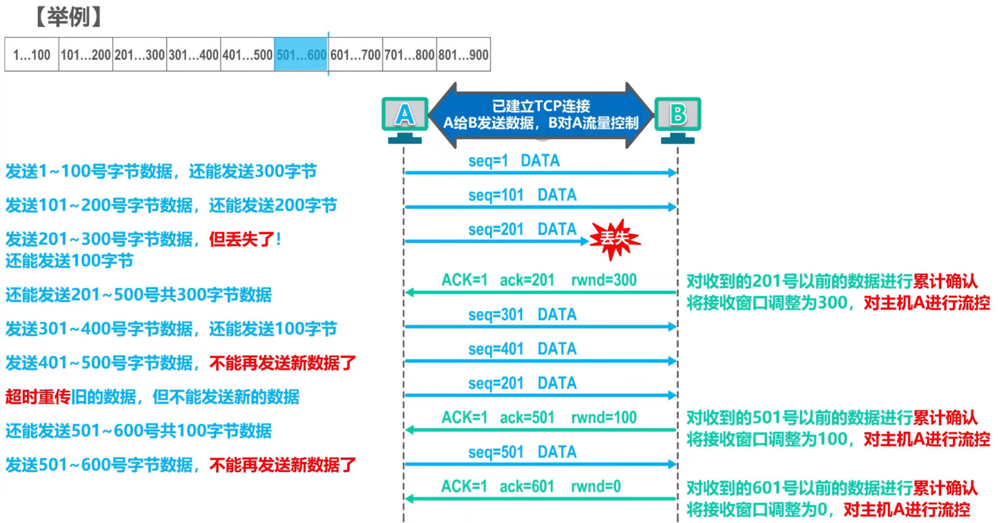

#### TCP的拥塞控制

##### 拥塞控制的概念

在某段时间内，若对网络中某一资源的需求超过了该资源所能提供的可用部分，网络性能就会变差，这种情况就叫做拥塞(congestion)。

- 带宽、交换结点中的缓存和处理机等，都是网络的资源

- 类似于堵车

- 若出现拥塞而不进行控制，整个网络的吞吐量将随输入负荷的增大而下降

  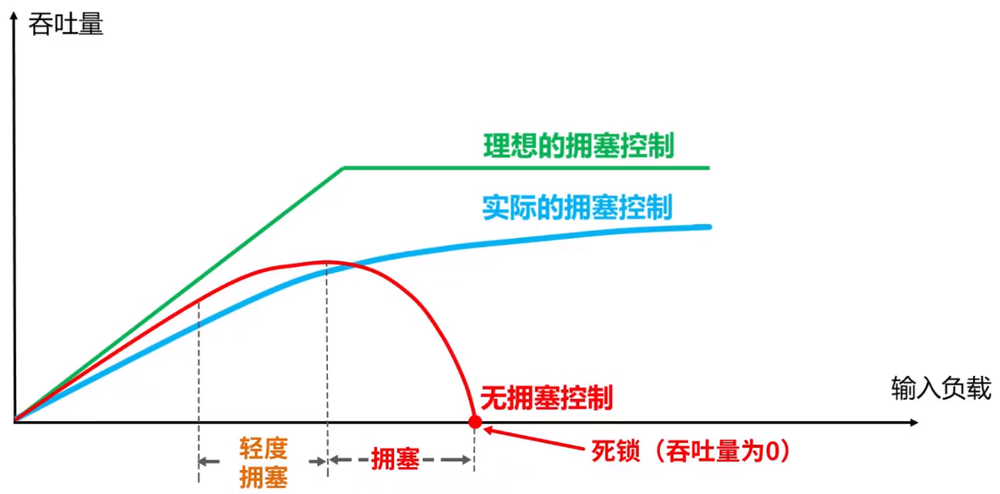

因此，拥塞控制是指防止过多的数据注入网络，保证网络中的设施不至于过载。出现拥塞时，端点并不了解拥塞发生的细节，对端点来说，拥塞往往表现为通信时延的增加。

##### 拥塞控制算法

发送方在确定发送报文的速率时，既要考虑接收方的接收能力，又要从全局考虑不要让网络发生拥塞。因此，TCP协议要求发送方维护以下两个窗口：

- 接收窗口rwnd，接收方根据目前接收缓存大小所许诺的最新窗口值，由TCP报文首部的窗口字段通知发送方
- 拥塞窗口cwnd，发送方根据自己估算的网络拥塞程度而设置的窗口值。

发送窗口应取接收窗口rwnd和拥塞窗口cwnd中较小的一个。

发送方如何维护拥塞窗口呢？这就是以下TCP协议所采用的拥塞控制算法所要解决的问题。

1. 慢开始和拥塞避免

   慢开始和拥塞避免算法是1988年提出的TCP拥塞控制算法（TCP Tahoe版本）

   - 慢开始

     初始时，令拥塞窗口cwnd=1，即一个最大报文段长度MSS。此后每收到一个对新报文段的确认后，将cwnd加1。直至cwnd增大到一个规定的慢开始门限ssthresh，然后改用拥塞避免算法。

   - 拥塞避免

     每经过一个往返时延RTT就将cwnd加1。

   无论在慢开始阶段还是在拥塞避免阶段，只要发送方判断网络出现拥塞（未按时收到确认），就将慢开始门限ssthresh设置为出现拥塞时的cwnd的一半，然后把cwnd重新设置为1。

   

2. 快重传和快恢复

   有时，个别报文段会在网络中丢失，但实际上网络并未发生拥塞。这将导致发送方超时重传，并误认为网络发生了拥塞，发送方将cwnd设置为最小值1，降低了传输效率。

   基于以上考虑，1990年又增加了快重传和快恢复算法以改进TCP的性能（TCP Reno版本）。

   - 快重传

     让发送方尽快进行重传，而不是等超时重传计时器超时才重传。

     - 要求接收方每收到一个报文段，就立即发送确认
     - 即使收到了失序的报文段，也要立即发出对已收到的报文段的重复确认
     - 发送方一旦收到3个连续的重复确认，就立即重传相应的报文段，而不是等超时才重传

     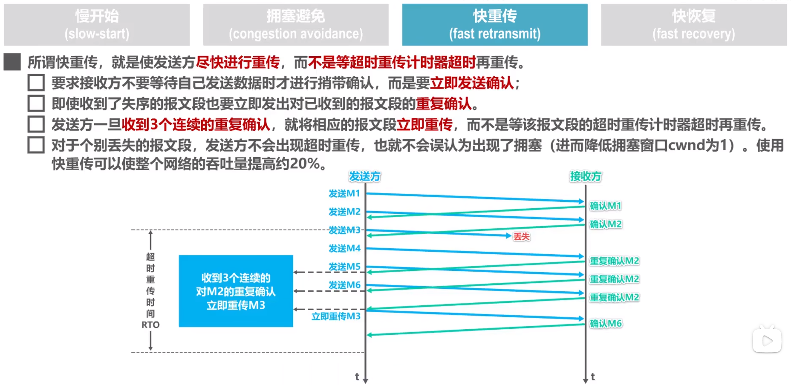

   - 快恢复

     发送方一旦收到3个重复确认，就知道当前只是丢失了个别的报文段，并不是发生了拥塞，于是将慢开始门限ssthresh和拥塞窗口cwnd调整为当前窗口的一半。

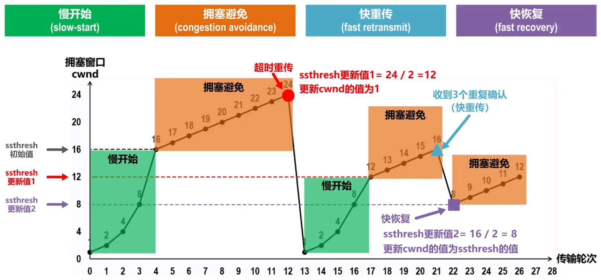

#### TCP可靠传输的实现

TCP使用了校验、序号、确认和重传等机制来实现可靠传输。TCP的校验机制与UDP校验一样，这里不再赘述。

1. 序号

   数据流中的每个字节都被编上一个序号，TCP报文段首部中的序号字段的值是指本报文段所发送的数据的第一个字节的序号。

2. 确认

   - TCP报文段首部中的确认号是期望收到的下一个字节的序号，即表明确认号以前的字节都已经被正确接收
   - 发送方缓存区会继续存储那些已发送但未收到确认的报文段，以便在需要时重传
   - 默认使用累积确认，只对按序到达的最后一个报文段进行确认

3. 重传

   - 每发送一个报文段，就对这个报文段设置一次计时器。当计时器超时仍未收到确认，就要重传这一报文段
   - 快重传（冗余ACK、冗余确认）

#### TCP连接管理

每个TCP连接都有三个阶段：连接建立、数据传送、连接释放。TCP连接管理就是使连接的建立和释放都能正常进行。

##### 连接建立

在TCP连接建立的过程中，要解决以下三个问题：

- 使双方能够知道对方的存在
- 使双方能够协商一些参数（如最大窗口值、是否使用窗口扩大选项、时间戳选项及服务质量等）
- 使双方能够对运输实体资源（如缓存大小、连接表中的项目等）进行分配

TCP使用“三次握手”建立连接，连接的端点为套接字(Socket)，每条TCP连接唯一地被通信的两个套接字确定。

连接建立前，TCP服务器进程处于监听(LISTEN)状态，等待TCP客户进程的连接请求。

①TCP客户进程向TCP服务器进程发送“TCP连接请求报文段”，进入“同步已发送(SYN-SENT)”状态。该报文段首部中的同步位SYN被设置为1，表明这是一个“TCP连接请求报文段”。序号字段seq被设置了一个初始值x，作为TCP客户进程所选择的初始序号。

②TCP服务器进程收到“TCP连接请求报文段”后，如果同意建立连接，则向TCP客户进程发送“TCP连接请求确认报文段”，进入“同步已接收(SYN-RCVD)”状态。该报文段首部中的同步位SYN和确认位ACK都被设置为1，表明这是一个“TCP连接请求确认报文段”。序号字段seq被设置了一个初始值y，作为TCP服务器进程所选择的初始序号。确认号字段ack的值被设置成了x+1，这是因为TCP客户进程所选择的初始序号为x。

③TCP客户进程收到“TCP连接请求确认报文段”后，向TCP服务器进程发送一个“普通的TCP确认报文段”，进入“连接已建立(ESTABLISHED)”状态。该报文段首部中的确认位ACK被设置为1，表明这是一个“普通的TCP确认报文段”。序号字段seq被设置为x+1，这是因为TCP客户进程发送的第一个TCP报文段的序号为x，并且不携带数据。确认号字段ack的值被设置为y+1，这是因为TCP服务器进程所选择的初始序号为y。

④TCP服务器进程收到上述的“普通的TCP确认报文段”后，也进入“连接已建立(ESTABLISHED)”状态。

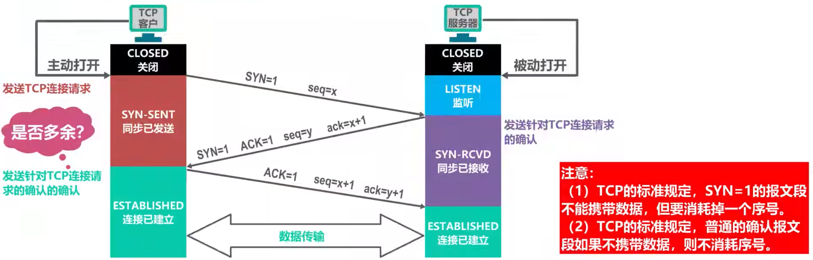

##### 连接释放

TCP使用“四次握手”释放连接。

①TCP客户进程向TCP服务器进程发送“TCP连接释放报文段”，进入“终止等待1(FIN-WAIT-1)”状态，停止发送数据。该报文段首部中的终止位FIN和确认位ACK的值都被设置为1，表明这是一个“TCP连接释放报文段”，同时也对之前收到的报文段进行确认。序号字段seq的值被设置为u，取决于TCP客户进程之前已传送的数据的最后一个字节的序号。确认号字段ack的值被设置为v，取决于TCP客户进程之前已收到的数据的最后一个字节的序号。

②TCP服务器进程收到“TCP连接释放报文段”后，发送一个“普通的TCP确认报文段”，进入“关闭等待(CLOSE-WAIT)”状态。该报文段首部中的确认位ACK的值被设置为1，表明这是一个“普通的TCP确认报文段”。序号字段seq的值被设置为v，取决于TCP服务器进程之前已传送的数据的最后一个字节的序号。确认号字段ack的值被设置为u+1，这是对TCP连接释放报文段的确认。此时，从TCP客户进程到TCP服务器进程这个方向的连接就释放了，TCP连接处于半关闭状态。

③TCP客户进程收到上述的“普通的TCP确认报文段”后，进入“终止等待2(FIN-WAIT-2)”状态，等待TCP服务器进程发出的“TCP连接释放报文段”。

④TCP服务器进程如果已经没有数据要发送了，就向TCP客户进程发送“TCP连接释放报文段”，进入“最后确认(LAST-ACK)”状态。该报文段首部中的终止位FIN和确认位ACK的值都被设置为1，表明这是一个“TCP连接释放报文段”，同时也对之前收到的报文段进行确认。序号字段seq的值被设置为w，这是因为在半关闭状态下，TCP服务器进程可能又发送了一些数据。确认号字段ack的值被设置为u+1，这是对之前收到的TCP连接释放报文段的重复确认。

⑤TCP客户进程收到“TCP连接释放报文段”后，发送一个“普通的TCP确认报文段”，进入“时间等待(TIME-WAIT)”状态。该报文段首部中的确认位ACK的值被设置为1，表明这是一个“普通的TCP确认报文段”。序号字段seq的值被设置为u+1，这是因为TCP客户进程之前发送的“TCP连接释放报文段”要消耗掉一个序号。确认号字段ack的值被设置为w+1，这是对“TCP连接释放报文段”的确认。

⑥TCP服务器进程收到上述的“普通的TCP确认报文段”后，进入“关闭(CLOSED)”状态。而TCP客户端进程进入进入“时间等待(TIME-WAIT)”状态，需等待2MSL时间后才能进入“关闭(CLOSED)”状态，这是为了确保TCP服务器进程能够收到来自TCP客户进程针对“TCP连接释放报文段”的确认。

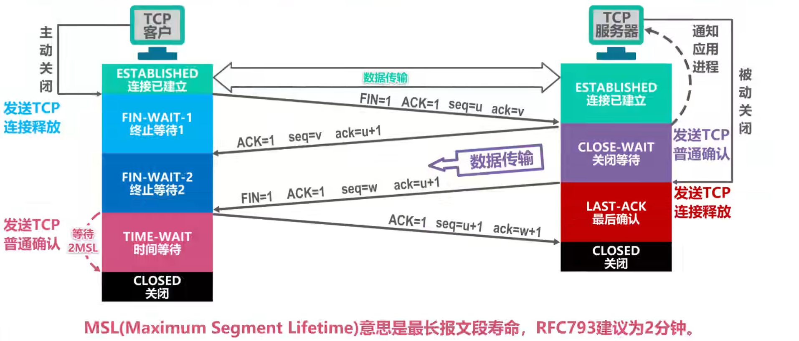

#### TCP报文段的首部格式

TCP的全部功能体现在其首部的各个字段中

- 源端口和目的端口。占16位。端口是运输层与应用层的服务接口，运输层的复用和分用都要通过端口实现
- 序号。占32位，表示本报文段所发送的数据的第一个字节的序号
- 确认号。占32位，表示期望收到对方下一个报文段的第一个字节的序号
- 数据偏移。占4位，即首部长度
- 保留。占5位，保留为今后使用，目前应置为0
- 紧急位URG。当URG=1时，紧急指针字段有效。它告诉系统此报文段中有紧急数据，应尽快传送
- 确认位ACK。当ACK=1时，确认号字段有效。TCP规定，在连接建立后所有传送的报文段都必须把ACK置为1
- 推送位PSH(Push)。接收方TCP收到PSH=1的报文段时，就尽快地交付给接收应用进程，而不再等到整个缓存都填满后再向上交付
- 复位位RST(Reset)。当RST=1时，表明TCP连接中出现严重差错，必须释放连接，然后再重新建立运输连接
- 同步位SYN。当SYN=1时，表示这是一个连接请求报文段或连接请求确认报文段
- 终止位FIN(Finish)。当FIN=1时，表明此报文段的发送方的数据已发送完毕，并要求释放运输连接。
- 窗口。占16位，表明此报文段的发送方的接收窗口
- 校验和。占16位，校验和计算方法和UDP一样（协议字段有区别）
- 紧急指针。占16位，指明在本报文段中的紧急数据共有多少字节
- 选项。增加选项可增加TCP的功能，如最大报文段长度（数据部分长度）
- 填充。使整个首部长度是4B的整数倍

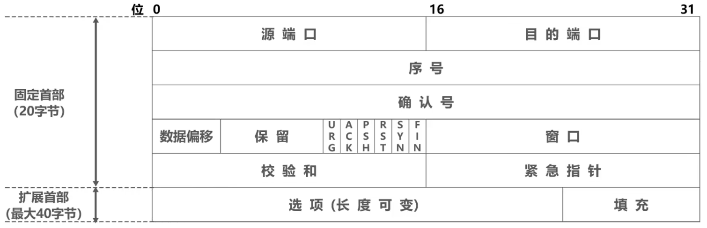

## 应用层

应用层是计算机网络体系结构的最顶层，是设计和建立计算机网络的最终目的，也是计算机网络发展最快的部分。

### 网络应用模型

#### 客户/服务器模型

- 客户和服务器是指网络通信中所涉及的两个应用进程
- 客户是服务请求方，服务器是服务提供方
- 服务器总是处于运行状态，并等待客户的服务请求
- 可扩展性不佳，受服务器硬件和网络带宽的限制，服务器支持的客户数有限

#### P2P模型

- 没有固定的客户和服务器的划分
- 各网络应用进程互为对等方，对等方相互之间直接通信，每个对等方既是服务请求方，又是服务提供方
- 可扩展性好，系统性能不会因规模的增大而降低

### 动态主机配置协议(DHCP)

- DHCP提供了一种即插即用的联网机制，允许一台计算机在加入新的网络和自动获取IP地址等网络配置信息，而不用手工参与
- DHCP是应用层协议，它是基于UDP的
- 使用客户/服务器模式工作
- 通过广播方式来进行交互

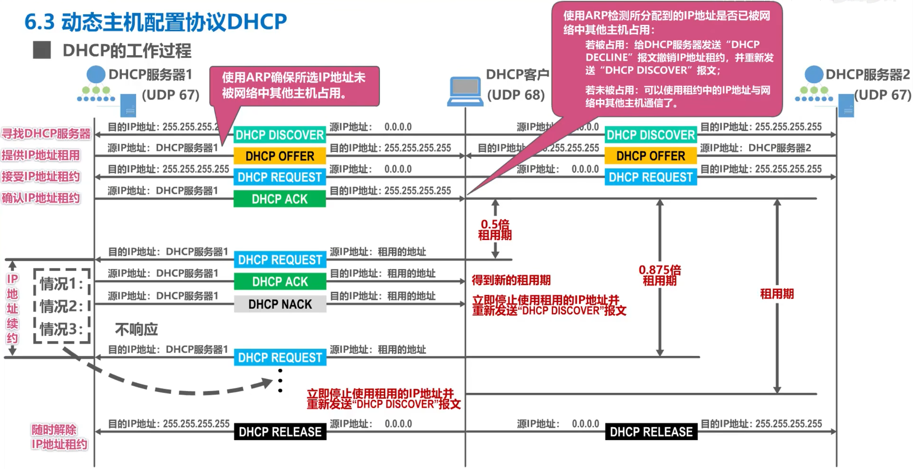

### 域名系统(DNS)

- 域名系统(Domain Name System, DNS)用于把域名转换为IP地址
- DNS系统采用客户/服务器模型，其协议运行在UDP之上，使用53端口

#### 层次域名空间

- 因特网采用层次树状结构的域名结构，一个完整的域名由多级域名构成（···.三级域名.二级域名.顶级域名）
- 各级域名（标号）中的英文不区分大小写，除连字符外不能使用其他标点符号
- 顶级域名(Top Level Domain, TLD)分为以下三类：
  - 国家顶级域名(nTLD)。国家和某些地区的域名，如"cn"、"us"、"jp"
  - 通用顶级域名(gTLD)。常见的有"com"（公司）、"net"（网络服务机构）、"org"（非营利性组织）
  - 反向域名。只有一个，即"arpa"，用于反向域名解析
- 国家顶级域名下注册的二级域名由该国家自行确定

#### 域名服务器

- 域名和IP地址的映射关系保存在域名服务器中，这样的域名服务器遍布各地

- 域名服务器可以划分为以下四种类型，它们要么自己能够进行域名到IP地址的转换，要么知道到什么地方去找其他域名服务器

  - 根域名服务器

    所有的根域名服务器都知道所有的顶级域名服务器的IP地址。

  - 顶级域名服务器

    负责管理在该顶级域名服务器注册的所有二级域名。可能返回最后结果，也可能返回下一步应当查找的权限域名服务器的IP地址。

  - 权限域名服务器

    保存一定辖区内的域名到IP地址的映射关系，总能返回最后结果。

  - 本地域名服务器

    当一个主机发出DNS请求报文时，这个报文首先被送往该主机的本地域名服务器。本地域名服务器起着代理的作用，会将报文转发到上述的域名服务器等级结构中，它离用户主机较近，一般不超过几个路由器。本地域名服务器的IP地址在网络配置时需要填写。

#### 域名解析过程

为了提高DNS的查询效率，并减轻根域名服务器的负荷和减少因特网上的DNS查询报文数量，在本地域名服务器和用户主机中广泛采用了高速缓存。高速缓存用来存放最近查询过的域名以及从何处获得域名映射信息的记录。

### 文件传输协议(FTP)

- 文件传输协议(File Transfer Protocol, FTP)是因特网上使用最为广泛的文件传输协议
- 它采用客户端/服务器的工作方式，使用TCP可靠的传输服务，工作时需要建立两个并行的TCP连接
  - 控制连接。在整个回话期间一直保持打开，用于传送FTP相关控制命令
  - 数据连接。用于文件传输，在每次文件传输时才建立，传输结束就关闭
  - FTP的熟知端口号为21，该端口用于控制连接
  - 数据连接有两种传输模式：主动模式和被动模式。主动模式下使用20端口，被动模式下会用随机端口

### 电子邮件

- 电子邮件系统采用客户/服务器模型，具有三个最主要的组成构件：用户代理、邮件服务器、电子邮件协议
  - 用户代理是用户与电子邮件系统的接口，又称为电子邮件客户端软件
  - 邮件服务器是电子邮件系统的基础设施，其功能是发送和接收邮件，同时还要负责维护用户的邮箱
  - 协议包括邮件发送协议（如SMTP）和邮件读取协议（如POP3）
- 常用的邮件发送协议是简单邮件传送协议SMTP
  - 基于TCP连接，熟知端口号为25
  - 只能传送ASCII码文本
  - 用于用户代理向邮件服务器发送邮件以及邮件服务器之间的邮件发送
- 为解决SMTP传送非ASCII码文本的问题，提出了多用途因特网邮件扩展MIME，它可以将非ASCII码文本转换为ASCII码文本
- 常用的邮件读取协议有以下两个：
  - 邮件协议(POP3)。非常简单、功能有限的邮件读取协议。不允许用户在邮件服务器上管理自己的邮件
  - 因特网邮件访问协议(IMAP)。功能比POP3强大，用户在自己的计算机上就可以管理自己在邮件服务器上的邮件
  - POP3和IMAP4都基于TCP连接，熟知端口号分别为110和143
- 基于万维网的电子邮件
  - 通过浏览器登录邮件服务器网站就可以撰写、收发、阅读和管理电子邮件。这种工作模式与IMAP很类似，不同的是用户计算机无需安装专门的用户代理程序，只需要使用通用的万维网浏览器
  - 这种工作模式在用户浏览器与邮件服务器网站之间使用HTTP协议，在邮件服务器之间使用SMTP协议

### 万维网(WWW)

#### 万维网概述

- 万维网(World Wide Web, WWW)是一个大规模的、联机式的信息存储空间，是运行在因特网上的一个分布式应用

- 万维网使用统一资源资源定位符(URL)来指明因特网上任何种类“资源”的位置，其一般形式为：<协议>://<主机>:<端口>/<路径>

- 万维网文档的一般由以下要素组成：

  - 超文本标记语言HTML，使用多种“标签”来描述网页的结构和内容
  - 层叠样式表CSS，从审美角度来描述网页的样式
  - 脚本语言JavaScript，控制网页的行为

- 万维网的大致工作过程

  用户单击鼠标后所发生的事件按顺序如下（以访问清华大学的网站为例）：

  ①浏览器分析链接指向页面的URL(http://www.tsinghua.edu.cn/chn/index.htm) 

  ②浏览器向DNS请求解析www.tsinghua.edu.cn的IP地址

  ③域名系统DNS解析出清华大学服务器的IP地址

  ④浏览器与该服务器建立TCP连接（默认端口号为80）

  ⑤浏览器发出HTTP请求：GET /chn/index.htm

  ⑥服务器通过HTTP响应把文件index.htm发送给浏览器

  ⑦释放TCP连接

  ⑧浏览器解析文件index.htm，并将Web页显示给用户

- 在万维网中还可以使用缓存机制来提高效率。Web缓存可以位于客户机，也可以位于中间系统（又称代理服务器）

#### 超文本传输协议(HTTP)

HTTP定义了浏览器（即万维网客户进程）怎样向万维网服务器请求万维网文档，以及万维网服务器怎样把万维网文档传送给浏览器

1. HTTP的特点

   - HTTP是无状态的。Cookie提供了一种机制使得万维网服务器能够“记住”客户，它是一种对无状态的HTTP进行状态化的技术
   - HTTP/1.0采用非持续连接方式。浏览器每次要请求一个文件都要与服务器建立TCP连接，当收到响应后就立即释放连接
   - HTTP/2.0采用持续连接方式。万维网服务器在发送响应后仍然保持这条连接，使同一个客户和该服务器可以继续在这条连接上传送后续的HTTP请求和响应报文。为了进一步提高效率，还可以采用流水线形式，即浏览器在收到HTTP响应报文之前就能够连续发送多个请求报文。这样，所有引用的对象共计经历1个RTT延迟，而不是像非流水线方式那样，每个引用都必须有1个RTT延迟。

   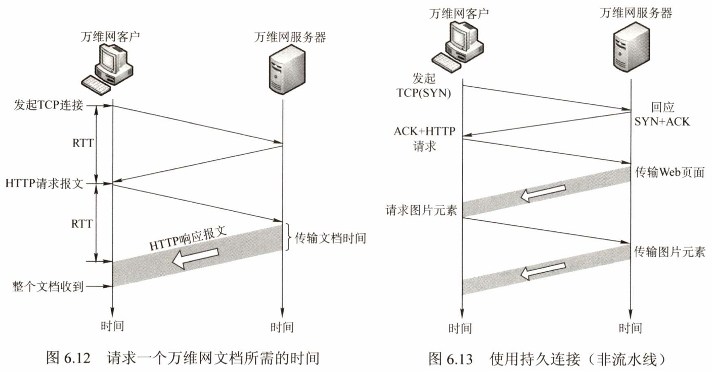

2. HTTP报文的结构

   - HTTP有两类报文：请求报文和响应报文。报文中的每个字段都是一些ASCII码串，并且每个字段的长度都是不确定的
   - HTTP请求报文和响应报文都由三个部分组成，主要区别在于开始行
     - 开始行：请求报文中的开始行称为“请求行”，响应报文中的开始行称为“状态行”
     - 首部行：用来说明浏览器、服务器或报文主体的一些信息
     - 实体主体：在请求报文中一般不使用这个字段，而在响应报文中也可能没有这个字段

   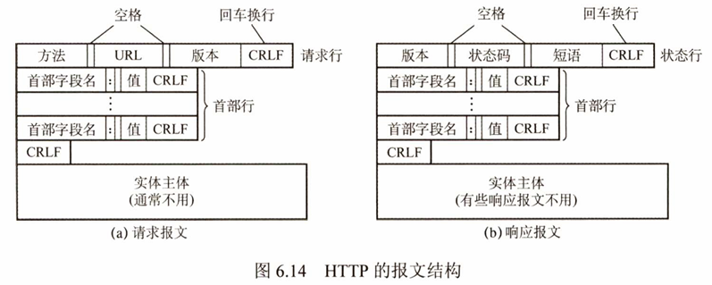

## 值得重温的视频

- 运输层端口号、复用与分用的概念
- 虚拟专用网VPN与网络地址转换NAT
- MAC地址、IP地址与ARP协议
- 万维网WWW
